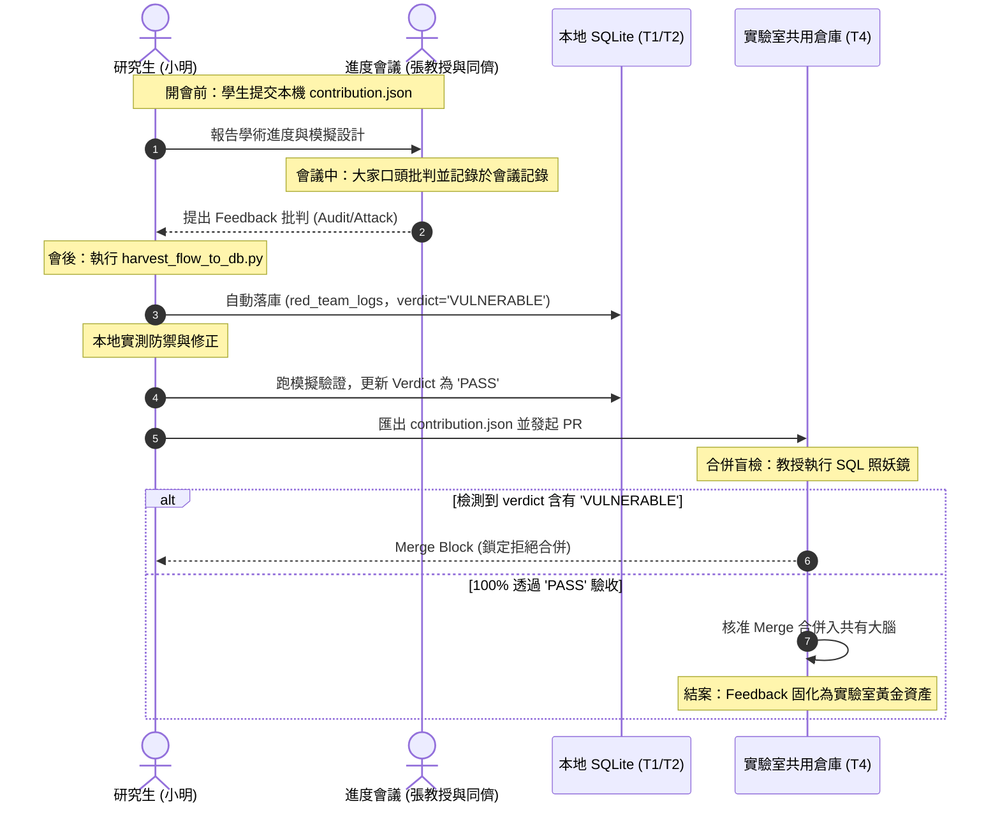

# 14.6 聯邦共有大腦：去中心化實驗室的共創與 Feedback 固化落庫 SOP

在學術研究中，指導教授與學生拉鋸最痛苦的時刻，往往發生在每週的進度會議（Group Meeting）上。教授對學生的文獻、模擬或匹配電路設計提出了極具物理價值的批判與修正建議（Feedback），學生在台上拼命點頭，但會後一覺醒來忘掉大半。最終，這些含金量極高的 Feedback 流失在 Word 檔或 NAS 檔案的深處，成為「揮發性的雜訊」；而教授在下週開會時，也因缺乏實體憑據，難以追蹤學生的修改進度。

在 **v1.2.3 聯邦共有大腦** 的去中心化哲學中，口頭討論的 Feedback 不再被動流失，而是透過實體資料庫的「物理分層」與「四步閉環協定」，自動固化為實驗室的集體智慧遺產。

---

## 🪐 一、 十一表之「共有資產」與「主權私有」的工程辯證

在去中心化聯邦大腦的設計中，我們不需要為實驗室設計一套龐大而獨立的「中央資料庫」表結構（這會破壞「本地即聯邦」的同構對稱性）。實驗室大腦（`Lab_Brain.db`）與個人的主權大腦（`Research_Artifacts.db`）在物理上共享完全相同的 **十一張表結構 (schema.sql)**，但在資料生命週期與重建的彙整中，這十一張表在邏輯上自然分化為以下三種層次：

```
                      +------------------------------------+
                      |    實驗室聯邦共有大腦 (Lab Brain)   |
                      +------------------------------------+
                                       |
       +-------------------------------+-------------------------------+
       |                               |                               |
       ▼                               ▼                               ▼
【第一類：公有知識地基】        【第二類：集體攻防編年史】        【第三類：主權路由與產出樹】
 - papers (背景文獻)             - red_team_logs (會後Feedback)   - directory_roots (路徑抽象)
 - paper_relations (文獻圖譜)     - empirical_evidences (實測避雷)  - my_manuscripts (手稿樹)
 - paper_tags (文獻標籤)                                          - manuscript_citations (引用脈絡)
 - paper_urls (NAS相對路徑)
```

### 1. 絕對的「公有背景文獻與客觀知識」表
這些表是實驗室最堅固的學術地基。當每位研究生的 `contribution.json` 在本地匯出並合併至 Git 後，這些表會自動融合重建，消滅資訊孤島：
*   **`papers` (背景文獻主表)**：所有研究生共同發掘的背景文獻、Cite Key 與 BibTeX，是實驗室最強大的公用背景知識庫。
*   **`paper_relations` (背景文獻交叉關係演化表)**：記錄文獻之間的 `IMPROVES`（改進）、`REFUTES`（反駁）或 `GROUNDED_ON`（基於）的交叉關係。這是整個實驗室集體思維織成的**演化圖譜**。
*   **`paper_tags` 與 `paper_urls`**：大家共同為文獻標註的多維度標籤，以及實驗室公用 NAS 上的 PDF 相對相對路徑。

### 2. 合併後轉化為「集體實戰編年史」的表（個人行為沉澱為共有資產）
這些表在研究生本機上，記錄的是個人的防禦與實驗；但在實驗室大腦重建合併後，**它們會融合成實驗室最具靈魂的「非個人共有資產」**：
*   **`red_team_logs` (紅軍自審與品位裁決表)**：
    小明被教授修理的記錄，合併後與小華、小李的記錄放在一起。對學弟妹來說，這張表就是**「實驗室歷代 Feedback 攻防實戰編年史」**！他們可以直接下 SQL 查詢：「過去關於 Duffing 方程式的匹配設計，張教授曾提出過哪些物理質疑？當時學長姐是怎麼防禦通過的？」
*   **`empirical_evidences` (實踐與實體舉證表)**：
    各個研究生針對文獻理論跑出來的本地模擬實測數據與實體舉證（誤差、真值、波形圖）。重建合併後，這張表就成了實驗室的**「集體實測避雷指南」**，新進人員一眼就能看出哪些文獻的理論在實測中誤差高達 30%、哪些文獻是灌水垃圾。

### 3. 定義主權邊界與學術產出樹的表
這些表用來定義個人與實驗室的資產邊界，以及學術血統的追溯：
*   **`directory_roots` (目錄實體映射表)**：
    定義了 `LAB_SHARED` (如 NAS 的 SMB 路徑) 與各個學生的 `root_key`。它不屬於特定個人，而是用來作為跨電腦路徑對齊的「物理路由器」，徹底解決了路徑斷線的噩夢。
*   **`my_manuscripts` (主權手稿表) 與 `manuscript_citations`**：
    定義「是誰在寫哪篇論文，繼承了哪篇前導研究」。對指導教授而言，這就是實驗室的**「學術產出樹與進度地圖」**。

### 4. 聯邦傳輸載體：`contribution.json` 實體 DTO 範例
為了解決跨研究生電腦的 SQLite `.db` 檔案二進位合併衝突，我們在 v1.2.3 引進了純文字 JSON 作為「知識合流信封」（`contribution.json`）。以下是一個包含文獻、關係演化鏈，以及會後攻防 Feedback 的實體範例結構：

```json
{
  "generator": "Antigravity Academic Co-creation Exporter v1.2.3",
  "topic_id": "matching_circuit",
  "papers": [
    {
      "paper_id": "p_003",
      "task_id": "task_2027_03",
      "topic_id": "topic_non_linear_matching",
      "title": "Duffing Non-linear Bifurcation and Compensation in Acoustic Wireless Power Transfer",
      "authors": "D. Park, S. Lee",
      "year": 2027,
      "core_method": "Dynamic Phase-Locked Loop (PLL) Phase Compensation",
      "cite_key": "Park2027Duffing",
      "bibtex": "@article{Park2027Duffing, author={Park, D. and Lee, S.}, journal={Journal of Applied Physics}, title={Duffing Non-linear Bifurcation and Compensation in Acoustic Wireless Power Transfer}, year={2027}, volume={131}, pages={450-462}}",
      "meta_data": {
        "nonlinear_elastic_constant": -3.2e10,
        "bifurcation_threshold_volts": 10.5
      }
    }
  ],
  "paper_relations": [
    {
      "relation_id": "rel_002",
      "source_paper_id": "p_003",
      "target_paper_id": "p_001",
      "relation_type": "IMPROVES",
      "description": "Park2027 改進了 Seong2026 的線性電路匹配，主動引入 Duffing 非線性彈性常數修正，解決了高壓下的分歧匹配不穩定問題。"
    }
  ],
  "red_team_logs": [
    {
      "log_id": "log_001",
      "paper_id": "p_003",
      "aspect_analyzed": "Duffing Non-linear Bifurcation",
      "reviewer_attack": "在 15V 高電壓下，Duffing 分歧會直接擊穿電容，你必須設計退避電路！",
      "student_defense": "引入 PLL 相位鎖定，並實施 8V 最高電壓退避限制，模擬結果顯示電容擊穿風險為 0%",
      "verdict": "PASS"
    }
  ]
}
```

#### 📌 JSON 傳輸信封關鍵欄位解析：
*   **`papers` 陣列**：研究生小明在本機採集到的背景文獻。它帶著 LaTeX / BibTeX 引用一等公民欄位，並以 `meta_data` 承載物理參數。
*   **`paper_relations` 陣列**：研究生自主整理的文獻繼承關係圖譜。
*   **`red_team_logs` 陣列 (Feedback 載體)**：這正是本機資料庫與聯邦 PR 的對齊樞紐！
    *   `reviewer_attack` 欄位：存放開會討論時教授與同儕提出的口頭 Feedback 質疑。
    *   `student_defense` 欄位：研究生在本地實測防禦的設計公式與物理說明。
    *   `verdict` 欄位（裁決狀態）：若是 `'PASS'` 方可解除 PR 鎖定；若是 `'VULNERABLE'`，教授在 Git 上執行 PR 照妖鏡 SQL 盲檢時，會發動物理鎖定阻斷合併，以此落實 100% 閉環。

---

## ⚙️ 二、 師徒會議 Feedback 四步閉環協定 (Sovereign Feedback Loop)

為了讓口頭討論的觀點無摩擦地落入這十一張表，實驗室引進了 **「四步閉環協定 (Sovereign Meeting Feedback Protocol)」**。這套機制將 Feedback 的修正，強制變成了「代碼與資料合併的物理前置條件」：



### 1️⃣ 步驟一：開會口述與標記 (Tagging)
在進度會議討論小明提交的 `contrib_matching_circuit.json` 時，張教授提出的 Feedback 由秘書或語音轉文字工具記錄在當天的會議 Markdown 檔案中。我們使用專用的**語意標籤**將 Feedback 結構化：
```markdown
[Audit::Aspect] Duffing 非線性電阻高壓擊穿防禦 (p_003)
[Attack::ProfessorChang] 在 15V 高驅動電壓下，Duffing 分歧會直接擊穿匹配電容，你必須設計退避電路！
```

### 2️⃣ 步驟二：心流考古自動落庫 (Ingestion)
會後，小明拉取當天的會議記錄，在本地終端機執行 **`harvest_flow_to_db.py`** 腳本：
```bash
python scripts/research/harvest_flow_to_db.py --meeting WL_Meeting_2026-05-26.md
```
該腳本會秒級自動解析標籤，**將教授的批判 Feedback 寫入小明本地 SQLite 資料庫的 `red_team_logs` 中**：
*   `reviewer_attack` 欄位 ➔ 自動寫入：`在 15V 高驅動電壓下...`
*   `verdict` 欄位 ➔ **預設自動設為 `'VULNERABLE'`（脆弱/待解決）**！

### 3️⃣ 步驟三：實體防禦與裁決更新 (Student Defense)
因為本地資料庫中該手稿的狀態被強制鎖定為 `'VULNERABLE'`，小明必須真正回到本地模擬層去修正他的匹配電路。當模擬誤差回到合理區間、匹配電路設計好後，小明將他的防禦方案（如「引入 PLL 相位鎖定，並實施 8V 最高電壓退避限制」）寫入資料庫的 `student_defense`，並將 `verdict` 更新為 **`'PASS'`**！

### 4️⃣ 步驟四：教授照妖鏡盲檢與 PR 合併 (Merge Block Gate)
小明執行 `export_contributions.py` 導出最新 JSON 並提交 Pull Request。
教授在 Git 平台上審查 PR 時，執行 **SQL 照妖鏡檢核三**，直接盲檢小明這篇論文在 `red_team_logs` 上的防禦狀態。如果檢測到該主題下依然有 `'VULNERABLE'`，**系統會發動自動鎖定（Merge Block）**，拒絕將小明的文獻合併入實驗室共有大腦！只有當 100% 通過 `PASS` 時，這段「討論-修正-防禦」的戰役軌跡才正式沉澱為實驗室的集體資產。

---

## 🚀 三、 知識遺傳與集體研究智商的「跳躍式進化」

這套機制在師徒治理與資產累積上展現了極致的教學美學：

1.  **消滅敷衍與裝死**：
    透過資料庫外鍵與 Git 合併鎖定，**Feedback 的修正被強制變成了代碼與資料合併的「物理前置條件」**，徹底消滅了口頭答應、會後裝死的治理黑箱。
2.  **開會即落庫，零後製負擔**：
    透過考古腳本，研究生不需要手動複製貼上，開會講過的話一秒就變成資料庫裡的結構化審計欄位。
3.  **大腦的跳躍式繼承**：
    當新進學弟妹拉取代碼庫，並執行 `rebuild_lab_brain.py` 時，他們在本地 SQLite 中不只繼承了冰冷的文獻，更完整讀取到了**「歷代學長姐在進度會議上被教授痛宰、以及如何用物理防禦通過的完整戰役軌跡」**！這讓新人在起跑時就擁有了學長姐累積了數年的「情報探勘力」與「避雷能力」，實現了實驗室集體研究智商的跳躍式進化。
