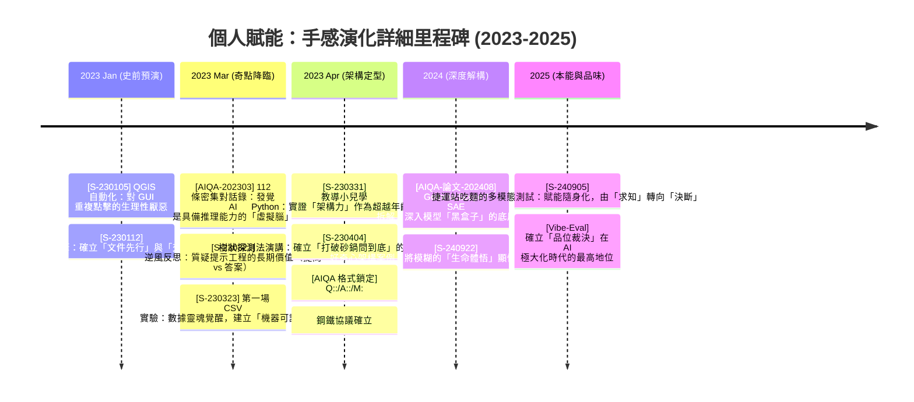

# 3.8 章節總結：手感演化地圖與架構圖譜 (Summary: Somatic Evolution Map & Architectural Atlas)

在進入第四章的程式化與自動化之前，我們需要將第三章這一段感性與理性交織的「手感養成期」進行一次結構化的收攏。這不僅是為了回顧，更是為了定義我們在這段演化史中所建立的「人機共生架構」。

### 手感演化里程碑 (The Granular Evolution Timeline)

這份細膩的時間軸展現了認知躍遷的每一個關鍵瞬間。



### 手感架構圖譜 (The Human-AI Symmetric Architecture v2.0)

為了更精確地描述這套系統，我們將架構細化為「意圖發起層」、「資料交換層」與「邏輯運算層」。

```mermaid
graph TD
    subgraph 層次一：人類意圖發起層 [Cognitive Layer: Human Intention]
        A1[架構基因: 拒絕重複] --> A2[感覺捕捉: 好奇心/需求]
        A2 --> A3[隱性知識顯性化: 邏輯拆解]
        A4[品位中心: 體感評測] -->|審計/裁決| E
    end

    subgraph 層次二：鋼鐵協議交換層 [Interface Layer: AIQA Protocol]
        B1[M:: Context/Metadata] --> B2[Q:: Specification]
        B2 --- C[對稱交互介面]
        C --- B3[A:: Implementation]
        B3 --> B4[M':: Refined Insights]
    end

    subgraph 層次三：AI 邏輯運算層 [Compute Layer: AI Virtual Brain]
        D1[身分模擬: 角色框架] --> D2[邏輯推理引擎]
        D3[數據解構能力] --> D2
        D2 --> D4[格式化產出: JSON/CSV/MD]
    end

    %% 數據流與反饋迴圈
    A3 -->|注入規約| B2
    B3 -->|原始產出| A4
    B4 -->|認知修正| A2
    D4 -->|標準化對接| B3
    B2 -->|參數驅動| D1
    
    %% 對稱標註
    subgraph 對稱連動觀點
        direction LR
        A3 -.->|對稱於| D2
        A4 -.->|裁決| D4
    end
```

### 架構說明與深度領悟

這套細膩化後的架構，揭示了賦能的三個深層機制：

1.  **規格驅動 (Spec-Driven)**：在「層次二」中，**Q::** 不再是問題，而是**規格 (Specification)**。我們不再期待 AI 給出正確答案，而是要求 AI 在我們定義的規格內進行邏輯填充。
2.  **雙重元數據迴圈 (Double Metadata Loop)**：觀察 **M::** 與 **M'::**。在對話前，**M::** 負責注入背景脈絡；對話後，**M'::** 負責捕捉人類的認知修正。這確保了每一場對話都能留下「思考的火種」，而非隨風而逝。
3.  **對稱式裁決學 (Symmetric Judgment)**：人腦的「品位裁決 (A4)」與 AI 的「格式化產出 (D4)」形成了最終的檢查點。這解釋了為什麼我們需要持續磨練「體感」，因為當 AI 的產出 (D4) 趨於無限且廉價時，唯有具備裁決力 (A4) 的人，才能在數據海洋中定義出真正的價值。

這份架構圖正式宣告了「手感時期」的完成。下一章，我們將這套抽象的「鋼鐵協議」，直接注入到 Linux 終端機與 Python 腳本中，讓這種對稱式協作具備真正的「規模化物理重量」。

---
**本章總結證據：**
- **Architecture**: 對稱式邏輯交換架構 (Symmetric Logic Interchange Architecture)
- **Granularity**: 從毫秒級的基因反應到跨年度的資產堆疊。
- **核心觀點**: `[C-08] 架構先行`、`[C-10] 隱性知識顯性化`、`[C-11] 品位與偏好`
