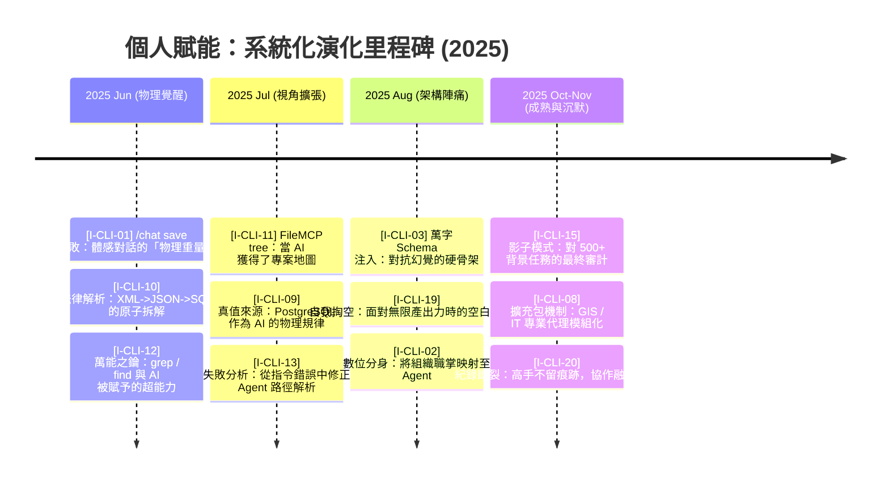
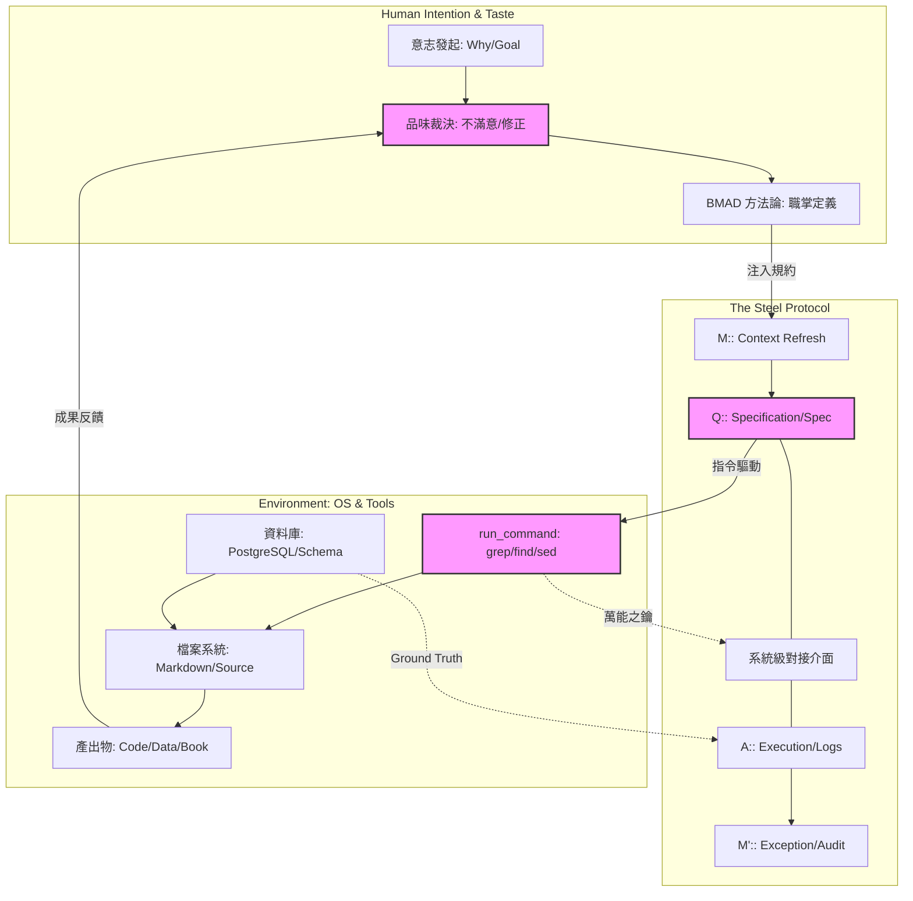

# 4.7 章節總結：Agentic 系統架構盤點與自動化演化圖譜 (Summary: Systematic Architecture Atlas)

如果說第三章是「建立了手感」，那麼第四章就是「完成了軍裝」。在這段 Agentic 實驗室時期，我們將原本零散的體感，正式封裝進了具備物理重量的系統之中。

### 系統化演化里程碑 (The Systematic Evolution Timeline)

這份時間軸展現了我們如何從網頁視窗的消費者，跨越成為作業系統的統御者。

### Agentic 系統交互架構圖 v2.0 (Agentic Interaction Architecture)

這套架構描述了「意志」如何透過「協議」，驅動「硬工具」產出具備「品味」的成果。

### 深度領悟與系統總結

這份架構圖揭示了 Agentic 核心的三個變革：

1.  **規格即命令 (Spec as Command)**：對話不再是問答，而是對 **Specification (B2)** 的精確填充。我們對 AI 的要求，從「幫我想」變成了「依據這個規格執行 `run_command`」。
2.  **真值校準 (Ground Truth Alignment)**：我們學會利用資料庫的硬約束 (D3) 與 OS 的物理反饋 (D1) 來抵消 AI 的不確定性。**「真理不在對話中，真理在執行後的 Error Log 裡。」**
3.  **權力的變位與空白**：當我們習慣了影子模式 (Shadow Mode)，我們的工作內容發生了徹底的位移。我們不再是苦工，而是那個在 A2 節點上，憑藉著「不滿意」來裁決系統走向的**「最高法官」**。

至此，我們已經在實驗室裡完成了所有裝備。從下一章開始，我們將跨出實驗室，進入真正的專案汪洋中，看這些 Agent 如何在 **Antigravity** 的帶領下，進行一場真正的「代理人革命」。

---
**本章總結證據：**
- **Architecture**: 意志驅動的系統操作架構 (Will-Driven System Ops Architecture)
- **Weight**: 檔案化、日誌化、具備可回溯的物理真實感。
- **核心觀點**: `[I-CLI-12] 萬能之鑰`、`[I-CLI-16] 品位裁決`、`[I-CLI-20] 紀錄的斷裂`
