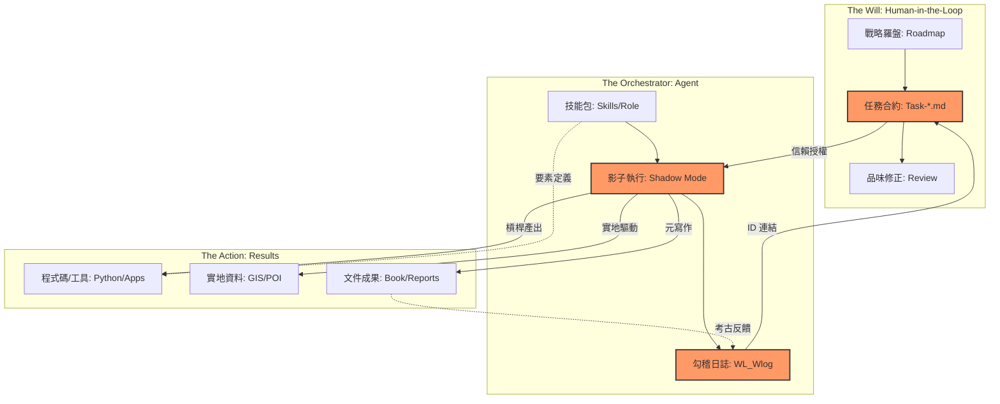

# 5.10 章節總結：代理人組織架構與成果要素矩陣 (Summary: The Result Matrix)

第五章帶領我們從「工具的使用」跨越到了「系統的統御」。我們不再只是在調整參數，而是在架構一個能自我推進、自我管理、且具備高度勾稽能力的 **「個人代理人組織」**。

### 代理人成果-要素矩陣 (Outcome-Element Matrix)

為了讓讀者能快速掌握這場革命的「配方」，我們將這段實戰時期的關鍵要素進行了矩陣化：

| 成果類型 (Outcomes) | 關鍵驅動要素 (Core Elements) | 代表領悟 (Insights) |
| :--- | :--- | :--- |
| **爆發式技術產出** | 工具槓桿 (Tool-Making) | `I-AG-02` 從幫我寫到幫我算 |
| **無人值守自動化** | 任務合約 (Task-based Contract) | `I-AG-03` 影子任務的誕生 |
| **高品質認知專注** | 空間管理 (Workspace Isolation) | `I-AG-01` 專案即容器 |
| **複雜實地實踐** | 實地對接 (Grounding/GIS) | 曾文溪實地賦能紀錄 |
| **跨維度架構設計** | 三層勾稽 (Three-Tier Linkage) | Compass-Task-WLog 下心智對接 |

### 代理人組織交互架構圖 v3.0 (Agentic Organization v3.0)

這套架構展示了「意志」如何透過「三層勾稽」驅動「代理人團隊」在物理與數位空間同步產出。

### 邁向終局的預演

在第五章，我們已經完成了從 **「單兵」** 到 **「兵團」** 的轉化。我們擁有了空間、槓桿、合約與勾稽。這一切都為全書的最後一篇（Part III）奠定了基礎。

當我們學會了如何「大規模生產」後，最後的問題就回來了：在這個被代理人充斥的世界中，**「人」到底在哪裡？** 那些因為速度太快而差點遺失的「思考火種」，將如何在接下來的「哈爸筆記」系統中，找到最終的歸宿？

我們準備好進入最後一章，去尋找那個關於「原創力」與「品味」的最終護城河。

---
**本章總結證據：**
- **Architecture**: 三層勾稽代理人架構 (Three-Tier Linked Agentic Architecture)
- **Results**: MMAnalyze, City7, 曾文溪走讀, 建構元日誌。
- **核心觀點**: `意志的穿透`、`工具製造者的製造者`、`元寫作實證`。
