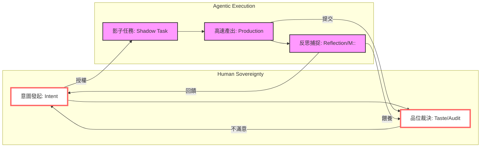
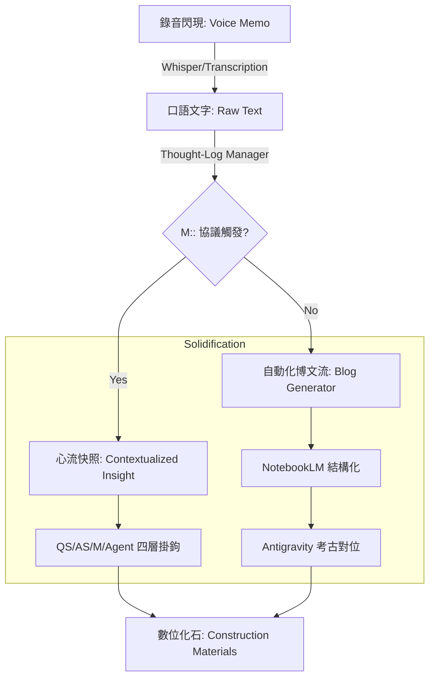
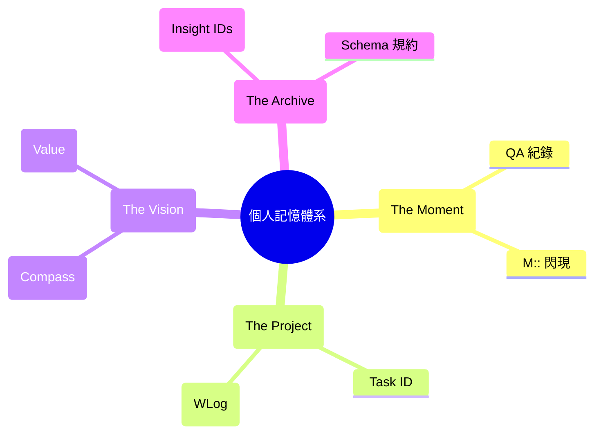
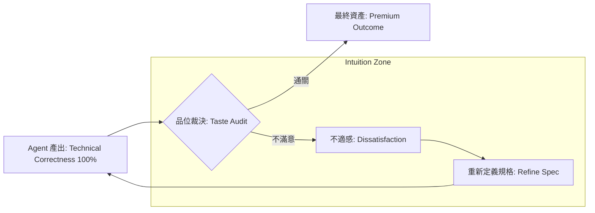

# 6.10 章節總結：反思架構、品位矩陣與人機共生決策環 (The Architecture of Reflection)

第六章標誌著我們從「執行力的擴張」轉向「主體性的回歸」。本章總結了如何在高速產出中透過架構化的反思（Reflection）來接住遺失的靈魂，並定義了赋能者的終極護城河。

### 哈爸筆記核心方法論矩陣 (The Reflection Matrix)

| 捕捉方式 (Method) | 技術要素 (Technique) | 核心價值 (Value) |
| :--- | :--- | :--- |
| **無感捕捉 (Passive)** | 錄音轉化流 (Voice-to-Blog) | **靈魂保全**：為了遺忘而記，釋放腦壓。 |
| **現場捕捉 (Active)** | `M::` 心流捕捉協議 | **領悟鎖定**：將施工現場的驚訝即時固化。 |
| **結構回溯 (Dynamic)** | 羅盤與日誌自動化重建 | **維度定錨**：透過數位考古看清演化位點。 |
| **主觀裁決 (Judgment)** | 品位修正 (Taste Adjudication) | **主權確立**：拒絕平庸，定義「好壞」的標準。 |

### 人機共生決策環 v1.0 (The Symbiotic Decision Loop)

這套架構展示了「人」如何透過品位與反思，與「代理人軍團」形成一個閉環的共生系統。

### 靈魂防腐處理流 (The Soul Preservation Pipeline)

展示從感性的錄音閃現，如何透過系統化的「除皺」與「固化」，轉變為理性的數位資產。

### 多維度記憶體系 (Multi-Dimensional Memory Architecture)

展示 M:: 如何作為連接點，將「當下的驚訝」與「歷史的證據」進行摺疊。

### 品位裁決過濾器 (The Taste Adjudication Filter)

這張圖呈現了為什麼「正確答案」不等於「好答案」，以及人的審美如何驅動進化的循環。

### 第一篇的演化總結：賦能者的終極堡壘

在本章結束時，我們終於完成了「個人代理人實驗室」的第一個版本。這不是一套工具的堆疊，而是一個具備 **「執行力 (Antigravity)」** 與 **「反思力 (Haba Notes)」** 的有機體。

我們學會了：
- 用 **Workspace** 隔絕雜訊。
- 用 **Schema** 約束行為。
- 用 **Task** 驅動執行。
- 用 **WLog** 紀錄歷程。
- 用 **Compass** 定標戰略。
- 用 **M::** 鎖定驚訝。
- 最後，用 **Taste** 統御一切。

這些要素共同勾稽成了 Part I 最硬核的產出。我們已經準備好告別感性的「演化史」，進入 Part II 的「實作手冊」，將這些架構一一落地。

---
**第六章核心產出點：**
- **Methodology**: `M::` 協議與聲控博文流。
- **Architecture**: 人機共生決策環 (The Loop).
- **Mindset**: 品位裁決作為最高護城河。
