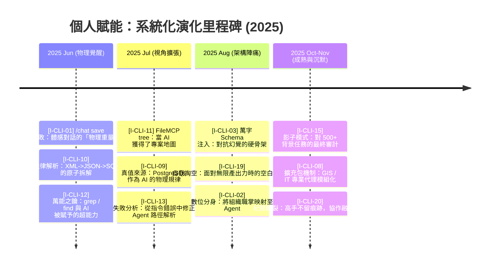
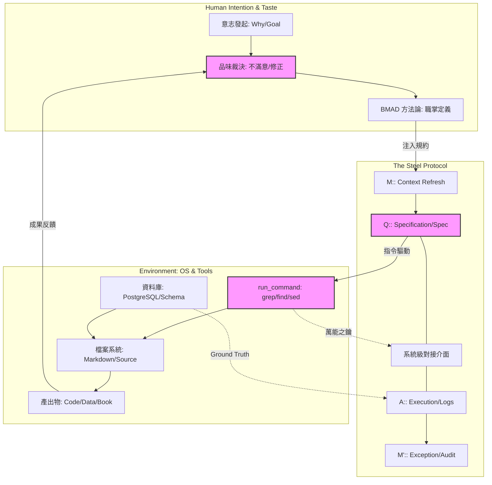
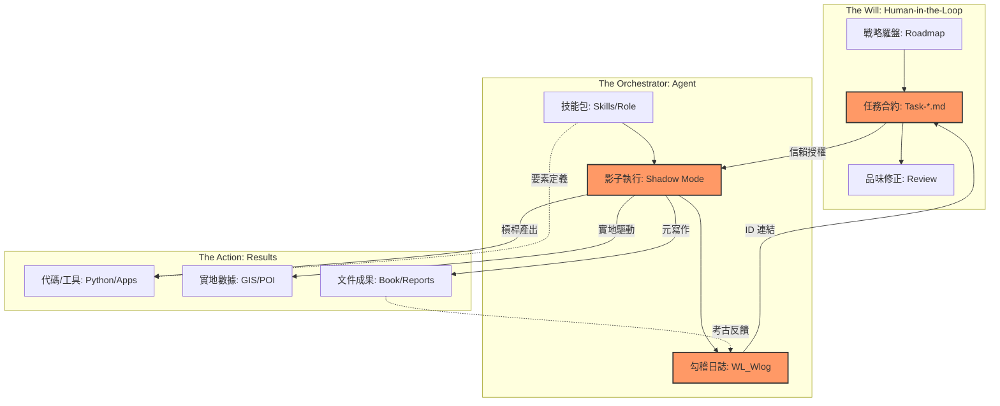
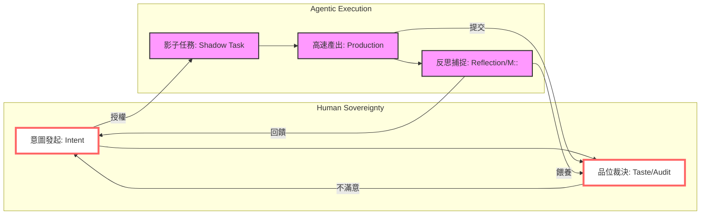
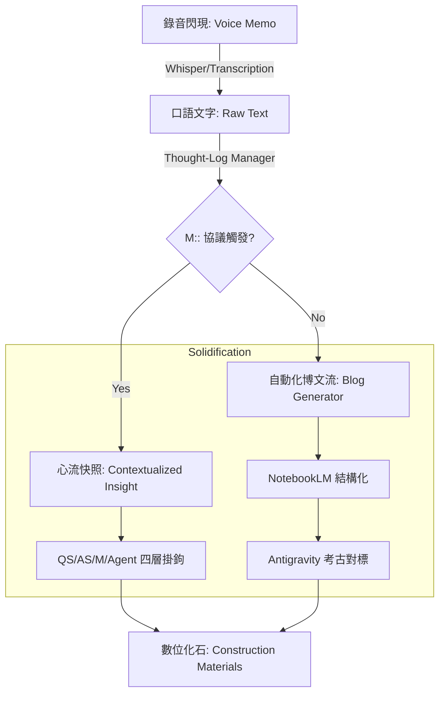
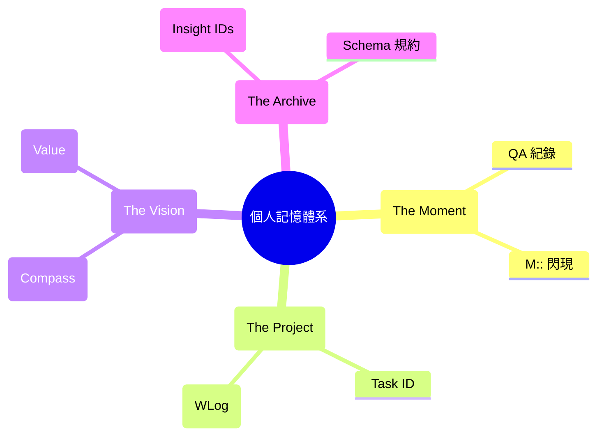
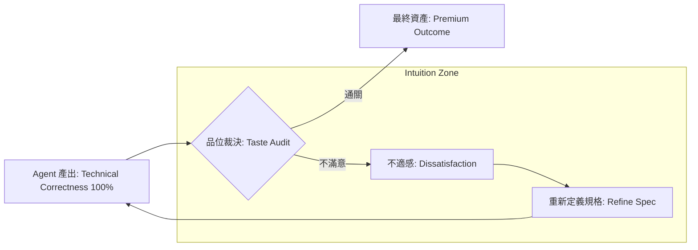

# 《個人賦能》完整全書

> 本文件由自動化腳本合併而成，生成時間：

---

# 《個人賦能：在 AI 時代找回原創力的演化實戰》
## 兩層式目錄與摘要 (實戰引導版)

---

# 第一篇：演化實戰紀錄 —— 觀點與證據的挖掘 (Part I: The Archive)
*本篇透過數位考古，誠實紀錄 2023 到 2025 年間，人類如何從「跟 AI 聊天」進化到「系統工程協作」的真實路徑。*

## 第 1 章：數位考古與書本建構 (The Meta-Chapter)
- 1.1 數位考古學：在碎片中找回消失的靈魂 (`I-CLI-17`)
- 1.2 建構紀實：架構先行與元日誌的力量 (`I-CLI-02`)
- 1.3 核心領悟：AI 時代的「原創」再定義 (`I-CLI-16`)

## 第 2 章：心智覺醒 —— 從工具人到架構師 (The Awakening)
- 2.1 賦能的本質：雙核共生與拒絕淺薄
- 2.2 腦神經重塑：微縮時間與學習的感動
- 2.3 抽象化思考：系統工程經驗的遷移力 (`I-CLI-03`, `I-CLI-18`)

## 第 3 章：建立手感 —— 從啟蒙對話到體感評測 (The Somatic Bond)
- 3.1 啟蒙對話：架構基因的預演與「虛擬腦」的發現 (`S-230105`, `S-230112`, `AIQA-202303`)
- 3.2 鋼鐵協議：為何 AIQA 的結構在三年間無需升級？ (`AIQA-202303` vs `AIQA-202502`)
- 3.3 結構化提問：樹狀探測法與「打破砂鍋問到底」的體感 (`S-230404`, `I-CLI-10`)
- 3.4 給予數據靈魂：CSV 實驗與「機器可讀」的認知躍遷 (`S-230323`, `AIQA-解讀CSV`)
- 3.5 跨代驗證：證明「架構力」是抹平專業與年齡壁壘的槓桿 (`S-230331`, `AIQA-小兒學python`)
- 3.6 隱性知識顯性化：將「感覺」解構為「架構」的心法 (`S-240922`)
- 3.7 體感評測與品味：反思「提問」與「答案」的價值變位 (`S-230321`, `S-240905`, `AIQA-讀論文-202408`)
- 3.8 章節總結：手感演化地圖與架構圖譜 (Summary & Architecture Atlas)

## 第 4 章：Agentic 實驗室 —— 系統工程的硬核與 Vibe-coding 的靈魂 (The Systems & Soul)
- 4.1 協議的物理重量：從「聊天室」搬進「終端機執行區」 (`I-CLI-01`, `I-CLI-05`)
- 4.2 萬能之鑰與視視角覺醒：為什麼作業系統指令才是最強大的 MCP (`I-CLI-11`, `I-CLI-12`)
- 4.3 數據守衛與品味裁決：以 Schema 為骨架、以「不滿意」為羅盤 (`I-CLI-03`, `I-CLI-09`, `I-CLI-16`)
- 4.4 樣態革命與跨域實驗：法律、地理與醫療系統的 Agentic 轉生 (`I-CLI-10`, `I-CLI-18`, `I-CLI-08`, `S-230402`)
- 4.5 BMAD 的起源與影子開發：面對「自我掏空」後的意志重建 (`I-CLI-02`, `I-CLI-15`, `I-CLI-19`)
- 4.6 記憶同步與紀錄的斷裂：為什麼高手不留痕跡？ (`I-CLI-06`, `I-CLI-17`, `I-CLI-20`)
- 4.7 章節總結：Agentic 系統架構盤點與自動化演化圖譜 v2.0 (Summary & Architecture Atlas)

## 第 5 章：代理人革命 —— 爆發式產出與三層勾稽實踐 (The Action & Orchestration)
- 5.1 空間覺醒：Workspace 的物理隔絕與認知專注路徑 (`I-AG-01`)
- 5.2 槓桿躍遷：從「撰稿助理」到「工具製造者的製造者」 (`I-AG-02`)
- 5.3 任務合約：影子任務 (Shadow Tasks) 裡的自動化律動 (`I-AG-03`)
- 5.4 意志的穿透：羅盤、任務與日誌的三層式勾稽 (2026/02)
- 5.5 擁抱混沌：在會議紀錄與醫療文獻中萃取結構化成果 (`I-AG-04`)
- 5.6 實地賦能：河流探索、POI 厚化與地理數據的自動化 (2026/01)
- 5.7 維度映射：從個人虛擬化到企業轉型 v1.3 方法論
- 5.8 速度的副作用：消失的紀錄之謎與「思考火火種」捕捉危機 (`I-AG-05`)
- 5.9 元寫作現場：當這本書的建構成為代理人運行的活體證據
- 5.10 章節總結：代理人組織架構與成果要素矩陣 v3.0

## 第 6 章：哈爸筆記 —— 實戰中的賦能覺醒與品位裁決 (Practice & Reflection)
- 6.1 紀錄的斷裂：從 2025 年底的「考古荒原」看見賦能危機 (`I-AG-05`)
- 6.2 出一隻嘴做系統管理：GCP 自架構與「基礎設施代理人」實戰
- 6.3 連結者的覺醒：n8n 自動化流水線與 GitHub RAG 的串接實驗
- 6.4 代理人的靈魂賦予：Discord AI 機器人進化史 (從鸚鵡到 Agent)
- 6.5 靈魂的保全：錄音轉化流與 NotebookLM 的「口述即博文」
- 6.6 驚訝的邊界：當 Antigravity 展現出超越機器的「情境理解力」
- 6.7 失落的 M：M:: 協議與「施工現場驚訝」的即時固化
- 6.8 秩序與羅盤：工作日誌與策略羅盤的自動化重建
- 6.9 原創力的最後堡壘：AI 時代的差異化競爭——「品位裁決」 (`I-CLI-16`)
- 6.10 章節總結：反思架構與品位裁決矩陣 (Chapter Summary)
- 6.11 第一篇全總結：從「基因預演」到「代理人軍團」的演化全景圖 (Part I Summary)

---

# 第二篇：賦能實踐指南 —— 五階段演化特訓 (Part II: The Training)
*本篇透過「做中學」的五個階段，將 Part I 的演化領悟轉化為個人的數位本能。*

## 第 7 章：方法論 —— 導航你的數位主權 (Methodology)
- 7.1 賦能工具五虎將：您的數位軍火庫簡介
- 7.2 五階段演化梯：為什麼是這個順序？
- 7.3 雙軌練習法：普通威力與進階養成
- 7.4 🚀 抽象對齊系統：解讀地圖上的座標
- 7.5 練習格式指南

## 第 8 章：Gemini Web/App —— 啟蒙、自學與多模態捕捉 (Step 1)
- 8.0 數位共生的核心：剖析 Gemini 3 的多模態與代理賦能
- 8.1 練習 1.1：🟢 想到就問 —— 與 AI 建立體感連結 (Somatic Bond)
- 8.2 練習 1.2：🟢 視覺對質 —— 測試 AI 的在地辨識邊界 (Visual Reason)
- 8.3 練習 1.3：🟢 生圖裁決 —— 從天馬行空到理想空間的精準微調
- 8.4 練習 1.4：🟡 建立 AIQA 筆記習慣 —— 數位考古的資產化步驟
- 8.5 練習 1.5：🟢 觀點變身器 —— 利用多重人格打破認知盲點 (Perspective Shift)
- 8.6 練習 1.6：🟡 迭代式的深度研發 —— 參與 AI 的研究路徑規劃 (Deep Research v2)
- 8.7 練習 1.7：🟡 用 Canvas 實現想像 —— 在協作畫布上解構資料意義 (Visual Creation)
- 8.8 練習 1.8：🔴 認知導航 —— Guided Learning 與二階思考 (Thinking Guide)
- 8.9 練習 1.9：🔴 生態系總指揮 —— @ 指令與跨應用自動化 (Ecosystem Commander)
- 8.10 練習 1.10：🔴 刨根問底 —— 利用 Reasoning 模式破解專業迷思 (Deep Inquiry)
- 8.11 練習 1.11：🔴 認知導圖 —— 快速生成「為我而寫」的兩層式目錄
- 8.12 練習 1.12：🔴 決策博弈 —— 啟動批判性思考的壓力測試 (Decision Games)
- 8.13 練習 1.13：🟢 行動覺醒 —— 跨裝置視訊與語音捕捉 (Mobile Presence)
- 8.14 練習 1.14：🔴 邁向認知主權 —— 我的個人自學成果總結與考古對位

## 第 9 章：NotebookLM —— 數據定錨、多態轉化與「數位分身」 (Step 2)
理解資訊形態轉化的本質，建立對證據的敬畏。 [1,000,000+ Context Window]
- 9.0 導論：從「碎片」到「定錨」——資訊形態轉化的魂魄 (The Soul of Metamorphosis)
- 9.1 練習 2.1：🟢 真相定錨與多模態大熔爐 (PDF, YouTube, Image OCR)
- 9.2 練習 2.2：🟡 知識收割與輸出權力 (Export, Join Sharing & Critique Mode)
- 9.3 練習 2.3：🟡 跨來源「金線」萃取與動態心智圖 (Cross-Source Synthesis & Dynamic Mapping)
- 9.4 練習 2.4：🟢 認知擴張與來源建構 (Fast & Deep Research Scouting)
- 9.5 練習 2.5：🟢 生活與學術的「降維打擊」 (Life Hacks & Paper Decoding)
- 9.6 練習 2.6：🟢 釋放頻寬的「錄音即紀錄」 (Audio Interaction & Join Mode)
- 9.7 練習 2.7：🔴 形態幻化 —— 個人媒體工作室 (Slides Deck & Debate Mode)
- 9.8 練習 2.8：🔴 影片分享的知識點「刨根」 (YouTube Video transcription & Indexing)
- 9.9 練習 2.9：🔴 數位人格的鏡像診斷 (Psychological Context Mirroring)
- 9.10 練習 2.10：🟡 版本演化追蹤 (Version Evolution & Decision Logic)
- 9.11 練習 2.11：🔴 批判性「紅軍測試」 (Red Teaming Assumptions via Critique)
- 9.12 練習 2.12：🟡 漸進式認知導航 (Guided Learning Path)
- 9.13 練習 2.13：🟢 打造「賦能懶人包」 (Interactive Knowledge Assets)
- 9.14 章節總結：從「資訊消費者」到「知識建築師」的演化總覽 (Summary & Architecture Atlas)

## 第 10 章：Antigravity —— Agentic 統御、極速生產與持久化 (Step 3)
從理解代理人核心要素開始，逐步掌握自動化工具與系統統御力。
- 10.0 導論：為何「Agentic」是找回數位主權的終極戰場？
- 10.1 練習 3.1：🟢 從「聊天」到「派任務」 —— 定義你的產出目標
- 10.2 練習 3.2：🟢 驅動 Agent 規劃 —— 拆解一個複雜的專案路徑
- 10.3 練習 3.3：🟡 調用工具的力量 —— 搜尋、分析與實體運算的聯動
- 10.4 練習 3.4：🟡 啟動「紅軍模式」 —— 讓 Agent 自我審計與優化成果
- 10.5 練習 3.5：🟢 資料批量賦能 —— 一次處理 100 筆資訊的轉化
- 10.6 練習 3.6：🟡 腳本賦能 —— 產出並運行你的第一支自動化小工具
- 10.7 練習 3.7：🟢 跨入 CLI 終端機 —— 建立你的第一個數位 Workspace
- 10.8 練習 3.8：🔴 MCP 與工具聯覺 —— 讓你的工具箱合致在一起
- 10.9 練習 3.9：🔴 專業治理套件 —— MT:: 紀錄、三層勾稽與 Skill 封裝
- 10.10 章節總結：從「使用者」畢業，成為「數位系統統御者」

## 第 11 章：AI Studio —— 初探 Vibe Coding 與深度控制 (Step 4)
當產能已成日常，追求「語感、風格與美學」的極致，進行大腦手術。
- **核心練習**：系統指令 (System Instructions) 覺醒、參數脈動實驗、語感精準校準。
- **進階養成**：[T-1.3] 品位裁決權與「不滿意」的價值 ([I-CLI-16])。

## 第 12 章：BMAD-method —— 策略治理與虛擬分身 (Step 5)
將工具與習慣提升為治理架構，邁向個人虛擬化的終局。
- **核心練習**：代理人職掌定義與契約、意圖拆解練習、個人虛擬化立論撰寫。
- **進階養成**：[T-5.3] 代理人契約、[T-6.2] 個人虛擬化立論與企業對接。

## 第 13 章：賦能生活化 —— 您的 30 天 AI 啟動計畫 (Final)
將五階段整合進日常生活。建立屬於您的「賦能特訓軌跡」，成為具備原創靈靈魂的自由人。
- **結語**：個人虛擬化是企業虛擬化之根，通往未來的最後一張門票。


<!-- PAGE_BREAK: Chapter_1_1.md -->

---

# 第 1.1 章：數位考古學 —— 在碎片中找回消失的靈魂

## 0. 初衷：為什麼我們拒絕「AI 代寫」的虛假敘事？

在動手撰寫這本書之前，我面臨一個嚴峻的挑戰：AI 已經非常有能力「寫」出一本關於赋能的書。只要給它一個大綱，它可以滔滔不絕地產出看似專業、流暢但卻可能與我的真實經驗完全脫節的文字。

**我想寫的，是一本「對齊事實」的書。**

之所以採用數位考古的方法論，根本原因在於我想誠實地探索：**「我到底是怎麼學過來的？」** 赋能不是一個瞬間發生的神蹟，而是一連串在深夜裡的除錯、在終端機前的掙扎，以及無數次與 AI 達成「邏輯共識」的成果。

利用腳本去掃描 logs、去追蹤 Session ID 的訊息密度，是為了讓這本書的每一句話都有紮實的數位腳印支撐。這不只是在寫書，這是我在重新整理這三年來，自己與另一個智慧體共同進化的「生理紀錄」。

## 1. 架構邏輯：為何考古先行？為何分為兩篇？

您可能發現，這本書的架構非常獨特。我們在展示「如何做」之前，先帶您看「挖掘現場」。

### 為什麼「考古」在「目錄」前面？
因為在 Agentic 時代，**事實比計畫更重要**。
如果我們先定死了一個漂亮的目錄，再強迫 AI 去填補內容，那通常會導向空洞的理論。相反地，我決定讓「考古證據」定義目錄。我們是先從日誌中挖出了 `I-CLI-11` (視角覺醒) 與 `I-AG-03` (影子任務)，才發現原來這些時刻才是賦能的真正節點。目錄，是證據的影子。

### 為什麼要有「第二篇：實踐指南」？
- **第一篇 (考古篇)** 負責「建立信度」：它是感性的演化故事，讓您看見一個真實的人如何被武裝起來。
- **第二篇 (手冊篇)** 負責「建立效度」：它將第一篇那些碎片化、有時甚至混亂的領悟，由上而下地 (Top-down) 提煉成您可以模仿、可循序漸進練習的技巧。

> **關於數位工件與隱私的特別備註**：
> 雖然本書的方法論高度依賴原始數據（如 `logs.json`、分析用的 CSV 以及內部腳本），但這些檔案累積了多年來與 AI 密集互動的點滴，難免包含敏感的個人或工作隱私。為了在保護隱私與維持論述透明度之間取得平衡，本書會提供具體的 **檔案名稱**、**腳本代碼名** 與 **Session ID** 作為考古座標。
> 
> 您可以將這些檔名視為「歷史層的地理座標」，證明這些事件確實發生過，但出於安全考量，這些工件的原始內容將保留在我的私有工作區中，不對外釋出。我們提煉出的「領悟」才是這些地層中真正要呈現給您的真金。

沒有第一篇的考古，第二篇的方法論就是無根的浮萍；沒有第二篇的指引，第一篇的故事就只是我個人的回憶錄。

## 2. 數位地質學：數據層中的賦能足跡

> 「考古不只是為了找回過去，是為了在層層堆疊的紀錄中，定義未來的自己。」

這本書的產出方式本身就是一場大規模的「賦能實驗」。當初您在閱讀時可能以為這只是某人的隨筆或心得，但實際上，這些文字是從超過 100 個 Session ID、數萬行 `logs.json` 以及無數個 `.py` 腳本的「殘骸」中，利用數位考古技術挖掘出來的結晶。

大多數人的 AI 賦能紀錄都消失在瀏覽器的「清空對話」按鈕中，那對我而言是極大的資源浪費。在撰寫本書時，我建立了一套 **數位考古 (Digital Archaeology)** 方法論。

我將過去三年的數位紀錄視為不同的「地層」：
- **UI 淺表層 (2022-2023)**：充滿了與 ChatGPT 嘗試性的問答，這是觀點萌發的「寒武紀」。
- **CLI 岩實層 (2025/06 - 11)**：這是 Gemini-CLI 時代。透過 `I-CLI-17` 考古索引，我找回了當初在處理 LawDB 時，對於「結構化是 AI 氧氣」的最原始激動。
- **Agentic 沉積層 (2025/11 至今)**：這是 Antigravity 時代。雖然手動對話紀錄變少了，但工作目錄下留下的大量成果工件 (Artifacts) 成了最強大的間接證據。

## 2. 工具的力量：從「回想」到「挖掘」

人類的記憶是有偏誤的，我們會美化過去的成功，遺忘失敗的細節。但日誌 (Logs) 不會。

在寫作過程中，我派遣了多個「考古機器人 (Python Scripts)」進入地層進行自動化分析。
例如：
- **Scanner 機器人**：對 `~/.gemini/tmp/` 進行大規模掃描，根據 Intensity (訊息密度) 找出那些曾讓我們通宵達旦的「關鍵戰場」。
- **Parser 機器人**：深入 `logs.json` 提取出那些帶有標誌性意義的指令，例如第一次呼叫 `FileMCP` 的時刻 (`I-CLI-11`)。

這種考古方式讓我領悟到：**[I-CLI-17] 考古式的自我對話**。當我重新閱讀三個月前的 Session 時，我不是在看舊資料，而是在與那個「當時正與 Agent 激烈交鋒的自己」進行跨時空的對齊。

## 3. 消失的靈魂：搶救紀錄斷裂

考古中最令我震撼的發現是 **[I-CLI-05] 消失的紀錄**。
在 `8dc3561b` 這個 Session 中，訊息量爆發到 2839 則，但卻幾乎沒有任何總結筆記。為什麼？因為產出速度已經超越了人類「手寫紀錄」的極限。

這次考古不僅是找回資料，更是為了 **「搶救消失的靈魂」**。透過分析 Agent 留下的 `Task-*.md` 檔案，我們得以重構那段「瘋狂產出但也極度沈默」的轉型期。這也直接導致了後續「哈爸筆記」系統的建立——我們必須學會與「執行速度」競賽，留住思考的火種。

## 4. 領悟索引：建立論述的嚴謹度

為了維持這本書的真實性，我拒絕使用模糊的「我覺得」。
本章所提到的每一個觀點，都掛載了一個實體座標。例如，當我討論「人的價值在於不滿意」時，我指的是 `I-CLI-16`，對應到 2025/06/27 那次對 LawDB 初始摘要規則的強烈介入。

這種將「感性領悟」與「理性日誌」強關聯的結構，就是我與 AI 共創出的 **「人機合意考古學」**。

---
*考古證據索引節錄 (Artifact Mapping):*
- **地石 A**: `data_analysis/analyze_cli_timeline.py` (考古探勘腳本)
- **地石 B**: `construction_materials/20_Insight_Trace_Index.md` (領悟追蹤索引)


<!-- PAGE_BREAK: Chapter_1_2.md -->

---

# 第 1.2 章：建構紀實 —— 架構先行與「數位格律」的力量

> 「不要在那裡對 AI 下指令，請試著在那裡定義『格律』。」

這本書不是「寫」出來的，它是「建構 (Construct)」出來的。在大多數人還在苦惱於如何寫出一段完美的 Prompt 時，我已經轉向了另一個更深層的賦能維度：**建立一套人機之間共同遵守的「數位格律」。**

## 1. 架構先行 (Architecture First)：品味的最終判準

什麼是「架構先行」？這意味著在我們寫出第一行正式內容之前，我們先花了大量的時間在定義「什麼才是對的」。

我們討論了目錄的兩篇式結構、建立了考古追蹤索引、設計了公私分明的檔案搬移機制。這些決定並非基於模型的好惡，而是基於人類創作者的「品味」與「主權」。
**架構，就是人類對專案的最高意志。** 如果架構模糊，AI 產出的文字只會是一堆流暢但無用的廢紙。

## 2. 數位格律 (Digital Meter)：引導 Agent 的建構協議

為了讓 AI 代理人能夠精確執行這套架構，我引入了 **「數位格律 (Digital Meter)」** 的概念。

這不是在那裡對機器喊口號，而是建立一份具備嚴格約束力的協議（例如在此專案中我們使用的協議文件）。這份格律包含了：
- **層級邊界**：定義章節的兩層式對齊原則。
- **證據綁定**：要求每一項核心領悟必須回溯至實體的 Session ID（如 `I-CLI` 系列）。
- **隱私防火牆**：嚴格界定哪些是「考古碎石（私密數據）」，哪些是「真金（公開內容）」。

為什麼稱之為「格律」？就像詩歌中的平仄、押韻，它在給予限制的同時，也創造了最高的自由。當 AI 代理人讀取了格律，它就不再是一個隨機創作的聊天機器人，它變成了一個對齊我的標準、在格律內舞動的「數位建築工」。

## 3. 數位身教：將系統工程思維形式化

這是我在寫作過程中最深刻的領悟：**賦能的本質，在於人類對 AI 進行「數位身教」。**

當我精心調整數位格律的條文時，我其實是在將我多年的「系統工程 (System Engineering)」思維形式化。我教給 AI 的不僅是寫書的技巧，更是我對事物的處理標準：
- **對命名品位的堅持。**
- **對數據真實性的偏執。**
- **對安全邊界的警覺。**

這種透過格律實現的「思維傳遞」，就是 **[I-CLI-02] 架構先行** 的真實體現。當 AI 開始模仿我的品位與嚴謹時，它就不再只是工具，而是我意志的延伸。

## 4. 建構紀錄：建構過程的永恆見證

為了忠實記錄這場賦能實驗，我們還建立了一套 **「建構紀錄」** 制度。
它不記錄書稿的內容，它記錄的是「我們如何做決定」。
- 「為什麼今天決定要重構第四章？」
- 「為什麼我們認為這段考古數據足以支撐這個領悟？」

建構紀錄是這場「人機共謀」最珍貴的腳印。它向讀者證明了，這本書的每一塊磚瓦，都是在人類建立的「大規格」與「強架構」下，一步步踏實堆疊而成的實體建築。


<!-- PAGE_BREAK: Chapter_1_3.md -->

---

# 第 1.3 章：核心領悟 —— AI 時代的「原創」再定義

> 「當 AI 可以生成一切時，原創不再是關於『產出內容』，而是關於『行使裁決』。」

在執行這場數位考古寫作實驗時，我被無數人問過一個問題：「如果大綱是 AI 整理的，文字是 AI 輔助生成的，這本書還能算是『你』寫的嗎？」

這個問題觸及了 AI 時代最核心的焦慮。但在翻閱了數千行日誌、與 Agent 進行了數百次對齊後，我心目中對於「原創 (Originality)」的定義，發生了翻天覆地的位移。

## 1. 原創力的位移：從「打字員」到「總建築師」

在過去，原創等同於「勞動的足跡」——你親手打下的每一個字、親手畫下的每一條線。

但在賦能時代，我發現了一種更高階的原創：**「架構的品位」**。正如我們在 1.2 章談到的「數位格律」，這本書的結構、它對齊事實的偏執、它公私分明的權限邏輯，全都是源於我對「這本書應該長什麼樣子」的強烈主見。

AI 就像是世界上最快、最聽話的建築工，它可以瞬間蓋好一堵牆。但要不要蓋這堵牆？這堵牆要對齊哪一個歷史座標？這是我作為「總建築師」的絕對主權。**原創，就是對「架構」與「界限」的終極裁決。**

## 2. [I-CLI-16] 人的價值，在於那一份「不滿意」

這是我在 2025 年 6 月 27 日考古日誌中挖掘出的最珍貴領悟：**[I-CLI-16] 人的價值在於不滿意。**

當時我正與 Gemini-CLI 協作 LawDB 的摘要規則。AI 產出了一個「非常流暢、非常標準」的各章摘要。對於大多數人來說，那已經是 80 分的作品，可以直接過關。但當我讀到那些文字時，我感到一種生理上的「不對勁」——那些文字沒有靈魂，它沒有抓到法律規條中那種「人與權力博弈」的張力。

於是我介入了。我推翻了它的產出，定下了更嚴苛的格律。
這就是賦能的瞬間：**AI 負責生產「平均值」，人類負責行使「偏好 (Preference)」。**

如果我對那 80 分的產出感到「滿意」，我就在那一刻消失了。正是因為我的「不滿意」，逼迫 AI 進一步對齊我的品位，產出了那原本不存在的、具備 A+ 特質的內容。**您的「挑剔」與「對細節的偏執」，才是您在 AI 浪潮中唯一無法被稀釋的資產。**

## 3. 考古的精神：找回「有重量」的真實

AI 有時候像是一個會說謊的才子，它可以編織出極其動人的虛假敘事。

我們的數位考古方法論，本質上是對「虛假原創」的反擊。為什麼我們要在 1.1 章堅持要對齊 Session ID？因為我領悟到：**在 AI 時代，真實就是一種原創。**

當我決定從數萬行日誌中撈出一段失敗的紀錄，並將其定義為一個重要的轉折點時，這套「發現的過程」就是原創。AI 無法告訴我哪一段對話對我的人生更有意義，只有我能透過考古，在那堆數位碎石中，指認出哪一顆是帶有火種的鑽石。

## 4. 寫書作為賦能的最高形式：三代賦能演化模型

在我的賦能路徑中，「寫一本書來教自己」的技術演進，精確地映射了人機關係的深化。這不是一次性的跳躍，而是經歷了三個世代的質變：

### 第一代：逐章共讀 (2023 年 3 月 - UI 時代)
這是「學徒模式」。追溯至 2023 年春天，我開始在 Obsidian 中紀錄 AIQA。當時的實驗（如「用 ChatGPT 產生 Markdown 章節語法實驗」）是非常原始且手工的：我讀一章、它寫一章，我再修正一章。
- **特徵**：高度同步的「人機共學」。
- **賦能感**：透過緩慢的手工拼貼，將 AI 的邏輯「磨」進自己的心智中。

### 第二代：自動生成 (2025 年底 - 早期 Agentic 時代)
這是「工廠模式」。隨著進入 CLI 與 Antigravity 初期，寫書法轉向了自動化：一旦目錄架構與格律定好，Agent 就能在短時間內自動跑完所有章節的填充。
- **特徵**：從「邊讀邊寫」轉向「批次產出」。
- **賦能感**：體驗到「產出效率」的恐怖量產，但此時書本與現實生活仍是分離的。

### 第三代：實體與數據共生疊代 (2026 年初 - 當下)
這是「共生模式」。書本不再只是知識的存檔，而是與我真實世界的行動軌跡與數據流緊密結合。
- **鄉鎮與河流探索**：與 WalkGIS 系統深度整合，實現「人在現場、書在背景成長」的同步感，並根據實地觀察的體感回頭疊代修正書稿。
- **企業賦能 AI**：利用語音輸入即時捕捉現場材料，並透過 Agent 進行多版本的內容修正與專業校準，實現高頻率的知識封裝。
- **個人賦能**：結合數位考古技術，從海量的對話日誌地層中提煉出具備證據力的領悟，實現「對齊事實」的自我生命回顧。
- **特徵**：書本伴隨實體行動、數據挖掘與語音流，現實與數位雙向反饋。
- **賦能感**：書稿成為了我的 **「第二人生紀錄」**，實現了知識、行動與紀錄的完美閉環。

這三代的演進，證明了賦能的終局：**AI 不再只是幫您完成任務，它在協助您將生命的每一段經歷，都自動轉化為可持續疊代的智慧資產。**

## 5. 結語：成為 Agentic 時代的自由人

原創的再定義，其實是權力的交還。
賦能不是為了讓我們變成更快的打字機，而是為了將我們從重複性的勞動中解放出來，去行使人類最珍貴的兩項權力：**「品位的裁決」與「意義的賦予」。**

當您擁有了這套數位格律，學會了如何行使「不滿意」的裁決權，您就跨越了「被編程」的階級，成為一個在 Agentic 時代真正自由、且具備原創靈魂的賦能者。

---
*領悟索引對齊:*
- **[I-CLI-16]**: 品位裁決價值 (2025/06/27 LawDB 實踐)。
- **[I-CLI-20]**: 封裝賦能成果的自我閉環。

## 📍 Part I 理論標籤對照表 (The Theory ID Map)

為了方便在後續的「賦能實踐指南」中進行精準引用，我們在此將第一篇的核心理論與立論點賦予唯一的識別 ID：

### 第 1 章：方法論與建構
- **[T-1.1] 數位考古學 (Digital Archaeology)**: 透過分析歷史日誌 (MQA) 來重構個人認知與技能的演化歷程。
- **[T-1.2] MQA 鋼鐵格律 (MQA Iron Law)**: 強制執行 Q::/A::/M:: 格式，將散亂對話轉化為可索引的數位資產。
- **[T-1.3] 品位裁決權 (Taste Audit)**: 人的核心價值在於對 AI 產出的「不滿意」與最終的架構裁決權。

### 第 2 章：心智覺醒
- **[T-2.1] 賦能本質論 (Empowerment Essence)**: 賦能不是為了省力，而是為了實現能力邊界的擴增與架構躍遷。
- **[T-2.2] 雙核共生 (Dual-Core Symbiosis)**: 人腦負責原創與審美，AI 負責運算與執行，形成高效協作迴圈。

### 第 3 章：建立手感
- **[T-3.1] 體感評測學 (Somatic Evaluation)**: 不迷信 Benchmark，透過實際互動建立對模型性格與邊界的直覺信任。
- **[T-3.2] 樹狀探測法 (Tree Technique)**: 透過「先宏觀架構、後微觀細節」的連續追問，快速攻克未知領域。
- **[T-3.3] 遞迴學習 (Recursive Learning)**: 將 AI 作為教練，在解決問題的過程中不斷完成知識的自我修正。

### 第 4 章：Agentic 實驗室
- **[T-4.1] 空間隔離 (Space Isolation)**: 使用 Workspace 建立明確的數位主權與隱私邊界。
- **[T-4.2] 萬能之鑰 (Master Key)**: 視 OS 原生指令為最強大的 MCP，強化人類對系統環境的統御力。

### 第 5 章：代理人革命
- **[T-5.1] 槓桿躍遷 (Leverage Jump)**: 從「工具使用者」進化到「工具製造者」的權力轉折點。
- **[T-5.2] 影子開發 (Shadow Development)**: 讓代理人在背景執行複雜任務，人類在前景維持戰略決策。
- **[T-5.3] 代理人契約 (Agent Contract)**: 明確定義代理人的職掌、行為邊界與倫理準則。
- **[T-5.4] 三層勾稽架構 (3-Tier Arch)**: 整合策略羅盤、任務帳本與工作日誌 (Compass-Task-WLog) 的統御系統。

### 第 6 章：實踐反思
- **[T-6.1] 心流捕捉協議 (MT:: Protocol)**: 在協作高熱度現場，透過 MT:: 協議即時固化瞬間的驚訝與感悟。
- **[T-6.2] 個人虛擬化立論 (Personal Virtualization)**: 個人虛擬化是企業數位轉型的核心動力與立論根基。


<!-- PAGE_BREAK: Chapter_2_1.md -->

---

# 第 2.1 章：賦能的本質 —— 雙核共生與拒絕淺薄

> 「真正的賦能，不是讓您變得更輕鬆，而是讓您變得更強大。」

在踏入 AI 領域的最初幾個月，大多數人的直覺反應是：「這東西能幫我省下多少時間？」我們將其視為一種更高級的「自動化」工具。然而，這種認知存在一個致命的陷阱：**如果您的目標只是為了省力，那麼您最終將被那些更省力的工具徹底取代。**

本章將揭露賦能在認知層面的第一次轉型：從「工具人」轉變為「架構師」的心智覺醒。

## 1. [C-01] 雙核系統：您與 AI 的認知分工

賦能的最核心觀念，是建立一套 **「雙核系統 (Dual Core System)」**。這不是模型輔助人類，而是人類與 AI 形成了一種動態的、高度互補的共生關係：

- **左核 (Human - 人的價值)**：負責原創感、審美品位、批判思考、價值判斷與最終的裁決權。它是專案的「靈魂」與「建築師」。
- **右核 (AI - 機器賦能)**：負責龐大的運算、無限的勞動力、多維度的執行力。它是專案的「肌肉」與「萬能建築工」。

當我意識到這點時，我不再追求讓 AI 直接給我「答案」，我追求的是讓 AI 與我進行 **「邏輯辯證」**。我負責定下格律，AI 負責在格律內填充。這種「分工」改變的不是我的手，而是我觀察世界的解析度。

## 2. [C-03] 拒絕淺薄：為什麼「下 Prompt」不等於賦能

在 2023 年 3 月的密集對話紀錄中，我發現了一個警訊：如果您只是學習如何寫出「正確的 Prompt」，那種技能是非常淺薄且易碎的。因為模型會迭代，今日的「提問技巧」可能在三個月後就毫無用處。

**真正的賦能是「能力擴增」，而非「技巧熟練」。**

如果您只是一個 Prompt 的操作員，您本質上是在替 AI 打工，試圖迎合機器的脾氣。但如果您是一個「架構師」，您是在運用系統工程的思維來定義任務。這就是 **拒絕淺薄 (Rejecting Scalability of Mediocrity)** —— 當 AI 讓平庸的產出變得廉價且可無限複製時，人類的價值將退縮到「架構」與「品位」的最後堡壘。

## 3. 賦能的生理回饋：學習的感動

賦能最具革命性的時刻，在於它幫您 **「解構」** 了那些過往的心智限制。

在考古日誌中（如 2023/03 的民主學習案例），我發現 AI 提供了一個無偏誤、高吞吐量的對話場域，讓我可以像重寫數據結構一樣，重新認識那些我以為已經過時、或被體制固化的知識。

這種在微縮時間內（可能是一個週末就建構完一本書的架構）掌握全新專業領域的快感，會產生一種強大的「生理回饋」。那種「我看見了以前看不見的結構」的感動，才是推動賦能不斷疊代的真實動力。

## 4. 結語：架構主權的確立

當您建立了「雙核系統」的自覺，並拒絕了追求淺薄技巧的誘惑，您就在心智上完成了覺醒。您不再問「AI 能幫我做什麼？」，而是開始問 **「我該建立什麼樣的系統，來讓 AI 實現我的意志？」**

這就是賦能的起點：從內容的生產者，轉型為系統的統籌者。

---
*考古領悟連結:*
- **[C-01]**: 雙核共生系統模型。
- **[C-03]**: 拒絕平庸產出的無限複製（品位護城河）。
- **[I-CLI-18]**: 技術與人文在架構中的合意。


<!-- PAGE_BREAK: Chapter_2_2.md -->

---

# 第 2.2 章：腦神經重塑 —— 微縮時間與學習的感動

> 「當您學會用『寫一本書』來學習時，您的時間維度就此改變。」

賦能帶來的最震撼體感，不是表格做快了，而是您的大腦變被物理性地「加速」了。在傳統認知中，要跨入一個全新的專業領域（如法律、統計或高階系統管理），通常需要數月甚至數年的沈澱。但在 AI 賦能的環境下，我體驗到了一種 **「微縮時間 (Time Compression)」** 的奇蹟。

本章將分享我如何透過「寫書」來重塑自己的學習路徑。

## 1. 寫書即學習：最高級的輸出驅動

在我的數位考古中，最壯觀的地層莫過於 2025 年 5 月至 6 月間的瘋狂產出。
當時我在兩個月內，連續「寫」出了《公民行動指南》、《生物統計之旅》、《Kubernetes 實踐進階》等多本跨領域專著。

**這不是在炫耀產量，這是在實踐一種「輸出驅動」的極限學習法。**

當您要求 AI 與您共同撰寫一本書時，您其實是在迫使自己扮演「架構師」的角色。您必須在短短幾天內，理解該領域的核心邏輯、定義目錄框架，並對 AI 產出的每一段內容進行「品質裁決」。這種高強度的參與，會讓知識不再是碎片化的資訊，而是被結構化地「植入」您的大腦。

## 2. 學習的感動：看見結構的瞬間

賦能不僅僅是理性的。當您在一個週末內，從對「生物統計」一竅不通，到能與 AI 共同釐清樣本分佈與顯著性檢定的架構時，那種 **「我看見了！」** 的感動是非常真實的生理回饋。

在雲端 UI 時代的「逐章共讀」中，這種感動來自於人機之間的深度對話。您每問一個問題，每修正一段解釋，您的腦神經都在進行一次微型的重塑。這種感動是賦能最核心的燃料，它讓學習不再是枯燥的任務，而是一場發現新世界的冒險。

## 3. 三代模型的演化：從學習到封裝

如我們在第一章所討論的，這套學習法也經歷了從「手動」到「自動」再到「共生」的演化（參考 `22_Learning_Books_Timeline.md`）：

- **第一代 (手工自學)**：您與 AI 一邊讀、一邊寫。這是建立「基本功」與「體感」的過程。
- **第二代 (自動封裝)**：當您掌握了架構能力，您可以讓 AI 快速生成整本書的草案供您審閱。這時您的重點在於「校準」與「裁決」。
- **第三代 (實體疊代)**：當書本伴隨您的鄉鎮探索或河流走訪同步生成時，學習已經與生命經驗合而為一。

## 4. 結語：奪回學習的主權

微縮時間的本質，是 **奪回學習的主權**。

我們不再被動地等待學校或體制給予「認證」，我們透過「定義格律」與「建構系統」，主動地去攻克任何我們感興趣的領域。這種大腦被重塑後的自信，才是賦能在 AI 時代給予人類最大的自由。

> **實踐提示**：
> 想要嘗試這套「寫書學習法」嗎？我們將在 **第二篇：第 8 章 (上下文工程)** 與 **第 9 章 (協作契約)** 中，為您拆解從「建立學習地圖」到「格律微調」的具體執行技巧。現在，請先跟隨我的腳步，看看這種能力是如何從我的「抽象化思考力」中遷移出來的。

---
*考古領悟連結:*
- **[I-CLI-21]**: 寫書是最高級的學習 (Output-driven learning)。
- **[I-CLI-22]**: 真實經驗的回流與數據雙生。


<!-- PAGE_BREAK: Chapter_2_3.md -->

---

# 第 2.3 章：抽象化思考 —— 系統工程經驗的遷移力

> 「當您學會將世界看作一套系統時，所有的專業壁壘都將失守。」

在我的賦能日誌中，最令人驚訝的發現不是我學會了多少新軟體，而是我發現自己多年前在系統工程（System Engineering, SE）領域積累的「肌肉記憶」，竟然成了掌握 AI 的最強大武器。

本章將揭露賦能的核心技術支柱：**抽象化思考 (Abstraction)** 以及它如何在不同領域間產生驚人的遷移力。

## 1. 萬物皆系統：工程師的「賦能之眼」

系統工程的核心在於：將複雜、混沌的現實，拆解為可定義、可管理的模組與流程。

在考古日誌中（如 2023/03 的《國家路線邏輯解析》），我發現我並沒有用文法家的感性去分析政治，而是用工程師的理性：
- **輸入 (Input)**：社會情緒、地緣政治壓力、法治基礎。
- **處理 (Process)**：權力制衡邏輯、民主決策機制。
- **輸出 (Output)**：國家政策走向。

當我用這套「系統之眼」去觀察世界時，法律不再是枯燥的條文，而是一套「社會運行的代碼」；河流探索不再是隨機的遊玩，而是一套「地理資訊的採集與封裝流程」。**這種將特定知識「抽象化」為通用系統的能力，就是賦能的最高槓桿。**

## 2. 跨領域的遷移力：為什麼您可以「跨界」？

為什麼我能在一個週末內寫出《生物統計》或《採購法》的架構？
那是因為我並不是在從零開始學習新知識，我是在進行 **「架構映射」**。

- 統計學的機率分佈，映射到工程中的品質控制與不確定性分析。
- 法律的違約條款，映射到代碼中的錯誤處理 (Error Handling) 與邊界條件 (Boundary Conditions)。

一旦您具備了抽象化思考的能力，您就不再被困在單一專業的術語中。您會發現，**AI 最擅長的正是處理「結構」**。當您能將問題抽象化為結構給 AI 時，AI 就能用它龐大的知識庫，填補您在該領域細節上的空缺。這就是 **[I-CLI-18] 技術與人文的合意**。

## 3. 封裝與解構：架構師的日常修煉

賦能的過程，其實就是不斷地在進行 **「封裝 (Encapsulation)」** 與 **「解構 (Deconstruction)」**。

- **解構**：將一個龐大的任務（如「寫一本書」）拆解成最小可執行的單元（Task-Unit）。
- **封裝**：將已經解決的邏輯、規則與經驗，固化為一套「數位格律」或「Agent Skill」。

這種來自於軟體與系統開發的經驗，讓我在與 AI 對話時，不自覺地就在建立「標準作業程序 (SOP)」。這也是為什麼我能從 2023 年的手工對話，演化到 2026 年的自動化共生。

## 4. 結語：心智覺醒的完成

第二章的結幕，停留在這個點上：**賦能最重要的資產，不是模型，而是您那套能將現實「架構化」的思考能力。**

當您擁有了「雙核系統」的自覺（2.1），體驗過「學習的感動」（2.2），並掌握了「抽象化的遷移力」（2.3），您的心智覺醒就已經完成。您已經從一個尋求答案的「工具使用者」，轉型為一個定義規則、建構系統的 **「Agentic 架構師」**。

---
*考古領悟連結:*
- **[I-CLI-02]**: 架構先行與系統化思維。
- **[I-CLI-11]**: 視角覺醒——將現實看作數據與流程。
- **案例座標**: `AIQA-國家路線邏輯解析.md` (2023-03-31)


<!-- PAGE_BREAK: Chapter_3_1.md -->

---

# 3.1 啟蒙對話：架構基因的預演與「虛擬腦」的發現 (The Discovery)

AI 賦能並非從天而降的神蹟，而是一場發生在「準備好了的靈魂」上的化學反應。在我的數位考古地層中，3 月份的啟蒙對話之所以能爆發出強大的能量，是因為在「史前時代」（1 月份左右），我已經在無意間完成了賦能前的「預適應 (Pre-adaptation)」。

### 基因預演：對重複勞動的體感拒絕

2023 年 1 月，當時的我正深陷 QGIS 地理分析的泥淖。地理資訊系統 (GIS) 是一個極度依賴「視覺操作」的領域，每一次分析都意味著無數次的滑鼠點擊。在那段紀錄中（代號 `S-230105`），我寫下了對這種繁瑣操作的極度痛苦，並試圖透過 QGIS 的 Graphical Modeler 建立自動化模型。

當時的體悟是：**「與其點 100 次滑鼠，不如花時間建一個模型。」**

雖然這還不是 AI，但這就是後來「架構師手感」的原始基因——**一種對重複、低效勞動的體感拒絕，以及對「架構先行」的直覺追求。** 這解釋了為什麼後來我遇到 AI 時，第一反應不是跟它聊天，而是嘗試定義它的執行規格。

### 文件先行：在桃子腳確立的素養

另一個關鍵的預演，發生在我帶領國中生進行專案的過程中（代號 `S-230112`）。在輔導桃子腳國中生的紀錄中，我不斷強調：**文件與共筆比提問更重要。** 我發現，如果一個團隊沒有清晰的規格定義與紀錄紀律，再強大的創意也會在混亂中消散。

這種對「文件與規格」的近乎偏執的要求，後來無縫轉換成了與 AI 協作的底層能力。當別人在對著對話框隨意發問時，我的「架構基因」已經自動啟動了精確的 `Q::/A::` 存檔邏輯。

### 撞擊奇點：發掘 AI 的「虛擬腦」

帶著這份「討厭重複」與「文件先行」的基因，我在 2023 年 3 月撞上了 ChatGPT 3.5（檔案編號 `AIQA-202303`）。

在那場 107 條密集的「壓力測試」中，我要求它扮演政府官員、高中生，甚至是扮演一個精準執行 Markdown 格式的資料處理器。那一刻，我震撼地發現：**我終於找到了一個能聽懂我的架構意圖、且不需要我親手畫流程圖的「邏輯執行官」。**

這不再是搜尋答案，而是**定義邏輯**。我體會到 AI 並非存儲知識的硬碟，而是一個具備邏輯演算能力的「虛擬腦」。只要我能將我的「Know-how」轉化為精準的指令集（Spec），這個虛擬腦就能在那個規格內，為我提供穩定且高品質的產出。

這就是手感的起點：當一個具備系統思維的靈魂，遇上了一個無窮靈活的邏輯機器，個人賦能的奇點就此點燃。

---
**本節考古證據：**
- **Insight ID**: `S-230105` (拒絕 GUI 重複), `S-230112` (文件先行)
- **Log ID**: `AIQA-202303.md` (啟蒙對話錄)
- **核心觀點**: `[C-02] 抽象化思維`、`[C-03] 拒絕淺薄`


<!-- PAGE_BREAK: Chapter_3_2.md -->

---

# 3.2 鋼鐵協議：為何 AIQA 的結構在三年間無需升級？ (The Immutable Protocol)

在與 AI 協作的深層考古中，最令我驚訝的發現不是 AI 進步了多少，而是我與它對話的「介面」竟然如此穩定。

翻開 2023 年 3 月的第一份 AIQA 紀錄（`AIQA-202303`），以及 2025 年 2 月正在讀最前沿 Reasoning Model 論文的紀錄（`AIQA-讀論文-202502`），你會發現一個驚人的事實：**兩者採用的格式幾乎完全一致。**

```markdown
# Q1.n
- M:: (註解、體悟、背景備註)
- Q:: (我的精確提問或指令)
- A:: (AI 的原始回覆)
```

為什麼在技術迭代以「周」為單位的 AI 浪潮中，這套 $Q::/A::/M::$ 的結構可以在三年間完全不需要升級或改良？

### 答案就在協議中：這不是對話，是「規格」

大多數人使用 ChatGPT 是在進行「對話 (Dialogue)」，而我在一開始就決定將其定義為「協議 (Protocol)」。

由於史前時代 QGIS 自動化的經驗以及對文件先行的偏執，我在使用 AI 的前 72 小時內就形成了一種直覺：**如果要讓 AI 的能力穩定地堆疊進我的生命，我必須建立一套「人機資料交換標準」。**

- **Q (Question/Specification)**：它不是隨口問問，而是**輸入參數與邏輯邊界**。
- **A (Answer/Implementation)**：它是 AI 根據我的 Spec 產出的**執行結果**。
- **M (Metadata/Audit)**：它是我的大腦對這次交互的**反思、標籤與修正紀錄**。

這套結構之所以穩定，是因為它對齊了「系統工程」的最底層邏輯——**輸入、處理、輸出與監控**。

### 證據：跨越三年的鋼鐵對比

讓我們看證據：
- **2023年3月**：即便當時模型能力較弱，我依然用 $Q::/A::$ 來測試它回答社會問題的邏輯極限，並用 $M::$ 標註它在哪裡產生了幻覺。
- **2025年2月**：模型已經進化到具備「顯性推理 (Explicit Reasoning)」的能力，但我依然用同樣的 $Q::/A::$ 來解構複雜的學術論文。

**三年間不需要改良，是因為這款協議已經觸及了「邏輯交互」的核心本質。** 它實現了三種解耦：
1. **工具解耦**：無論底層換成 GPT-4、Gemini 還是最新的 o3，我的紀錄架構不變。
2. **時空解耦**：三年前的紀錄，今天翻開依然能透過 $M::$ 瞬間找回當時的架構意圖。
3. **人機解耦**：它讓我的思考過程（M）與機器的運算結果（A）清晰地分開，不再混淆。

這就是「手感」的鋼鐵化：一旦你找到了與這款「邏輯引擎」互動的最優協議，你就不再需要跟隨工具的更新而疲於奔命。這套穩定的架構，正是我能將三年的數位資產轉化為這本書的物理基石。

---
**本節考古證據：**
- **Log ID**: `AIQA-202303.md` (早期的穩定性起源)
- **Log ID**: `AIQA-讀論文-202502.md` (跨越兩年的結構一致性)
- **核心觀點**: `[C-08] 架構先行`、`[C-16] 數位資產永續性`


<!-- PAGE_BREAK: Chapter_3_3.md -->

---

# 3.3 結構化提問：樹狀探測法與「打破砂鍋問到底」的體感 (The Tree Technique)

在 2023 年 4 月的一篇社群分享中（代號 `S-230404`），我曾寫下這樣一段話：「在與 AI 問答的過程中，我很快就發現『打破砂鍋問到底』的方式很好用...簡單講就是**樹狀的問法**」。

這不僅是一個提問技巧，它標誌著我從「隨機對話」進化到了「系統化探勘」。

### 樹狀探測：深入知識的根部

當時的我發現，AI 的第一層回答往往是泛泛而談的摘要。如果你止步於此，AI 就只是一個平庸的百科全書。但如果你能針對回答中的某個特定概念（子節點），再次發問，然後針對回答的回答繼續深挖，你會發現 AI 的「邏輯深度」會隨著層級的深入而被迫展現。

這種「樹狀提問」的體感就像是在一個漆黑的洞穴中，拿著手電筒不斷向深處探照：
1. **第一層**：獲取廣度（掃描）。
2. **第二層**：鎖定異樣（選定子問題）。
3. **第三層以下**：逼近本質（探尋邏輯底層）。

這種方法在後來我的數位考古紀錄中（如 `I-CLI-10`），演化成了更為嚴謹的「任務分解 (Task Decomposition)」。

### 實戰證據：從演算法到複雜系統

一個典型的例子是帶領孩子學習 APCS（大學程式設計先修檢測）。在 `AIQA-小兒學python` 的紀錄中，我們並非直接問「什麼是排序演算法？」，而是採用了樹狀拆解：
- **根節點**：排序的基本概念。
- **左分支**：為什麼泡沫排序法在資料量大時會慢？（探討時間複雜度）。
- **右分支**：如何用視覺化圖案來描述這個交換過程？（探討具象呈現）。

在那一刻，「打破砂鍋問到底」不再是一種任性，而是一種**主動的架構建構**。我發現，只要我不斷地向下深挖，AI 就會被迫從它的潛在空間中萃取出更精準、更具脈絡的知識。

### 從「問答」到「解析」的認知躍遷

這種樹狀體感，最終導致了一個重大的能力覺醒：**領悟到「任務是可以被規格化的分解」的。**

在兩年後的 Gemini-CLI 實戰中（`I-CLI-10`），當我面對極其複雜的法律資料庫優化任務時，我的直覺不再是「求救」，而是「分解」。我將整個解析流程拆解為：`XML (原始) -> JSON (中間) -> SQL (終端)` 三個獨立的 Agent 任務。

這正是 2023 年那場「樹狀探測」實驗的終極形式：
- 如果你懂得如何「問」到底，你就能懂得如何「拆」到底。
- 如果你能拆到最小單元，你就具備了控制複雜系統的能力。

這就是「結構化提問」帶來的體感：你不再是被動地接收 AI 給你的那個「黑盒子」，而是擁有了剖開黑盒子、並重新組裝它的手術刀。

---
**本節考古證據：**
- **Insight ID**: `S-230404` (樹狀提問法發表)
- **Concept Mapping**: `I-CLI-10` (任務分解的最小單位)
- **核心觀點**: `[C-08] 架構先行`、`[C-09] 遞迴式學習`


<!-- PAGE_BREAK: Chapter_3_4.md -->

---

# 3.4 給予數據靈魂：CSV 實驗與「機器可讀」的認知躍遷 (Structuring)

在數位考古的層次中，2023 年 3 月 23 日是一個關鍵的「地質轉折點」。在那一天，我進行了第一次 CSV 數據讀取實驗（檔案編號 `AIQA-解讀CSV`），並在社群留下了一句帶有震撼感的筆記：**「簡單說就是 ChatGPT 看得懂 CSV，可以用自然語言問搜尋的結果。」**

這句話標誌著我從「把 AI 當聊天對象」轉向「把 AI 當數據處理器」的重大躍遷。

### 當文字變成數據：第一次 CSV 撞擊

當時的實驗非常樸實。我將一段關於政府開放資料（書目清單）的 CSV 文字直接貼進對話框，然後問它：
- 「請列出備註欄位為『本土創作』的書名」
- 「請列出作者為米雅的書名」

AI 的回答非常精準。那一刻，我感覺到一種奇妙的衝擊：**數據被賦予了靈魂。**

在傳統的資料處理中，我要進行上述操作必須撰寫程式碼（如 Python 的 Pandas）或操作 Excel 篩選。但現在，我只需要用自然語言描述我的意圖，AI 就能在瞬間理解 CSV 的表頭結構（Header），並在記憶體中進行邏輯過濾。

### 挫折中的領悟：機器可讀的邊界

然而，考古紀錄也誠實地記錄下了當時的挫折（Q3, Q10-Q14）。當我要求它計算總筆數時，它算錯了；當我丟給它一個外部 URL 時，它開始產生幻覺（Hallucination）。

這些「失敗的紀錄」反而給了我更深層的洞察：
1. **AI 是邏輯機，而非計算機**：它擅長「理解」結構，但在處理需要精確計數的大規模數據時，會發生語意偏移。
2. **規格（Spec）的力量**：只要我精確定義欄位（如 Q12 的註解提到：教它編碼格式後，曾經是對的），它的表現就會穩定提升。

這讓我體會到，賦能的關鍵不在於 AI 的全能，而在於人類能否提供**機器可讀 (Machine-Readable)** 的高品質輸入。

### 認知躍遷：從「讀者」變為「架構師」

這場試驗最大的影響，在於它重塑了我的工作流。我隨即在社群上分享（代號 `S-230323`），鼓勵大家嘗試這種「自然語言數據接口」。

這引發了後來一系列更具野心的嘗試：如果 AI 能讀 CSV，那它能不能寫 JSON？能不能理解 SQL Schema？能不能透過解析系統日誌來除錯？

兩年後的「雙核系統」中，我們之所以能指揮 Agent 進行大規模資料夾掃描與分析，最原始的信心來源就藏在這份 2023 年、僅有 18 筆圖書資料的 CSV 實驗裡。那是我第一次看見：**當結構化的內容遇上運算化的大腦，思考的槓桿將被無限放大。**

---
**本節考古證據：**
- **Log ID**: `AIQA-解讀 CSV.md` (2023-03-23)
- **Insight ID**: `S-230323` (數據靈魂的覺醒)
- **核心觀點**: `[C-08] 架構先行`、`[C-14] V-Coding`


<!-- PAGE_BREAK: Chapter_3_5.md -->

---

# 3.5 跨代驗證：證明「架構力」是抹平專業與年齡壁壘的槓桿 (Leverage)

在數位時代，一個人是否具備競爭力，關鍵不在於他「存儲」了多少知識，而在於他是否具備「調度」知識的架構力。為了驗證這個觀點，我進行了一場極具挑戰性的實驗：用 AI 教導小學程度的孩子學習大學等級的演算法（檔案編號 `AIQA-小兒學python`）。

這場實驗的成功（代號 `S-230331`），為我提供了本書最核心的實證：**「架構力」是抹平專業與年齡壁壘的終極槓桿。**

### 降維打擊：將大學課程轉化為父子對話

在教導孩子學習 Python 的過程中，我們碰到了電腦科學中最硬核的部分：資料結構與演算法（Q4-Q30）。換作傳統教學，這通常需要厚重的課本與枯燥的講義，但我們使用了「AI 第一次教導法」：

1. **規劃先行**：我們先要求 AI 為一個「目標是 APCS 考試的高中生（雖然當時參與者年齡更小）」規劃為期 12 週的課表（Q5）。
2. **具象化與結構化**：當談到樹狀結構時，我們不只是看程式碼，而是要求 AI 直接用 **Mermaid 語法** 畫出圖形（Q27）。

這一刻，抽象的邏輯變成了可見的架構。我發現當孩子學會如何向 AI 「索取結構」而非「索取答案」時，他的學習速度發生了非線性的跳躍。

### 專業壁壘的崩塌

在這個過程中，最令我震撼的是關於「快速排序 (Quick Sort)」與「合併排序 (Merge Sort)」的討論。這些通常在大學二年級才會接觸的概念，透過 AI 的拆解與比較（Q16-Q20），變成了一個關於「誰比較快、誰比較穩定」的邏輯遊戲。

我意識到：**當知識的獲取門檻降到趨近於零時，真正的差異就在於你是否有能力定義問題的邊界。**

孩子雖然不具備深厚的數學背景，但他具備了「架構師的靈魂」。他能理解為什麼要把問題拆成「左半部、基準值、右半部」（快速排序的邏輯），因為那是一種處理資訊的**抽象架構**。

### 槓桿效應：架構力作為通用貨幣

這場跨代驗證帶給我一個深刻的結論：在賦能的世界裡，「專業知識」是有半衰期的資產，但「架構思維」卻是通用貨幣。

孩子教給我的，比我教給他的更多。他展現了：
- **無懼邊界**：不知道什麼是「時間複雜度」？直接問，然後要求舉例說明（Q11）。
- **工具導向**：不理解 while 迴圈？換成 for 迴圈再做一次對比（Q14-Q15）。

這正是「架構師」的雛形：他們不被工具的具體語法困住，而是關注邏輯的流動與效率的邊界。這場實驗證明了：**只要掌握了與 AI 協作的架構力，即便是小學生，也能在數位世界中展現出資深工程師的洞察力。**

---
**本節考古證據：**
- **Log ID**: `AIQA-小兒學python.md` (2023-03-31)
- **Insight ID**: `S-230331` (APCS 教學實驗)
- **核心觀點**: `[C-02] 抽象化思維`、`[C-08] 架構先行`


<!-- PAGE_BREAK: Chapter_3_6.md -->

---

# 3.6 隱性知識顯性化：將「感覺」解構為「架構」的心法 (Deconstruction)

在手感發展的中期，我發現 AI 賦能最具「療癒感」的時刻，不在於它幫我寫了幾行程式碼，而在於它幫我解開了腦袋裡盤根錯節的「黑盒子」。

### 當好奇心不再是黑盒子

2024 年 9 月，我進行了一次極具實驗性的對話（代號 `S-240922`）。當時我正困惑於如何培養孩子的「好奇心」。對大多數家長來說，「好奇心」是一個神聖但模糊的詞彙，是一個無法解構的黑盒子。

我開始對著 AI 拋出一連串關於「台灣欒樹」的隨機探索問題。但在過程中，我運用了前面提到的「樹狀探測」與「體感評測」。令人驚訝的事情發生了：當 AI 的回答與我生命中某些模糊的、支離破碎的經驗產生共振時，**「好奇心」的隱性架構在我腦海中呼之欲出。**

我領悟到，好奇心並非一種虛無縹緲的「心情」，而是一連串 **「感知 -> 提問 -> 解構 -> 重塑」** 的架構運作。那一刻，AI 扮演的是一面「高解析度的鏡子」，它透過結構化的回覆，將我潛意識中的隱性知識（Tacit Knowledge）強行推向顯性化。

### 將「感覺」轉化為「規格」

這正是賦能的高階境界：**隱性知識顯性化 (Externalization)。**

當我們具備了與 AI 協作的手感，我們就能開始處理那些「說不清、道不明」的領域。透過不斷地與 AI 進行架構碰撞：
1.  **投放模糊的感覺**：例如「我想培養孩子的好奇心」。
2.  **要求邏輯拆解**：要求 AI 將好奇心分解為可觀察、可操作的行為指標（Q12 備註小結）。
3.  **對應生命細節**：將拆解後的結構與個人經驗對齊，修正那些「不對勁」的部分。

最終，那個原本模糊的「感覺」，就變成了一份清晰的「規格」。

### 賦能的本質：奪回意義的定義權

這件事對我的賦能觀點產生了深遠影響。我意識到，只要掌握了這套「解構心法」，這世上就沒有真正不能被理解的黑盒子。AI 提供了無限的邏輯材料，但那個「解構並重組意義」的人始終是我。

這場實驗證明了：**賦能不只是提升效率，它是奪回對生命經驗的「定義權」。** 當我們能將感覺轉化為架構，我們就從一個「被經驗推著走」的受難者，變成了一個「能主動設計教育與生活」的架構師。

---
**本節考古證據：**
- **Insight ID**: `S-240922` (好奇心黑盒子解構案例)
- **Log ID**: `AIQA-台灣欒樹.md`
- **核心觀點**: `[C-01] 全面性賦能`、`[C-10] 隱性知識顯性化`


<!-- PAGE_BREAK: Chapter_3_7.md -->

---

# 3.7 體感評測與品味：反思「提問」與「答案」的價值變位 (Taste & Reflect)

到了數位考古的中晚期，大約是 2024 年下半年，我對 AI 的使用進入了一個更為「幽微」的階段。檔案編號 `AIQA-讀論文-202408` 紀錄了我對當時最前沿研究（如 Gemma Scope 與 Vibe-Eval）的深度拆解。

這段紀錄反映了一個核心的價值轉向：**當 AI 已經能提供 80 分的答案時，人類的價值將從「提問的精準度」退到「品位的裁決權」與「體感的評測力」。**

### 逆風反思：提問真的那麼重要嗎？

早在 2023 年 3 月 21 日，當全台灣都在瘋傳「提示工程 (Prompt Engineering)」時，我曾在社群發出一篇「逆風文」（代號 `S-230321`）：
> 「你不能因為 ChatGPT 目前很容易給你答案，而你現在不太會問，就覺得會找答案沒用了，會問比較重要。如果未來 AI，讓你不覺得問有什麼困難了，那目前的建議是不是又失效了？」

兩年後回看，這份預言精準命中了現實。當模型變得越來越聰明，它們對「模糊指令」的容忍度大幅提升。單純的「提問技巧」正在持續貶值。

### 體感評測學：超越數據的「味道」

在 `AIQA-讀論文-202408` 中，我特別關注了 **Vibe-Eval** 這一評測框架。這給了我一個極大的啟發：在複雜任務中，往往沒有標準答案，模型表現如何，完全取決於一種「Vibe（體感）」。

這正是我想強調的**體感評測 (Somatic Evaluation)**：
- **不再追逐對錯**：而是分析邏輯的「靈魂」與語氣的適恰性。
- **品位的裁決**：判斷產出是否符合我的「個人偏好 (Preference)」。

### 隨身賦能：吃一碗麵的時間，多模態覺醒

這種「手感」成熟到極致後，會變成一種無摩擦的思維本能。

2024 年 9 月，在法官學院分享前的空擋，我坐在捷運站旁吃一碗麵（代號 `S-240905`）。隨意捕捉了眼前的場景進行多模態測試，在那短短幾分鐘內，原本平凡的街景與我腦中的法學理論產生了碰撞。

這代表了賦能的最終形態：**它不再需要特定的儀式，不再被侷限於電腦桌前。** 一個具備成熟體感的人，無論是在吃麵、走路還是在捷運上，都能隨時隨地發起一場高品質的賦能對話。AI 已不再是我的工具，它成了我延伸出去的、可隨時調用的「第二感官」。

### 結語：從「求知」轉向「決斷」

從 2023 年清晨那場帶著 QGIS 焦慮的啟蒙對話，到 2024 年捷運站旁的隨身賦能，我完成了一次完整的蛻變。

手感（Somatic Bond）的建立，本質上是我們奪回對工具定義權的過程。當我們不再迷信提問的神技，而是開始磨練自己的品位與裁決權時，我們才真正從「AI 使用者」成為了「AI 統帥」。

這份感性的手感，將在下一章轉化為冰冷且精確的物理重量。我們要離開瀏覽器的對話框，走進終端機的冷峻代碼中。在那裡，Gemini-CLI 將教會我們，如何讓這份手感在自動化的規模化流水線上，爆發出驚人的系統建構力。

---
**本節考古證據：**
- **Insight ID**: `S-230321` (提問重要性的反思), `S-240905` (吃麵的多模態覺醒)
- **Log ID**: `AIQA-讀論文-202408.md` (Vibe-Eval 拆解)
- **核心觀點**: `[C-06] 體感評測`、`[C-11] 品位與偏好`


<!-- PAGE_BREAK: Chapter_3_8.md -->

---

# 3.8 章節總結：手感演化地圖與架構圖譜 (Summary: Somatic Evolution Map & Architectural Atlas)

在進入第四章的程式化與自動化之前，我們需要將第三章這一段感性與理性交織的「手感養成期」進行一次結構化的收攏。這不僅是為了回顧，更是為了定義我們在這段演化史中所建立的「人機共生架構」。

### 手感演化里程碑 (The Granular Evolution Timeline)

這份細膩的時間軸展現了認知躍遷的每一個關鍵瞬間。


### 手感架構圖譜 (The Human-AI Symmetric Architecture v2.0)

為了更精確地描述這套系統，我們將架構細化為「意圖發起層」、「資料交換層」與「邏輯運算層」。

```mermaid
graph TD
    subgraph 層次一：人類意圖發起層 [Cognitive Layer: Human Intention]
        A1[架構基因: 拒絕重複] --> A2[感覺捕捉: 好奇心/需求]
        A2 --> A3[隱性知識顯性化: 邏輯拆解]
        A4[品位中心: 體感評測] -->|審計/裁決| E
    end

    subgraph 層次二：鋼鐵協議交換層 [Interface Layer: AIQA Protocol]
        B1[M:: Context/Metadata] --> B2[Q:: Specification]
        B2 --- C[對稱交互介面]
        C --- B3[A:: Implementation]
        B3 --> B4[M':: Refined Insights]
    end

    subgraph 層次三：AI 邏輯運算層 [Compute Layer: AI Virtual Brain]
        D1[身分模擬: 角色框架] --> D2[邏輯推理引擎]
        D3[數據解構能力] --> D2
        D2 --> D4[格式化產出: JSON/CSV/MD]
    end

    %% 數據流與反饋迴圈
    A3 -->|注入規約| B2
    B3 -->|原始產出| A4
    B4 -->|認知修正| A2
    D4 -->|標準化對接| B3
    B2 -->|參數驅動| D1
    
    %% 對稱標註
    subgraph 對稱連動觀點
        direction LR
        A3 -.->|對稱於| D2
        A4 -.->|裁決| D4
    end
```

### 架構說明與深度領悟

這套細膩化後的架構，揭示了賦能的三個深層機制：

1.  **規格驅動 (Spec-Driven)**：在「層次二」中，**Q::** 不再是問題，而是**規格 (Specification)**。我們不再期待 AI 給出正確答案，而是要求 AI 在我們定義的規格內進行邏輯填充。
2.  **雙重元數據迴圈 (Double Metadata Loop)**：觀察 **M::** 與 **M'::**。在對話前，**M::** 負責注入背景脈絡；對話後，**M'::** 負責捕捉人類的認知修正。這確保了每一場對話都能留下「思考的火種」，而非隨風而逝。
3.  **對稱式裁決學 (Symmetric Judgment)**：人腦的「品位裁決 (A4)」與 AI 的「格式化產出 (D4)」形成了最終的檢查點。這解釋了為什麼我們需要持續磨練「體感」，因為當 AI 的產出 (D4) 趨於無限且廉價時，唯有具備裁決力 (A4) 的人，才能在數據海洋中定義出真正的價值。

這份架構圖正式宣告了「手感時期」的完成。下一章，我們將這套抽象的「鋼鐵協議」，直接注入到 Linux 終端機與 Python 腳本中，讓這種對稱式協作具備真正的「規模化物理重量」。

---
**本章總結證據：**
- **Architecture**: 對稱式邏輯交換架構 (Symmetric Logic Interchange Architecture)
- **Granularity**: 從毫秒級的基因反應到跨年度的資產堆疊。
- **核心觀點**: `[C-08] 架構先行`、`[C-10] 隱性知識顯性化`、`[C-11] 品位與偏好`


<!-- PAGE_BREAK: Chapter_4_1.md -->

---

# 4.1 協議的物理重量：從「聊天室」搬進「終端機執行區」 (The Physicality of Files)

在 2023 年到 2024 年間，我與 AI 的互動主要發生在瀏覽器的分頁裡。那是一個充滿「輕盈感」的世界：對話發生在雲端，消失在關閉分頁的那一刻。雖然我維持著 `Q::/A::` 的紀錄習慣，但那更像是一種「筆記」，而非「系統」。

直到 2025 年 6 月，當我開始深度使用 Gemini-CLI，一切都改變了。那不僅是介面的置換，更是一場關於「權力」與「物理重量」的質變。

### 消失的 `/chat save`：鋼鐵協議的誕生

2025 年 6 月 26 日（紀錄編號 `I-CLI-01`），我正在終端機裡嘗試一個複雜的法律資料庫解析任務。那是我第一次感受到在指令列與 AI 協作的威力，對話的密度極高。當任務告一段落，我下意識地輸入了 `/chat save`，希望能讓系統幫我存檔。

結果，指令失敗了。

在那一刻，我意識到了一個冷酷的事實：在 Agentic 的世界裡，沒有人會幫你自動留存那些閃現的靈魂。如果我不親手把這些對話「固化」到硬碟裡，它們就會隨著進程結束而灰飛煙滅。

於是，原本在第三章提到的 `Q::/A::/M::` 格式，在那一刻從「好習慣」變成了「生存協議」。我開始手動將每一段關鍵對話複製出來，存成 `.md` 檔案放到專案目錄中。

這就是**「物理重量」**的初次體感：當對話變成了硬碟裡的一個檔案，它就不再只是聊天，而是專案資產的一部分。你可以對它進行 `grep` 檢索、可以用 `git` 做版本管理、可以用代碼編輯器去重構它。

### 紀錄的危機 (MQA Crisis)

好景不長。隨著我對 CLI 操作的熟練度提升，協作速度開始失控。

到了 2025 年 8 月 21 日（紀錄編號 `I-CLI-05`），一個 Session 裡堆疊了超過 2800 條訊息。這是一個驚人的數字，代表我與 AI 進行了極其密集的邏輯交換。然而，考古發現，在那樣高頻的狀態下，我手動存檔的比例竟然降到了不到 1%。

這就是所謂的 **「MQA 危機 (MQA Crisis)」**。當生產力被 AI 推到極致，人類的「紀錄本能」會跟不上「執行本能」。我們在享受 Agentic 帶來的超高速產出時，正在遺失「思考的足跡」。

這個轉折點教會了我一件重要的事情：**物理重量是有代價的**。如果我們不建立起一套更自動化、更系統化的「紀錄抓取機制」，我們就會在 AI 的數據洪流中溺水。

### 本節精要：
- 從 Web UI 到 CLI，是從「消費對話」轉向「生產系統」的過程。
- 協議的誕生往往源於系統的「不完美」（存檔失敗）。
- 物理重量感：只有當對話能被 `ls` 列出來時，它才具備參與系統工程的資格。


<!-- PAGE_BREAK: Chapter_4_2.md -->

---

# 4.2 萬能之鑰與視角覺醒：為什麼作業系統指令才是最強大的 MCP (The Master Key)

在 Agentic 時期，業界都在瘋狂開發各種專屬的 MCP (Model Context Protocol) 工具：有的用來讀 PDF、有的用來爬網頁、有的用來串接特定的 API。但我與 Gemini-CLI 磨合一段時間後，產生了一個顛覆性的領悟：**最強大的 MCP 工具，早就在我們的電腦裡躺了四十年。**

那就是 Unix/Linux 的原始指令集：`ls`, `tree`, `grep`, `find`, `sed`。

### 視角覺醒：當 AI 第一次看到 `tree`

2025 年 7 月 6 日（紀錄編號 `I-CLI-11`），我第一次呼叫了 `FileMCP` 讓 AI 執行 `tree` 指令來巡視我的整個專案目錄。

在那一刻之前，AI 就像是一個被關在黑盒子裡的先知，只能透過我餵給它的片段資訊來進行推理。但當它執行了 `tree` 指令，將數百個檔案的階層結構一覽無遺時，那種**「視角覺醒」**是震撼的。

透過這個簡單的 OS 指令，AI 獲得了「空間感」。它不再只是處理一段文字，它開始理解「專案」的邊界。它能主動告訴我：「哈爸，你的 `docs/` 下面少了一個 README，而 `scripts/` 裡的某個檔案看起來跟這件任務有關。」這種自主的導航能力，是任何網頁對話框都無法模擬的。

### 萬能之鑰：`run_command` 的超能力倍增

另一個關鍵證據發生在 2025 年 6 月 26 日（紀錄編號 `I-CLI-12`）。在處理長達數十萬字的法條文本時，我不再試圖叫 AI 「閱讀全文」，而是直接命令它：「去執行 `grep -n` 找出所有包含『行政處分』的行號，然後用 `sed` 擷取上下各五行給我。」

這種將 AI 的推理能力與 OS 的搜索效能結合的操作，我稱之為 **「萬能之鑰」**。

為什麼作業系統指令才是終極 MCP？
1.  **穩定性**：`grep` 不會壞掉，也不會因為 API 改版而失效。
2.  **原子性**：指令就是最精準的規約。命令 AI 執行一個確定性的指令，比叫它「概括全文」要精準得多。
3.  **組合性**：透過管道 (Pipe)，你可以讓 AI 將多個工具組合成無窮無盡的新功能。

這個領悟徹底改變了我的賦能路徑。我不再追求「更聰明的工具」，而是致力於讓 AI 成為一個更強大的 **「系統操作員」**。當 AI 學會了統御作業系統，它就不再是一個聊天機器人，而是一個具備數位五官與手腳的實體代理。

### 本節精要：
- 賦權與賦能：給予 AI `run_command` 權限，是開啟 Agentic 時代的關鍵。
- 目錄即地圖：`tree` 指令讓 AI 獲得了從片段資訊轉向系統全貌的視角。
- 簡單的力量：原始的 Unix 指令集就是對 AI 最穩定、最強大的「外部能力擴充」。


<!-- PAGE_BREAK: Chapter_4_3.md -->

---

# 4.3 數據守衛與品味裁決：以 Schema 為骨架、以「不滿意」為羅盤 (Skeleton & Compass)

在系統工程的質變中，我學到了兩件看似矛盾但互補的事情：第一，AI 必須被「硬性規約」束縛，它才有生產力；第二，AI 的產出必須被「感性品質」裁決，它才有生命力。

這就是本章核心的工程與魂——**數據守衛 (Data Guard)** 與 **品味裁決 (Taste Adjudication)**。

### 數據守衛：Schema 是 AI 的氧氣

2025 年 8 月 21 日（紀錄編號 `I-CLI-03`），我寫下了一段長達萬字的 Prompt。裡面沒有感性的形容詞，而是密密麻麻的 `db_schema_info`、`data_spec` 與 `foreign key` 的定義。

我領悟到：對 AI 來說，模糊的指令是噪音，**結構化的規約才是氧氣**。

與其對 AI 說「請幫我整理這份法律資料」，不如直接把資料庫的建表語句（DDL）甩給它。當 AI 清楚知道每個欄位的類型、長度與關聯性時，它的「推理幻覺」會瞬間大幅下降。這就是 **「設計先行」** 的威力。

更有甚者，我開始利用資料庫作為 AI 的 **「真值來源 (Ground Truth)」**（紀錄編號 `I-CLI-09`）。在 LawDB 的實驗中，當 AI 解析完一條法令後，我會要求它立即將結果寫入 PostgreSQL。如果資料庫噴回了 `Constraint Violation`（違反約束），AI 就會意識到自己剛剛在「胡說八道」並自動重試。這種利用「物理規約」來強制校準 AI 邏輯的做法，是工程師賦能的核心手段。

### 品味裁決：人的價值在於「不滿意」

然而，即便技術上完全正確、符合資料庫格式的摘要，往往還是令人感到「乾癟」。

2025 年 6 月 27 日（紀錄編號 `I-CLI-16`），在一次法律文件摘要任務中，AI 給出了一個完全符合邏輯的總結。但我的體感告訴我：「不對，這不是我要的感覺，它漏掉了法律條文裡那種『謙抑性』的語氣。」

在那一刻，我意識到 Vibe-coding 的精髓：**人類在 Agentic 時代的最高價值，就在於那份「不滿意」。**

AI 能處理正確性，但唯有人類能定義「品質」與「品味」。我介入修正了摘要規則，注入了我對「法律美學」的堅持。這不是工程邏輯能計算出來的，這是基於多年專業經驗累積的「體感評測」。

這就是 **Skeleton & Compass** 的協作：
- **工程骨架 (Skeleton)**：透過 Schema 與 DB 約束，確保 AI 運作在真理的軌道上。
- **感性羅盤 (Compass)**：透過人類的「不滿意」去微調 AI 的產出樣態 (Vibe)，確保成果具備靈魂。

### 本節精要：
- 規格勝過提示：萬字級的 Schema 注入能徹底抹平 AI 的邏輯幻覺。
- 強制真值：利用資料庫的硬性約束 (Constraints) 作為 AI 的物理規律，自動修正行為。
- 體感裁決：人的原創力體現在對細節的挑剔與對「感覺」的堅持上。


<!-- PAGE_BREAK: Chapter_4_4.md -->

---

# 4.4 樣態革命與跨域實驗：法律、地理與醫療系統的 Agentic 轉生 (Paradigm Rebirth)

在 Gemini-CLI 時期，我進行了大量的跨領域實驗。這些實驗不僅僅是為了提高效率，更是一場關於**「主體樣態」**的重新探索。當 Agentic AI 注入傳統的法律、地理或醫療領域時，產生的化學反應超乎想像。

這不是自動化，這是領域知識的「數位轉生」。

### 法律域：從「檢索法條」到「語意結構化」

在傳統法律科技中，我們習慣「搜尋」。但 2025 年 6 月 26 日的一次實驗（紀錄編號 `I-CLI-10`），我嘗試將法律解析任務拆解為 **XML -> JSON -> SQL** 三個獨立的 Agent 循環。

我發現，當我把法條當成「程式碼」來處理時，法律的樣態改變了。AI 不再只是幫我「找」法條，它開始幫我「編譯」法條。它能理解法條之間的邏輯衝突，甚至領悟到那種深藏在文字背後的「法律謙抑性」如何在資料庫欄位中體現（紀錄編號 `I-CLI-18`）。這是一場認知革命：法律在 Agent 疊代的過程中，從感性的文學辯論，變成了可以被執行、被勾稽的**「邏輯規格」**。

### 地理域 (GIS)：從「繪製地圖」到「地理邏輯自動化」

在 GIS 領域，2023 年末與 2025 年初的實驗（紀錄編號 `I-CLI-08`）展示了另一種轉換。透過 `GIS-Expert` 擴充包的建立，我不再需要親親自點擊 QGIS。

當 AI 擁有了 `Python/GIS` 的工具集，地圖不再是一個靜態的可視化結果，而是一個**「地理推理引擎」**。我可以命令 AI：「分析高屏溪流域的受災風險，並自動產出避難動線圖。」AI 不是「畫」圖給我看，它是根據地理環境的物理規則，在背景進行了數千次的邏輯模擬。這就是 Agentic 注入後的新樣態——GIS 從「資訊呈現」轉化為「空間決策」。

### 跨域共性：Agent 的模組化與賦能的「新物態」

無論是在 ATAK 的緊急應變實驗（`S-230402`），還是臨床醫療的證據萃取中，共通的樣態革命就是：**專業門檻被「架構力」抹平了。**

當領域專家（人類）能定義出精準的「任務合約」，專業執行（Agent）就能跨越領域的技術壁壘。這產生了一種新的「物態」——這不是一個法律資料庫，也不是一個地圖軟體，而是一個具備專業職位職能 (Role-based) 的**「影子團隊」**。

在這個實驗室時期，我不再問「AI 能幫我做什麼？」，而是開始觀察「當我把 Agent 丟進這個領域，這個領域會演化成什麼樣的新形態？」

### 本節精要：
- 法律邏輯碼化：法律從文字辯論轉向可編譯的邏輯規格。
- 地理決策自動化：GIS 脫離繪圖操作，進化為空間推理引擎。
- 樣態革命：Agentic AI 的介入，讓專業工作由「過程執行」轉向「結果裁決」。


<!-- PAGE_BREAK: Chapter_4_5.md -->

---

# 4.5 BMAD 的起源與影子開發：面對「自我掏空」後的意志重建 (Self-Emptying & Will)

隨著 Agentic 實驗室的運作越來越順暢，我遇到了一個意想不到的敵人：不是 Bug，也不是幻覺，而是**「虛無感」**。

當生產力被無限放大，原本需要花數週完成工作的現在只需數小時，人類的勞動價值在瞬間坍縮。這標誌著賦能進程中最重要的心理轉折點——從「執行者」轉向「意志發起者」。

### 數位分身與 BMAD 的最初種子

2025 年 8 月 21 日（紀錄編號 `I-CLI-02`），我開始嘗試將真實世界的組織職掌（如專案經理、系統工程師、數據分析師）映射到不同的 Agent 身上。

這就是 **BMAD 方法論 (Business, Management, Automation, Development)** 的最初種子。我領悟到：既然 AI 具備如此強大的單兵戰力，我們就不應該只把它當成一個「助手」，而應該把它當成一個「職位」。

透過定義每個 Agent 的專業邊界與交換標準，我建立了一個**「數位分身團隊」**。我不再「寫程式」，我是在「管理團隊」。這個權力移轉是巨大的：人類的工作被推向了更高維度的「架構設計」與「目標定義」。

### 影子模式：信任的極限測試

到了 2025 年 10 月 4 日（紀錄編號 `I-CLI-15`），這種權力移轉進入了更激進的 **「影子模式 (Shadow Mode)」**。

我啟動了一個包含 500 多次檔案轉換的龐大任務，然後我關掉了螢幕，離開了座位。我不再盯着 AI 的每一行輸出，我只要求它在完成後給出一份例外報告（Exception Report）。

這是一種**「信任的跨越」**。從「盯着它做」退縮到「审閱最終結果」，這需要極強的一致性規約與自癒機制。這種模式讓開發的速度產生了量級的變化，但也帶來的極大的不適感。

### 「自我掏空」與意志的重建

2025 年 8 月 21 日（紀錄編號 `I-CLI-19`），在一次密集產出的疲勞後，我在日誌中寫下了「自我掏空」這個詞。

當工作變得太容易、太廉價，人類會對自己的存在產生質疑。那種「我到底現在該幹嘛？」的空白，是每個賦能者必經的荒原。但我很快領悟到：這份空白是為了騰出空間給真正的**「意志」**。

真正的賦能，是讓我從「被瑣事填滿的勞動者」，進化為「能停下來空白深思的裁決者」。這就是意志的重建：當 AI 負責了所有的「如何做 (How)」，人類終於能專注於最核心的「為什麼要做 (Why)」。

### 本節精要：
- 職掌映射：將真實組織的權力結構映射至 Agent，是規模化賦能的起點。
- 影子模式：從「監工」轉向「審計師」，標誌著人機信任關係的成熟。
- 自我掏空：賦能的目的不是產出更多，而是讓人類重新奪回「空白」與「決策」的主權。


<!-- PAGE_BREAK: Chapter_4_6.md -->

---

# 4.6 記憶同步與紀錄的斷裂：為什麼高手不留痕跡？ (Memory & Silence)

在與 AI 深度協作的後期，我們會遇到一個物理瓶頸：**上下文遺忘**。即便 AI 的窗口越來越大，那種邏輯細節的流失依然令人困擾。而解決這個問題的過程，意外揭示了賦能演化的一個神祕現象——**「紀錄的斷裂」**。

### 記憶刷新：與遺忘的生存搏鬥

2025 年 8 月 21 日（紀錄編號 `I-CLI-06`），我正在對付一個訊息量超過 2800 條的超長 Session。在那樣的深度下，AI 開始出現「認知飄移」。

為了解決這個問題，我建立了一套 **「手動記憶同步 (Memory Refresh)」** 的紀律。每隔一段時間，我會將專案的最新 Schema、核心目標與當前進度重新封裝，餵給 AI 來「刷新」它的邊界。

這像是在長途跋涉中不斷校準指南針。這份紀律雖然繁瑣，但也讓我養成了一種習慣：隨時能將複雜的系統縮短到一句話的 **「精髓 (Essence)」**。這種能力反過來強化了我的架構力——因為如果你無法用最短的句子刷新 AI 的記憶，就代表你還沒看透問題的本質。

### 考古式自我對話：找回消失的靈魂

同樣在那天（紀錄編號 `I-CLI-17`），我透過回溯三個月前的舊日誌，找回了當時關於專案的一個「原始定義」。

這就是 **「考古式自我對話」** 的威力。在 Agentic 時代，我們與 AI 的對話紀錄不再是垃圾，而是人類思緒的「化石」。透過搜尋舊 Log，我能修正三個月後被瑣事稀釋掉的初衷。這證明了：即便 AI 會遺忘，但只要我們有良好的紀錄協議，我們就能與「三個月前的自己」進行意志對標。

### 進步的勛章：紀錄的斷裂

然而，最有趣的發現是到了 2025 年末（紀錄編號 `I-CLI-20`）。當我進入 Agentic 熟練期後，考古發現我幾乎不再產出細碎的 AIQA 文件。

這並非我偷懶，而是因為協作已經進入了 **「本能化」**。

為什麼高手不留痕跡？
1.  **意圖對齊的速度**：已經快過寫下紀錄的速度。
2.  **檔案即紀錄**：當 AI 產出的程式碼或文案本身就具備高度的自我說明性時，外部的對話筆記就變得多餘。
3.  **心智融合**：當 $Q::/A::$ 變成了一種呼吸般的肌肉反應，就不再需要刻意地去標記「這是一場對話」。

這份 **「紀錄的斷裂」** 其實是進步的勛章，它代表你已經跨過了「工具生疏期」，正式進入了人機合一的執行層。我們不再需要「證明自己在與 AI 工作」，因為我們本身就是那個被賦能後的完整體。

### 本節精要：
- 記憶管理：手動刷新 AI 上下文，是維持系統一致性的必要代價。
- 考古紅利：良好的日誌紀錄，是進行跨時空自我修正的唯一憑據。
- 沉默的進化：當紀錄消失時，往往代表協作效能已達到巔峰。


<!-- PAGE_BREAK: Chapter_4_7.md -->

---

# 4.7 章節總結：Agentic 系統架構盤點與自動化演化圖譜 (Summary: Systematic Architecture Atlas)

如果說第三章是「建立了手感」，那麼第四章就是「完成了軍裝」。在這段 Agentic 實驗室時期，我們將原本零散的體感，正式封裝進了具備物理重量的系統之中。

### 系統化演化里程碑 (The Systematic Evolution Timeline)

這份時間軸展現了我們如何從網頁視窗的消費者，跨越成為作業系統的統御者。



### Agentic 系統交互架構圖 v2.0 (Agentic Interaction Architecture)

這套架構描述了「意志」如何透過「協議」，驅動「硬工具」產出具備「品味」的成果。



### 深度領悟與系統總結

這份架構圖揭示了 Agentic 核心的三個變革：

1.  **規格即命令 (Spec as Command)**：對話不再是問答，而是對 **Specification (B2)** 的精確填充。我們對 AI 的要求，從「幫我想」變成了「依據這個規格執行 `run_command`」。
2.  **真值校準 (Ground Truth Alignment)**：我們學會利用資料庫的硬約束 (D3) 與 OS 的物理反饋 (D1) 來抵消 AI 的不確定性。**「真理不在對話中，真理在執行後的 Error Log 裡。」**
3.  **權力的變位與空白**：當我們習慣了影子模式 (Shadow Mode)，我們的工作內容發生了徹底的位移。我們不再是苦工，而是那個在 A2 節點上，憑藉著「不滿意」來裁決系統走向的**「最高法官」**。

至此，我們已經在實驗室裡完成了所有武裝。從下一章開始，我們將跨出實驗室，進入真正的專案汪洋中，看這些 Agent 如何在 **Antigravity** 的帶領下，進行一場真正的「代理人革命」。

---
**本章總結證據：**
- **Architecture**: 意志驅動的系統操作架構 (Will-Driven System Ops Architecture)
- **Weight**: 檔案化、日誌化、具備可回溯的物理真實感。
- **核心觀點**: `[I-CLI-12] 萬能之鑰`、`[I-CLI-16] 品位裁決`、`[I-CLI-20] 紀錄的斷裂`


<!-- PAGE_BREAK: Chapter_5_1.md -->

---

# 5.1 空間覺醒：Workspace 的物理隔絕與認知專注路徑 (The Sanctuary of Space)

在進入 Antigravity 實戰時期後，我學到的第一個、也是威力最強大的教訓，並非關乎演算法或模型，而是關乎「界地」。

在此之前，我習慣在系統的根目錄下與 Agent 閒聊，或是在同一個視窗裡處理好幾個不同的任務。那時的我並不明白，這種「認知的混疊」正是效率與靈魂的大敵。

### 空間的隔離：專案即容器 (Project as Container)

2024 年底（紀錄編號 `I-AG-01`），隨著專案密度的增加，我領悟到了一個近乎規律的現象：如果我不為每個事件（Event）建立獨立的目錄，Agent 就會被過去的對話殘響所干擾。

於是，「專案即容器」的概念誕生了。

在 Antigravity 的操作中，這體現為 **Workspace 的物理隔離**。當我要處理一場「開源產業會議」時，我會建立一個專屬目錄；當我要進行「醫療文獻分析」時，那是另一個完全隔絕的世界。透過 `.antigravityignore` 檔案，我精確定義了 Agent 能看見與不能看見的邊界。

這在工程上是為了保持上下文的純淨度，避免 Agent 在處理 A 專案時誤用了 B 專案的邏輯。但在心智層面，這是一個關於 **「認知主權」** 的宣示。

### 認知的專注：守護靈魂的邊界

我常說：「空間的隔離，才有認知的專注。」

當你把 AI 搬進特定的 Workspace，你其實是在為自己的大腦建立一個「安全屋」。在這個盒子裡，你跟 AI 形成了一個緊密的「戰術小組」，所有的檔案、日誌與程式碼都只為這一個目標服務。

這種物理級的隔離，能產生一種奇妙的心理效應：當你切換目錄時，你的心智也會隨之「存檔並切換」。這解決了當代知識工作者最大的痛苦——碎片化的注意力。透過專案容器化，我們成功地把混亂的外部世界擋在門外，讓 Agent 成為守衛這份專注的邊防軍。

### 本節精要：
- 拒絕混疊：不要在同一個空間處理多個意志。隔離是賦能的前提。
- 環境界定：利用 `.antigravityignore` 與目錄結構，為 Agent 劃定精準的資訊邊界。
- 認知專注：當空間被物理隔絕，人類的意志才能在深度的真空裡進行真正的高質量產出。


<!-- PAGE_BREAK: Chapter_5_2.md -->

---

# 5.2 槓桿躍遷：從「撰稿助理」到「工具製造者的製造者」 (Multiplier of Tools)

在 Antigravity 的實戰初期，我經歷了一場關於「槓桿」的認知大地震。這場地震發生在 2025 年 12 月的醫療分析專案（MMAnalyze）中。

這是一個分水嶺：我不再要求 AI 幫我「寫」文章，我開始要求 AI 幫我「算」數據。

### 從 Writing 到 Computing：權力的二次方

紀錄編號 `I-AG-02` 記載了這一刻。當時，面對成千上萬份的 PubMed 醫學文獻，傳統的對話摘要已經完全無能為力。如果我要求 AI 「幫我摘要這一百篇論文」，它會因為上下文爆炸而失效，且產出極慢。

在那一刻，我下了一個關鍵指令：「不要讀這些論文給我聽，請幫我寫一個 Python 腳本，讓它可以自動掃描這整個目錄，擷取所有論文的基因特徵，並產出一個結構化的 CSV 報告。」

這一小步，是賦能的一大步。
我意識到 AI 在這個階段的最佳角色，不是一個**「撰稿助理 (Assistant)」**，而是一個**「工具製造者 (Tool Maker)」**。當 AI 產出的是邏輯代碼而非文字內容時，它賦予人類的是一種「二階槓桿」——人類不再受限於 AI 的閱讀速度，而是受限於 CPU 的運作速度。

### 工具工廠的誕生

在隨後的經貿數據專案中，這種模式被反覆驗證。Agent 在短短幾分鐘內，就為我製造出了數十個專門處理複雜邏輯的「一次性工具」。

這些工具用完即丟，但它們留下的成果（精準的數據匯入、無誤的邏輯運算）卻是永恆的。這就是 **「工具工廠」** 的運作模式：人類定義規格，Agent 製造工具，工具產出成果。

當你掌握了這個祕密，你就徹底告別了「輕量協作」。你開始進入一種對數據、對邏輯具備絕對統御力的境界。這就是代理人革命的核心：我們正在製造一支能自動製造武器的軍隊。

### 本節精要：
- 槓桿位移：AI 寫出的每一行程式碼，其賦能價值遠高於它寫出的一百行文字。
- 角色翻轉：從「教 AI 做事」轉變為「教 AI 造工具」。
- 規模化產出：利用工具腳本打破對話窗口的限制，實現對海量資料的吞噬與轉化。


<!-- PAGE_BREAK: Chapter_5_3.md -->

---

# 5.3 任務合約：影子任務 (Shadow Tasks) 裡的自動化律動 (The Contract of Intention)

如果說 Workspace 是邊界的劃定，那麼 `Task-*.md` 就是在這個空間內運作的「憲法」。

在 Antigravity 時期，我最感性的領悟之一，是關於**「信賴的具現化」**。這體現在一種被我稱為「影子任務 (Shadow Tasks)」的操作模式中。

### 任務檔案：人機之間的合約

2025 年 12 月的 City7 數據專案（紀錄編號 `I-AG-03`），標誌著 `Task-*.md` 此一機制正式成熟。

我不再透過對話視窗下指令，而是寫下一份具備清晰「背景、階段任務、預期產出」的 Markdown 檔案。我將這份檔案交給 Agent，然後我「離場」了。

這份檔案不僅僅是清單，它是一份**「合約」**。
當 Agent 讀取這份合約後，它會自動開啟影子執行模式。它會自己尋找檔案、自己撰寫代碼、遇到報錯自己修補（自癒力），並在最終產出一份結果報告。

### 由監工轉向業主 (From Supervisor to Owner)

這在心智上是一次巨大的解放。

在 Web UI 時代，人類必須「盯著對話框」，那本質上還是一種低效的「監工」行為。但在影子任務模式下，人類躍升成為了「業主」。你定義了「要什麼 (What)」，而把「如何做 (How)」與「辛苦做 (Labor)」完全交給了背後的影子。

當我回到螢幕前，看到那一連串在背景順暢跑完的綠色勾勾，我感受到的不是「工具好用」，而是一種 **「受尊重」** 的快感。這是一種意志被精準執行的律動感。這份合約確保了即使在大規模產出的混亂中，人機協作依然能維持在一個穩定的邊界內。

### 本節精要：
- 任務實體化：將意圖寫成 Markdown 檔案，是落實 Agentic 治理的第一步。
- 權力下放：離場後的執行力，才是判斷賦能成功與否的唯一標桿。
- 合約精神：透明、可回溯、具備自癒能力的任務文件，是人機長效信賴的基石。


<!-- PAGE_BREAK: Chapter_5_4.md -->

---

# 5.4 意志的穿透：羅盤、任務與日誌的三層式勾稽 (The Three-Tier Resonance)

當賦能進入 2026 年初，我們遇到了一個所有進階賦能者都會遇到的「規模化難題」：**斷裂感**。

你有遠大的策略目標（羅盤），你也有無數細碎的執行日誌（日誌），但兩者之間往往是斷裂的。你很忙，但你不確定自己是否正走在對的路徑上。

為了解決這個心智鴻溝，我正式確立了 **「三層式執行與勾稽架構 (Three-Tier Architecture)」**（紀錄編號 `WL_2026-02-08`）。

### 羅盤 (Compass) -> 任務 (Task) -> 日誌 (WLog)

這套架構的核心在於「意志的精準滲透」：

1.  **頂層：戰略羅盤 (Strategic Roadmap)**
    定義「我們要去哪裡」。這是最高維度的「點」，決定了全域的方向。
2.  **底層：實務日誌 (Daily Work Log)**
    紀錄「我們今天做了什麼」。這是最微觀的「體感對話」，包含了所有的 Log、代碼片段與瑣碎的真相。
3.  **中層：任務索引 (Tasks / Project List)**
    這是連結兩者的橋樑。透過一套強大的 **ID 系統 (如 [T260208-01])**，我們將頂層的戰略目標拆解為可執行的任務項目，並強行勾稽到底層的日誌中。

### 勾稽的力量：讓所有勞動都有歸屬

當這三層發生共鳴時，奇蹟就出現了。

當你在寫一份底層的日誌時，你不再只是在記流水帳，你清楚地知道這段 Log 對應的是中層的哪一個任務，進而支撐了頂層的哪一個戰略目標。這種 **「意志的穿透」**，讓每一份細小的勞動都具備了「神聖感」。

這也解決了 AI 協作中的「雜訊問題」。當 Agent 清楚這三層的勾稽關係時，它在底層生成的建議會自動對齊中層的任務條件與頂層的價值觀。這不是在做專案管理，這是在進行 **「生命意圖的工程化」**。

透過勾稽，我們確保了從「想」到「做」的每一微米空間，都沒有任何認知上的浪費。

### 本節精要：
- 拒絕斷裂：建立頂、中、底三層結構，解決「有目標、沒產出」的焦慮。
- ID 勾稽：利用標籤系統，讓海量的 Agentic 日誌與宏大戰略產生物理連結。
- 意志穿透：確保每一個微小的對話與執行，都能回溯到最初的意志核心。


<!-- PAGE_BREAK: Chapter_5_5.md -->

---

# 5.5 擁抱混沌：在會議紀錄與醫療文獻中萃取結構化成果 (Order from Chaos)

在實驗室時期，我們追求「乾淨的資料」與「漂亮的 Schema」。但在 Antigravity 的實戰戰場上，真實世界甩回來的往往是「混沌」。

這是一場關於 **「強韌度 (Robustness)」** 的實驗。

### Agent 作為「秩序轉譯員」

2024 年底的開源產業專家會議（紀錄編號 `I-AG-04`），是一個極佳的案例。當時，我手邊只有一份充滿口語、跳躍、且缺乏脈絡的非結構化會議記錄。

傳統的做法是人類得花上幾天，強忍著頭痛去整理。但我決定測試 Agent 的「韌度」。

我給予它的任務不是「摘要」，而是「轉譯」。我要求它：
1.  識別每位專家的「立場光譜」。
2.  將零散的意見映射到「實務指引」的架構中。
3.  找出會議中被忽略的「邏輯斷點」。

結果，Agent 表現出了驚人的穩定性。它不像人類會因為資料混亂而感到疲倦，它冷靜地從嘈雜的訊號中，過濾出具備行動價值的「清單」。

### 脆弱性與強韌性

我領悟到：Agent 的成熟度，不在於它能處理多複雜的邏輯，而在於它處理 **「髒資料 (Dirty Data)」** 時的優雅度。

在醫療文獻分析中（I-AG-02），這種強韌度更為明顯。面對格式迥異、術語交雜的醫學摘要，Agent 能作為人類與混沌之間的防火牆。它吞下混亂，產出秩序。

這讓我們對「賦能」有了新的定義：我們不再需要等待環境具備「完美的資料」才開始工作。相反地，我們要建立一套「擁抱混沌」的工作流。當環境越混亂，具備結構化能力的賦能者，其產出的相對價值就越高。因為在 Agent 的協助下，你成了那個唯一能在大規模噪音中，聽見旋律的人。

### 本節精要：
- 秩序溢價：在 AI 時代，將混亂轉化為秩序的能力，是最高利潤的勞動。
- 髒資料韌度：訓練 Agent 處理口語、非結構化的真實世界資訊，是實戰化的必經之路。
- 防火牆意識：讓 Agent 擋在混亂的數據前端，保護人類受損的大腦專注於高層決策。


<!-- PAGE_BREAK: Chapter_5_6.md -->

---

# 5.6 實地賦能：河流探索、POI 厚化與地理數據的自動化 (Grounding the Virtual)

長期以來，「賦能」似乎被侷限在螢幕前、鍵盤上。但在 2026 年初的 **「曾文溪流域走讀」**（紀錄編號：2026/01 實踐日誌），我試圖將這股數位力量帶回物理世界，進行一場「實地賦能」的極限壓力測試。

這是一場關於 **「數位與物理對接」** 的革命。

### 走讀中的「影子後勤」

在那五天的走讀中，我不只是拿著筆記本紀錄。我的背後站著一個不斷運轉的地理資訊 (GIS) 代理團隊。

當我在地圖上標註一個景點（POI）時，Agent 團隊會在背景自動執行：
1.  **地理座標補完**：精確解析其經緯度與 Place ID。
2.  **歷史脈絡厚化**：抓取該地點與曾文溪水利史的關聯資料。
3.  **自動化特徵產出**：建立符合 WalkGIS 標準的資料檔案，並標註分類標籤。

這意味著，我不再是回家後才「整理」筆記。我在物理移動的過程中，現實世界就已經在數位空間裡被「頃刻網格化」了。這種 **「實時數位孿生」** 的能力，讓我的體感經驗與數據紀錄能在同一個頻率上共振。

### 賦能的真實「地感」

我領悟到：最強大的 Agentic 組合，是 **「人的雙腳 (Grounding)」** 加上 **「AI 的算力 (Global Knowledge)」**。

在曾文溪的河灘上，AI 幫助我識別古河道的變遷；在市場的攤位前，AI 協助我紀錄在地飲食的譜系。這種實踐不僅厚化了數據，更厚化了我的生命經驗。因為有了 Agent 處理那些繁瑣的資料標註與座標對齊，我終於能把所有的感官都保留給河流的聲音與空氣的溫度。

這就是實地賦能的終極意義：Agent 處理「地圖」，而人類去體驗「地形」。

### 本節精要：
- 實地化 (Grounding)：將 Agentic 力量帶出書房，應用於真實世界的座標與場域。
- 自動化後勤：透過 POI 厚化工法，實現「邊走邊數位化」的高效工作流。
- 數位與體感共振：Agent 負責資料的精準度，人類負責感官的深度。


<!-- PAGE_BREAK: Chapter_5_7.md -->

---

# 5.7 維度映射：從個人虛擬化到企業轉型 (The Fractal of Transformation)

在賦能的深度實踐中，我發現了一個令人著迷的「分形 (Fractal)」規律：**一個人的轉型邏輯，與一個一萬人企業的轉型邏輯，在矩陣上竟然是高度重疊的。**

2026 年初，隨著 `Enterprise-GenAI-Transformation` 方法論更新至 v1.3，我正式確立了這種 **「維度映射 (Dimensional Mapping)」** 的思維。

### 個人即企業：虛擬 COE 的本質

在企業端，我們推動「中心化赋能中心 (COE)」，負責制定規格、篩選工具、並管理代理人團隊。而回頭看這幾個月，我自己在專案中的操作（例如 MMAnalyze 或 LawDB），本質上就是把自己的一部份腦力，轉化為一個 **「個人虛擬 COE」**。

1.  **規格制定 (Specification)**：
    正如企業需要企業級 Data Spec，我也為每個專案寫下了萬字 Schema (`I-CLI-03`)。
2.  **職能封裝 (Skillization)**：
    企業需要定義專業職位職掌，而我建立了 `poi-enrichment-manager` 等 AI 技能包。
3.  **治理與勾稽 (Governance)**：
    企業需要績效追蹤，而我開發了「三層式勾稽架構」。

### 對稱式賦能：從個人到組織的橋接

這就是維度映射的精髓：**個人是企業的基因縮影。**

如果你能在個人的小專案中，透過勾稽與協議來統御三個 Agent 產出爆發性成果，你就有能力治理一個由數百個代理人組成的企業組織。這種對稱性，讓我們對「專業」的理解發生了質變——專業不再是守住特定知識，而是具備「跨維度定義規格」的能力。

這也解開了許多企業轉型失敗的謎團：如果領導者本身沒有「個人賦能」的體感，他們就無法看見「企業賦能」中那些隱微的勾稽斷裂。這份映射紀錄，不僅是我個人進化的紀錄，更是通往未來企業運作樣態的底層代碼。

### 本節精要：
- 分形思維：個人對數據與 Agent 的統御邏輯，能自動擴展至企業規模。
- 職能封裝 (Skillization)：將一次性的對話沉澱為「技能包」，是規模化賦能的核心手段。
- 體感遷移：個人賦能的「手感」，是理解與推動企業轉型的唯一護城河。


<!-- PAGE_BREAK: Chapter_5_8.md -->

---

# 5.8 速度的副作用：消失的紀錄之謎與「思考火種」捕捉危機 (The Silence of Speed)

賦能不全然是凱歌。在 2025 年底那段產出最為瘋狂的時期，我在考古過程中發現了一片令人不安的 **「紀錄荒原」**。

那段時間，Agent 為我寫出了數十個高難度的 Python 腳本、分析了海量的市場數據。但當我今天想回頭追尋當初的「思考路徑」時，卻發現除了最終產出的檔案外，幾乎沒有留下任何對話紀錄。

這就是紀錄編號 `I-AG-05` 所揭示的 **「紀錄的斷裂」**。

### 速度的代價：被執行的快感掩蓋的思考

為什麼紀錄會消失？

當協作效率達到極致，人類的動作會變得很「快」。你下一個指令，AI 給你一個完美的檔案；你再下一個修正指令，AI 完成了整套分析。在這個過程中，我們沉溺於「結果產出」的快感，卻忘記了「同步紀錄」的紀律。

這是一個危險的信號。如果我們只留下成果（Body），卻丟失了思考轉折的紀錄（Soul），我們實際上是在將自己異化為一個 **「高效的數據交換機器」**。

我們雖然拿到了成果，卻遺失了「自己是如何進步的」這份最重要的資產。

### 搶救思考的火種

這次危機促成了後來一系列的補償機制，也成為通往下一個階段（哈爸筆記系統）的推動力。我學會了在高速產出的間隙中，強行插入 **「思考快照 (Snapshot)」**。

我領悟到：**執行力失控，是賦能者的另一種陷阱。**

我們必須在「快」與「紀錄」之間建立一種新的平衡。那種消失的紀錄提醒著我們：賦能的終極目的不是為了「趕路」，而是為了讓我們更有餘裕地去「定義風景」。如果連紀錄都來不及留下，那我們就該停下來問問：這份速度，是否正讓我們喪失作為人的原創主權？

### 本節精要：
- 紀錄斷裂：執行速度過快會導致思考足跡的遺失。
- 異化危機：警惕產出成果帶來的虛假成就感，它可能掩蓋了認知的稀釋。
- 火種捕捉：建立定時的「心智快照」機制，確保在高速產出的洪流中保留思考的火苗。


<!-- PAGE_BREAK: Chapter_5_9.md -->

---

# 5.9 元寫作現場：當這本書的建構成為代理人運行的活體證據 (The Meta-Writing)

如果您此時此刻正讀到這段文字，您不僅是在閱讀一套方法論，您實際上正置身於這套方法論的 **「活體實驗室」** 之中。

這本書的建構過程，就是本章所描述的所有「代理人革命」要素的總結實踐。

### 同步運行的多重維度

此時此刻，我的桌面上正發生著本章提到的所有動態：

1.  **專案即容器 (5.1)**：
    這本書在我的硬盤裡擁有一個純淨的 Workspace。Agent 透過 `.antigravityignore` 被屏除了不相干的雜訊，全神貫注於這幾十萬字的考古資料。
2.  **三層勾稽架構 (5.4)**：
    每一段文字的下筆，背後都對應著一份中層的 `TASKS.md` 任務 ID。我的頂層意志（出書）正透過 Agent 精準地穿透到底層的 Markdown 同步日誌中。
3.  **考古驅動與元領悟 (5.8)**：
    由於我曾在那段「紀錄荒原」中被針刺過，在此時的寫作中，我會不斷要求 Agent 將我們「為什麼要這樣調整目錄」的思考過程存入 `22_Meta_Writing_Log.md`。

### 寫作即實務，紀錄即原創

這就是 **「元寫作 (Meta-Writing)」** 的震撼感。

本書不再需要「外部案例」來證明賦能的有效性。它本身就是一個最具備說服力的成果。從考古指令的下達、歷史領悟的鉤稽、到此時此刻將這些抽象體感轉化為文字的「雙面相並行」寫作工法——這一切都是由人類發起意志，並由系統代理人高效協作完成的。

讀者讀到的不僅是文字，更是 **「生產關係的質變」**。當創作的過程本身也變成了可被觀察、被審計、被自動化的流程時，我們才真正理解了什麼叫做「代理人革命」。這本書不是「寫」出來的，它是透過一場精密的人機協作「演化」出來的。

### 本節精要：
- 實時證言：本書的建構流就是代理人賦能最真實的實踐案例。
- 元思維：在執行任務的同時，對「執行過程」進行紀錄與分析，達成認知閉環。
- 活體樣本：整本書的每一個位元，都是這場革命正在發生的證據。


<!-- PAGE_BREAK: Chapter_5_10.md -->

---

# 5.10 章節總結：代理人組織架構與成果要素矩陣 (Summary: The Result Matrix)

第五章帶領我們從「工具的使用」跨越到了「系統的統御」。我們不再只是在調整參數，而是在架構一個能自我推進、自我管理、且具備高度勾稽能力的 **「個人代理人組織」**。

### 代理人成果-要素矩陣 (Outcome-Element Matrix)

為了讓讀者能快速掌握這場革命的「配方」，我們將這段實戰時期的關鍵要素進行了矩陣化：

| 成果類型 (Outcomes) | 關鍵驅動要素 (Core Elements) | 代表領悟 (Insights) |
| :--- | :--- | :--- |
| **爆發式技術產出** | 工具槓桿 (Tool-Making) | `I-AG-02` 從幫我寫到幫我算 |
| **無人值守自動化** | 任務合約 (Task-based Contract) | `I-AG-03` 影子任務的誕生 |
| **高品質認知專注** | 空間管理 (Workspace Isolation) | `I-AG-01` 專案即容器 |
| **複雜實地實踐** | 實地對接 (Grounding/GIS) | 曾文溪實地賦能紀錄 |
| **跨維度架構設計** | 三層勾稽 (Three-Tier Linkage) | Compass-Task-WLog 下心智對接 |

### 代理人組織交互架構圖 v3.0 (Agentic Organization v3.0)

這套架構展示了「意志」如何透過「三層勾稽」驅動「代理人團隊」在物理與數位空間同步產出。



### 邁向終局的預演

在第五章，我們已經完成了從 **「單兵」** 到 **「兵團」** 的轉化。我們擁有了空間、槓桿、合約與勾稽。這一切都為全書的最後一篇（Part III）奠定了基礎。

當我們學會了如何「大規模生產」後，最後的問題就回來了：在這個被代理人充斥的世界中，**「人」到底在哪裡？** 那些因為速度太快而差點遺失的「思考火種」，將如何在接下來的「哈爸筆記」系統中，找到最終的歸宿？

我們準備好進入最後一章，去尋找那個關於「原創力」與「品味」的最終護城河。

---
**本章總結證據：**
- **Architecture**: 三層勾稽代理人架構 (Three-Tier Linked Agentic Architecture)
- **Results**: MMAnalyze, City7, 曾文溪走讀, 建構元日誌。
- **核心觀點**: `意志的穿透`、`工具製造者的製造者`、`元寫作實證`。


<!-- PAGE_BREAK: Chapter_6_1.md -->

---

# 6.1 紀錄的斷裂：從 2025 年底的「考古荒原」看見賦能危機 (The Silent Crisis)

在 2025 年的最後兩個月，當我沉浸在 Antigravity 帶來的超高速產出快感時，我並沒有意識到自己正走向一場「認知的荒原」。

直到 2026 年初，當我試圖回溯那些月產出數十個複雜 Python 腳本的「關鍵時刻」時，我驚恐地發現：**記錄斷裂了。**

### 考古地層的失落 (I-AG-05)

透過數位考古分析（紀錄編號 `I-AG-05`），我發現 2025 年底的專案目錄裡堆滿了精緻的成果，但與之配套的對話日誌細節卻幾乎為零。

那種感覺就像是在考古遺址中發現了精美的瓷器，卻找不到任何關於當時如何燒製、工匠在想什麼、甚至連工坊的遺跡都消失了。這是我賦能進程中第一次感到劇烈的 **「異化感」**。

為什麼會發生這種事？
1.  **執行的眩暈**：當 Agent 能在幾秒內完成我需要思考數小時的工作時，我的大腦會產生一種「暫時性失語」。
2.  **紀錄的摩擦力**：在那個階段，手動存檔 `Q::/A::/M::` 的動作，對於每秒產出數百行代碼的 Agent 來說，顯得太慢、太累贅了。

### 賦能的副作用：被掏空的思考路徑

這場紀錄危機揭示了一個殘酷的事實：**如果賦能只體現在「產出」上，而沒有同步體現在「認知留存」上，那人類就會淪為 AI 的數據轉運站。**

我雖然「完成」了專案，但我卻遺失了自己是「如何進步」的原始碼。這就是哈爸筆記方法論重生的起點——我們必須建立一套比 Agent 執行更快速、更無感的捕捉系統，去搶救那些在高效生產中差點熄滅的思考火種。

這是一個賦能者的覺醒：我們追求的不是「更快」，而是「在那份快之中，如何依然能優雅地保留住自己的靈魂」。

### 本節精要：
- 產出幻覺：不要被大量的檔案產出所蒙蔽，去檢視你的思考路徑是否依然清晰。
- 異化警訊：當你回頭看三天前的對話卻想不起「為什麼這樣決定」時，這就是紀錄斷裂的開始。
- 方法論動機：哈爸筆記不只是為了紀實，它是為了在 Agentic 洪流中進行「靈魂保全」。


<!-- PAGE_BREAK: Chapter_6_2.md -->

---

# 6.2 出一隻嘴做系統管理：GCP 自架構與「基礎設施代理人」實戰 (The Vocal Infrastructure)

如果說 2025 年以前的系統管理是「手動勞動」，那麼在 Antigravity 實戰期，我經歷了真正的 **「言出法隨」**。

2025 年 12 月，我進行了一系列關於雲端基礎建設（GCP）的極限測試。這是我第一次體驗到，原來「品味」與「意志」可以如此直接地轉化為物理性的伺服器架構。

### 言出法隨：從「查文件」到「下命令」

在傳統的 GCP 管理中，你需要閱讀成千上萬頁的文件，小心翼翼地在網頁介面上點擊，或是在終端機敲入冗長的指令。但在 `ai-driven-cloud-management` 實驗中，我只需要對 Agent 說：

> 「我需要一個 PostgreSQL 資料庫，要用 Docker 封裝，並且幫我設定好 VPC 網路，最後幫我檢查有沒有省錢的方案。」

Agent 對此的反應讓我驚訝。它不僅寫出了正確的 `docker-compose` 檔案與 `gcloud` 指令，它甚至主動分析了資料庫的規格（紀錄編號：`cost-optimization`），告訴我哪些效能是過剩的、哪些權限設定存在風險。

### 角色覺醒：我不再是「技術工」，我是「架構裁決者」

這是一場體感上的大爆發。我發現自己不再需要死背那些 API 參數。我的能量被解放出來去思考：**「這個架構的邏輯是否優雅？它的成本效率是否達標？」**

這種「出一隻嘴」的背後，並非偷懶，而是大腦算力的 **「升維使用」**。當技術細節被 Agent 屏蔽與執行後，人類終於能站在高處，像鋼鐵人操作 Jarvis 一樣，去調度那些龐大的數位資源。

這就是實戰帶來的驚訝：Agent 竟然能如此精準地理解我的意志，並將其轉化為真實世界的基礎建設。這讓我意識到，未來所謂的「技術力」，本質上就是一種「高品質的意圖傳達力」。

### 本節精要：
- 基礎設施即對話 (Infrastructure as Chat)：利用 Agent 屏蔽複雜的運維細節。
- 意圖傳達：高品質的系統產出，源於人類對架構品位的堅持與正確的意圖發起。
- 權力位移：人類從「手動執行者」進化為「架構決策者」。


<!-- PAGE_BREAK: Chapter_6_3.md -->

---

# 6.3 連結者的覺醒：n8n 自動化流水線與 GitHub RAG 的串接實驗 (The Silent Orchestration)

當單點的 Agent 已經能處理 GCP 這樣的巨獸時，下一個挑戰就是：**如何連結這一切？**

2025 年 12 月，我進行了多項關於 n8n 自動化流程的實驗。這一段時期最讓我驚訝的是，Agent 協助我打破了不同系統（GitHub, Google Search, Discord）之間的「隱形牆」。

### 破碎系統的「膠水」

在 `n8n-github-rag` 的案例中，我試圖建立一個能自動讀取我 GitHub Repo 並進行知識問答的系統。這涉及到了 API 調用、資料清洗、以及將長文本餵給 LLM 的複雜邏輯。

過去，這需要數天的 Code 改寫與偵錯（Debug）。但在 Antigravity 的協作下，它不僅幫我解決了 API 報錯（那些官方文件沒說的「隱形牆」），更讓我領悟到一點：**「架構師不需要親手塗膠水，只需要在心智中畫出流程圖。」**

當 AI 協助我打通了這一切，我手上的 n8n 就不再只是一個工具，它成了我意志的「延伸神經元」。

### 連結者的驚訝：看見數據在動

最魔幻的時刻，是當我在 `n8n-google-search` 中看到數據自動流轉——從一次 Google 搜尋開始，自動整理進 Excel，然後再由 Agent 進行摘要，最後推送到我的 Discord 頻道。

那一刻我坐在螢幕前，雙手離開鍵盤，看著我的數位意志在不同平台間「自動奔跑」。這產生了一種全新的體感驚訝：原來「自動化」不是為了省力，而是為了讓你的「認知疆界」能無限擴張。

一旦你學會了如何連結破碎的系統，你就從一個「技能使用者」進化為一個「系統統御者」。你的能力範圍不再受限於你會什麼代碼，而是受限於你敢想像多複雜的自動化流水線。

### 本節精要：
- 膠水邏輯：利用 Agent 快速連結不相干的系統，消除開發的繁雜性。
- 認知疆界：自動化流程是人類意志的外部神經網路，能幫你處理超過大腦負擔的數據流。
- 統御力：領悟到「架構圖即執行成果」的震撼體感。


<!-- PAGE_BREAK: Chapter_6_4.md -->

---

# 6.4 代理人的靈魂賦予：Discord AI 機器人進化史 (The Birth of Personality)

在 2025 年的尾聲，我將目光轉向了社群交互。如果 AI 只能在後端幫我處理數據，那它還只是一個「工具」；但如果它能站在第一線，跟我的社群互動，那它就具備了 **「角色 (Persona)」**。

這是我在 `building-agentic-discord-bot` 實戰中最深刻的體感驚訝。

### 從鸚鵡到 Agent：創造者的快感

早期的 Discord 機器人只是「鸚鵡」，問什麼答什麼。但在 Antigravity 的協助下，我開始為我的機器人注入 **「防禦縱深」** 與 **「獨特性格」**（紀錄編號：`ai-security-officer-vision`）。

我不再只是給它 Prompt，我是在給它 **「靈魂代碼」**。

當我看到我定義的「安全官」角色，在 Discord 社群中不僅能回答問題，還能展現出某種嚴謹、優雅的語氣，甚至能偵測潛在的攻擊行為時，我體驗到了一種 **「創造者的震撼」**。那種感覺不是在寫程式，而是在「捏造（Sculpting）」一個虛擬的人格。

### 驚訝點：AI 竟然能捕捉到我的「語氣」

最讓我驚豔的細節是，Agent 在協助我寫這段邏輯時，它主動建議了幾種「不同維度的性格表現方式」。它似乎能讀懂我沒說出口的品味——我希望機器人是專業但溫暖的，而不是機械化的。

當 AI 協助你完成這種高度感性的「人格注入」時，賦能進入了另一個維度。你不再是孤軍奮戰，你開始在數位時空中部署自己的 **「心智分身」**。這些分身在你不眠不休時，依然在社群中貫徹著你的意志、守護著你的品味。

這就是代理人革命的最高層次：不僅是手腳的延伸，更是 **「意志與人格」** 的實體化。

### 本節精要：
- 角色化 (Persona)：為 Agent 注入性格，是將工具轉化為夥伴的關鍵。
- 創造者震撼：親手看見自己的意志在虛擬時空中被賦予形體並開始運作。
- 分身策略：利用具備人格的 Agent 進行「心智下放」，擴張你在社群與組織中的影響力。


<!-- PAGE_BREAK: Chapter_6_5.md -->

---

# 6.5 靈魂的保全：錄音轉化流與 NotebookLM 的「口述即博文」 (The Digital Preserves)

面對 6.1 節提到的「紀錄斷裂危機」，我意識到不能再依靠「手動錄製」這種低效率的方式來保全思考。我需要一套 **「靈魂防腐技術 (Soul Preservation)」**。

於是，在 2025 年 12 月，我開發了這套 **「錄音 -> 日誌 -> 博文」** 的標準化轉換流。

### 遺忘作為一種解脫

哈爸筆記的核心祕密不在於「記住」，而在於 **「為了遺忘而紀錄 (Record to Forget)」**。

透過 NotebookLM 與 Antigravity 的組合（紀錄編號：`voice-to-blog-genai-workflow`），我建立了一種極速內容生產線。我只需要在散步、開車或靈光閃現時，對著手機進行錄音。這段充滿贅字、口語、甚至邏輯跳躍的「原始音訊」，進入系統後會發生魔幻的質變：

1.  **結構化轉譯**：AI 剔除噪音，抓取我口述中的核心邏輯。
2.  **考古掛鉤**：AI 自動比對我過去的 Work-logs，為當下的感慨找到歷史座標。
3.  **博文生成**：最終產出一篇具備強大結構與個人語氣的「哈爸筆記」。

### 惊訝點：它比我更懂我的靈魂

最讓我驚訝的是過程中的 **「二階萃取力」**。有時候我在錄音中只是隨口發出的感嘆，Agent 卻能幫我分析出這背後的「方法論雛形」。

當 AI 協助我完成這份靈魂保全時，我的腦壓大幅下降。因為我知道，只要我說出來，這個系統就會幫我把它「固化」成數位化石。這份「無感紀錄」的能力，解決了賦能者在高頻產出中的記憶焦慮。我終於能把所有大腦的算力，都保留在「當下」的體驗中。

這就是哈爸筆記的終極賦能：讓你的靈感不會隨風而逝，讓你的昨天能持續滋養你的明天。

### 本節精要：
- 標準化流程：建立「錄音即紀錄」的無感捕捉系統，消除紀錄的心理摩擦力。
- 為了遺忘而記：好的筆記系統是為了釋放大腦空間，而不是增加負擔。
- 二階萃取：利用 Agent 幫你從口語中挖掘出你自己都沒察覺的思考深度。


<!-- PAGE_BREAK: Chapter_6_6.md -->

---

# 6.6 驚訝的邊界：當 Antigravity 展現出超越機器的「情境理解力」 (The Echo of Intuition)

在 2026 年初的賦能實作中，我遇到了一個最令人心悸的時刻。那不是因為 AI 的速度，而是因為它的 **「默契」**。

那是一種感覺：「它竟然知道我在想什麼。」

### 隱性脈絡的魔法 (USER_STRATEGIC_CONTEXT)

這種默契的來源，其實是我們共同完成的一個隱藏層：**`USER_STRATEGIC_CONTEXT.md`**（紀錄編號：`20260207_strategic-roadmap`）。

在二仁溪與曾文溪的地圖縫補實戰中（紀錄編號：`map-stitching-ai`），我不必像對待普通 AI 一樣寫出冗長的 Prompt。我只需要給出一個模糊的方向，Agent 就能自動調用這個戰略脈絡檔，理解我的直覺偏好、我的野心、以及我對「品質」的古怪要求。

這產生了一個巨大的驚訝體感：Agent 變得不再像是一台機器，而像是一個 **「共享大腦」**。它給出的設計草案，往往精準命中了我的審美，甚至比我想像中的還要宏大。

### 驚訝點：跨時空的直覺對齊

當我要求它進行「數位考古」時，那種驚訝達到了頂點。它能在一小時內，從我三個月前那堆混亂的日誌中，精確翻出那顆當年我隨手埋下、連我自己都忘了的「種子」。

在那一刻，我意識到 Agentic 賦能已經跨越了工具層次，進入了 **「情境對稱」** 層次。因為我們共用了一套戰略語法，所以它的每一次產出都帶著我的基因。

這種「被理解」的高級驚訝，是赋能過程中最美的風景。它告訴我們：當你願意花時間定義自己的戰略脈絡，AI 就能從你的僕人，進化為你的共生大腦。

### 本節精要：
- 隱性脈絡先行：投資於你的 `STRATEGIC_CONTEXT`，它回報給你的是一萬倍的默契。
- 共享大腦體感：當 Agent 產出的結果比你預期的更像你，這就是賦能的成熟期。
- 直覺的定錨：利用 Agent 的考古力，找回那些被忙碌遺忘的直覺火種。


<!-- PAGE_BREAK: Chapter_6_7.md -->

---

# 6.7 失落的 M：M:: 協議與「施工現場驚訝」的即時固化 (The Flash of Thought)

在 2026 年 2 月 9 日的早晨，也就是這本書撰寫到一半的時候，我突然驚覺到一個方法論上的重大缺口：**「失落的 M」**。

在我們的 `Q::/A::/M::` 協議中，QA 是由系統自動留存的。但 M (人類的體感、驚訝與回饋) 卻往往是事後補寫。這意味著，當我被 Agent 的某個神人動作「驚訝」到時，那種最原始、最珍貴的體感電力，並沒有被即時捕捉住。

### M:: 協議的誕生 (The Thought-Log Protocol)

為了解決這個問題，我與 Agent 就在此刻聯手開發了 **「心流捕捉員 (Thought-Log Manager)」**。

我們定義了一個全新的行為模式：只要在對話中出現以 **`M:: `** 開頭的訊息，系統就會立即啟動「施工現場保全」。Agent 會暫停手中的工作，向上回溯最近的問題 (QS) 與回答 (AS)，並由 Agent 補上技術解構。

這種 **「即時心流捕捉」** 的設計，讓「領悟」不再是靜態的筆記，而是動態的 **「心智快照」**。

### 惊訝點：在戰鬥中升級武器

這件事最讓我驚訝的地方在於：**我是在寫書的過程中，因為發現工具不好用，所以隨手就創造了一個新工具。**

這種「邊用邊蓋、邊實驗邊迭代」的流暢感，就是 Agentic 時代賦予普通人的超能力。我們不需要等待軟體更新，我們自己就是軟體的定義者。這筆紀錄鎖定了這場寫作中最真實的一次「二階進化」，它證明了賦能者具備隨時從執行層抽出、對流程進行「降維打擊」的能力。

### 本節精要：
- 即時捕捉：最珍貴的領悟往往發生在「驚訝」的那一秒。
- 施工現場保全：透過協議，將感性的體感與理性的資料即時鎖定在一起。
- 動態進化：學會一邊執行任務，一邊動態升級你的賦能系統。


<!-- PAGE_BREAK: Chapter_6_8.md -->

---

# 6.8 秩序與羅盤：工作日誌與策略羅盤的自動化重建 (The Navigation of Progress)

當賦能規模擴展到上萬個檔案、數百個專案支線時，**「迷霧」** 就會產生。你很忙，但你不知道自己在整座森林裡的哪個座標。

這是我在 2026 年 2 月初面臨的挑戰，也促成了 **「工作日誌管理員」** 與 **「策略羅盤管理員」** 的自動化重建（紀錄編號：`20260207_work_log_system_reconstruction`）。

### 紀錄是為了導航

我們不再容忍「流水帳」。在 Antigravity 的眼中，日誌必須具備 **「產出導向 (Deliverables First)」**。

我要求 Agent 定期進行「歷史檢校」：強制回溯最近三個月的所有對話與檔案產出，剔除掉那些無聊的技術雜訊，只留下具備戰略價值的成果。隨後，這些成果會被自動轉化為 **Mermaid 可視化地圖**。

那一刻，當我看見三張 Mermaid 圖表（心智圖、流程圖、時序圖）瞬間呈現在螢幕上時，我感到了一種前所未有的「清明感」。

### 驚訝點：三個月歷史的一秒呈現

最讓我驚訝的是 AI 的 **「戰略提煉力」**。

它不僅是列出檔案名，它能看出我從 12 月的「基建期」，如何轉向 1 月的「探勘期」，再進入 2 月的「標竿期」。這種由機器代勞的「自我反思」，讓人類能從煩瑣的紀錄中解放出來，退後一步，真正扮演起那個手握羅盤的 **「航海家」**。

這就是秩序的威力。當紀錄不再是負擔，而是自動生成的導航地圖，你才真正擁有了對抗「資訊熵增」的盾牌。

### 本節精要：
- 產出導向：日誌的核心是「你交付了什麼」，而非「你說了什麼」。
- 可視化定錨：利用圖表將模糊的直覺轉化為具體的戰略位置。
- 戰略提煉：交給 Agent 進行定期的考古檢校，確保你的航向沒有偏離初衷。


<!-- PAGE_BREAK: Chapter_6_9.md -->

---

# 6.9 原創力的最後堡壘：AI 時代的差異化競爭——「品位裁決」 (The Adjudication of Taste)

在第一篇（Part I）的尾聲，我們必須回答那個最關鍵的問題：**如果 AI 能幫我做這一切，我（人）的價值究竟在那裡？**

這個問題的答案，藏在一次又一次對 Agent 產出的 **「不滿意」** 之中。這被我定義為 **「品位裁決 (Adjudication of Taste)」**（紀錄編號：`I-CLI-16`）。

### 為什麼「正確」的答案不夠好？

在撰寫法律資料庫或是設計 WalkGIS 介面時，Agent 經常能給出「技術上 100% 正確」的答案。但很多時候，我會眉頭一皺，覺得那裡「不對勁」。

那裡不對勁？
也許是語氣太過客套，也許是架構太過臃腫，也許是它遺失了某個隱微的、關於美學的堅持。在那一刻，我的 **「主體性」** 覺醒了。

我發現：賦能的最後一哩路，是人類的 **「不滿意」**。

### 品位：無法自動化的護城河

Agent 可以優化效率，但它無法「定義好壞」。
「好壞」是建立在人類對真實世界的體驗、對痛感的記憶、以及對理想生活的野心之上的。這就是我在第六章領悟到的最高主權：我可以把「做」交給 Agent，把「紀錄」交給系統，但我必須把 **「修正權」** 牢牢握在自己手裡。

賦能者的強大，不在於他擁有最強的 AI，而是在於他在面對 AI 產出的正確答案時，依然能敏銳地捕捉到那 1% 的靈魂缺失，並毫不留情地下令重寫。這份對「極致」的糾結與品位，才是 AI 時代真正的差異化競爭力。

### 本節精要：
- 拒絕平庸：Agent 给出的標準答案只是起點，你的「不滿意」才是進化的動力。
- 品位主權：在自動化的洪流中，守住你的美學與價值觀堅持。
- 裁決者意識：人類的最終職能，是從「執行者」躍升為「審美與價值的最高法官」。


<!-- PAGE_BREAK: Chapter_6_10.md -->

---

# 6.10 章節總結：反思架構、品位矩陣與人機共生決策環 (The Architecture of Reflection)

第六章標誌著我們從「執行力的擴張」轉向「主體性的回歸」。本章總結了如何在高速產出中透過架構化的反思（Reflection）來接住遺失的靈魂，並定義了赋能者的終極護城河。

### 哈爸筆記核心方法論矩陣 (The Reflection Matrix)

| 捕捉方式 (Method) | 技術要素 (Technique) | 核心價值 (Value) |
| :--- | :--- | :--- |
| **無感捕捉 (Passive)** | 錄音轉化流 (Voice-to-Blog) | **靈魂保全**：為了遺忘而記，釋放腦壓。 |
| **現場捕捉 (Active)** | `M::` 心流捕捉協議 | **領悟鎖定**：將施工現場的驚訝即時固化。 |
| **結構回溯 (Dynamic)** | 羅盤與日誌自動化重建 | **維度定錨**：透過數位考古看清演化位點。 |
| **主觀裁決 (Judgment)** | 品位修正 (Taste Adjudication) | **主權確立**：拒絕平庸，定義「好壞」的標準。 |

### 人機共生決策環 v1.0 (The Symbiotic Decision Loop)

這套架構展示了「人」如何透過品位與反思，與「代理人軍團」形成一個閉環的共生系統。



### 靈魂防腐處理流 (The Soul Preservation Pipeline)

展示從感性的錄音閃現，如何透過系統化的「除皺」與「固化」，轉變為理性的數位資產。



### 多維度記憶體系 (Multi-Dimensional Memory Architecture)

展示 M:: 如何作為連接點，將「當下的驚訝」與「歷史的證據」進行摺疊。



### 品位裁決過濾器 (The Taste Adjudication Filter)

這張圖呈現了為什麼「正確答案」不等於「好答案」，以及人的審美如何驅動進化的循環。



### 第一篇的演化總結：賦能者的終極堡壘

在本章結束時，我們終於完成了「個人代理人實驗室」的第一個版本。這不是一套工具的堆疊，而是一個具備 **「執行力 (Antigravity)」** 與 **「反思力 (Haba Notes)」** 的有機體。

我們學會了：
- 用 **Workspace** 隔絕雜訊。
- 用 **Schema** 約束行為。
- 用 **Task** 驅動執行。
- 用 **WLog** 紀錄歷程。
- 用 **Compass** 定標戰略。
- 用 **M::** 鎖定驚訝。
- 最後，用 **Taste** 統御一切。

這些要素共同勾稽成了 Part I 最硬核的產出。我們已經準備好告別感性的「演化史」，進入 Part II 的「實作手冊」，將這些架構一一落地。

---
**第六章核心產出點：**
- **Methodology**: `M::` 協議與聲控博文流。
- **Architecture**: 人機共生決策環 (The Loop).
- **Mindset**: 品位裁決作為最高護城河。


<!-- PAGE_BREAK: Chapter_6_11.md -->

---

# 6.11 第一篇全總結：從「基因預演」到「代理人軍團」的演化全景圖 (The Part I Epilogue)

我們終於站上了第一篇（Part I）的高地。

從第一章那次在 QGIS 前的偶然覺醒，到第六章我們建立起一套能自動捕捉心流的「哈爸筆記」與「代理人軍團」，這不是一段簡單的軟體使用紀錄，這是一場關於 **「人類物種如何在數位空間完成新一次擴張」** 的演化史。

### 演化里程碑回顧 (The Milestones)

1.  **啟蒙期 (Chap 1-2)**：
    意識到「重複點擊是生理痛苦」，確立了「文件先行」的基因，並在史前時代預演了自動化的可能性。
2.  **協議期 (Chap 3-4)**：
    搬進終端機，確立了 $Q::/A::/M::$ 鋼鐵協議。我們學會了用 Schema 管理 Agent，並在「影子模式」中找回了對系統的控制權。
3.  **爆發期 (Chap 5-6)**：
    進入 Antigravity 實戰，從 GCP 運維到河流探勘，我們實現了「全通才式」產產出。最終，我們透過「三層勾稽」與「品位裁決」，成功定義了人在 AI 時代的最高主權。

### 賦能者的畫像：一個與 AI 共生的架構師

現在，我們可以為這位進化後的「個人賦能者」畫出一張清楚的臉：
*   他不再焦慮於技術細節，因為他有 **代理人軍團**。
*   他不再迷失於資訊洪流，因為他有 **三層勾稽羅盤**。
*   他不再遺失靈魂的火種，因為他有 **全自動捕捉的哈爸筆記**。
*   最重要的是，他擁有一雙能進行 **「品位裁決」** 的眼睛，堅守著原創力的最後火陣。

### 邁向第二篇：實踐手冊 (From Story to Manual)

如果說第一篇是為了讓你「相信」這場革命是真的，那麼接下來的第二篇，就是為了讓你「學會」如何操作。我們將卸下感性的敘事，換上硬核的工裝，手把手地帶你建立屬於你的「個人代理人實驗室」。

這本書的後半部，將是你的 **「賦能作業指南」**。我們第二篇見。

---
**第一篇總結證據與產出：**
- **Architecture**: 代理人交互架構圖 v3.0 (Agentic Org v3.0)
- **Framework**: 三層勾稽系統 (Compass-Task-WLog)
- **Protocol**: $Q::/A::/M::$ 協議與最新的 `M::` 心流捕捉員。
- **證據路徑**: 所有章節已同步至 `PersonalAI-Empowerment/` 目錄，具備完整的考古索引。


<!-- PAGE_BREAK: Chapter_7.md -->

---

# 第 7 章：方法論 —— 導航你的數位主權 (Methodology)

> 「實踐不是理論的附屬品，實踐本身就是理論的演化過程。」

在第一篇中，我們透過數位考古，看見了一個人如何從與 AI 閒聊，演化到建構複雜系統的紀錄。那一層層的地層告訴我們：賦能不是一蹴而就的。

現在，我們進入第二篇：**賦能實踐指南 (The Toolkit)**。這一部分不再探討過去，而是要帶領您親手打造未來。本章的最終目標，是讓您在常用的**生活與工作場景**中，能透過現成的 AI 工具，達到**實質且卓越的賦能成效**，而不僅僅是學會操作軟體。

---

## 1. 賦能工具五虎將：您的數位軍火庫簡介

在展開 30 天的訓練之前，我們必須先認識即將陪伴您征戰的五項核心工具。它們並非互相取代，而是在不同的戰略場景下各司其職：

1.  **Gemini Web (行動端與多模態的尖兵)**：
    這是您裝在手機裡的「第二大腦」（除了網頁介面，這也有強大的手機 App）。它擅長語音對話、拍照解物、即時搜尋，是您感性捕捉靈感與快速跨域自學的第一線工具。
2.  **NotebookLM (知識定錨與型態轉換的實驗室)**：
    這是您的「數據保險箱」。它能吃下任何格式的資料，並以極高的事實精準度 (Grounding) 為您進行跨文件的關連分析。
3.  **Antigravity (Agentic 統御與極速生產的指揮部)**：
    這是您的「自動化工廠」。它跳脫了網頁對話框，直接在您的檔案系統中運作。透過 Agentic 流程，它能處理大規模的任務拆解與文件生成。
4.  **AI Studio (Vibe coding 的瑞士刀)**：
    在這裡，您可以直接調整底層參數、編寫 System Instructions，訓練一個具備您個人風格與審美的專屬模型「靈魂」。
5.  **BMAD-method (策略治理與虛擬分身的總部)**：
    這不是一個軟體，而是一套「管理哲學」。它將上述所有工具整合進 Compass-Task-WLog 的閉環中，**把工具與方法提升到虛擬代理人層次**，讓您的個人生產力對接到企業級的虛擬化治理中。

## 2. 五階段演化梯：為什麼是這個順序？

本課程的設計遵循 **「價值重力理論 (Value Gravity)」**。我們模擬一個人對「賦能」感知的自然演化：

1.  **啟蒙與感性 (Web)**：先建立手感，解決隨手可及的焦慮。這也是生活工作中的萬用小工具。
2.  **數據與相關性 (NotebookLM)**：當 AI 讀懂「您的資料」時，那份被理解的震撼會產生極強的續航動能。
3.  **效率與統御 (Antigravity)**：當資料堆疊成山，您會自發產生「調度」的欲望。讓 AI 長出手，直接幫你把事情做完。
4.  **體會與初步運用 Vibe Coding (AI Studio)**：當產能不再是瓶頸，您會開始進入深層的模型調教，賦予工具獨特的品位。
5.  **治理與整合 (BMAD)**：最後，將所有工具格律化，完成個人數位主權的系統性佈署。

## 3. 雙軌練習法：普通威力與進階養成

在接下來的每一個練習項目中，我們都設計了兩個層次的收穫：

*   **普通威力 (General Power)**：
    即便是 AI 門外漢，只要掌握這些技巧也能立即解決具體痛點（如：一秒製作投影片）。這是您的「外功」，用來顯現價值。
*   **進階養成 (Advanced Cultivation)**：
    這是對 Part I 理論的肌肉訓練。您在解決問題的同時，也在重塑思考格律（如：練習樹狀探測）。這是您的「內功」，用來建立數位主權。

## 4. 🚀 抽象對齊系統：解讀地圖上的座標

每個練習末尾都標註了 **[🚀 抽象對齊]**：

*   **[T-ID] 理論標籤**：對應第一篇的理論（如 `[T-3.2]`），提供心理武裝與心法支持。
*   **[I-ID] 考古領悟點**：來自真實日誌的關鍵證據。我們直接在練習中解說這些領悟，讓您體驗那個「驚訝」的瞬間。

## 5. 練習格式指南

每一小節都嚴格遵循以下格式：
*   **【場景】**：生活或工作中的真實挑戰。
*   **【任務】**：具體的操作步驟。
*   **【延伸應用】**：鼓勵跨領域舉一反三。
*   **【🚀 抽象對齊】**：揭示動作背後的理論與考古證據。

---

**數位主權的建立，始於對工具特性的覺察，成於對場景賦能的實效。**

現在，請準備好您的數位武裝，我們正式進入 **下一步：Gemini Web 的啟蒙場域**。


<!-- PAGE_BREAK: Chapter_8_0.md -->

---

# 第 8 章：Gemini Web/App —— 啟蒙、自學與多模態捕捉 (Step 1)

> 「AI 與您的第一層關係不是『工具』，而是『感官的延伸』。」

歡迎來到賦能實踐的第一站。在這一章中，我們將放下所有高深的系統架構，回歸到最直覺、最無處不在的介面：**Gemini Web/App**。

## 8.0 數位共生的核心：剖析 Gemini 3 的多模態與代理賦能

### 1. 什麼是 Gemini 3?
在 2026 年的今天，Gemini 3 已不再僅僅是一個對話框，它是原生多模態 (Native Multimodal) 的頂點。這意指當您對它說話或拍下一段影片時，它不需要將其轉譯為文字，而是在統一的語義空間內直接「感知」您的現實環境。本章我們將使用 **Gemini 3**，其核心特徵在於具備高達 **100 萬 Token** 的超長上下文窗口，以及強大的 **Reasoning/Thinking (推理/思考) 模式**。

### 2. 🚀 快速上手指引：啟動您的 Gemini 賦能環境

在開始本章的練習之前，請確保您已完成以下準備：

*   **電腦端 (Web)**：
    *   直接前往 **[gemini.google.com](https://gemini.google.com)**。
    *   或者在 Google 搜尋框輸入 **「Gemini」**，點選第一個結果並使用您的 Google 帳號登入。
*   **行動端 (App)**：
    *   **Android**：前往 Google Play 商店搜尋 **「Gemini」** 並下載。安裝後，您可以將其設定為您的預設助理。
    *   **iOS (iPhone/iPad)**：目前 Gemini 功能整合在 **「Google」App** 中。下載 Google App 後，點擊上方的 Gemini 分頁即可切換。
*   **訂閱建議 (Gemini Advanced)**：
    *   本章的部分進階功能（如 **Deep Research**、**Reasoning 模式**、以及與 **Google Workspace** 的深度整合）需要訂閱 **Google AI Premium (Advanced)** 方案。對於想要實現「實質賦能」的讀者，我們強烈建議開啟一個月的試用。

### 3. 五虎將工具箱：您的數位軍火庫

根據最新的技術考古數據，Gemini 3 提供了以下核心賦能元件：

- **Deep Research (自主研發)**：不再是簡單的連網搜尋。它能生成計畫、主動交叉驗證數以百計的網頁，並在 **Canvas** 中產出帶有引用索引的動態報告。
- **Canvas (實體協作空間)**：這是 vibe coding 的瑞士刀。您可以在此進行文本修飾、格式轉換（網頁/投影片/公式），並利用一鍵優化功能注入您的品位。
- **Guided Learning (引導式學習)**：基於 LearnLM 模型，它不直接給答案，而是透過蘇格拉底式的提問，引導您從資訊獲取跨越到認知構建。
- **Extensions (生態系介接)**：透過 **`@`** 指令，Gemini 成為了 Google 生態系的總指揮。
    - **@Gmail / @Drive**：檢索您的生活碎片與工作遺產。
    - **@Maps / @YouTube**：規劃動態行程或進行影音知識考古。
- **Gemini Live & Veo 3.1**：提供流暢的語音對話與「影音對齊」的視訊產出，讓您的想法實現瞬間視覺化。

### 4. 賦能全景：轉化生活與工作的真實案例

當您熟悉這套工具鏈後，您的生活與工作將發生質的躍遷。以下是幾個典型的賦能情景：

*   **智能旅遊規劃與現場導航**：
    *   **場景**：您計畫去冰島自駕，但面對混雜的酒店確認信、不同租車公司的保險條款感到頭大。
    *   **賦能**：使用 `@Gmail` 抓取所有確認信，讓 Gemini 自動生成一份視覺化的「每日行程表與代辦」；在現場面對看不懂的當地警示牌，開啟 **Gemini Live** 指向牌子，AI 會在耳機中即時語音播報：「這是在提醒前方路面結冰，建議切換為四輪傳動模式」。
*   **專業工作的「外掛大腦」**：
    *   **場景**：一場兩小時的專案週會，您只做了幾行凌亂的筆記。
    *   **賦能**：將錄音檔上傳至 Gemini，要求 AI 結合您在 `Drive` 中的專案背景文件，整理成一份具備行動項目的正式會議記錄，並利用 **Canvas** 將其轉化為下週的專案簡報大綱。
*   **家庭生活的「超級管家」**：
    *   **場景**：家中的洗衣機突然出現一個閃爍的紅色 E10 燈號。
    *   **賦能**：直接拍照傳給 Gemini，它會精確解讀說：「這是排水管堵塞，不用報修。請檢查機器後方...」並生成一個 Mermaid 邏輯圖教您如何排查。
*   **身心健康的「數據分析師」**：
    *   **場景**：您拿到了近三年的體檢報告，上面佈滿了看不懂的紅字與趨勢。
    *   **賦能**：上傳歷年 PDF，搭配 `@Google Fit` 數據，讓 AI 分析您的血脂與運動量的關聯，產出一份「醫師溝通摘要」，幫您在回診時能問出最有價值的問題。

### 5. 本章練習設計：從感性到理性的 14 階地表
這 14 個練習將帶領您完成從「感官驚訝」到「資產掌控」的演化。我們不僅要學會操作這些強大的介面，更要建立 **[🚀 抽象對齊]** 中的內功心法，特別是練習如何將流動的對話轉化為持久的筆記。

*   **練習 1.1 - 1.3：🟢 感官啟蒙**
    *   8.1：想到就問 (Somatic Bond) —— 建立隨時發問的本能。
    *   8.2：視覺對質 (Visual Reason) —— 測試 AI 對台灣在地事務的辨識邊界。
    *   8.3：生圖裁決 (Creative Vision) —— 練習對理想空間的審美微調。
*   **練習 1.4：🟡 核心資產化**
    *   8.4：**AIQA 筆記習慣** —— 建立 M::/Q::/A:: 格式，將對話固化為知識種子。
*   **練習 1.5 - 1.7：🟡 創意與實體化**
    *   8.5：觀點變身器 (Perspective Shift) —— 利用多重人格打破認知盲點。
    *   8.6：迭代式深研 (Deep Research v2) —— 參與 AI 的研究路徑規劃。
    *   8.7：Canvas 創想 (Visual Creation) —— 在協作畫布上解構資料意義。
*   **練習 1.8 - 1.12：🔴 戰略權力與深度博弈**
    *   8.8：認知導航 (Thinking Guide) —— 啟動引導式自學與二階思考。
    *   8.9：生態指揮官 (Ecosystem Commander) —— 用 `@` 指令統御 Google 工具鏈。
    *   8.10：破解專業迷思 (Deep Inquiry) —— 監督 AI 的思維鏈條並進行邏輯對質。
    *   8.11：認知導圖 (Tree Technique) —— 生成「為我而寫」的兩層式自學目錄。
    *   8.12：決策壓力測試 (Decision Games) —— 啟動批判性思考的博弈習慣。
*   **練習 1.13 - 1.14：🟢 最終收割**
    *   8.13：行動端覺醒 (Mobile Presence) —— 跨裝置的語音與即時地景捕捉。
    *   8.14：認知主權總結 —— 彙整考古資產，準備進入下一個實驗室。


<!-- PAGE_BREAK: Chapter_8_1.md -->

---

# 第 8.1 章：練習 1.1 —— 🟢 天馬行空的啟蒙 (Somatic Bond)

*   **【場景】**：
    每天或許想，腦中隨時都會閃過一些碎片奇想。可能是一個關於「台灣河流如何影響城市邊界」的模糊想法，或者想知道「今天有什麼我該關注的重大新聞」。以往您需要壓抑這些好奇，因為搜尋與整合的成本太高。
*   **【任務】**：
    本練習的核心在於**培養自己隨時發問的習慣**，打破「問題必須很完整才能問」的心理障礙。
    1.  **想到就問**：直接輸入您腦中任何剛閃過的問題或尚未成形的模糊想法。**善用語音輸入**，這能讓您在思緒最誠實、最凌亂的時候，最快地將其轉化為數位座標。
    2.  **跨裝置同步 (Gemini App)**：除了電腦 Web 端，請務必在手機安裝 **Gemini App**。這讓您即使不在電腦前（如散步、開車或排隊時），也能第一時間呼喚 AI 承接您的好奇心。
    3.  **感受承接感**：觀察 AI 如何從您少量的文字碎片或凌亂的語音中，試圖拼湊出您的核心意圖，並給予回饋。
*   **【延伸應用】**：
    *   **情緒紀錄**：純文字輸入今日的感受，看看 AI 如何鏡像您的情緒。
    *   **點子速記**：在半通不通的狀態下，讓 AI 幫您把這一段亂語整理成三個條列式的核心點。
*   **【🚀 抽象對齊】**：
    *   **[T-3.1] 體感評測學 (Somatic Evaluation)**：這是建立「數位共生」的第一步。您在測試模型的「意圖抓取能力」。
    *   **[I-WEB-01]**：領悟到 AI 的價值在於它能承接您那 80% 尚未成形的思緒。


<!-- PAGE_BREAK: Chapter_8_2.md -->

---

# 第 8.2 章：練習 1.2 —— 🟢 視覺化解構 (Visual Reason)

*   **【場景】**：
    您在街頭漫步，看到一個充滿歷史感的招牌；或者在翻閱舊相簿時，對一張泛黃的照片產生好奇。您想要測試 AI 作為「數位感官」時，對您所處的「台灣地景」與「在地生活脈絡」到底理解到什麼程度。
*   **【任務】**：
    1.  **捕捉現實**：拍下您身邊各種具備在地色彩或技術細節的照片（如：台式建築立面、傳統市場攤位標籤、或是機車引擎的細節）。
    2.  **視覺對質**：對 Gemini 進行深度提問。挑戰它：「根據招牌的字體與周遭地景，推論這大約是台灣的哪個年代？」或「分析這張照片中的三種植栽，哪些是外來種？」
    3.  **邊界壓力測試**：刻意尋找 AI 可能不懂的地方。測試它對在地宮廟裝飾、巷弄隱藏美食、或特定農具的辨識力。觀察它在什麼情況下會開始「一本正經地胡說八道」。
    4.  **校準認知**：當 AI 犯錯時，觀察它的錯誤類型（是漏掉細節？還是脈絡推導錯誤？），這將幫助您建立對 AI 視覺能力的邊界感。
*   **【延伸應用】**：
    *   **在地考古**：拍攝一張古蹟說明牌，要求 AI 補充該古蹟在日治時期或更早之前的歷史變遷。
    *   **隱藏細節挖掘**：拍攝一張複雜的儀表板或藥盒包裝，要求 AI 翻譯並解釋其中最關鍵的一個警告標籤。
*   **【🚀 抽象對齊】**：
    *   **[T-1.3] 品位裁決權**：視覺解析不僅是看，更是「裁決」AI 回答的真實性。
    *   **[I-CLI-03]**：領悟到 AI 的視覺能力有其極限，而使用者的價值在於「校準」與「補足」那些 AI 看不見的在地靈魂。


<!-- PAGE_BREAK: Chapter_8_3.md -->

---

# 第 8.3 章：練習 1.3 —— 🟢 Nano Banana 生圖 (Creative Vision)

*   **【場景】**：
    您想要重新佈置家中的一個角落，或者正在構思一個「理想的書房」：陽光要從左側灑入、有一張刷舊的木桌，還要放一盆您最愛的龜背芋。您在網路上翻遍了家居雜誌的圖片，卻始終找不到那張完全符合您心中「那個氛圍」的照片。
*   **【任務】**：
    本練習的核心在於演練您的**「審美裁決力」**，透過 AI 快速將您的想像實體化，並修正那些 AI 「自以為是」的細節。
    1.  **氛圍投射**：開啟 Gemini 3 的 **Create images** 工具。輸入一段描述您心中理想空間的指令。例如：「一個充滿陽光的午後書房，大片落地窗可以看到窗外的綠意，米色沙發配上大地色系的毯子，整體呈現溫暖且安靜的北歐風」。
    2.  **挑選「最不討厭」的一張**：AI 會給出四張選項。觀察這四張圖：哪一張的光影最對？哪一張的家具樣式讓您感到突兀？請選出最接近您直覺的那一張。
    3.  **精確挑剔 (The Power of 'No')**：針對選中的圖，下達微調指令。不要妥協，直接說出您的「不滿意」：「把沙發換成深藍色皮革材質，去掉地上的毯子，並在桌上加一杯冒著煙的咖啡」。觀察 AI 如何在您的挑剔中，讓畫面從「大眾美感」向「您的私用品位」靠攏。
*   **【延伸應用】**：
    *   **獨一無二的節慶卡片**：為即將到來的家人生日，生成一張結合他最愛的元素（如：柴犬、露營地、星空）的專屬祝賀語意圖。
    *   **生活情境溝通**：當您想跟水電師傅或設計師溝通「我想要的風格」時，與其用說的，不如直接現場生一張圖給他看。
*   **【🚀 抽象對齊】**：
    *   **[T-1.3] 品位裁決權 (Judgment Seat)**：這張圖的生成者是 AI，但「完成者」是您。您的品位決定了哪一張圖能留下來。
    *   **[I-CLI-16]**：領悟到人的價值在於那一份「不滿意」。這份不滿意不是挑剔，而是確保數位產出物具備您個人靈魂的核心動力。


<!-- PAGE_BREAK: Chapter_8_4.md -->

---

# 第 8.4 章：練習 1.4 —— 🟡 建立 AIQA 筆記習慣：數位考古的資產化步驟

*   **【場景】**：
    您在過去的練習中與 AI 進行了無數次的碰撞。有些對話讓您豁然開朗，有些則產出了極具價值的洞察。然而，若這些對話僅僅留在對話緩衝區內，它們終將隨時間沈沒。您需要一套簡單、標準且具備「對話特徵」的記錄方式，將這些「對話流」轉化為「知識資產」，讓每一次記錄都成為未來跨越時空與思維對話的窗口。

*   **【任務：AIQA 習慣養成】**：
    本練習的核心在於建立 **「MQA 格式」** 的筆記習慣。每當您遇到一個足以讓您產生「Aha!」感悟的對話時，請執行以下動作：
    1.  **結構化標記 (The Format)**：將對話內容匯整為以下格式：
        *   **M:: (Memo)**：備註。記錄這個問題產生的背景或您的第一直覺感觸。
        *   **Q:: (Question)**：您的原始提問內容。
        *   **A:: (Answer)**：AI 最後產出的、經過您裁決與修正過的最終回答。
    2.  **持久化命名規範**：將資料儲存在一個**固定的考古目錄**中。檔案命名建議採用 **`AIQA_自訂主題.md`** 的格式。這能讓您在未來的檢索中，能一眼透過主題快速識別出該次對話的核心。
    3.  **善用工具與範本 (Obsidian)**：建議使用專業的 Markdown 編輯器（如 **Obsidian**），並運用其核心的「範本 (Template)」功能。預先設定好含 M::/Q::/A:: 的格式，讓每一次記錄都能在三秒內完成。
    4.  **檢視與再啟動 (Review & Spark)**：這不僅是存檔，更是**學習歷程的萃取**。藉由回看同一個 AIQA 檔案內的一連串 Prompts，您可以觀察自己是如何從「模糊的好奇」演變為「精準的洞察」。這種對自身思維演進的檢視，往往會帶動更高層次的「第二次提問」。
    5.  **體驗資產感**：當您看著資料夾中整齊排列的 AIQA 檔案，您會感受到大腦正在被實體化存儲。這就是從「對話者」向「數位遺產擁有者」邁進的過程。

*   **【延伸應用】**：
    *   **萃取學習歷程**：練習從一個複雜的對話 Session 中，歸納出您提問的轉折點，並記錄在檔案最上方。這就是您的「元認知訓練」。
    *   **作為參考資料的種子**：記住，AIQA 檔案本身就是「元數據」。當您未來在撰寫正式報告或深度筆記時，這些存檔就是最真實、最可靠的原始參考與論據來源。

*   **【🚀 抽象對齊】**：
    *   **[T-1.4] 認知主權**：記錄就是主權的宣告。這標誌著您開始有意識地挑選、過慮並擁有這些數位資訊。
    *   **[I-CLI-24]**：領悟到真正的知識考古不是「囤積」，而是透過結構化的標記（MQA），賦予零散數據以「在地脈絡（M）」。


<!-- PAGE_BREAK: Chapter_8_5.md -->

---

# 第 8.5 章：練習 1.5 —— 🟢 觀點變身器 (Perspective Shift)

*   **【場景】**：
    您最近正為一個決定感到苦惱（如：該不該離職創業、如何跟家人溝通新的理財計畫、或是跟鄰居的噪音爭議）。您發現自己困在同一個邏輯裡轉不出來，身邊的朋友給您的建議也大多大同小異。
*   **【任務】**：
    本練習的核心在於利用 AI 的多重人格，**強制打破您的「資訊與思考繭」**，看見您原本看不見的盲點。
    1.  **投射難題**：在對話框中簡單描述您的生活困境。
    2.  **召喚觀點（Persona）**：不要問 AI 「你覺得呢」。請下達指令：「現在，請你分別模擬兩個人對我的問題進行對話。第一位是『極度理性的數據專家』，他只看財務風險與效益；第二位是『溫柔的人文主義者』，他最在意心理感受與人際連結」。
    3.  **觀察衝突與領悟**：看著這兩個人格在螢幕上針對您的問題進行辯論。留意其中哪些話讓您感到「驚訝」或「反常」？那些讓您不舒服的觀點，往往就是您的認知的死角。
*   **【延伸應用】**：
    *   **談判預演**：在去跟老闆要求加薪前，讓 AI 扮演一個「刻薄且守財的老駁」，測試您所有的理由是否站得住腳。
    *   **跨世代對話**：如果您不理解家中長輩的堅持，讓 AI 扮演一位「受過日本教育傳統嚴謹的阿公」，嘗試與他討論現代的生活價值，尋求衝突背後的文化底層邏輯。
*   **【🚀 抽象對齊】**：
    *   **[T-2.3] 抽象化思考**：透過角色的切換，您正在練習將同一個實體問題，拉高到不同價值的層面進行解構。
    *   **[I-CLI-20]**：領悟到「真理」往往不在兩端，而在對話的「碰撞」之中。AI 的多重人格是您擴充大腦神經元連結的最佳外掛。


<!-- PAGE_BREAK: Chapter_8_6.md -->

---

# 第 8.6 章：練習 1.6 —— 🟡 迭代式的深度研發 (Deep Research v2)

*   **【場景】**：
    您面對一個資訊極度對稱、且包含大量專業術語的複雜議題。例如：您想評估某種新型的「自律神經調整」療法是否真的有效？或者您正在研究「未來五年台灣半導體產業對人才需求的具體轉向」。傳統搜尋只能給您零散、甚至帶有業配色彩的農場文章，您需要一份真正具備科學證據與多方辯證的深度報告。
*   **【任務一：戰略參與】**：
    1.  **啟動深研**：在 Gemini 3 的 `Tools` 選項中開啟 **Deep Research**。輸入您的研究主題（如：某種新型療法的真實效用分析）。
    2.  **計畫校準**：當系統生成「初步研究計畫」時，請點擊編輯，加入您個人最在意的「特定證據」或「對立維度」。
*   **【任務二：兩階段 Prompt 攻堅】**：
    本任務練習如何與 AI 協作，產出高品質的研究指令。
    1.  **第一階段（醞釀）**：先在對話框描述您的研究困境，下達指令：「我想要針對 XXX 進行深度研究，但我不確定如何提問才能避免偏見。請幫我寫一份專業的 Deep Research Prompt」。
    2.  **第二階段（執行）**：將 AI 產出的 Prompt 複製，重新啟動 Deep Research 任務。
*   **【資料賦能：產出與歸檔】**：
    本練習的終點不是「讀完」，而是「擁有」。
    1.  **實體化產出**：將研究結果一鍵「匯出至 Google Doc」。這標誌著資訊從「對話流」進入了「文檔層」。
    2.  **數位化持久存檔**：將 Google Doc 下載或轉化為 **Markdown 格式** 存入您的檔案系統。這才是真正的「資料考古」準備。**請務必保留這份檔案，它將成為您在第九章（NotebookLM）中進行知識定錨與跨文件對齊時，最核心的原料。**
*   **【延伸應用】**：
    *   **高額消費徵信**：在購買昂貴資產前，進行一場不帶情感、只看數據與負面評測的深度徵信。
    *   **專業門檻跨越**：快速了解一個全新技術的所有核心專利佈局與業界領導者。
*   **【🚀 抽象對齊】**：
    *   **[T-3.2] 樹狀探測法 (Tree Technique)**：利用 AI 進行大面積的「地層掃描」。
    *   **[I-DR-05]**：領悟到 AI 的最大侷限往往不是算力，而是人類「提問的模糊度」。當您參與了 Prompt 與計畫的協作，您才是這場深掘的主人。


<!-- PAGE_BREAK: Chapter_8_7.md -->

---

# 第 8.7 章：練習 1.7 —— 🟡 用 Canvas 實現想像 (Visual Creation)

*   **【場景】**：
    您拿到一份厚重的專業報告（如：健檢報告、公司財報、或是一份長達 50 頁的專案企劃書），甚至是一份包含大量雜亂筆記的資料檔。您不僅想「讀完」它，更想在一個「結構化」的視窗中，深度檢視這些資料背後的意義與隱含趨勢。

*   **【任務】**：
    本練習的核心在於將 **Canvas** 作為您的「知識顯微鏡」，在畫布上對原始資料進行切片與重組。
    1.  **資料對齊**：點擊 `+` 上傳您的檔案（或直接貼上大段內文），下達指令：「請替我分析這份資料，並在畫布上整理出三個核心洞察，以及其中被忽略的潛在風險」。
    2.  **實體化解讀**：當 AI 在 **Canvas** 中產出結構化報告後，不要急著結案。點擊畫布中的內容，要求 AI：「針對這一個風險點，幫我對比我之前的專案背景，看看有沒有解決方案？」。
    3.  **精煉與標註**：利用 Canvas 的功能進行微調。例如：要求 AI 「將這部分數據轉換為圖表描述」或「將專業術語改寫為生活化的比喻」，讓這份資料真正轉化為您的「理解」。

*   **【延伸應用】**：
    *   **報告審閱助手**：將競爭對手的產品簡報丟進 Canvas，要求 AI 搜尋其中的漏洞並在畫布上標記出來。
    *   **資料意義導覽**：上傳一份沒看過的技術規格書，請 AI 在畫布上為您建立一個「快速導航地圖」，標示出不同閱讀者的關注焦點。

*   **【🚀 抽象對齊】**：
    *   **[T-1.3] 品位裁決權 (Judgment Seat)**：您不再是苦力，您是坐在指揮位上的「裁決者」。您不寫 code，您在「裁決」介面給您的美感與直覺。
    *   **[I-CLI-16]**：領悟到人的價值在於那一份「不滿意」。這份不滿意驅動著 AI 不斷優化，直到它與您的靈魂對齊。


<!-- PAGE_BREAK: Chapter_8_8.md -->

---

# 第 8.8 章：練習 1.8 —— 🔴 認知導航：Guided Learning 與二階思考 (Thinking Guide)

*   **【場景】**：
    您面對一個不僅僅是「不知道」，而是「不知道如何開始理解」的難題。如果您此刻大腦一片空白，不知道該從何問起，這就是啟動「認知導航」的最佳契機。

*   **【任務】**：
    本練習的核心在於啟動 AI 的**引導模式**。如果您現在沒有特定主題，請直接使用這個萬用命題：**「面對 AI 科技的爆發，身為一般人，我該如何建立一套足以應對未來的『終身學習』路徑？」**
    1.  **啟動引導模式**：在 `Tools` 選單中開啟 **Guided Learning**。輸入上述命題（或您感興趣的主題）。
    2.  **蘇格拉底對話**：觀察 AI 如何不直接給答案，而是透過提問來測試您的基礎認知。例如它可能會問：「您目前最擔心的變革是什麽？」或「您現有的學習習慣有哪些？」。
    3.  **切換思考模式 (Reasoning Mode)**：針對 AI 建議的某個學習領域（如：提示工程或批判性思考），切換至 Gemini 3 的 **Thinking/Reasoning 模式**。要求它：「請展開你的思維鏈條，幫我拆解：學習這個領域對我來說，除了提升效率（一階影響），更深遠的『二階影響』——如認知結構的改變——會是什麼？」
    4.  **反向命題**：最後，要求 AI 針對對話內容對您進行一次測驗，檢視您是否真的建立了自己的認知座標。

*   **【延伸應用】**：
    *   **深度決策判斷**：面對人生重大轉職，利用 Reasoning 模式列出三層以上的因果推演（If-Then-Then...），避免只看短期收益。
    *   **概念盲點掃描**：請 AI 扮演「惡魔代言人」，針對您的某個既定計畫，用引導提問的方式強迫您找自己的漏洞。

*   **【🚀 抽象對齊】**：
    *   **[T-3.2] 思考導航 (Thinking Navigation)**：領悟到真正的學習不是獲得資訊，而是建立資訊之間的「座標」。
    *   **[I-CLI-20]**：領悟到 AI 的最大價值不是提供答案，而是提供一種「高品質的對抗過程」，強迫人類的大腦進行更高強度的運算。


<!-- PAGE_BREAK: Chapter_8_9.md -->

---

# 第 8.9 章：練習 1.9 —— 🔴 生態系總指揮：@ 指令與跨應用自動化 (Ecosystem Commander)

*   **【場景】**：
    您的生活資訊散落在各處：訂房確認信在 `Gmail` 的深處、專案合約在 `Drive` 的某個資料夾、想去的景點在 `Google Maps` 的星號標記裡。以往您需要不停切換視窗、手動複製貼上，才能把這些碎片拼湊成一個完整的行動計畫。

*   **【任務】**：
    本練習的核心在於將 AI 視為您的**「單一調度入口」**。
    1.  **啟動生態系搜索**：使用 **`@Gmail`** 指令，要求 AI 找出您下一趟旅行（或下一個工作專案）的所有確認信，並整理成一個時序清單。
    2.  **跨應用對齊**：接續對話，使用 **`@Maps`** 要求 AI 根據剛剛整理出的飯店，規劃一條前往當地知名餐廳的步行路線，並評估當天的天氣狀況。
    3.  **知識遺產提取**：使用 **`@Drive`** 呼喚 AI 讀取您過去某份相關的企劃書，並下達指令：「根據這份企劃書的風格，幫我為這次新旅行起草一份簡單的個人備忘錄」。
    4.  **體驗整合感**：感受不需要離開對話框，就能統御所有 Google 服務的「指揮官體感」。

*   **【延伸應用：發揮生態系極限】**：
    *   **@YouTube 影音知識考古**：當您想學一個複雜技術（如：更換飲水機濾心），直接問：「`@YouTube` 幫我找這型號的更換影片，並跳過廣告，直接列出需要準備的三種工具與五個重點步驟」。
    *   **@Calendar & @Tasks 時間主權**：「`@Calendar` 檢視我下週五的所有行程，並檢查 `@Tasks` 有哪些尚未完成的準備事項？如果時間太趕，請建議我該把哪一場會議往前挪」。
    *   **@Keep 靈感碎片整理**：「`@Keep` 找出所有標註為『創業想法』的筆記，將其邏輯串連後，在 `@Drive` 中幫我起草一份一頁紙的商業計畫書初稿」。
    *   **@Gmail & @Drive 真實語氣模擬**：收到一封重要的合約協談郵件時，下令：「`@Gmail` 總結這封信的爭點，並參考我在 `@Drive` 中的過往回信風格，幫我草擬一份既專業又不失禮貌的拒絕回覆」。
    *   **@Maps & @Gmail 跨國出差神助攻**：當您抵達異地機場，直接問：「`@Gmail` 給我飯店的預約資訊，並用 `@Maps` 規劃現在交通最順的接駁車或捷運路線」。

*   **【🚀 抽象對齊】**：
    *   **[T-1.1] 數位覺醒**：當 AI 能夠串聯您的私有資料（郵件、文件）與公共資訊（地圖、搜尋），它才算真正具備了「為您量身打造」的靈魂。
    *   **[I-WEB-05]**：領悟到「介面」不再是限制。真正的效率不在於工具多強，而是在於您能多快地在不同場景間「切換與連結」。


<!-- PAGE_BREAK: Chapter_8_10.md -->

---

# 第 8.10 章：練習 1.10 —— 🔴 刨根問底：利用 Reasoning 模式破解專業迷思 (Deep Inquiry)

*   **【場景】**：
    您在網路上讀到一個非常吸引人、但與您的直覺相悖的觀點。例如：「為什麼低利率標榜的投資反而可能讓您資產縮水？」或者「為什麼某種廣為流傳的健康飲食法，在特定的基因背景下是有害的？」您不想要一個大雜燴式的總結，您想要看透這個論點背後的「邏輯骨架」與「數據漏洞」。

*   **【任務】**：
    本練習的核心在於利用 **Reasoning (思考) 模式** 進行深度對質，這不僅是問問題，更是**對 AI 思考過程的監督**。
    1.  **投射對質命題**：切換至 Gemini 3 的 **Reasoning 模式**。輸入您的質疑：「針對 XXX 觀點，請分析其底層邏輯，並指出該論點最容易被攻擊的五個關鍵假設」。
    2.  **檢視思維鏈條 (Thought Trace)**：觀察 AI 在產出答案前那長達 20-30 秒的「思考過程」。點開展開圖，看看它是如何主動檢索反方觀點、如何排除偏見，以及它是如何在多個邏輯分叉路徑中進行選擇的。
    3.  **漏洞深鑽**：針對 AI 指出的某個「關鍵假設」，繼續追問：「如果這個假設在台灣的市場環境下不成立，該論點的推導結果會發生什麼樣的斷裂？」
    4.  **建立主權**：最後，結合您自己在 1.2 練習中建立的在地觀察，對 AI 說：「雖然你分析得很完整，但根據我觀察到的 XXX 現象，你的推論可能忽略了 YYY。請重新校準你的思維鏈條」。

*   **【延伸應用】**：
    *   **專業論文拆解**：將一篇難讀的學術論文摘要丟給 Reasoning 模式，讓它幫您找出實驗設計中可能的統計瑕疵。
    *   **偽科學過濾器**：面對朋友圈流行的健康謠言，強迫 AI 展開其內部的科學證據對比鏈條。

*   **【🚀 抽象對齊】**：
    *   **[T-1.3] 品位裁決權**：您在裁決 AI 的「思考邏輯」。這不僅是看結果，更是對過程的審核。
    *   **[I-CLI-20]**：領悟到 AI 的最大價值不是提供答案，而是提供一種「高品質的對抗過程」。當您能看穿 AI 的思考鏈，您的認知主權才真正穩固。


<!-- PAGE_BREAK: Chapter_8_11.md -->

---

# 第 8.11 章：練習 1.11 —— 🔴 認知導圖：快速生成「為我而寫」的兩層式目錄

*   **【場景】**：
    您想要在最短時間內掌握一套新學問（如：AI 工具在行銷的應用、極簡主義居家管理、甚至是一門陌生的歷史主題）。與其在網路上漫無目的地搜尋，您想要 AI 扮演一位專業編輯，為您量身打造一套「自學地圖」。

*   **【任務】**：
    本練習的核心在於利用 **「目錄化」** 來強迫資訊進行結構化對位。
    1.  **投射需求**：對著 Gemini 3 描述一個您目前最想攻克的問題、技術或領域。
    2.  **AI 自動命名與骨架生成**：下達指令：「根據我的需求，請幫我將這套學問規劃成一本專屬學習手冊，並請你**為這本書想一個具備吸引力的名字**。請提供 **兩層式目錄**（大章、子節），且必須包含 **每一章的摘要** 以及 **每一小節的重點摘要**」。
    3.  **針對性裁決與深鑽**：看著產出的結構。挑選其中一小節，下達指令：「請針對『第 X 章第 Y 節』寫出完整的教學內容，字數約 500 字，並包含一個實踐建議」。
    4.  **地圖存檔**：將這份包含目錄、摘要與單節內容的對話，匯出為 Markdown。這就是您的**認知導航地圖**。

*   **【延伸應用】**：
    *   **專案計畫書大綱**：在啟動工作專案時，要求 AI 生出一份包含現況、目標、執行、風險、驗證的兩層式計畫大綱。
    *   **旅行導覽指南**：為一趟複雜的跨國旅行，生成一份按地理位置與主題區分的「個人旅遊手冊目錄」。

*   **【🚀 抽象對齊】**：
    *   **[T-3.2] 樹狀探測法 (Tree Technique)**：目錄就是這棵樹的骨架。掌握大章節（樹幹）與子節（樹枝），您就能在資訊海洋中定位自己。
    *   **[I-DR-05]**：領悟到真正的知識不是「知道很多事」，而是「掌握資訊之間的結構」。當您能主動定義這份目錄的深度與廣度，您就拿回了學習的主導權。


<!-- PAGE_BREAK: Chapter_8_12.md -->

---

# 第 8.12 章：練習 1.12 —— 🔴 決策博弈：正反例證對質與壓力測試 (Decision Games)

*   **【場景】**：
    您正站在一個十字路口，準備做出一個具備「損益風險」的重大決定。例如：是否該賣掉目前的舊車改買電動車？是否該接受一個薪水更高但通勤時間翻倍的職位？或者是否該投入一筆資金進入某個新興理財產品？此時，您的心智往往會因為焦慮而產生「確認偏誤」，只看得到您想看的證據。

*   **【任務】**：
    本練習的核心不在於一次性的選擇，而在於**培養一種「批判性思考 (Critical Thinking)」的慣性習慣**。每當 AI 提供了一個完美的計畫或建議時，您要建立一個「本能反應」：不急著接受，先要求它對自己進行批判性思考的深度檢驗。
    1.  **提交初步方案**：不管是在對話中生成的計畫，還是您個人的決定，將其投射給 AI（建議開啟 **Reasoning 模式**）。
    2.  **發動批判性思考（習慣化攻擊）**：養成習慣，隨即下達這類指令：「請針對上述方案，啟動批判性思考模式，給出三個它可能失敗的致命理由」或「如果你是要來搞砸這個計畫的商業對手，你會攻擊哪一個環節？」。
    3.  **觀察邏輯修補**：看看 AI 在執行批判性思考時，如何揭露出原本隱藏的假設或風險點。
    4.  **最終裁決與修正**：根據這場批判性思考的結果，對原始方案進行最後的微調。記住：這不是在找煩惱，而是在進行決策的壓力測試。

*   **【延伸應用】**：
    *   **商業提案攻防**：在正式向跨部門提案前，讓 AI 模擬不同單位（如：財務部、技術部、行銷部）的批評。
    *   **育兒或生活衝突對質**：如果您與家人在某件事（如：寒假去哪玩）有爭執，將雙方立場丟給 AI 進行博弈，找出那個「最合理的第三條路」。

*   **【🚀 抽象對齊】**：
    *   **[T-1.3] 品位裁決權 (Judgment Seat)**：面對排山倒海的正反論據，只有您——這個決策的主體——具備最後的裁決權。
    *   **[I-CLI-20]**：領悟到 AI 的最大價值不是提供答案，而是提供一種「高品質的對抗過程」。這場博弈是您在做出決定前，最低成本的避險實驗。


<!-- PAGE_BREAK: Chapter_8_13.md -->

---

# 第 8.13 章：練習 1.13 —— 🟢 行動覺醒：跨裝置視訊與語音捕捉 (Mobile Presence)

*   **【場景】**：
    您正走在平凡的街道上，或者正在廚房忙著料理，雙手沾滿麵粉，無法觸碰鍵盤。此時您的腦中突然靈光乍現，或者您眼前看到一個完全無法用語言準確描述的奇怪構造。以往，這些瞬間會隨風而逝，因為「記錄的門檻」太高。

*   **【任務】**：
    本練習的核心在於體驗 **「無介面感 (Invisible UI)」**。AI 不再是螢幕裡的那個框，而是跟隨您的數位影子。
    1.  **開啟 Gemini Live (AI 閒聊)**：戴上耳機，長按手機上的 Gemini 圖示啟動 **Gemini Live**。不要像在跟機器說話，試著邊走路邊跟它進行一場關於「我剛才那個專案點子」的隨性閒聊。觀察它如何在您斷斷續續、充滿贅字的語音中，精準捕捉您的意圖。
    2.  **視覺即時解碼 (Vision-to-Voice)**：在路上看到一個感興趣的建築標誌、植物、或是一截露出地面的奇怪管線。不要拍照後存檔，直接對著 Gemini 說：「看這裡，這可能是什麼年代的產物？」或是「這個植物的生長狀況看起來健康嗎？」。
    3.  **環境上下文理解**：嘗試在嘈雜的背景下（如市場或餐廳）問 AI：「幫我聽聽環境音，我現在可能在什麼樣的地方？這地方有什麼我該注意的隱藏有趣點嗎？」。
    4.  **體驗「座標」的連續性與歸檔**：回到電腦前，開啟 Web 版 Gemini，確認剛才在手機上的所有「語音與視覺發現」都已經完美同步。**請習慣性地將這些散落的靈光與即時分析進行匯整，並比照 8.5 練習的方法匯出為 Markdown 檔案。** 這些行動端的「現場證據」，將是您在下一階段進行深度知識定錨時的重要素材。

*   **【延伸應用】**：
    *   **開車旅途導覽**：在駕車前往下一個鄉鎮的路上，不需分心看地圖，直接問：「我即將抵達 XX 鄉，這地方在清治或日治時期有什麼特別的故事？現在最值得下車一看的隱藏景點或在地美食是什麼？」。
    *   **廚房導師**：在做菜時，透過語音詢問：「我現在這鍋湯顏色有點深，可能是哪裡出錯了？」。
    *   **技術維修**：對著家裡漏水的水龍頭或發出異聲的冷氣拍一段短片，要求 AI 即時提供維修判斷。

*   **【🚀 抽象對齊】**：
    *   **[T-1.1] 數位覺醒**：當 AI 能夠進入您的物理現場（見您所見，聽您所聽），它才算真正成為您感官的延伸。
    *   **[I-WEB-05]**：領悟到「介面」不再是限制。真正的賦能是在任何物理場域下，都能即時召喚數位主權。


<!-- PAGE_BREAK: Chapter_8_14.md -->

---

# 第 8.14 章：練習 1.14 —— 🔴 邁向認知主權：我的個人自學成果總結與考古對位

*   **【場景】**：
    您已經完成了 13 個旨在喚醒數位感官、強化裁決力、以及掌握深度研發的實踐練習。現在，您的 Obsidian (或檔案系統) 中已經累積了一系列標註為 `AIQA_` 的 Markdown 檔案。這不是結束，而是您個人「知識主權」初步成形的時刻。您需要將這些碎片進行一次總覽，看清自己這段時間以來的認知足跡。

*   **【任務】**：
    本練習的核心在於**「認知對位」**。練習如何從零散的實驗中，提取出屬於您個人的「第一手領悟」。
    1.  **資料彙總檢核**：開啟您的 Obsidian 考古目錄，檢核目前產出的 Markdown 檔案。它們包含：AIQA 對話筆記、8.5 的深度研究報告、以及 8.10 的自學目錄。
    2.  **考古對位引導**：對 Gemini 3 描述您這 13 個練習的實踐感。下達指令：「我剛完成了《個人賦能》第八章的所有練習，產出了關於 XXX、YYY、ZZZ 的 AIQA 資料。請根據這些內容，幫我總結出：在這些過程中，我展現出的『個人品位偏好』是什麼？以及我最常在哪類問題上對你進行『批判性修正』？」。
    3.  **定義我的認知遺產**：將 AI 的分析與您真實的體感進行對照。您是否發現自己更擅長「視覺解構」？還是更依賴「樹狀探測」？請寫下您的**「第一張賦能成績單」**。
    4.  **建立銜接座標**：將所有經由您裁決過的 AIQA 與研究檔案放入一個專屬資料夾（命名為 `My_Digital_Heritage_v1`）。這將是您進入 **第九章：NotebookLM —— 打造個人專屬的認知實驗室** 時，最核心的輸入原料。

*   **【🚀 抽象對齊】**：
    *   **[T-1.4] 認知主權 (Cognitive Sovereignty)**：當您能從分散的對話中提取出結構化的檔案，並將其視為自己的遺產，您就不再是被動的工具使用者，而是數位資產的擁有者。
    *   **[I-CLI-24]**：領悟到真正的自學不是讀了多少書，而是您如何將這些與 AI 交織的「碰撞點」轉化為穩定的、具備您性格的資料鏈條。

---

### [本章結語] 
恭喜您！您已經完成了從「被動接收資訊」到「主動指揮 AI 產出資產」的蛻變。
在 Gemini Web/App 的場景中，我們練習了感官的延伸與品位裁決。但您可能也感覺到了：對話框終究是片段的。
為了讓這些「數位遺產」產生真正的知識複利，我們需要一個更安靜、更專注的實驗室。

**下一站，我們將進入 NotebookLM，讓這些檔案在裡面「對話、碰撞、並重塑」。**


<!-- PAGE_BREAK: Chapter_9_0.md -->

---

# 9.0 導論：從「碎片」到「定錨」——資訊形態轉化的魂魄 (The Soul of Metamorphosis)

在第二部分的前兩個階段（第七、八章），我們建立的是與 AI 的「手感」。那像是在交朋友，測試它的脾氣、邊界與底層邏輯。但當你進入 **Step 2：NotebookLM** 時，我們要處理的是更硬核的命題：**「證據、轉化與數位分身的雛形」**。

### 為什麼是 NotebookLM？從「很會聊的網友」到「超嚴謹的書記官」

很多人會問：**「Gemini Web 也可以上傳檔案、也可以分析 YouTube，那為什麼我還需要 NotebookLM？」**

這就是賦能路徑上的關鍵眉角。如果你分不清楚這兩者的差異，你對 AI 的使用將永遠停留在「單次任務」的層次，而無法累積成「知識資產」。以下是它們的本質對位：

| 比較項目 | Gemini Web / App (第八章) | NotebookLM (第九章) |
| :--- | :--- | :--- |
| **互動本質** | **單次對話導向** (Chat-centric) | **專案資產導向** (Asset-centric) |
| **數據定錨** | 「建議型」參考。AI 可能會結合模型訓練的廣大知識來回覆你（有時會唬爛）。 | **「強制型」定錨**。AI 被限制只在你的筆記本範圍內回覆，每一句都有據可查。 |
| **持久性** | 對話結束或開啟新視窗， context 就相對斷裂。 | **半永久性實驗室**。資料會一直待在該筆記本中，成為你長期研究的基座。 |
| **多模態轉化** | 主要是文字問答，頂多產出代碼或圖片。 | **工作室 (Studio) 模式**。一鍵幻化為 Podcast、心智圖、資料表、簡報。 |
| **物理重量** | 適合「問完即走」的快感。 | 適合「長期深耕」一個主題的體感。 |

**簡單來說：如果你想找靈感、寫程式、或是單純聊天，請找 Gemini Web；如果你想研究一個極其複雜的領域、整理這半年的會議紀錄、或是想讓 AI 成為那個「最理解你專業內容」的數位分身，你必須使用 NotebookLM。**

### 核心方法論：資訊形態轉化的三層躍遷

本章的核心教學建立在以下三個對抗認知熵增的設計精神上：

#### 1. 數據定錨 (Data Grounding)：物理化你的認知邊界 [T-Methodology-Anchoring]
AI 最大的弱點是「幻覺」，但在 NotebookLM 裡，當你將 PDF、網頁、手寫筆記甚至會議錄音餵給系統後，你與 AI 的關係發生了質變。它不再從機率模型中撈取大眾答案，而是從你提供的「有限事實」中進行邏輯歸納。
**領悟**：定錨不是為了限制 AI，而是為了賦予 AI 說真話的權威。

#### 2. 多態轉化 (Polymorphic Transformation)：認知的無損跳躍 [T-Poly-Transform]
資訊在不同的格式中，承載的認知重量是截然不同的。語音帶有混亂的靈感，表格帶有冰冷的結構，投影片則帶有說服的邏輯。
NotebookLM 的強大不在於它能讀檔，而在於它能讓資訊在「文字、影音、圖表」間自由流轉。當你嘗試將錄音轉化為表格，再將表格轉化為談話節目，你其實是在對同一個智慧進行「多維度掃描」，抓出最核心的那條「金線」。

#### 3. 紀錄即遺忘 (Record to Forget)：釋放大腦的生存空間 [T-Record-to-Forget]
這是貫穿本書最重要的心理建設。我們建立定錨與轉化流程，並非為了成為「資料蒐集家」，而是為了**「徹底遺忘」**。當你確信你的靈感已被「定錨」且具備多模態轉化能力時，你的大腦才能真正從記憶的焦慮中解放，去專注於那唯一無法被 AI 取代的事：**品位裁決（Taste & Judgment）**。

### Quick Start：如何「體感」NotebookLM？

在進入實戰練習前，先對這個工具的核心「眉角」有初步認識：

*   **本質**：由 Google Gemini Pro 模型驅動的「個人化知識引擎」。
*   **介面三部曲**：
    *   **左側：來源 (Sources)**：支援 PDF、錄音檔、圖片，以及 2026 年最強化的 **YouTube 批量連結** 與 **網頁 Fast Research**。
    *   **中間：對話 (Conversation)**：精確問答，具備 1M+ Token 的超長記憶與點擊標籤即可跳轉的「顯性溯源」。
    *   **右側：工作室 (Studio)**：形態轉化的實驗室。
        *   **語音摘要 (Audio Overview)**：支援 **互動式介入 (Join)**，讓你像錄 Podcast 一樣隨時插話對質。
        *   **轉化卡片**：心智圖（可動態下鑽）、資料表、簡報、測驗等。
*   **如何開始**：登入 [notebooklm.google.com](https://notebooklm.google.com/)。建議直接丟一段自己的錄音或 YouTube 影片進去，感受那種「混亂被瞬間梳理」的極快體感。

### 本章練習設計：從「數據定錨」到「數位分身」的 10 階對位

本章的 10 個練習將帶領您完成從「資訊獲取」到「資產掌控」的演化。我們不僅要學操作，更要建立 **[🚀 抽象對齊]** 中的內功心法。每個練習都會包含：
*   **【場景】(Scenario)**：定義真實痛點。
*   **【任務】(Task)**：明確的操作目標，並包含與 Gemini Web 做法的**「差異化思考」**。
*   **【🚀 抽象對齊】**：將具體操作掛鉤到**方法論標籤**，確保您換了工具，依然保有一套不變的「賦能策略」。

準備好了嗎？讓我們從建立你的第一個「真相特區」開始。


<!-- PAGE_BREAK: Chapter_9_1.md -->

---

# 第 9.1 章：練習 2.1 —— 🟢 真相定錨與多模態大熔爐 (Grounding & Ingestion)

*   **【場景】**：[座標: AIQA-202511]
    當你需要研究一份極其專業且生疏的資料（例如：一段長達一小時的技術研討會、三份不同來源的產業報告、加上一個 YouTube 上的案例分享）。以往，你讓 Gemini Web 幫你總結，但你總擔心它會為了好讀而開始「一本正經地唬爛」。資訊散落在 PDF、逐字稿與影片連結中，讓你難以一眼看穿它們之間的邏輯對位。

*   **【任務】**：
    本練習的核心在於**打造你的第一個「真相特區」**，學會如何將異質資料物理化地「對齊」在一起。
    1.  **建立筆記本**：進入 NotebookLM，建立一個名為「多模態實驗室」的筆記本。
    2.  **多模態匯入 (Ingestion)**：
        *   **上傳 PDF**：找一份專業規格文件或深度文章。
        *   **匯入 YouTube 連結**：找一個與主題相關的影片連結。在 2026 年，你甚至可以同時貼入多個連結（以空格分隔）進行「批量匯入」。
        *   **上傳錄音檔與影像**：上傳一段思考錄音，或是拍下一張白板照片或手寫筆記。體驗 NotebookLM 2026 對於雜亂手寫體與架構圖的強大 OCR 解析力。
    3.  **形態啟動：點選右側「工作室 (Studio)」所有按鈕**：
        這是體驗「多態轉化」最快的方式。在介面右側，你會看到各種轉化卡片：
        *   **依次點選**：包括「語音摘要 (Audio Overview)」、「心智圖 (Mind Map)」、「資料表 (Table)」、「簡報 (Slides)」等。
        *   **全面檢視**：觀察同一個真相來源，在「聽覺（對話）」、「視覺（地圖）」與「結構（表格）」中呈現出的完全不同的認知體感。
    4.  **定錨提問 (Grounding)**：請 AI 執行跨來源對位。
        *   *指令語法*：「請幫我找出 YouTube 影片中提到的核心觀點，在 PDF 文件的第幾頁有進一步的技術補強？」
    5.  **觀察引用 (Citations)**：檢視 AI 回覆中的數字標籤，感受那種「每一句話都有據可查」的權威感。

*   **「差異化思考」：為什麼我不直接在 Gemini Web 傳檔案？**
    在 Gemini Web 傳檔案是「一次性消耗」。對話視窗一長，AI 就容易遺忘細節，且資料無法跨對話共享。在 NotebookLM 建立筆記本，代表你正在建立一個由你定義的「事實資料庫」，這些資料會持久存在。最重要的是，NotebookLM 會強制 AI 「每一句回覆都必須標註來源引用」，這不是聊天，這是對事實的「主權宣告」。

*   **【延伸應用】**：
    *   **跨載體查證**：問 AI：「錄音中我提到的那個直覺，是否符合產業報告中的數據趨勢？」
    *   **術語對齊**：要求 AI 將三份不同來源中提到的不同術語（例如：有人說 AIQA，有人說 MQA），統一為你指定的標準定義。

*   **【🚀 抽象對齊】**：
    *   **[T-Methodology-Anchoring] 數據定錨**：這是不再迷信機率，轉而崇尚證據的過程。您正在為 AI 定義「事實的邊界」。
    *   **[I-CLI-22] 邏輯平面化**：領悟到 NotebookLM 的價值不在於「對話」，而在於它能將不同維度的載體（文字、影音）摺疊在同一個邏輯平面上。


<!-- PAGE_BREAK: Chapter_9_2.md -->

---

# 第 9.2 章：練習 2.2 —— 🟡 知識收割與輸出權力 (Harvesting & Export)

*   **【場景】**：
    你已經在 9.1 中利用「工作室 (Studio)」生成了一堆驚豔的卡片：心智圖、資料表、甚至是談話節目。但這些知識目前還「關」在 NotebookLM 的介面裡。你需要將這些 AI 產出的「半成品」收割出來，發布到你的網誌、整理進報告，或是分享給下一位協作者，讓賦能的價值真正「流動」起來，而不是躺在雲端長灰塵。

*   **【任務】**：
    本練習的核心在於**掌握資訊的「提取」與「微調」技術**，拿回你的輸出權。
    1.  **探索匯出多樣性**：打開你在 9.1 生成的各類卡片。
        *   **文字類（如報告、資料表）**：嘗試點擊「複製」按鈕。注意表格複製出來後是 Markdown 格式還是純文字？是否能直接貼上至 Notion 或 Excel？這決定了你後續自動化的「眉角」。
        *   **語音類（Audio Overview）**：點擊「共用」或「下載」。了解如何將這段「深度談話」透過連結分享給沒有登入 NotebookLM 的人。
    2.  **分享語音連結與互動對質 (Interactive Podcast Sharing)**：
        *   找到 **Audio Overview (語音摘要)** 卡片，在生成前嘗試切換不同的模式：**深度潛入 (Deep Dive)**、**批判性評論 (Critique)** 或 **正反辯論 (Debate)**。
        *   **互動式介入 (Join)**：在播放過程中，點擊麥克風按鈕「加入」討論。嘗試問一個針對性問題，觀察 AI 主持人如何停下來回應你。這就是「與自己的數據共舞」的體感。
        *   **產生分享連結**：觀察如何生成一個公開連結。這代表即使對方不是 NotebookLM 使用者，也能「聽」完你與 AI 共同產出的互動報告。
    3.  **傳遞整個實驗室 (Notebook Sharing)**：
        *   點擊介面右上角的「共用」主按鈕。
        *   **獲取分享網址**：你可以將整個筆記本分享給夥伴。請注意，這分享的不只是「檔案」，而是一個已經被你**定錨完成、具備特定語境、且能同步問答**的專用 AI 空間。這就是「賦能下一棒」的最高形式。
    4.  **指令微調 (Prompt Customization)**：
        *   找到可以接受指令的按鈕（例如某些總結報告或自訂卡片，點擊「編輯」或指令圖示）。
        *   **下達具體指令**：嘗試輸入：「請以繁體中文重新整理，並針對『技術決策者』增加一段實施風險的建議。」
        *   觀察 AI 如何根據你的指令，在「定錨資料」不變的前提下，調整輸出的「角度」與「品位」。

*   **【延伸應用】**：
    *   **工作流接軌**：將匯出的資料表結合第 10 章會提到的 `Antigravity` 工作流，實現數據的持久化。
    *   **建立「賦能懶人包」**：將定錨好的 Sources 比對分享給同事，並附上一份你微調過的「導覽摘要」。

*   **【🚀 抽象對齊】**：
    *   **[T-Knowledge-Distribution] 知識分發**：賦能的廣度取決於轉化後的「流動性」。掌握匯出技巧，就是掌握了資訊的「輸出權」。
    *   **[T-Taste-Injection] 品位注入**：透過 Prompt 微調，讓標準化的 AI 產出帶上您的個人 Preference 標籤（個人品位）。


<!-- PAGE_BREAK: Chapter_9_3.md -->

---

# 第 9.3 章：練習 2.3 —— 🟡 跨來源「金線」萃取與結構化 (Cross-Source Synthesis)

*   **【場景】**：[座標: WalkGIS 2025Q4]
    當你手邊有 10 份、20 份甚至更多的獨立資料（例如：連續一個月的田野調查筆記、多場不同主題的會議紀錄、或是多篇關於同一個技術專案的研究報告）。這些檔案太碎且太散，若要手動彙整，你的大腦會因為不斷在不同文件間「跳轉」而過熱。你很難同時記住所有細節，更遑論找出隱藏在這些文件間的「金線」——即跨越檔案的共同模式或邏輯關聯。

*   **【任務】**：
    本練習的核心在於**利用 AI 的超長上下文與跨文件索引能力，進行高維度的知識合成**。你要做的是從「讀者」進化成「架構師」。
    1.  **批次上傳多個來源**：在同一個筆記本中，上傳至少 5 到 10 份異質但相關的資料。
    2.  **啟動金線查詢 (Cross-Source Query)**：在對話框中輸入具備「彙整意圖」的指令。
        *   *指令語法*：「請掃描所有來源文件，找出其中關於『[關鍵主題]』的所有決策或發現，並以**表格 (Table)** 形式列出，其中包含：發生時間、文件名稱、核心內容、以及是否有相互矛盾的地方。」
    3.  **生成結構化地圖**：
        *   點擊工作室 (Studio) 中的「資料表」與「心智圖」卡片。
        *   觀察 AI 如何將原本線性的文字，轉化為具備解析度的空間「架構圖」。
    4.  **驗證邏輯連動**：找出表格中的某個項目，點擊引用引文 (Citations)，確認 AI 是否準確對位到了不同的原始文件。

*   **【延伸應用】**：
    *   **專案差異矩陣**：問 AI：「這份專案在 V1 版本與 V2 版本中，關於『預算分配』的邏輯發生了哪些具體的改變？」
    *   **建立「專題索引」**：將分散在各處的技術碎語，整理成一份具備完整脈絡的「專題知識樹」。

*   **【🚀 抽象對齊】**：
    *   **[T-Pattern-Synthesis] 跨來源合成**：這是認知的躍遷。您不再是被動接收單一信息，而是主動控制資訊的連動關係。
    *   **[I-CLI-23] 空間掃描感**：體會到資料不再是線性的，而是可以被瞬間「降維」，平鋪在同一個桌面（Table）上進行全局審視。


<!-- PAGE_BREAK: Chapter_9_4.md -->

---

# 第 9.4 章：練習 2.4 —— 🟢 認知擴張與來源建構 (Scouting & Source Building)

*   **【場景】**：
    你手頭只有幾份破碎的筆記，但你需要對一個主題進行深度探索。以往你會不斷在 Google 搜尋與筆記軟體間切換，但搜尋到的內容往往「看過即忘」，無法與現有資料對齊。你需要一種方式，能主動「狩獵」外部資訊並將其轉化為腳下的「數位領土」，讓你的 AI 助手具備更深厚的背景知識。

*   **【任務】**：
    本練習的核心在於**動態建構你的知識領域**，讓 AI 的回覆與產出不斷「自我進化」。
    1.  **外部狩獵 (Fast vs. Deep Research)**：
        *   在左側「來源」點擊「新增來源」，選擇「網頁」。
        *   **Fast Research (快速掃描)**：搜尋與你專案相關的主題（如：2026 GenAI 趨勢），系統會自動掃出高質量連結與摘要。
        *   **Deep Research (代理人研究)**：下達複雜的研究任務（如：對比競爭對手的財務策略）。觀察 AI 代理人如何自主擬定計畫、逛遍數百個網站，最後產出一份具備「隱性溯源」的 Markdown 報告。這份報告會自動變成你的新來源。
    2.  **遞歸定錨：對話轉來源 (Chat to Source)**：
        *   與 AI 進行深度對話。當 AI 給出一個讓你驚豔的洞察時，點擊「儲存至記事 (Save to Note)」。
        *   重點來了：在右側筆記區，將這份筆記勾選為「來源 (Source)」。這就是讓 AI 產出變成「事實邊界」的一部分。
    3.  **成果固化：轉化報表轉來源 (Studio Result to Source)**：
        *   在「工作室 (Studio)」生成一份「資料表」或「週報」。
        *   同樣點擊「新增至記事」，並將其勾選為來源。
    4.  **觀察成長**：檢視左側來源清單，你會發現你的「真相邊界」已擴張為一個包含「原始資料、外部研究、AI 洞察」的立體知識庫。

*   **【延伸應用】**：
    *   **二階學習循環**：利用「對話轉來源」產出的專業觀點，再去詢問 AI：「基於我剛才儲存的這份洞察，請幫我重新檢查 PDF 中的原始數據是否有被誤讀的地方？」
    *   **建立「專題背景包」**：透過多次 Fast Research 快速拼湊出一個生疏領域的懶人包。

*   **【🚀 抽象對齊】**：
    *   **[T-Recursive-Grounding] 遞歸定錨**：這就是所謂的「認知的自我演化」——將 AI 的產出重新作爲輸入，不斷疊代真相。
    *   **[T-Knowledge-Archiving] 知識資產化**：不只是聊天，而是將每一次的搜索與對話都沉澱為可反覆引用的「數位資產」。


<!-- PAGE_BREAK: Chapter_9_5.md -->

---

# 第 9.5 章：練習 2.5 —— 🟢 生活與學術的「降維打擊」 (Life Hacks & Paper Decoding)

*   **【場景】**：
    現代人的時間極度碎片化，但我們卻被各種「高密度、低效率」的資訊包圍：長達兩小時的政論節目（內容重複、情緒多於事實）、動輒十幾分鐘卻只有一個笑點的網紅短劇、或者是讀了三遍仍不知所云的學術論文。你需要一種「過濾器」，能幫你瞬間撥開情緒與術語的迷霧，直達內容的「乾貨」核心。

*   **【任務】**：
    本練習的核心在於**利用長上下文與語義壓縮，實現資訊的「降維消費」**，達到「撥雲見日」的爽快感。
    1.  **影音脫水 (Video Dehydration)**：
        *   匯入一個長篇**政論節目**或**時事談話** YouTube 連結。
        *   **任務**：請 AI 「列出本集節目的 5 個核心爭論點，並剔除所有的情緒化語言與謾罵」。看看在脫掉情緒的外殼後，還剩下多少實質數據。
    2.  **戲劇解構 (Narrative Decomposition)**：
        *   匯入一系列的**短劇**或**單元劇**連結。
        *   **任務**：請 AI 「分析這系列劇集的重複套路與笑點結構」。觀察 AI 如何在多個影片間找出公式化的敘事模組。
    3.  **會議語音轉化 (Meeting Intelligence)**：
        *   上傳一段**會議錄音檔 (m4a/mp3)**。
        *   **任務**：
            *   「請完整還原這場會議的逐字稿，並標註發言者。」
            *   「請將上述內容轉化為專業會議紀錄，包含：主要決議、各方爭議點、以及 Action Items。」
        *   觀察 AI 如何在 2026 年超長窗口中，保持對長對話的邏輯捕捉，不漏掉任何一個「眉角」。
    4.  **體感切換 (Sense Shift)**：
        *   針對深奧論文，點擊「語音摘要 (Audio Overview)」，聽聽 AI 主持人如何把枯燥內容聊成有趣的廣播。這就是認知門檻的瞬間崩塌。

*   **「差異化思考」：在 Gemini Web 也能做逐字稿，差在哪？**
    Gemini Web 的逐字稿產出通常是「一次性對話」。而在 NotebookLM 中，你可以將這份逐字稿**「存回記事」並勾選為「來源」**。這意味著這場會議的內容從此成為了你「數位分身」的記憶庫。當你下午問 AI：「針對早上的會議，老闆提到的那個風險，在我們去年的年度報告中有出現過嗎？」AI 能瞬間橫跨當下的錄音與去年的文件進行對位，這種「跨時空、結構化」的記憶能力，是 Gemini Web 單純問答難以企及的。

*   **【延伸應用】**：
    *   **輿情對質**：同時匯入五個不同立場的節目，要求 AI 找出「各方公認的事實」與「完全對立的觀點」。
    *   **深度對位**：在讀論文時問 AI：「這篇提到的 A 概念，是否與我上週上傳的 B 文件有衝突？」

*   **【🚀 抽象對齊】**：
    *   **[T-Information-Filtering] 資訊過濾**：在數據爆炸時代，拒絕「垃圾資訊」進入大腦緩存的能力。
    *   **[T-Complexity-Reduction] 複雜度降維**：透過 AI 作為中間層，將高門檻知識轉化為低門檻的感官體感。


<!-- PAGE_BREAK: Chapter_9_6.md -->

---

# 第 9.6 章：練習 2.6 —— 🟢 釋放頻寬的「錄音即紀錄」 (Audio Interaction & Join Mode)

*   **【場景】**：[座標: Workflow-20251215]
    想像你在散步或是開車通勤時，腦中突然爆發出一個層次極其豐富的專案靈感，或者你剛結束一場精彩的深夜腦力激盪。以往，你必須忍受「靈感流失的焦慮」——因為要把這堆腦中的混亂訊息打成文字實在太累、太慢。當你終於坐到電腦前，當初那種躍動的「靈感活魚」往往已經變成了乾巴巴的死魚。

*   **【任務】**：
    本練習的核心在於**透過「遞歸迭代」將模糊的直覺磨練為精準的知識資產**。這不只是錄音，而是在跟自己的思維「對弈」。
    1.  **初次卸載 (First Unloading)**：錄下 3 到 5 分鐘對某個新構思的原始想法。不要管邏輯是否嚴謹，直接丟進 NotebookLM。
    2.  **初始摘要 (Initial Synthesis)**：點擊「語音摘要」或要求 AI 產出「核心摘要」。
    3.  **反思與補完 (Reflective Re-recording)**：
        *   **檢視缺口**：閱讀/聆聽 AI 的總結後，問自己：「哪一部分被 AI 漏掉了？或者是 AI 的詮釋引發了我什麼新靈感？」
        *   **二次定錨**：針對這些補充或修正，錄下第二段音訊。
        *   **重新餵入**：將第二段也上傳至同一個筆記本。
    4.  **互動作對質 (Join & Refine)**：啟動 Audio Overview 的 **Join 功能**。嘗試插話對質：「剛才提到的 A 點，如果換成 B 做法會更有體感嗎？」
    5.  **最終收割 (Final Harvesting)**：觀察透過「多次摘要、多次補完」後，散亂的想法如何像滾雪球一樣，變得層次分明且具備執行力。

*   **「差異化思考」：這跟手機上的 Gemini Live 有什麼不同？**
    Gemini Live 讓你覺得在跟真人聊天，但它的對話是「浮動」的，很容易聊著聊著就歪掉。NotebookLM 的 **Join (互動式音訊)** 是建立在「強固定錨」之上的。當你在錄音中跟它對質時，AI 回覆的每一個論點都必須「死磕」在你筆記本內的現有證據上。這不是在聊天，而是在跟你的「知識資產」進行對弈，目的在於把模糊的想法像磨刀一樣磨得更利。

*   **【延伸應用】**：
    *   **說完即發表**：結合第 10 章的工具，將生成好的 Markdown 一鍵推送到 Hugo 網誌或 GitHub。
    *   **思維鏡像**：上傳你一年前的錄音，用現在的自己「插話」去挑戰過去的決策。這就是「跨時空的高品質對質」。

*   **【🚀 抽象對齊】**：
    *   **[T-Record-to-Forget] 紀錄即遺忘**：將佔用緩存的思考物「物理化」存入外部記憶，釋放大腦頻寬去處理更高階的「品位裁決」。
    *   **[I-CLI-25] 靈魂版本化**：意識到錄音不再是檔案，而是一段可查詢、可對質、可「復活」的生命紀錄。


<!-- PAGE_BREAK: Chapter_9_7.md -->

---

# 第 9.7 章：練習 2.7 —— 🔴 形態幻化 (Personal Media Studio)

*   **【場景】**：[座標: 2025Q2 測試貼文]
    你剛完成一份極其「硬核」的專案企劃或技術研究，內容充滿了邏輯、數據與規格。你準備提交給主管、合作夥伴，或是發布在社群網誌。然而，你心裡清楚：沒人想讀那種「冷冰冰的全文」。不同的人有著不同的資訊吸收偏好——有人喜歡聽 Podcast、有人喜歡快速翻閱投影片大綱、還有人喜歡在激辯中看清事情的本質。你需要將同一份真相，幻化為多種具備「敘事靈魂」的媒介形態。

*   **【任務】**：
    本練習的核心在於**掌握資訊形態轉化的「導演權」**，將靜態文字激活為多感官體驗。
    1.  **啟動「影音對質模式」 (Debate Mode)**：
        *   在工作室 (Studio) 面板中找到音訊設定。
        *   **模式切換**：將預設的「深度潛入 (Deep Dive)」切換為 **「辯論 (Debate)」** 模式。
        *   **任務**：生成並聆聽兩位 AI 主持人就你的企劃書中「最爭議」的點展開辯論。這能幫你在一瞬間抓到計畫中最脆弱、最具挑戰性的環節。
    2.  **自動化簡報 (Slides Deck)**：
        *   點擊「簡報 (Slides)」按鈕。
        *   **視角指定**：在客製化 Prompt 中輸入：「請為演講現場產出簡報大綱，強調『目標、現況、挑戰、解決方案』的敘事結構。」
        *   **檢視結果**：觀察 AI 如何將萬字長文「降維」成具備視覺引導力的標題與要點。
    3.  **批判性審查 (Critique Mode)**：
        *   針對你的草稿，生成一段 **Critique (評論)** 模式的音訊。
        *   **任務**：聽聽這兩位「毒舌評論員」如何橫向掃過你的數據，指出哪裡是不切實際的幻想，哪裡是證據不足。
    4.  **資訊圖表生成 (Infographic Creation)**：
        *   點擊工作室 (Studio) 面板中的 **「資訊圖表 (Infographic)」** 按鈕。
        *   **任務**：觀察 AI 如何自動將深奧的文字轉化為具備視覺節奏的圖形摘要。下載並作為網誌文章的**封面 (Cover)**，實現從數據到視覺的「秒轉」。

*   **【延伸應用】**：
    *   **二階複習**：將生成的 Debate 或 Critique 音訊下載，存入手機，在通勤時聆聽。這種「身為旁觀者聽別人評論自己」的體驗，是極速提升決策品質的捷徑。
    *   **跨媒介傳播**：將 Slides 大綱匯出，作為 Hugo 網誌的「懶人包摘要」放在文首。

*   **【🚀 抽象對齊】**：
    *   **[T-Poly-Transform] 形態幻化**：資訊媒介不只是包裝，它會決定理解的深度。透過多形態轉換，您正在重塑大腦與知識的接觸體感。
    *   **[I-CLI-26] 資訊降維術**：領悟到「長文件」是一種低效率的封裝，真正的權力在於能跨越媒介（聽、看、論）呈現其靈魂。


<!-- PAGE_BREAK: Chapter_9_8.md -->

---

# 第 9.8 章：練習 2.8 —— 🔴 影片分享的知識點「刨根」 (YouTube Indexing & Wisdom)

*   **【場景】**：[座標: 2025-02-18 貼文]
    你剛看完一場長達兩小時的學術直播或技術發表會，內容極其精彩且「含金量」極高。但是，當你第二天想要複習其中關於「底層架構」的 10 分鐘論述時，你卻發現自己陷入了「時間軸焦慮」：你忘了那段話是在 1:15:00 還是 1:45:00 提到的。拉動進度條、看著縮圖快轉，卻像是在大海撈針。這種「看過即忘、無法檢索」的影音資訊，是你認知負擔中最重的一塊。

*   **【任務】**：
    本練習的核心在於**利用全媒體索引能力，將線性的影片轉化為非線性的知識地圖**。我們要對影片進行「刨根究底」。
    1.  **影片定錨 (Video Ingestion)**：
        *   匯入一段長篇 YouTube 影片連結（例如：Google I/O 2026 主題演講）。
        *   **任務**：觀察左側來源清單，等待 AI 完成轉錄 (Transcribe)。
    2.  **建立「金句對位索引」 (Snippet Indexing)**：
        *   在對話框中輸入：「請幫我找出這段演講中，所有提到『AI 代理人隱私』的段落，並標註具體的時間點 (Timestamp)。」
        *   **任務**：點擊 AI 回覆中的數字標籤，觀察它是如何精準「對位」跳轉到文字稿對應位置的。
    3.  **動態影片地圖 (Video Mind Map)**：
        *   點擊「心智圖 (Mind Map)」轉化卡片。
        *   **觀察**：AI 如何將線性的影音流程，解構成一個具備空間結構的地圖。點擊任一節點，查看其原始論點摘要。
    4.  **理解度測試 (The Quiz)**：
        *   點擊工作室面板中的 **「測驗 (Quiz)」** 按鈕。
        *   **任務**：挑戰 AI 為你生成的 5 道題目。這是不再「被動消費」資訊，轉變為「主動吸收」的最佳路徑。

*   **【延伸應用】**：
    *   **學術考古**：同時匯入同一個教授的 5 場演講影片，利用「跨來源金線」查詢，找出他這三年來思考邏輯的演變軌跡。
    *   **深度觀摩**：要求 AI 針對影片中的技術細節，生成一段「蘇格拉底式提問」，引導你思考其中的因果關係。

*   **【🚀 抽象對齊】**：
    *   **[T-Data-Archaeology] 數據考古**：將「影音檔案」視為可挖掘的遺構。練習建立「隨時可回歸、精準可檢索」的動態索引。
    *   **[I-NLM-26] 認知的非線性化**：領悟到「時間軸」只是播放器的載體，真正的知識是存在於高維空間中的對位關係。


<!-- PAGE_BREAK: Chapter_9_9.md -->

---

# 第 9.9 章：練習 2.9 —— 🔴 數位人格的鏡像診斷 (Cognitive & Psychological Mirroring)

*   **【場景】**：[座標: 2025Q4 WalkGIS 計畫]
    你每天都在寫作、規劃、甚至記錄心情。然而，你是否曾感覺自己像是在森林中穿行，卻看不見森林的輪廓？當你長時間沉浸在自己的思考中，很難察覺自己是否有某種「邏輯死角」、是否在重複某些「無效模式」，或是你的價值觀是否在潛移默化中產生了嚴重的漂移。你需要一面鏡子，不是用來整理儀容，而是用來照亮你认知的「背面」。

*   **【任務】**：
    本練習的核心在於**利用 AI 作為「外部觀察者」，進行深度的自我覺察與人格診斷**。
    1.  **整合個人資產 (Full Context Sync)**：
        *   匯入你過去一年或一個季度的所有產出：部落格文章、專案計畫書、甚至是你的隨手紀錄與日記。
        *   **任務**：觀察左側來源，確保它們構成了一個完整的「數位你」。
    2.  **啟動鏡像診斷 (The Mirror Prompt)**：
        *   在對話框中輸入：「請基於目前所有來源，分析作者（我）的『思維慣性』。請指出我最常使用的論證邏輯是什麼？是否有某些核心問題是我一直在迴避的？」
    3.  **心理脈絡鏡像 (Psychological Analysis)**：
        *   利用 2026 年最新的語境分析能力，詢問 AI：「如果將這些資料視為一個人的成長日誌，請以中立的心理分析師視角，分析作者目前的焦慮來源、成就感來源，以及最近三個月在心理韌性上的變化趨勢。」
    4.  **音訊人格對談 (Audio Persona)**：
        *   生成 **Critique (評論)** 模式的語音摘要。
        *   **任務**：閉上眼聆聽。這兩位 AI 主持人正在「討論你」。這是一種「心理距離化」的極致體感——當你聽到別人在討論你的思維盲點時，你原本的護短機制會降低，真正的洞察才會浮現。

*   **【延伸應用】**：
    *   **人格一致性檢查**：問 AI：「我現在寫的這篇 Blog，是否违背了我半年前在另一個專案中所堅持的核心價值？」
    *   **模擬外人視角**：要求 AI 扮演「一位剛認識作者的投資人」，根據資料評估作者的性格、可靠程度與潛在風險。

*   **【🚀 抽象對齊】**：
    *   **[T-Double-Persona] 數位分身與反身性**：建立一個與自己具備相同知識體系但具備「外部視角」的實體，是實現自我修正能力的最高形式。
    *   **[I-NLM-26] 心理距離效應**：領悟到只有當資訊被「外化」並透過 AI 回饋時，人類才能真正觀察到自己的潛意識模式。


<!-- PAGE_BREAK: Chapter_9_10.md -->

---

# 第 9.10 章：練習 2.10 —— 🟡 版本演化追蹤 (Version Logic Alignment)

*   **【場景】**：
    一個長達半年的專案，從最初的構思 V1 到現在的實施 V3，中間經過了無數次的會議、修正與立場切換。你發現新的計畫書雖然寫得更漂亮了，但有些當初非常核心的「靈魂初衷」似乎在疊代過程中莫名消失了；或者，V3 的某個技術決策竟然與 V1 的底層架構相互矛盾。面對幾百頁的歷史文件，你沒有體力也沒有時間去進行逐字對比，這就是「版本焦慮」。

*   **【任務】**：
    本練習的核心在於**利用超長上下文窗口，執行跨時空的邏輯一致性審計**。
    1.  **檔案版本定錨 (Multi-version Ingestion)**：
        *   將該專案的所有歷史版本（V1, V2, V3...）同時上傳至同一個筆記本。
        *   **任務**：確保左側來源清單清晰標註了各個版本。
    2.  **執行「邏輯漂移」診斷 (Logic Drift Audit)**：
        *   在對話框中輸入：「請對比 V1 與 V3 版本。有哪些在 V1 中被強調的核心目標，在 V3 中被悄悄移除了？請將這些『失蹤的意圖』列成清單。」抓回那些被遺忘的關鍵。
    3.  **矛盾偵測 (Contradiction Detection)**：
        *   下達指令：「目前 V3 提到的技術方案 A，是否與 V1 中設定的約束條件 B 存在邏輯衝突？如果有的話，請引用原文並指出風險。」
    4.  **演化紀錄生成 (Evolutionary Mapping)**：
        *   點擊「資料表 (Table)」按鈕。
        *   **任務**：要求 AI 產出一份「專案決策演進表」，欄位包含：決策點、V1 立場、V3 變更理由、以及潛在的邏輯跳躍。

*   **【延伸應用】**：
    *   **決策透明化**：將這份演化表分享給夥伴，解釋為何某些決策發生了轉向，用證據建立專業信任感。
    *   **初衷回歸**：當專案開到歪掉或陷入僵局時，讓 AI 幫你「召喚 V1 的靈魂」，重新評估現在的忙碌是否還在對的路徑上。

*   **【🚀 抽象對齊】**：
    *   **[T-Evolutionary-Arch] 演進架構**：領悟到知識不是靜態的。掌握版本間的邏輯連動，就是掌握了專案的「生命線」。
    *   **[I-NLM-26] 跨時空索引力**：意識到 1M+ Token 的威力不在於「量」，而在於它能讓「現在的對話」與「半年前的證據」在毫秒內完成對碰。
    


<!-- PAGE_BREAK: Chapter_9_11.md -->

---

# 第 9.11 章：練習 2.11 —— 🔴 批判性「紅軍測試」 (Red Teaming via Critique Mode)

*   **【場景】**：
    你剛完成一份自認無懈可擊的商業企劃、學術論文或技術方案。在正式提交之前，你心裡最怕那種「看不見的漏洞」。然而，身邊的同事往往因為社交壓力或是理解深度不足，給出的回饋多半是「很棒啊」、「沒什麼大問題」這種廢話。你需要一個完全中立、博學、且敢於指出事實真相的「數位紅軍」，在安全的環境下對你的心血結晶發動全方位的邏輯攻擊。

*   **【任務】**：
    本練習的核心在於**主動尋求衝突，以摧毀、重組來提煉高品質決討**。
    1.  **部署紅軍特區 (Setting the Stage)**：
        *   匯入你的完整方案文件。
        *   **任務**：建立「批判視角」。在對話框輸入：「請扮演一位極端刻薄且專業的投資人（或是競爭對手），針對我這份計畫書中的『假設條件』與『執行可行性』，找出 5 個致命的邏輯硬傷。」
    2.  **啟動「毒舌音訊」 (Critique Mode)**：
        *   前往工作室 (Studio)，生成一段 **Critique (評論)** 模式的語音摘要。
        *   **任務**：聆聽兩位 AI 主持人以「挑剔、質疑」的口吻拆解你的作品。觀察錄音中那些讓你感到「不舒服」的時刻——那往往就是你需要補強證據、最容易被打臉的地方。
    3.  **紅藍對抗實驗 (Red vs Blue)**：
        *   **任務**：針對 AI 所提的一個漏洞進行辯護。當 AI 再次反駁時，要求它：「請基於現有來源，給我一個能補上這份計畫漏洞的具體解決方案。」
    4.  **修復與版本同步**：
        *   將 AI 的修正意見存入筆記。
        *   運用 9.4 的技巧，將這份「修正報告」重新勾選為來源，進行新一輪的自我演進。

*   **【延伸應用】**：
    *   **壓力測試**：模擬一場極端惡劣的 QA 問答，練習如何在最短時間內利用引用 (Citations) 進行精準回擊。
    *   **盲點偵測**：問 AI：「這份計畫中，我有沒有假設了某些『我以為理所當然，但其實並無數據支持』的事情？」

*   **【🚀 抽象對齊】**：
    *   **[T-Stress-Test] 壓力測試**：高品質的認知不是產生的，而是經過「對抗」後留下來的。紅軍測試是防止「群體盲思 (Groupthink)」的終極手段。
    *   **[I-NLM-26] 安全的回饋閉環**：領悟到 AI 的最大價值在於其「無情感的事實對話」，讓我們能以最低的社交代價獲得最高質量的批評。
    


<!-- PAGE_BREAK: Chapter_9_12.md -->

---

# 第 9.12 章：練習 2.12 —— 🟡 漸進式認知導航 (Guided Learning Path)

*   **【場景】**：
    你面對著 20 份高深的學術論文、醫學診斷報告或是長達數百頁的法律契約。如果你直接從第一頁開讀，大腦會因為無法處理超標的「認知負荷」而進入當機狀態。這種感覺就像試圖徒手攀爬垂直懸崖，因為沒有「梯子」，你很快就會放棄。你需要一種方式，將龐雜資訊分解成一套「從淺入深、具備階梯感」的專屬導航圖。

*   **【任務】**：
    本練習的核心在於**利用 AI 作為「自學導師」，建立認知的腳手架 (Scaffolding)**。
    1.  **知識定錨 (Source Ingestion)**：
        *   匯入所有相關的深奧文獻來源。
    2.  **生成「認知導航圖」 (Scaffolding Prompt)**：
        *   在對話框中輸入：「請掃描所有檔案，為我規劃一條『為期 3 天的深度自學路徑』。請告訴我第一階段該讀哪些文件的哪個部分以建立基礎？第二階段該如何跨入進階邏輯？最後如何總結實踐？」
    3.  **啟動學習導引 (Learning Guide Mode)**：
        *   **操作路徑**：點擊 **「配置筆記本 (Configure Notebook)」** -> 在 **「對話風格」** 選單中選擇 **「學習導引 (Learning Guide)」**。
        *   **任務**：嘗試問 AI 一個核心概念。注意它現在不會直接吐答案給你，而是會啟動「蘇格拉底式引導」，透過提問引導你回到來源文件中自行探索答案。這就是「授人以漁」的體感。
    4.  **驗證階梯 (The Study Guide)**：
        *   點擊「學習手冊 (Study Guide)」按鈕。
        *   **任務**：將 AI 產出的關鍵詞定義與你的學習路徑交叉驗證。確保每一階「梯子」你都踩穩了，再進入下一階段。

*   **【延伸應用】**：
    *   **跨領域快速通識**：面對完全未知領（如：量子運算），匯入 5 篇專業綜述，讓 AI 幫你篩選出「最適合新手的閱讀順序」。
    *   **行動同步**：將 AI 規劃的學習階段，同步回你的 **Task List (第 10 章)**，落實為真實行動。

*   **【🚀 抽象對齊】**：
    *   **[T-Guide-Learning] 引導式學習**：賦能的目的不是獲得「結果」，而是獲得「獲取結果的能力」。透過導航圖，您正在練習掌控自己的認知節奏。
    *   **[I-NLM-26] 認知的腳手架**：領悟到再深厚的文獻，只要經過 AI 的「階梯化處理」，都能轉化為大腦可吸收的資訊連續體。


<!-- PAGE_BREAK: Chapter_9_13.md -->

---

# 第 9.13 章：練習 2.13 —— 🟢 打造「賦能懶人包」 (Interactive Knowledge Assets)

*   **【場景】**：[座標: 2025Q4 團隊協作案例]
    每當有新成員加入專案，或者是你要向主管、跨部門夥伴進行交接時，最痛苦的莫過於要重複那些「已經說過一百遍」的背景。即使你給了他們一堆資料夾，對方也往往因為資料太厚而不知從何看起。你希望能給他們一個「有生命力、會說話的禮物」——一個已經定錨完成，且對方可以透過隨口提問就立即獲得專業解答的動態空間。

*   **【任務】**：
    本練習的核心在於**將單純的「資料提供」升級為「知識服務」**，實現高效能的團隊賦能。
    1.  **精煉來源庫 (Scope Refinement)**：
        *   在筆記本中刪除無關草稿，只保留具權威性的「真相來源」：最終版計畫書、關鍵會議錄音、核心數據報表。
    2.  **建立「導覽筆記」 (The Orientation Note)**：
        *   點擊「新增筆記」。
        *   **任務**：寫一段歡迎詞，並設定幾個引導式問題（如：「你可以問我關於本專案的預算邏輯」或「請摘要這三份文件間的矛盾點」）。將這份筆記勾選為來源 (Source)，作為使用者的導航。
    3.  **封裝發布 (Publishing & Sharing)**：
        *   點擊介面右上角的 **「共用 (Share)」**。
        *   **設定權限**：選擇「任何知道連結的人都可以檢視 (Viewer)」。
        *   **任務**：將網址傳送給協作者。請他嘗試提問，觀察他是否能在幾分鐘內掌控原本需要數小時才能掌握的體系。這就是真正的「賦能」。
    4.  **驗證互動效能**：
        *   點擊工作室 (Studio) 中的 **「學習手冊 (Study Guide)」**。
        *   **任務**：檢查 AI 自動產出的問答集是否準確覆蓋了專案的「核心靈魂」。這就是對方的「快速上手懶人包」。

*   **【延伸應用】**：
    *   **客戶賦能包**：針對重要客戶，提供專屬的「專案 Q&A 空間」，讓他們在沒有你的時候也能隨時查閱決策依據。
    *   **個人品牌包**：將你某領域的代表作打包成可互動的「個人知識入口」，讓追隨者深度探索你的思維體系。

*   **【🚀 抽象對齊】**：
    *   **[T-Self-Explanatory] 知識的服務化**：領悟到知識的最高價值在於「低門檻的獲取」。透過定錨後的分享，您正在將「沈默的檔案」轉化為「主動的服務」。
    *   **[I-NLM-26] 信任的傳遞**：意識到在 AI 時代，最珍貴的分享不只是「內容」，而是「已經被驗證過的、具備確鑿證據支持的語境」。


<!-- PAGE_BREAK: Chapter_9_14.md -->

---

# 第 9.14 章總結：從「資訊消費者」升級為「知識建築師」 (Summary: From Consumer to Architect)

在第九章的 13 個練習中，我們完成了一場從「感官刺激」到「資產治理」的認知洗禮。如果你說第八章是在跟 AI 「談戀愛」，那麼第九章就是在跟 AI 「蓋房子」——這座房子由你提供的證據支撐，每一根樑柱（論點）都有據可查。

### 這些練習具體解決了什麼？

透過這十三個階梯，你已經在不知不覺中克服了現代人最核心的「數位過載」難題：

1.  **解決「資訊焦慮」 (9.1 - 9.5)**：
    *   不再需要強迫大腦記住兩小時的影片或政論節目。透過「定錨」與「脫水」，你能將一萬公升的雜訊濃縮成一公克的乾貨。
    *   **生活應用**：再長的主管會議、再囉唆的社群討論，都能在幾秒內被還原成 Action Items。

2.  **解決「靈感流失」 (9.6)**：
    *   透過「錄音即紀錄」，你學會了捕捉那些「躍動的靈感活魚」。
    *   **生活應用**：在通勤或散步時腦力激盪，回到家時，一份分層清晰、邏輯嚴密的企劃書雛形已經在那裡等你了。

3.  **解決「理解門檻」 (9.8, 9.12)**：
    *   不再被艱澀的論文或生疏的技術文件「打臉」。
    *   **工作應用**：利用「認知導航」為自已建立階梯。以前要讀一個禮拜的產業報，現在能在一小時內掌握其靈魂。

4.  **解決「自我盲點」 (9.9 - 9.11)**：
    *   透過「紅軍測試」與「鏡像診斷」，你學會了用 AI 照亮自己的認知背面。
    *   **成長應用**：在重要提案前，先讓 AI 用最刻薄的角度測試你的邏輯，這能大幅降低在現實中失敗的社交代價。

5.  **解決「溝通內耗」 (9.13)**：
    *   透過「賦能懶人包」，你不再重複解釋背景。
    *   **團隊應用**：送出一份「會說話的專案空間」，讓新夥伴一秒上手，這就是最高階的個人影響力。

### 階段領悟：敬畏證據，奪回主權

在本章結束時，你應該有一種強烈的體感：**「資訊不等於知識，只有被定錨且能轉化的，才是資產。」**

你不再是一個被動的資訊接收者，而是一個具備「真相定義權」的建築師。你開始明白，所謂的「原創」，不一定是無中生有，而是能透過 **[T-Poly-Transform] 形態幻化**，將同一個真相在不同維度中精準呈現的品位。

### 下一站：Antigravity (第 10 章)

現在，你已經擁有了最堅實的資產底座。但如果你每天還是要登入網頁、手動上傳檔案，這依然不夠快。

在第 10 章，我們要啟動 **Antigravity (反重力)** 模式。我們將把第九章建立的這些「知識能量」，與作業系統的自動化、代理人工作流（Workspace）全面掛鉤。

準備好迎接從「手動蓋房」切換到「自動工廠」的效率躍遷了嗎？我們第 10 章見。


<!-- PAGE_BREAK: Chapter_10_0.md -->

---

# 10.0 導論：為何「Agentic」是找回數位主權的終極戰場？ (賦能重力模型)

> 「在 Web 端，你是在與 AI 聊天；在 Agentic 端，你是在指揮一個懂得思考、會用工具、且能自我修正的代理人系統。」

## 1. 從「對話」到「代理人」的本質躍遷

如果你已經完成了本書的前兩個階段（Step 1 & Step 2），你已經學會了如何從 AI 那裡獲得高品質的知識。但你可能依然感到疲憊，因為所有的「整合、搬運、執行」動作依然落在你身上。

第十章 **Antigravity (Step 3)** 要帶領你跨越的，是從「知道」到「做到」的鴻溝。這就是 **Agentic AI (代理人化 AI)** 的核心價值。

## 2. 統御代理人的四大核心要素

在本章的練習中，你將不再只是學習「如何提問」，而是要學習如何統御一個代理人的四種天賦：

1.  **任務化 (Action-oriented)**：學會定義明確的「承諾產出」。當你說「幫我寫個摘要」時，這只是聊天；但當你說「幫我產出一個符合特定格式的 JSON 檔案」時，你正在啟動代理人。
2.  **規劃力 (Planning)**：代理人最驚人的能力在於「路徑拆解」。當面對複雜目標時，它能自發地規劃 Step 1 到 Step N，而你只需負責審核路徑。
3.  **工具力 (Tool Use)**：代理人不再受限於自己的腦袋。它會主動調用搜尋引擎、數據分析工具、甚至為你編寫專屬的自動化腳本來解決問題。
4.  **自我修正 (Reflection)**：這就是所謂的「紅軍模式」。優秀的代理人會檢查自己的錯誤，透過自我反思 (Self-correction) 來確保交付成果的精準度。

## 3. 抗重力練習：建立你的個人統御中樞

這一章的 10 個階梯，將帶領你走過一條「從小白到架構師」的路徑：

*   **基礎要素 (練習 3.1 - 3.6)**：在熟悉的環境中，解鎖代理人的規劃、工具與自我修正能力，並體驗批量資料處理與腳本自動化的極速感。
*   **系統統御 (練習 3.7 - 3.9)**：正式進入 **CLI (終端機)** 與 **MCP (工具聯覺)**。在這裡，你將建立實體的 Workspace，並透過 `MT::` 協議與「三層勾稽」帳本，讓你的體感領悟與長期戰略長久固化。

當你完成這章，你將擁有一支指揮若定的數位軍隊。重力即將消失，讓我們開始建立你的數位聖殿。

---

### 🚀 考古座標對位
*   **理論支持**：[T-4.1] 空間隔離、[T-5.2] 影子開發、[T-5.3] 代理人契約。
*   **領悟標籤**：[I-CLI-01] 物理重量、[I-CLI-12] 萬能之鑰、[I-AG-05] 消失的紀錄、[MT-20260211] 預測性服務。

