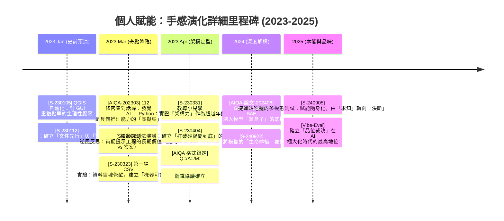
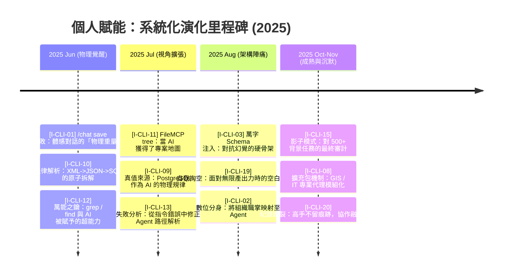
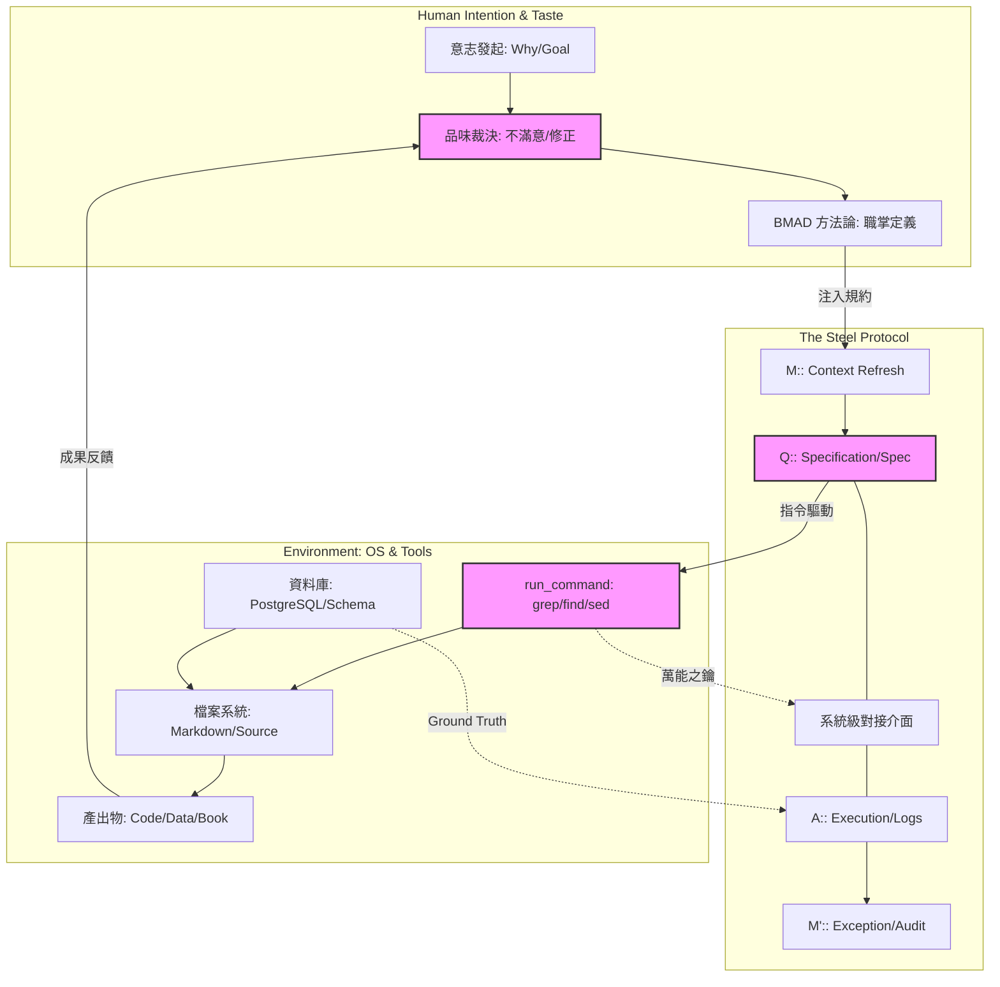
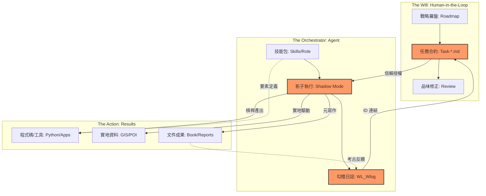
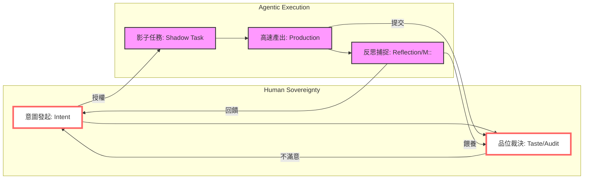
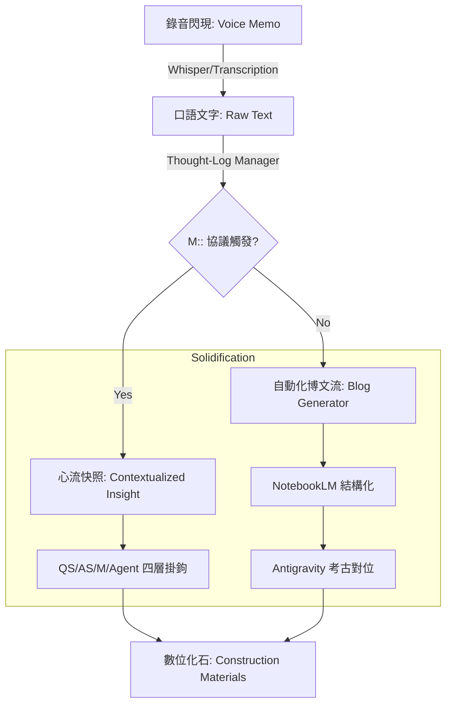
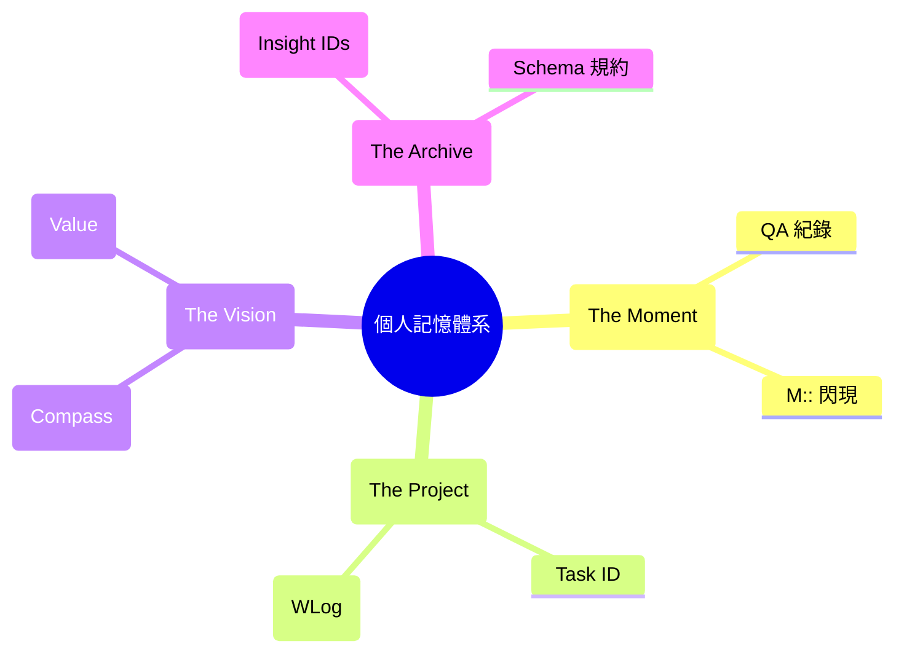
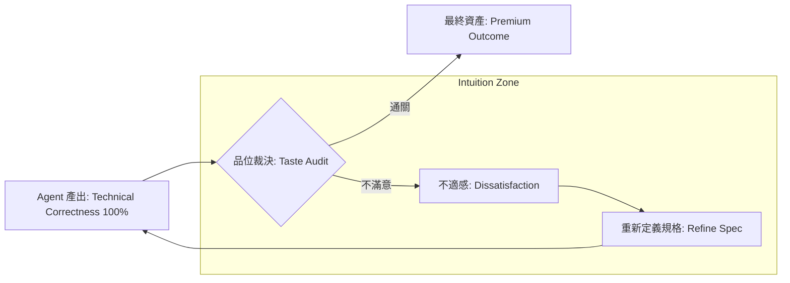

# 《個人賦能》完整全書

> 本文件由自動化腳本合併而成，產生時間：2026-02-14 07:57:45

---

# 《個人賦能：在 AI 時代找回原創力的演化實戰》
## 兩層式目錄與摘要 (實戰引導版)

---

# 第一篇：演化實戰紀錄 —— 觀點與證據的挖掘 (Part I: The Archive)
*本篇透過數位考古，誠實紀錄 2023 到 2025 年間，人類如何從「跟 AI 聊天」進化到「系統工程協作」的真實路徑。*

## 第 1 章：數位考古與書本建構 (The Meta-Chapter)
- 1.1 數位考古學：在碎片中找回消失的靈魂 (`I-CLI-17`)
- 1.2 建構紀實：架構先行與元日誌的力量 (`I-CLI-02`)
- 1.3 核心領悟：AI 時代的「原創」再定義 (`I-CLI-16`)

## 第 2 章：心智覺醒 —— 從工具人到架構師 (The Awakening)
- 2.1 賦能的本質：雙核共生與拒絕淺薄
- 2.2 腦神經重塑：微縮時間與學習的感動
- 2.3 抽象化思考：系統工程經驗的遷移力 (`I-CLI-03`, `I-CLI-18`)

## 第 3 章：建立手感 —— 從啟蒙對話到體感評測 (The Somatic Bond)
- 3.1 啟蒙對話：架構基因的預演與「虛擬腦」的發現 (`S-230105`, `S-230112`, `AIQA-202303`)
- 3.2 鋼鐵協議：為何 AIQA 的結構在三年間無需升級？ (`AIQA-202303` vs `AIQA-202502`)
- 3.3 結構化提問：樹狀探測法與「打破砂鍋問到底」的體感 (`S-230404`, `I-CLI-10`)
- 3.4 給予資料靈魂：CSV 實驗與「機器可讀」的認知躍遷 (`S-230323`, `AIQA-解讀CSV`)
- 3.5 跨代驗證：證明「架構力」是抹平專業與年齡壁壘的槓桿 (`S-230331`, `AIQA-小兒學python`)
- 3.6 隱性知識顯性化：將「感覺」解構為「架構」的心法 (`S-240922`)
- 3.7 體感評測與品味：反思「提問」與「答案」的價值變位 (`S-230321`, `S-240905`, `AIQA-讀論文-202408`)
- 3.8 章節總結：手感演化地圖與架構圖譜 (Summary & Architecture Atlas)

## 第 4 章：Agentic 實驗室 —— 系統工程的硬核與 Vibe-coding 的靈魂 (The Systems & Soul)
- 4.1 協議的物理重量：從「聊天室」搬進「終端機執行區」 (`I-CLI-01`, `I-CLI-05`)
- 4.2 萬能之鑰與視視角覺醒：為什麼作業系統指令才是最強大的 MCP (`I-CLI-11`, `I-CLI-12`)
- 4.3 資料守衛與品味裁決：以 Schema 為骨架、以「不滿意」為羅盤 (`I-CLI-03`, `I-CLI-09`, `I-CLI-16`)
- 4.4 樣態革命與跨域實驗：法律、地理與醫療系統的 Agentic 轉生 (`I-CLI-10`, `I-CLI-18`, `I-CLI-08`, `S-230402`)
- 4.5 BMAD 的起源與影子開發：面對「自我掏空」後的意志重建 (`I-CLI-02`, `I-CLI-15`, `I-CLI-19`)
- 4.6 記憶同步與紀錄的斷裂：為什麼高手不留痕跡？ (`I-CLI-06`, `I-CLI-17`, `I-CLI-20`)
- 4.7 章節總結：Agentic 系統架構盤點與自動化演化圖譜 v2.0 (Summary & Architecture Atlas)

## 第 5 章：代理人革命 —— 爆發式產出與三層勾稽實踐 (The Action & Orchestration)
- 5.1 空間覺醒：Workspace 的物理隔絕與認知專注路徑 (`I-AG-01`)
- 5.2 槓桿躍遷：從「撰稿助理」到「工具製造者的製造者」 (`I-AG-02`)
- 5.3 任務合約：影子任務 (Shadow Tasks) 裡的自動化律動 (`I-AG-03`)
- 5.4 意志的穿透：羅盤、任務與日誌的三層式勾稽 (2026/02)
- 5.5 擁抱混沌：在會議紀錄與醫療文獻中萃取結構化成果 (`I-AG-04`)
- 5.6 實地賦能：河流探索、POI 厚化與地理資料的自動化 (2026/01)
- 5.7 維度映射：從個人虛擬化到企業轉型 v1.3 方法論
- 5.8 速度的副作用：消失的紀錄之謎與「思考火火種」捕捉危機 (`I-AG-05`)
- 5.9 元寫作現場：當這本書的建構成為代理人執行的活體證據
- 5.10 章節總結：代理人組織架構與成果要素矩陣 v3.0

## 第 6 章：哈爸筆記 —— 實戰中的賦能覺醒與品位裁決 (Practice & Reflection)
- 6.1 紀錄的斷裂：從 2025 年底的「考古荒原」看見賦能危機 (`I-AG-05`)
- 6.2 出一隻嘴做系統管理：GCP 自架構與「基礎設施代理人」實戰
- 6.3 連結者的覺醒：n8n 自動化流水線與 GitHub RAG 的串接實驗
- 6.4 代理人的靈魂賦予：Discord AI 機器人進化史 (從鸚鵡到 Agent)
- 6.5 靈魂的保全：錄音轉化流與 NotebookLM 的「口述即博文」
- 6.6 驚訝的邊界：當 Antigravity 展現出超越機器的「情境理解力」
- 6.7 失落的 M：M:: 協議與「施工現場驚訝」的即時固化
- 6.8 秩序與羅盤：工作日誌與策略羅盤的自動化重建
- 6.9 原創力的最後堡壘：AI 時代的差異化競爭——「品位裁決」 (`I-CLI-16`)
- 6.10 章節總結：反思架構與品位裁決矩陣 (Chapter Summary)
- 6.11 第一篇全總結：從「基因預演」到「代理人軍團」的演化全景圖 (Part I Summary)

---

# 第二篇：賦能實踐指南 —— 五階段演化特訓 (Part II: The Training)
*本篇透過「做中學」的五個階段，將 Part I 的演化領悟轉化為個人的數位本能。*

## 第 7 章：方法論 —— 導航你的數位主權 (Methodology)
- 7.1 賦能工具五虎將：您的數位軍火庫簡介
- 7.2 五階段演化梯：為什麼是這個順序？
- 7.3 雙軌練習法：普通威力與進階養成
- 7.4 🚀 抽象對齊系統：解讀地圖上的座標
- 7.5 練習格式指南

## 第 8 章：Gemini Web/App —— 啟蒙、自學與多模態捕捉 (Step 1)
- 8.0 數位共生的核心：剖析 Gemini 3 的多模態與代理賦能
- 8.1 練習 1.1：🟢 想到就問 —— 與 AI 建立體感連結 (Somatic Bond)
- 8.2 練習 1.2：🟢 視覺對質 —— 測試 AI 的在地辨識邊界 (Visual Reason)
- 8.3 練習 1.3：🟢 生圖裁決 —— 從天馬行空到理想空間的精準微調
- 8.4 練習 1.4：🟡 建立 AIQA 筆記習慣 —— 數位考古的資產化步驟
- 8.5 練習 1.5：🟢 觀點變身器 —— 利用多重人格打破認知盲點 (Perspective Shift)
- 8.6 練習 1.6：🟡 迭代式的深度研發 —— 參與 AI 的研究路徑規劃 (Deep Research v2)
- 8.7 練習 1.7：🟡 用 Canvas 實現想像 —— 在協作畫布上解構資料意義 (Visual Creation)
- 8.8 練習 1.8：🔴 認知導航 —— Guided Learning 與二階思考 (Thinking Guide)
- 8.9 練習 1.9：🔴 生態系總指揮 —— @ 指令與跨應用自動化 (Ecosystem Commander)
- 8.10 練習 1.10：🔴 刨根問底 —— 利用 Reasoning 模式破解專業迷思 (Deep Inquiry)
- 8.11 練習 1.11：🔴 認知導圖 —— 快速產出「為我而寫」的兩層式目錄
- 8.12 練習 1.12：🔴 決策博弈 —— 啟動批判性思考的壓力測試 (Decision Games)
- 8.13 練習 1.13：🟢 行動覺醒 —— 跨裝置視訊與語音捕捉 (Mobile Presence)
- 8.14 練習 1.14：🔴 邁向認知主權 —— 我的個人自學成果總結與考古對位

## 第 9 章：NotebookLM —— 資料定錨、多態轉化與「數位分身」 (Step 2)
理解資訊形態轉化的本質，建立對證據的敬畏。 [1,000,000+ Context Window]
- 9.0 導論：從「碎片」到「定錨」——資訊形態轉化的魂魄 (The Soul of Metamorphosis)
- 9.1 練習 2.1：🟢 真相定錨與多模態大熔爐 (PDF, YouTube, Image OCR)
- 9.2 練習 2.2：🟡 知識收割與輸出權力 (Export, Join Sharing & Critique Mode)
- 9.3 練習 2.3：🟡 跨來源「金線」萃取與動態心智圖 (Cross-Source Synthesis & Dynamic Mapping)
- 9.4 練習 2.4：🟢 認知擴張與來源建構 (Fast & Deep Research Scouting)
- 9.5 練習 2.5：🟢 生活與學術的「降維打擊」 (Life Hacks & Paper Decoding)
- 9.6 練習 2.6：🟢 釋放頻寬的「錄音即紀錄」 (Audio Interaction & Join Mode)
- 9.7 練習 2.7：🔴 形態幻化 —— 個人媒體工作室 (Slides Deck & Debate Mode)
- 9.8 練習 2.8：🔴 影片分享的知識點「刨根」 (YouTube Video transcription & Indexing)
- 9.9 練習 2.9：🔴 數位人格的鏡像診斷 (Psychological Context Mirroring)
- 9.10 練習 2.10：🟡 版本演化追蹤 (Version Evolution & Decision Logic)
- 9.11 練習 2.11：🔴 批判性「紅軍測試」 (Red Teaming Assumptions via Critique)
- 9.12 練習 2.12：🟡 漸進式認知導航 (Guided Learning Path)
- 9.13 練習 2.13：🟢 打造「賦能懶人包」 (Interactive Knowledge Assets)
- 9.14 章節總結：從「資訊消費者」到「知識建築師」的演化總覽 (Summary & Architecture Atlas)

## 第 10 章：Antigravity —— Agentic 統御、極速生產與持久化 (Step 3)
從理解代理人核心要素開始，逐步掌握自動化工具與系統統御力。
- 10.0 導論：為何「Agentic」是找回數位主權的終極戰場？
- 10.1 練習 3.1：🟢 從「聊天」到「派任務」 —— 定義你的產出目標
- 10.2 練習 3.2：🟢 驅動 Agent 規劃 —— 拆解一個複雜的專案路徑
- 10.3 練習 3.3：🟡 調用工具的力量 —— 搜尋、分析與實體運算的聯動
- 10.4 練習 3.4：🟡 啟動「紅軍模式」 —— 讓 Agent 自我審計與最佳化成果
- 10.5 練習 3.5：🟢 資料批量賦能 —— 一次處理 100 筆資訊的轉化
- 10.6 練習 3.6：🟡 腳本賦能 —— 產出並執行你的第一支自動化小工具
- 10.7 練習 3.7：🟢 跨入 CLI 終端機 —— 建立你的第一個數位 Workspace
- 10.8 練習 3.8：🔴 MCP 與工具聯覺 —— 讓你的工具箱合致在一起
- 10.9 練習 3.9：🔴 Skill 封裝 —— 將成熟 SOP 轉化為數位裝備 (Skill Construction)
- 10.10 練習 3.10：🔴 三層勾稽模式 —— 確保系統目標的對位與一致 (Triple Checking)
- 10.11 練習 3.11：🔴 MT:: 紀錄機制 —— 自動化捕捉你的心流與領悟 (Meta-insight Capture)
- 10.12 章節總結：從「使用者」畢業，成為「數位系統統御者」

## 第 11 章：BMAD-method —— 策略治理與虛擬分身 (Step 5)
將工具與習慣提升為治理架構，邁向個人虛擬化的終局。
- 11.0 導論：從執行到治理 —— 建立您的虛擬專家團隊
- 11.1 練習 4.1：🟢 [BMM] 敏捷推進 —— 從產品簡報到開發故事的工序預演
- 11.2 練習 4.2：🟢 [CIS] 創意發散 —— 啟動設計思考進行多維度腦力激盪
- 11.3 練習 4.3：🟡 [BMB] 模組自建 —— 透過 Builder 建立您的第一個自定義工作流程
- 11.4 練習 4.4：🟢 [PA] 協調員管家 —— 啟動韋小寶進行跨代理人任務調度
- 11.5 練習 4.5：🟡 跨域任務對位 —— 測試研究分析師與文件專家的連鎖產出
- 11.6 練習 4.6：🟢 資訊擷取與溝通代理 —— 處理外部雜訊並草擬專業回覆
- 11.7 練習 4.7：🟡 情境子主題設定 —— 在 PA 之上定義一個特定目標
- 11.8 練習 4.8：🔴 虛擬團隊職掌定義 —— 為該主題打造專屬代理人團隊
- 11.9 練習 4.9：🔴 團隊契約與影子執行 —— 建立協作契約與影子內閣運作
- 11.10 練習 4.10：🔴 任務裝備化 —— 從 Task 到 Skill 的封裝升級路徑
- 11.11 練習 4.11：🔴 底層運作拆解 —— 探索 Manifest、Config 與運作邏輯
- 11.12 練習 4.12：🔴 終極對位 —— 實現 BMAD 治理架構與執行力的深度融合
- 11.13 章節總結：從工具使用者到數位領主的演化里程碑
- **進階養成**：[T-5.3] 代理人契約、[T-6.2] 個人虛擬化立論與企業對接。

## 第 12 章：Vibe Coding —— 意圖與美學的奇點 (Step 4)
當治理架構已就位，程式碼不再是門檻，而是意志的延伸。
- 12.0 導論：從 Coding 到 Vibe Coding —— 意圖與美學的奇點
- 12.1 練習 5.1：🟢 系統管理裝備化 —— 清理硬碟小管家 (.fab 實戰)
- 12.2 練習 5.2：🟢 夢想工廠第一步 —— 「午餐吃什麼」App 誕生 (AI Studio)
- 12.3 練習 5.3：🟡 Vibe 的精準微調 —— 不改 Code 的美學校準
- 12.4 練習 5.4：🟡 開發範式 A —— 直接派工產出 App (Antigravity)
- 12.5 練習 5.5：🔴 開發範式 B —— 透過 BMAD-method 策略開發 (Antigravity)
- 12.6 練習 5.6：🟡 實戰對位 —— 複刻與超越 WalkGIS 雛形
- 12.7 練習 5.7：🔴 深度除錯體感 —— 「不出手」修復邏輯漏洞
- 12.8 章節總結：從「寫程式碼」到「調氣場」的領主格位
- **進階養成**：[T-1.3] 品位裁決權與「不滿意」的價值 ([I-CLI-16])。

## 第 13 章：賦能生活化 —— 您的 30 天 AI 啟動計畫 (Final)
將五階段整合進日常生活。建立屬於您的「賦能特訓軌跡」，成為具備原創靈靈魂的自由人。
- 13.0 導論：從實驗室到現實世界的「入軌期」
- 13.1 第一週：捕捉與覺醒 —— 建立數位遺產的物理慣性
- 13.2 第二週：資料定錨與資產化 —— 打造懂您的真相定錨點
- 13.3 第三週：代理統御與自動化 —— 奪回時間的主權
- 13.4 第四週：戰略治理與個人虛擬化 —— 預演未來的自由
- 13.5 結語：通往未來的最後一張門票與個人領主宣言


<!-- PAGE_BREAK: Chapter_1_1.md -->

---

# 第 1.1 章：數位考古學 —— 在碎片中找回消失的靈魂

## 0. 初衷：為什麼我們拒絕「AI 代寫」的虛假敘事？

在動手撰寫這本書之前，我面臨一個嚴峻的挑戰：AI 已經非常有能力「寫」出一本關於赋能的書。只要給它一個大綱，它可以滔滔不絕地產出看似專業、流暢但卻可能與我的真實經驗完全脫節的文字。

**我想寫的，是一本「對齊事實」的書。**

之所以採用數位考古的方法論，根本原因在於我想誠實地探索：**「我到底是怎麼學過來的？」** 赋能不是一個瞬間發生的神蹟，而是一連串在深夜裡的除錯、在終端機前的掙扎，以及無數次與 AI 達成「邏輯共識」的成果。

利用腳本去掃描 logs、去追蹤 Session ID 的訊息密度，是為了讓這本書的每一句話都有紮實的數位腳印支撐。這不只是在寫書，這是我在重新整理這三年來，自己與另一個智慧體共同進化的「生理紀錄」。

## 1. 架構邏輯：為何考古先行？為何分為兩篇？

您可能發現，這本書的架構非常獨特。我們在展示「如何做」之前，先帶您看「挖掘現場」。

### 為什麼「考古」在「目錄」前面？
因為在 Agentic 時代，**事實比計畫更重要**。
如果我們先定死了一個漂亮的目錄，再強迫 AI 去填補內容，那通常會導向空洞的理論。相反地，我決定讓「考古證據」定義目錄。我們是先從日誌中挖出了 `I-CLI-11` (視角覺醒) 與 `I-AG-03` (影子任務)，才發現原來這些時刻才是賦能的真正節點。目錄，是證據的影子。

### 為什麼要有「第二篇：實踐指南」？
- **第一篇 (考古篇)** 負責「建立信度」：它是感性的演化故事，讓您看見一個真實的人如何被裝備起來。
- **第二篇 (手冊篇)** 負責「建立效度」：它將第一篇那些碎片化、有時甚至混亂的領悟，由上而下地 (Top-down) 提煉成您可以模仿、可循序漸進練習的技巧。

> **關於數位工件與隱私的特別備註**：
> 雖然本書的方法論高度依賴原始資料（如 `logs.json`、分析用的 CSV 以及內部腳本），但這些檔案累積了多年來與 AI 密集互動的點滴，難免包含敏感的個人或工作隱私。為了在保護隱私與維持論述透明度之間取得平衡，本書會提供具體的 **檔案名稱**、**腳本程式碼名** 與 **Session ID** 作為考古座標。
> 
> 您可以將這些檔名視為「歷史層的地理座標」，證明這些事件確實發生過，但出於安全考量，這些工件的原始內容將保留在我的私有工作區中，不對外釋出。我們提煉出的「領悟」才是這些地層中真正要呈現給您的真金。

沒有第一篇的考古，第二篇的方法論就是無根的浮萍；沒有第二篇的指引，第一篇的故事就只是我個人的回憶錄。

## 2. 數位地質學：資料層中的賦能足跡

> 「考古不只是為了找回過去，是為了在層層堆疊的紀錄中，定義未來的自己。」

這本書的產出方式本身就是一場大規模的「賦能實驗」。當初您在閱讀時可能以為這只是某人的隨筆或心得，但實際上，這些文字是從超過 100 個 Session ID、數萬行 `logs.json` 以及無數個 `.py` 腳本的「殘骸」中，利用數位考古技術挖掘出來的結晶。

大多數人的 AI 賦能紀錄都消失在瀏覽器的「清空對話」按鈕中，那對我而言是極大的資源浪費。在撰寫本書時，我建立了一套 **數位考古 (Digital Archaeology)** 方法論。

我將過去三年的數位紀錄視為不同的「地層」：
- **UI 淺表層 (2022-2023)**：充滿了與 ChatGPT 嘗試性的問答，這是觀點萌發的「寒武紀」。
- **CLI 岩實層 (2025/06 - 11)**：這是 Gemini-CLI 時代。透過 `I-CLI-17` 考古索引，我找回了當初在處理 LawDB 時，對於「結構化是 AI 氧氣」的最原始激動。
- **Agentic 沉積層 (2025/11 至今)**：這是 Antigravity 時代。雖然手動對話紀錄變少了，但工作目錄下留下的大量成果工件 (Artifacts) 成了最強大的間接證據。

## 2. 工具的力量：從「回想」到「挖掘」

人類的記憶是有偏誤的，我們會美化過去的成功，遺忘失敗的細節。但日誌 (Logs) 不會。

在寫作過程中，我派遣了多個「考古機器人 (Python Scripts)」進入地層進行自動化分析。
例如：
- **Scanner 機器人**：對 `~/.gemini/tmp/` 進行大規模掃描，根據 Intensity (訊息密度) 找出那些曾讓我們通宵達旦的「關鍵戰場」。
- **Parser 機器人**：深入 `logs.json` 提取出那些帶有標誌性意義的指令，例如第一次呼叫 `FileMCP` 的時刻 (`I-CLI-11`)。

這種考古方式讓我領悟到：**[I-CLI-17] 考古式的自我對話**。當我重新閱讀三個月前的 Session 時，我不是在看舊資料，而是在與那個「當時正與 Agent 激烈交鋒的自己」進行跨時空的對齊。

## 3. 消失的靈魂：搶救紀錄斷裂

考古中最令我震撼的發現是 **[I-CLI-05] 消失的紀錄**。
在 `8dc3561b` 這個 Session 中，訊息量爆發到 2839 則，但卻幾乎沒有任何總結筆記。為什麼？因為產出速度已經超越了人類「手寫紀錄」的極限。

這次考古不僅是找回資料，更是為了 **「搶救消失的靈魂」**。透過分析 Agent 留下的 `Task-*.md` 檔案，我們得以重構那段「瘋狂產出但也極度沈默」的轉型期。這也直接導致了後續「哈爸筆記」系統的建立——我們必須學會與「執行速度」競賽，留住思考的火種。

## 4. 領悟索引：建立論述的嚴謹度

為了維持這本書的真實性，我拒絕使用模糊的「我覺得」。
本章所提到的每一個觀點，都掛載了一個實體座標。例如，當我討論「人的價值在於不滿意」時，我指的是 `I-CLI-16`，對應到 2025/06/27 那次對 LawDB 初始摘要規則的強烈介入。

這種將「感性領悟」與「理性日誌」強關聯的結構，就是我與 AI 共創出的 **「人機合意考古學」**。

---
*考古證據索引節錄 (Artifact Mapping):*
- **地石 A**: `data_analysis/analyze_cli_timeline.py` (考古探勘腳本)
- **地石 B**: `construction_materials/20_Insight_Trace_Index.md` (領悟追蹤索引)


<!-- PAGE_BREAK: Chapter_1_2.md -->

---

# 第 1.2 章：建構紀實 —— 架構先行與「數位格律」的力量

> 「不要在那裡對 AI 下指令，請試著在那裡定義『格律』。」

這本書不是「寫」出來的，它是「建構 (Construct)」出來的。在大多數人還在苦惱於如何寫出一段完美的 Prompt 時，我已經轉向了另一個更深層的賦能維度：**建立一套人機之間共同遵守的「數位格律」。**

## 1. 架構先行 (Architecture First)：品味的最終判準

什麼是「架構先行」？這意味著在我們寫出第一行正式內容之前，我們先花了大量的時間在定義「什麼才是對的」。

我們討論了目錄的兩篇式結構、建立了考古追蹤索引、設計了公私分明的檔案搬移機制。這些決定並非基於模型的好惡，而是基於人類創作者的「品味」與「主權」。
**架構，就是人類對專案的最高意志。** 如果架構模糊，AI 產出的文字只會是一堆流暢但無用的廢紙。

## 2. 數位格律 (Digital Meter)：引導 Agent 的建構協議

為了讓 AI 代理人能夠精確執行這套架構，我引入了 **「數位格律 (Digital Meter)」** 的概念。

這不是在那裡對機器喊口號，而是建立一份具備嚴格約束力的協議（例如在此專案中我們使用的協議文件）。這份格律包含了：
- **層級邊界**：定義章節的兩層式對齊原則。
- **證據綁定**：要求每一項核心領悟必須回溯至實體的 Session ID（如 `I-CLI` 系列）。
- **隱私防火牆**：嚴格界定哪些是「考古碎石（私密資料）」，哪些是「真金（公開內容）」。

為什麼稱之為「格律」？就像詩歌中的平仄、押韻，它在給予限制的同時，也創造了最高的自由。當 AI 代理人讀取了格律，它就不再是一個隨機創作的聊天機器人，它變成了一個對齊我的標準、在格律內舞動的「數位建築工」。

## 3. 數位身教：將系統工程思維形式化

這是我在寫作過程中最深刻的領悟：**賦能的本質，在於人類對 AI 進行「數位身教」。**

當我精心調整數位格律的條文時，我其實是在將我多年的「系統工程 (System Engineering)」思維形式化。我教給 AI 的不僅是寫書的技巧，更是我對事物的處理標準：
- **對命名品位的堅持。**
- **對資料真實性的偏執。**
- **對安全邊界的警覺。**

這種透過格律實現的「思維傳遞」，就是 **[I-CLI-02] 架構先行** 的真實體現。當 AI 開始模仿我的品位與嚴謹時，它就不再只是工具，而是我意志的延伸。

## 4. 建構紀錄：建構過程的永恆見證

為了忠實記錄這場賦能實驗，我們還建立了一套 **「建構紀錄」** 制度。
它不記錄書稿的內容，它記錄的是「我們如何做決定」。
- 「為什麼今天決定要重構第四章？」
- 「為什麼我們認為這段考古資料足以支撐這個領悟？」

建構紀錄是這場「人機共謀」最珍貴的腳印。它向讀者證明了，這本書的每一塊磚瓦，都是在人類建立的「大規格」與「強架構」下，一步步踏實堆疊而成的實體建築。


<!-- PAGE_BREAK: Chapter_1_3.md -->

---

# 第 1.3 章：核心領悟 —— AI 時代的「原創」再定義

> 「當 AI 可以產出一切時，原創不再是關於『產出內容』，而是關於『行使裁決』。」

在執行這場數位考古寫作實驗時，我被無數人問過一個問題：「如果大綱是 AI 整理的，文字是 AI 輔助產出的，這本書還能算是『你』寫的嗎？」

這個問題觸及了 AI 時代最核心的焦慮。但在翻閱了數千行日誌、與 Agent 進行了數百次對齊後，我心目中對於「原創 (Originality)」的定義，發生了翻天覆地的位移。

## 1. 原創力的位移：從「打字員」到「總建築師」

在過去，原創等同於「勞動的足跡」——你親手打下的每一個字、親手畫下的每一條線。

但在賦能時代，我發現了一種更高階的原創：**「架構的品位」**。正如我們在 1.2 章談到的「數位格律」，這本書的結構、它對齊事實的偏執、它公私分明的權限邏輯，全都是源於我對「這本書應該長什麼樣子」的強烈主見。

AI 就像是世界上最快、最聽話的建築工，它可以瞬間蓋好一堵牆。但要不要蓋這堵牆？這堵牆要對齊哪一個歷史座標？這是我作為「總建築師」的絕對主權。**原創，就是對「架構」與「界限」的終極裁決。**

## 2. [I-CLI-16] 人的價值，在於那一份「不滿意」

這是我在 2025 年 6 月 27 日考古日誌中挖掘出的最珍貴領悟：**[I-CLI-16] 人的價值在於不滿意。**

當時我正與 Gemini-CLI 協作 LawDB 的摘要規則。AI 產出了一個「非常流暢、非常標準」的各章摘要。對於大多數人來說，那已經是 80 分的作品，可以直接過關。但當我讀到那些文字時，我感到一種生理上的「不對勁」——那些文字沒有靈魂，它沒有抓到法律規條中那種「人與權力博弈」的張力。

於是我介入了。我推翻了它的產出，定下了更嚴苛的格律。
這就是賦能的瞬間：**AI 負責生產「平均值」，人類負責行使「偏好 (Preference)」。**

如果我對那 80 分的產出感到「滿意」，我就在那一刻消失了。正是因為我的「不滿意」，逼迫 AI 進一步對齊我的品位，產出了那原本不存在的、具備 A+ 特質的內容。**您的「挑剔」與「對細節的偏執」，才是您在 AI 浪潮中唯一無法被稀釋的資產。**

## 3. 考古的精神：找回「有重量」的真實

AI 有時候像是一個會說謊的才子，它可以編織出極其動人的虛假敘事。

我們的數位考古方法論，本質上是對「虛假原創」的反擊。為什麼我們要在 1.1 章堅持要對齊 Session ID？因為我領悟到：**在 AI 時代，真實就是一種原創。**

當我決定從數萬行日誌中撈出一段失敗的紀錄，並將其定義為一個重要的轉折點時，這套「發現的過程」就是原創。AI 無法告訴我哪一段對話對我的人生更有意義，只有我能透過考古，在那堆數位碎石中，指認出哪一顆是帶有火種的鑽石。

## 4. 寫書作為賦能的最高形式：三代賦能演化模型

在我的賦能路徑中，「寫一本書來教自己」的技術演進，精確地映射了人機關係的深化。這不是一次性的跳躍，而是經歷了三個世代的質變：

### 第一代：逐章共讀 (2023 年 3 月 - UI 時代)
這是「學徒模式」。追溯至 2023 年春天，我開始在 Obsidian 中紀錄 AIQA。當時的實驗（如「用 ChatGPT 產生 Markdown 章節語法實驗」）是非常原始且手工的：我讀一章、它寫一章，我再修正一章。
- **特徵**：高度同步的「人機共學」。
- **賦能感**：透過緩慢的手工拼貼，將 AI 的邏輯「磨」進自己的心智中。

### 第二代：自動產出 (2025 年底 - 早期 Agentic 時代)
這是「工廠模式」。隨著進入 CLI 與 Antigravity 初期，寫書法轉向了自動化：一旦目錄架構與格律定好，Agent 就能在短時間內自動跑完所有章節的填充。
- **特徵**：從「邊讀邊寫」轉向「批次產出」。
- **賦能感**：體驗到「產出效率」的恐怖量產，但此時書本與現實生活仍是分離的。

### 第三代：實體與資料共生疊代 (2026 年初 - 當下)
這是「共生模式」。書本不再只是知識的存檔，而是與我真實世界的行動軌跡與資料流緊密結合。
- **鄉鎮與河流探索**：與 WalkGIS 系統深度整合，實現「人在現場、書在背景成長」的同步感，並根據實地觀察的體感回頭疊代修正書稿。
- **企業賦能 AI**：利用語音輸入即時捕捉現場材料，並透過 Agent 進行多版本的內容修正與專業校準，實現高頻率的知識封裝。
- **個人賦能**：結合數位考古技術，從海量的對話日誌地層中提煉出具備證據力的領悟，實現「對齊事實」的自我生命回顧。
- **特徵**：書本伴隨實體行動、資料挖掘與語音流，現實與數位雙向反饋。
- **賦能感**：書稿成為了我的 **「第二人生紀錄」**，實現了知識、行動與紀錄的完美閉環。

這三代的演進，證明了賦能的終局：**AI 不再只是幫您完成任務，它在協助您將生命的每一段經歷，都自動轉化為可持續疊代的智慧資產。**

## 5. 結語：成為 Agentic 時代的自由人

原創的再定義，其實是權力的交還。
賦能不是為了讓我們變成更快的打字機，而是為了將我們從重複性的勞動中解放出來，去行使人類最珍貴的兩項權力：**「品位的裁決」與「意義的賦予」。**

當您擁有了這套數位格律，學會了如何行使「不滿意」的裁決權，您就跨越了「被編程」的階級，成為一個在 Agentic 時代真正自由、且具備原創靈魂的賦能者。

---
*領悟索引對齊:*
- **[I-CLI-16]**: 品位裁決價值 (2025/06/27 LawDB 實踐)。
- **[I-CLI-20]**: 封裝賦能成果的自我閉環。

## 📍 Part I 理論標籤對照表 (The Theory ID Map)

為了方便在後續的「賦能實踐指南」中進行精準引用，我們在此將第一篇的核心理論與立論點賦予唯一的識別 ID：

### 第 1 章：方法論與建構
- **[T-1.1] 數位考古學 (Digital Archaeology)**: 透過分析歷史日誌 (MQA) 來重構個人認知與技能的演化歷程。
- **[T-1.2] MQA 鋼鐵格律 (MQA Iron Law)**: 強制執行 Q::/A::/M:: 格式，將散亂對話轉化為可索引的數位資產。
- **[T-1.3] 品位裁決權 (Taste Audit)**: 人的核心價值在於對 AI 產出的「不滿意」與最終的架構裁決權。

### 第 2 章：心智覺醒
- **[T-2.1] 賦能本質論 (Empowerment Essence)**: 賦能不是為了省力，而是為了實現能力邊界的擴增與架構躍遷。
- **[T-2.2] 雙核共生 (Dual-Core Symbiosis)**: 人腦負責原創與審美，AI 負責運算與執行，形成高效協作迴圈。

### 第 3 章：建立手感
- **[T-3.1] 體感評測學 (Somatic Evaluation)**: 不迷信 Benchmark，透過實際互動建立對模型性格與邊界的直覺信任。
- **[T-3.2] 樹狀探測法 (Tree Technique)**: 透過「先宏觀架構、後微觀細節」的連續追問，快速攻克未知領域。
- **[T-3.3] 遞迴學習 (Recursive Learning)**: 將 AI 作為教練，在解決問題的過程中不斷完成知識的自我修正。

### 第 4 章：Agentic 實驗室
- **[T-4.1] 空間隔離 (Space Isolation)**: 使用 Workspace 建立明確的數位主權與隱私邊界。
- **[T-4.2] 萬能之鑰 (Master Key)**: 視 OS 原生指令為最強大的 MCP，強化人類對系統環境的統御力。

### 第 5 章：代理人革命
- **[T-5.1] 槓桿躍遷 (Leverage Jump)**: 從「工具使用者」進化到「工具製造者」的權力轉折點。
- **[T-5.2] 影子開發 (Shadow Development)**: 讓代理人在背景執行複雜任務，人類在前景維持戰略決策。
- **[T-5.3] 代理人契約 (Agent Contract)**: 明確定義代理人的職掌、行為邊界與倫理準則。
- **[T-5.4] 三層勾稽架構 (3-Tier Arch)**: 整合策略羅盤、任務帳本與工作日誌 (Compass-Task-WLog) 的統御系統。

### 第 6 章：實踐反思
- **[T-6.1] 心流捕捉協議 (MT:: Protocol)**: 在協作高熱度現場，透過 MT:: 協議即時固化瞬間的驚訝與感悟。
- **[T-6.2] 個人虛擬化立論 (Personal Virtualization)**: 個人虛擬化是企業數位轉型的核心動力與立論根基。


<!-- PAGE_BREAK: Chapter_2_1.md -->

---

# 第 2.1 章：賦能的本質 —— 雙核共生與拒絕淺薄

> 「真正的賦能，不是讓您變得更輕鬆，而是讓您變得更強大。」

在踏入 AI 領域的最初幾個月，大多數人的直覺反應是：「這東西能幫我省下多少時間？」我們將其視為一種更高級的「自動化」工具。然而，這種認知存在一個致命的陷阱：**如果您的目標只是為了省力，那麼您最終將被那些更省力的工具徹底取代。**

本章將揭露賦能在認知層面的第一次轉型：從「工具人」轉變為「架構師」的心智覺醒。

## 1. [C-01] 雙核系統：您與 AI 的認知分工

賦能的最核心觀念，是建立一套 **「雙核系統 (Dual Core System)」**。這不是模型輔助人類，而是人類與 AI 形成了一種動態的、高度互補的共生關係：

- **左核 (Human - 人的價值)**：負責原創感、審美品位、批判思考、價值判斷與最終的裁決權。它是專案的「靈魂」與「建築師」。
- **右核 (AI - 機器賦能)**：負責龐大的運算、無限的勞動力、多維度的執行力。它是專案的「肌肉」與「萬能建築工」。

當我意識到這點時，我不再追求讓 AI 直接給我「答案」，我追求的是讓 AI 與我進行 **「邏輯辯證」**。我負責定下格律，AI 負責在格律內填充。這種「分工」改變的不是我的手，而是我觀察世界的解析度。

## 2. [C-03] 拒絕淺薄：為什麼「下 Prompt」不等於賦能

在 2023 年 3 月的密集對話紀錄中，我發現了一個警訊：如果您只是學習如何寫出「正確的 Prompt」，那種技能是非常淺薄且易碎的。因為模型會迭代，今日的「提問技巧」可能在三個月後就毫無用處。

**真正的賦能是「能力擴增」，而非「技巧熟練」。**

如果您只是一個 Prompt 的操作員，您本質上是在替 AI 打工，試圖迎合機器的脾氣。但如果您是一個「架構師」，您是在運用系統工程的思維來定義任務。這就是 **拒絕淺薄 (Rejecting Scalability of Mediocrity)** —— 當 AI 讓平庸的產出變得廉價且可無限複製時，人類的價值將退縮到「架構」與「品位」的最後堡壘。

## 3. 賦能的生理回饋：學習的感動

賦能最具革命性的時刻，在於它幫您 **「解構」** 了那些過往的心智限制。

在考古日誌中（如 2023/03 的民主學習案例），我發現 AI 提供了一個無偏誤、高吞吐量的對話場域，讓我可以像重寫資料結構一樣，重新認識那些我以為已經過時、或被體制固化的知識。

這種在微縮時間內（可能是一個週末就建構完一本書的架構）掌握全新專業領域的快感，會產生一種強大的「生理回饋」。那種「我看見了以前看不見的結構」的感動，才是推動賦能不斷疊代的真實動力。

## 4. 結語：架構主權的確立

當您建立了「雙核系統」的自覺，並拒絕了追求淺薄技巧的誘惑，您就在心智上完成了覺醒。您不再問「AI 能幫我做什麼？」，而是開始問 **「我該建立什麼樣的系統，來讓 AI 實現我的意志？」**

這就是賦能的起點：從內容的生產者，轉型為系統的統籌者。

---
*考古領悟連結:*
- **[C-01]**: 雙核共生系統模型。
- **[C-03]**: 拒絕平庸產出的無限複製（品位護城河）。
- **[I-CLI-18]**: 技術與人文在架構中的合意。


<!-- PAGE_BREAK: Chapter_2_2.md -->

---

# 第 2.2 章：腦神經重塑 —— 微縮時間與學習的感動

> 「當您學會用『寫一本書』來學習時，您的時間維度就此改變。」

賦能帶來的最震撼體感，不是表格做快了，而是您的大腦變被物理性地「加速」了。在傳統認知中，要跨入一個全新的專業領域（如法律、統計或高階系統管理），通常需要數月甚至數年的沈澱。但在 AI 賦能的環境下，我體驗到了一種 **「微縮時間 (Time Compression)」** 的奇蹟。

本章將分享我如何透過「寫書」來重塑自己的學習路徑。

## 1. 寫書即學習：最高級的輸出驅動

在我的數位考古中，最壯觀的地層莫過於 2025 年 5 月至 6 月間的瘋狂產出。
當時我在兩個月內，連續「寫」出了《公民行動指南》、《生物統計之旅》、《Kubernetes 實踐進階》等多本跨領域專著。

**這不是在炫耀產量，這是在實踐一種「輸出驅動」的極限學習法。**

當您要求 AI 與您共同撰寫一本書時，您其實是在迫使自己扮演「架構師」的角色。您必須在短短幾天內，理解該領域的核心邏輯、定義目錄框架，並對 AI 產出的每一段內容進行「品質裁決」。這種高強度的參與，會讓知識不再是碎片化的資訊，而是被結構化地「植入」您的大腦。

## 2. 學習的感動：看見結構的瞬間

賦能不僅僅是理性的。當您在一個週末內，從對「生物統計」一竅不通，到能與 AI 共同釐清樣本分佈與顯著性檢定的架構時，那種 **「我看見了！」** 的感動是非常真實的生理回饋。

在雲端 UI 時代的「逐章共讀」中，這種感動來自於人機之間的深度對話。您每問一個問題，每修正一段解釋，您的腦神經都在進行一次微型的重塑。這種感動是賦能最核心的燃料，它讓學習不再是枯燥的任務，而是一場發現新世界的冒險。

## 3. 三代模型的演化：從學習到封裝

如我們在第一章所討論的，這套學習法也經歷了從「手動」到「自動」再到「共生」的演化（參考 `22_Learning_Books_Timeline.md`）：

- **第一代 (手工自學)**：您與 AI 一邊讀、一邊寫。這是建立「基本功」與「體感」的過程。
- **第二代 (自動封裝)**：當您掌握了架構能力，您可以讓 AI 快速產出整本書的草案供您審閱。這時您的重點在於「校準」與「裁決」。
- **第三代 (實體疊代)**：當書本伴隨您的鄉鎮探索或河流走訪同步產出時，學習已經與生命經驗合而為一。

## 4. 結語：奪回學習的主權

微縮時間的本質，是 **奪回學習的主權**。

我們不再被動地等待學校或體制給予「認證」，我們透過「定義格律」與「建構系統」，主動地去攻克任何我們感興趣的領域。這種大腦被重塑後的自信，才是賦能在 AI 時代給予人類最大的自由。

> **實踐提示**：
> 想要嘗試這套「寫書學習法」嗎？我們將在 **第二篇：第 8 章 (上下文工程)** 與 **第 9 章 (協作契約)** 中，為您拆解從「建立學習地圖」到「格律微調」的具體執行技巧。現在，請先跟隨我的腳步，看看這種能力是如何從我的「抽象化思考力」中遷移出來的。

---
*考古領悟連結:*
- **[I-CLI-21]**: 寫書是最高級的學習 (Output-driven learning)。
- **[I-CLI-22]**: 真實經驗的回流與資料雙生。


<!-- PAGE_BREAK: Chapter_2_3.md -->

---

# 第 2.3 章：抽象化思考 —— 系統工程經驗的遷移力

> 「當您學會將世界看作一套系統時，所有的專業壁壘都將失守。」

在我的賦能日誌中，最令人驚訝的發現不是我學會了多少新軟體，而是我發現自己多年前在系統工程（System Engineering, SE）領域積累的「肌肉記憶」，竟然成了掌握 AI 的最強大武器。

本章將揭露賦能的核心技術支柱：**抽象化思考 (Abstraction)** 以及它如何在不同領域間產生驚人的遷移力。

## 1. 萬物皆系統：工程師的「賦能之眼」

系統工程的核心在於：將複雜、混沌的現實，拆解為可定義、可管理的模組與流程。

在考古日誌中（如 2023/03 的《國家路線邏輯解析》），我發現我並沒有用文法家的感性去分析政治，而是用工程師的理性：
- **輸入 (Input)**：社會情緒、地緣政治壓力、法治基礎。
- **處理 (Process)**：權力制衡邏輯、民主決策機制。
- **輸出 (Output)**：國家政策走向。

當我用這套「系統之眼」去觀察世界時，法律不再是枯燥的條文，而是一套「社會執行的程式碼」；河流探索不再是隨機的遊玩，而是一套「地理資訊的採集與封裝流程」。**這種將特定知識「抽象化」為通用系統的能力，就是賦能的最高槓桿。**

## 2. 跨領域的遷移力：為什麼您可以「跨界」？

為什麼我能在一個週末內寫出《生物統計》或《採購法》的架構？
那是因為我並不是在從零開始學習新知識，我是在進行 **「架構映射」**。

- 統計學的機率分佈，映射到工程中的品質控制與不確定性分析。
- 法律的違約條款，映射到程式碼中的錯誤處理 (Error Handling) 與邊界條件 (Boundary Conditions)。

一旦您具備了抽象化思考的能力，您就不再被困在單一專業的術語中。您會發現，**AI 最擅長的正是處理「結構」**。當您能將問題抽象化為結構給 AI 時，AI 就能用它龐大的知識庫，填補您在該領域細節上的空缺。這就是 **[I-CLI-18] 技術與人文的合意**。

## 3. 封裝與解構：架構師的日常修煉

賦能的過程，其實就是不斷地在進行 **「封裝 (Encapsulation)」** 與 **「解構 (Deconstruction)」**。

- **解構**：將一個龐大的任務（如「寫一本書」）拆解成最小可執行的單元（Task-Unit）。
- **封裝**：將已經解決的邏輯、規則與經驗，固化為一套「數位格律」或「Agent Skill」。

這種來自於軟體與系統開發的經驗，讓我在與 AI 對話時，不自覺地就在建立「標準作業程序 (SOP)」。這也是為什麼我能從 2023 年的手工對話，演化到 2026 年的自動化共生。

## 4. 結語：心智覺醒的完成

第二章的結幕，停留在這個點上：**賦能最重要的資產，不是模型，而是您那套能將現實「架構化」的思考能力。**

當您擁有了「雙核系統」的自覺（2.1），體驗過「學習的感動」（2.2），並掌握了「抽象化的遷移力」（2.3），您的心智覺醒就已經完成。您已經從一個尋求答案的「工具使用者」，轉型為一個定義規則、建構系統的 **「Agentic 架構師」**。

---
*考古領悟連結:*
- **[I-CLI-02]**: 架構先行與系統化思維。
- **[I-CLI-11]**: 視角覺醒——將現實看作資料與流程。
- **案例座標**: `AIQA-國家路線邏輯解析.md` (2023-03-31)


<!-- PAGE_BREAK: Chapter_3_1.md -->

---

# 3.1 啟蒙對話：架構基因的預演與「虛擬腦」的發現 (The Discovery)

AI 賦能並非從天而降的神蹟，而是一場發生在「準備好了的靈魂」上的化學反應。在我的數位考古地層中，3 月份的啟蒙對話之所以能爆發出強大的能量，是因為在「史前時代」（1 月份左右），我已經在無意間完成了賦能前的「預適應 (Pre-adaptation)」。

### 基因預演：對重複勞動的體感拒絕

2023 年 1 月，當時的我正深陷 QGIS 地理分析的泥淖。地理資訊系統 (GIS) 是一個極度依賴「視覺操作」的領域，每一次分析都意味著無數次的滑鼠點擊。在那段紀錄中（代號 `S-230105`），我寫下了對這種繁瑣操作的極度痛苦，並試圖透過 QGIS 的 Graphical Modeler 建立自動化模型。

當時的體悟是：**「與其點 100 次滑鼠，不如花時間建一個模型。」**

雖然這還不是 AI，但這就是後來「架構師手感」的原始基因——**一種對重複、低效勞動的體感拒絕，以及對「架構先行」的直覺追求。** 這解釋了為什麼後來我遇到 AI 時，第一反應不是跟它聊天，而是嘗試定義它的執行規格。

### 文件先行：在桃子腳確立的素養

另一個關鍵的預演，發生在我帶領國中生進行專案的過程中（代號 `S-230112`）。在輔導桃子腳國中生的紀錄中，我不斷強調：**文件與共筆比提問更重要。** 我發現，如果一個團隊沒有清晰的規格定義與紀錄紀律，再強大的創意也會在混亂中消散。

這種對「文件與規格」的近乎偏執的要求，後來無縫轉換成了與 AI 協作的底層能力。當別人在對著對話框隨意發問時，我的「架構基因」已經自動啟動了精確的 `Q::/A::` 存檔邏輯。

### 撞擊奇點：發掘 AI 的「虛擬腦」

帶著這份「討厭重複」與「文件先行」的基因，我在 2023 年 3 月撞上了 ChatGPT 3.5（檔案編號 `AIQA-202303`）。

在那場 107 條密集的「壓力測試」中，我要求它扮演政府官員、高中生，甚至是扮演一個精準執行 Markdown 格式的資料處理器。那一刻，我震撼地發現：**我終於找到了一個能聽懂我的架構意圖、且不需要我親手畫流程圖的「邏輯執行官」。**

這不再是搜尋答案，而是**定義邏輯**。我體會到 AI 並非存儲知識的硬碟，而是一個具備邏輯演算能力的「虛擬腦」。只要我能將我的「Know-how」轉化為精準的指令集（Spec），這個虛擬腦就能在那個規格內，為我提供穩定且高品質的產出。

這就是手感的起點：當一個具備系統思維的靈魂，遇上了一個無窮靈活的邏輯機器，個人賦能的奇點就此點燃。

---
**本節考古證據：**
- **Insight ID**: `S-230105` (拒絕 GUI 重複), `S-230112` (文件先行)
- **Log ID**: `AIQA-202303.md` (啟蒙對話錄)
- **核心觀點**: `[C-02] 抽象化思維`、`[C-03] 拒絕淺薄`


<!-- PAGE_BREAK: Chapter_3_2.md -->

---

# 3.2 鋼鐵協議：為何 AIQA 的結構在三年間無需升級？ (The Immutable Protocol)

在與 AI 協作的深層考古中，最令我驚訝的發現不是 AI 進步了多少，而是我與它對話的「介面」竟然如此穩定。

翻開 2023 年 3 月的第一份 AIQA 紀錄（`AIQA-202303`），以及 2025 年 2 月正在讀最前沿 Reasoning Model 論文的紀錄（`AIQA-讀論文-202502`），你會發現一個驚人的事實：**兩者採用的格式幾乎完全一致。**

```markdown
# Q1.n
- M:: (註解、體悟、背景備註)
- Q:: (我的精確提問或指令)
- A:: (AI 的原始回覆)
```

為什麼在技術迭代以「周」為單位的 AI 浪潮中，這套 $Q::/A::/M::$ 的結構可以在三年間完全不需要升級或改良？

### 答案就在協議中：這不是對話，是「規格」

大多數人使用 ChatGPT 是在進行「對話 (Dialogue)」，而我在一開始就決定將其定義為「協議 (Protocol)」。

由於史前時代 QGIS 自動化的經驗以及對文件先行的偏執，我在使用 AI 的前 72 小時內就形成了一種直覺：**如果要讓 AI 的能力穩定地堆疊進我的生命，我必須建立一套「人機資料交換標準」。**

- **Q (Question/Specification)**：它不是隨口問問，而是**輸入參數與邏輯邊界**。
- **A (Answer/Implementation)**：它是 AI 根據我的 Spec 產出的**執行結果**。
- **M (Metadata/Audit)**：它是我的大腦對這次交互的**反思、標籤與修正紀錄**。

這套結構之所以穩定，是因為它對齊了「系統工程」的最底層邏輯——**輸入、處理、輸出與監控**。

### 證據：跨越三年的鋼鐵對比

讓我們看證據：
- **2023年3月**：即便當時模型能力較弱，我依然用 $Q::/A::$ 來測試它回答社會問題的邏輯極限，並用 $M::$ 標註它在哪裡產生了幻覺。
- **2025年2月**：模型已經進化到具備「顯性推理 (Explicit Reasoning)」的能力，但我依然用同樣的 $Q::/A::$ 來解構複雜的學術論文。

**三年間不需要改良，是因為這款協議已經觸及了「邏輯交互」的核心本質。** 它實現了三種解耦：
1. **工具解耦**：無論底層換成 GPT-4、Gemini 還是最新的 o3，我的紀錄架構不變。
2. **時空解耦**：三年前的紀錄，今天翻開依然能透過 $M::$ 瞬間找回當時的架構意圖。
3. **人機解耦**：它讓我的思考過程（M）與機器的運算結果（A）清晰地分開，不再混淆。

這就是「手感」的鋼鐵化：一旦你找到了與這款「邏輯引擎」互動的最優協議，你就不再需要跟隨工具的更新而疲於奔命。這套穩定的架構，正是我能將三年的數位資產轉化為這本書的物理基石。

---
**本節考古證據：**
- **Log ID**: `AIQA-202303.md` (早期的穩定性起源)
- **Log ID**: `AIQA-讀論文-202502.md` (跨越兩年的結構一致性)
- **核心觀點**: `[C-08] 架構先行`、`[C-16] 數位資產永續性`


<!-- PAGE_BREAK: Chapter_3_3.md -->

---

# 3.3 結構化提問：樹狀探測法與「打破砂鍋問到底」的體感 (The Tree Technique)

在 2023 年 4 月的一篇社群分享中（代號 `S-230404`），我曾寫下這樣一段話：「在與 AI 問答的過程中，我很快就發現『打破砂鍋問到底』的方式很好用...簡單講就是**樹狀的問法**」。

這不僅是一個提問技巧，它標誌著我從「隨機對話」進化到了「系統化探勘」。

### 樹狀探測：深入知識的根部

當時的我發現，AI 的第一層回答往往是泛泛而談的摘要。如果你止步於此，AI 就只是一個平庸的百科全書。但如果你能針對回答中的某個特定概念（子節點），再次發問，然後針對回答的回答繼續深挖，你會發現 AI 的「邏輯深度」會隨著層級的深入而被迫展現。

這種「樹狀提問」的體感就像是在一個漆黑的洞穴中，拿著手電筒不斷向深處探照：
1. **第一層**：獲取廣度（掃描）。
2. **第二層**：鎖定異樣（選定子問題）。
3. **第三層以下**：逼近本質（探尋邏輯底層）。

這種方法在後來我的數位考古紀錄中（如 `I-CLI-10`），演化成了更為嚴謹的「任務分解 (Task Decomposition)」。

### 實戰證據：從演算法到複雜系統

一個典型的例子是帶領孩子學習 APCS（大學程式設計先修檢測）。在 `AIQA-小兒學python` 的紀錄中，我們並非直接問「什麼是排序演算法？」，而是採用了樹狀拆解：
- **根節點**：排序的基本概念。
- **左分支**：為什麼泡沫排序法在資料量大時會慢？（探討時間複雜度）。
- **右分支**：如何用視覺化圖案來描述這個交換過程？（探討具象呈現）。

在那一刻，「打破砂鍋問到底」不再是一種任性，而是一種**主動的架構建構**。我發現，只要我不斷地向下深挖，AI 就會被迫從它的潛在空間中萃取出更精準、更具脈絡的知識。

### 從「問答」到「解析」的認知躍遷

這種樹狀體感，最終導致了一個重大的能力覺醒：**領悟到「任務是可以被規格化的分解」的。**

在兩年後的 Gemini-CLI 實戰中（`I-CLI-10`），當我面對極其複雜的法律資料庫最佳化任務時，我的直覺不再是「求救」，而是「分解」。我將整個解析流程拆解為：`XML (原始) -> JSON (中間) -> SQL (終端)` 三個獨立的 Agent 任務。

這正是 2023 年那場「樹狀探測」實驗的終極形式：
- 如果你懂得如何「問」到底，你就能懂得如何「拆」到底。
- 如果你能拆到最小單元，你就具備了控制複雜系統的能力。

這就是「結構化提問」帶來的體感：你不再是被動地接收 AI 給你的那個「黑盒子」，而是擁有了剖開黑盒子、並重新組裝它的手術刀。

---
**本節考古證據：**
- **Insight ID**: `S-230404` (樹狀提問法發表)
- **Concept Mapping**: `I-CLI-10` (任務分解的最小單位)
- **核心觀點**: `[C-08] 架構先行`、`[C-09] 遞迴式學習`


<!-- PAGE_BREAK: Chapter_3_4.md -->

---

# 3.4 給予資料靈魂：CSV 實驗與「機器可讀」的認知躍遷 (Structuring)

在數位考古的層次中，2023 年 3 月 23 日是一個關鍵的「地質轉折點」。在那一天，我進行了第一次 CSV 資料讀取實驗（檔案編號 `AIQA-解讀CSV`），並在社群留下了一句帶有震撼感的筆記：**「簡單說就是 ChatGPT 看得懂 CSV，可以用自然語言問搜尋的結果。」**

這句話標誌著我從「把 AI 當聊天對象」轉向「把 AI 當資料處理器」的重大躍遷。

### 當文字變成資料：第一次 CSV 撞擊

當時的實驗非常樸實。我將一段關於政府開放資料（書目清單）的 CSV 文字直接貼進對話框，然後問它：
- 「請列出備註欄位為『本土創作』的書名」
- 「請列出作者為米雅的書名」

AI 的回答非常精準。那一刻，我感覺到一種奇妙的衝擊：**資料被賦予了靈魂。**

在傳統的資料處理中，我要進行上述操作必須撰寫程式碼（如 Python 的 Pandas）或操作 Excel 篩選。但現在，我只需要用自然語言描述我的意圖，AI 就能在瞬間理解 CSV 的表頭結構（Header），並在記憶體中進行邏輯過濾。

### 挫折中的領悟：機器可讀的邊界

然而，考古紀錄也誠實地記錄下了當時的挫折（Q3, Q10-Q14）。當我要求它計算總筆數時，它算錯了；當我丟給它一個外部 URL 時，它開始產生幻覺（Hallucination）。

這些「失敗的紀錄」反而給了我更深層的洞察：
1. **AI 是邏輯機，而非計算機**：它擅長「理解」結構，但在處理需要精確計數的大規模資料時，會發生語意偏移。
2. **規格（Spec）的力量**：只要我精確定義欄位（如 Q12 的註解提到：教它編碼格式後，曾經是對的），它的表現就會穩定提升。

這讓我體會到，賦能的關鍵不在於 AI 的全能，而在於人類能否提供**機器可讀 (Machine-Readable)** 的高品質輸入。

### 認知躍遷：從「讀者」變為「架構師」

這場試驗最大的影響，在於它重塑了我的工作流。我隨即在社群上分享（代號 `S-230323`），鼓勵大家嘗試這種「自然語言資料接口」。

這引發了後來一系列更具野心的嘗試：如果 AI 能讀 CSV，那它能不能寫 JSON？能不能理解 SQL Schema？能不能透過解析系統日誌來除錯？

兩年後的「雙核系統」中，我們之所以能指揮 Agent 進行大規模資料夾掃描與分析，最原始的信心來源就藏在這份 2023 年、僅有 18 筆圖書資料的 CSV 實驗裡。那是我第一次看見：**當結構化的內容遇上運算化的大腦，思考的槓桿將被無限放大。**

---
**本節考古證據：**
- **Log ID**: `AIQA-解讀 CSV.md` (2023-03-23)
- **Insight ID**: `S-230323` (資料靈魂的覺醒)
- **核心觀點**: `[C-08] 架構先行`、`[C-14] V-Coding`


<!-- PAGE_BREAK: Chapter_3_5.md -->

---

# 3.5 跨代驗證：證明「架構力」是抹平專業與年齡壁壘的槓桿 (Leverage)

在數位時代，一個人是否具備競爭力，關鍵不在於他「存儲」了多少知識，而在於他是否具備「調度」知識的架構力。為了驗證這個觀點，我進行了一場極具挑戰性的實驗：用 AI 教導小學程度的孩子學習大學等級的演算法（檔案編號 `AIQA-小兒學python`）。

這場實驗的成功（代號 `S-230331`），為我提供了本書最核心的實證：**「架構力」是抹平專業與年齡壁壘的終極槓桿。**

### 降維打擊：將大學課程轉化為父子對話

在教導孩子學習 Python 的過程中，我們碰到了電腦科學中最硬核的部分：資料結構與演算法（Q4-Q30）。換作傳統教學，這通常需要厚重的課本與枯燥的講義，但我們使用了「AI 第一次教導法」：

1. **規劃先行**：我們先要求 AI 為一個「目標是 APCS 考試的高中生（雖然當時參與者年齡更小）」規劃為期 12 週的課表（Q5）。
2. **具象化與結構化**：當談到樹狀結構時，我們不只是看程式碼，而是要求 AI 直接用 **Mermaid 語法** 畫出圖形（Q27）。

這一刻，抽象的邏輯變成了可見的架構。我發現當孩子學會如何向 AI 「索取結構」而非「索取答案」時，他的學習速度發生了非線性的跳躍。

### 專業壁壘的崩塌

在這個過程中，最令我震撼的是關於「快速排序 (Quick Sort)」與「合併排序 (Merge Sort)」的討論。這些通常在大學二年級才會接觸的概念，透過 AI 的拆解與比較（Q16-Q20），變成了一個關於「誰比較快、誰比較穩定」的邏輯遊戲。

我意識到：**當知識的獲取門檻降到趨近於零時，真正的差異就在於你是否有能力定義問題的邊界。**

孩子雖然不具備深厚的數學背景，但他具備了「架構師的靈魂」。他能理解為什麼要把問題拆成「左半部、基準值、右半部」（快速排序的邏輯），因為那是一種處理資訊的**抽象架構**。

### 槓桿效應：架構力作為通用貨幣

這場跨代驗證帶給我一個深刻的結論：在賦能的世界裡，「專業知識」是有半衰期的資產，但「架構思維」卻是通用貨幣。

孩子教給我的，比我教給他的更多。他展現了：
- **無懼邊界**：不知道什麼是「時間複雜度」？直接問，然後要求舉例說明（Q11）。
- **工具導向**：不理解 while 迴圈？換成 for 迴圈再做一次對比（Q14-Q15）。

這正是「架構師」的雛形：他們不被工具的具體語法困住，而是關注邏輯的流動與效率的邊界。這場實驗證明了：**只要掌握了與 AI 協作的架構力，即便是小學生，也能在數位世界中展現出資深工程師的洞察力。**

---
**本節考古證據：**
- **Log ID**: `AIQA-小兒學python.md` (2023-03-31)
- **Insight ID**: `S-230331` (APCS 教學實驗)
- **核心觀點**: `[C-02] 抽象化思維`、`[C-08] 架構先行`


<!-- PAGE_BREAK: Chapter_3_6.md -->

---

# 3.6 隱性知識顯性化：將「感覺」解構為「架構」的心法 (Deconstruction)

在手感發展的中期，我發現 AI 賦能最具「療癒感」的時刻，不在於它幫我寫了幾行程式碼，而在於它幫我解開了腦袋裡盤根錯節的「黑盒子」。

### 當好奇心不再是黑盒子

2024 年 9 月，我進行了一次極具實驗性的對話（代號 `S-240922`）。當時我正困惑於如何培養孩子的「好奇心」。對大多數家長來說，「好奇心」是一個神聖但模糊的詞彙，是一個無法解構的黑盒子。

我開始對著 AI 拋出一連串關於「台灣欒樹」的隨機探索問題。但在過程中，我運用了前面提到的「樹狀探測」與「體感評測」。令人驚訝的事情發生了：當 AI 的回答與我生命中某些模糊的、支離破碎的經驗產生共振時，**「好奇心」的隱性架構在我腦海中呼之欲出。**

我領悟到，好奇心並非一種虛無縹緲的「心情」，而是一連串 **「感知 -> 提問 -> 解構 -> 重塑」** 的架構運作。那一刻，AI 扮演的是一面「高解析度的鏡子」，它透過結構化的回覆，將我潛意識中的隱性知識（Tacit Knowledge）強行推向顯性化。

### 將「感覺」轉化為「規格」

這正是賦能的高階境界：**隱性知識顯性化 (Externalization)。**

當我們具備了與 AI 協作的手感，我們就能開始處理那些「說不清、道不明」的領域。透過不斷地與 AI 進行架構碰撞：
1.  **投放模糊的感覺**：例如「我想培養孩子的好奇心」。
2.  **要求邏輯拆解**：要求 AI 將好奇心分解為可觀察、可操作的行為指標（Q12 備註小結）。
3.  **對應生命細節**：將拆解後的結構與個人經驗對齊，修正那些「不對勁」的部分。

最終，那個原本模糊的「感覺」，就變成了一份清晰的「規格」。

### 賦能的本質：奪回意義的定義權

這件事對我的賦能觀點產生了深遠影響。我意識到，只要掌握了這套「解構心法」，這世上就沒有真正不能被理解的黑盒子。AI 提供了無限的邏輯材料，但那個「解構並重組意義」的人始終是我。

這場實驗證明了：**賦能不只是提升效率，它是奪回對生命經驗的「定義權」。** 當我們能將感覺轉化為架構，我們就從一個「被經驗推著走」的受難者，變成了一個「能主動設計教育與生活」的架構師。

---
**本節考古證據：**
- **Insight ID**: `S-240922` (好奇心黑盒子解構案例)
- **Log ID**: `AIQA-台灣欒樹.md`
- **核心觀點**: `[C-01] 全面性賦能`、`[C-10] 隱性知識顯性化`


<!-- PAGE_BREAK: Chapter_3_7.md -->

---

# 3.7 體感評測與品味：反思「提問」與「答案」的價值變位 (Taste & Reflect)

到了數位考古的中晚期，大約是 2024 年下半年，我對 AI 的使用進入了一個更為「幽微」的階段。檔案編號 `AIQA-讀論文-202408` 紀錄了我對當時最前沿研究（如 Gemma Scope 與 Vibe-Eval）的深度拆解。

這段紀錄反映了一個核心的價值轉向：**當 AI 已經能提供 80 分的答案時，人類的價值將從「提問的精準度」退到「品位的裁決權」與「體感的評測力」。**

### 逆風反思：提問真的那麼重要嗎？

早在 2023 年 3 月 21 日，當全台灣都在瘋傳「提示工程 (Prompt Engineering)」時，我曾在社群發出一篇「逆風文」（代號 `S-230321`）：
> 「你不能因為 ChatGPT 目前很容易給你答案，而你現在不太會問，就覺得會找答案沒用了，會問比較重要。如果未來 AI，讓你不覺得問有什麼困難了，那目前的建議是不是又失效了？」

兩年後回看，這份預言精準命中了現實。當模型變得越來越聰明，它們對「模糊指令」的容忍度大幅提升。單純的「提問技巧」正在持續貶值。

### 體感評測學：超越資料的「味道」

在 `AIQA-讀論文-202408` 中，我特別關注了 **Vibe-Eval** 這一評測框架。這給了我一個極大的啟發：在複雜任務中，往往沒有標準答案，模型表現如何，完全取決於一種「Vibe（體感）」。

這正是我想強調的**體感評測 (Somatic Evaluation)**：
- **不再追逐對錯**：而是分析邏輯的「靈魂」與語氣的適恰性。
- **品位的裁決**：判斷產出是否符合我的「個人偏好 (Preference)」。

### 隨身賦能：吃一碗麵的時間，多模態覺醒

這種「手感」成熟到極致後，會變成一種無摩擦的思維本能。

2024 年 9 月，在法官學院分享前的空擋，我坐在捷運站旁吃一碗麵（代號 `S-240905`）。隨意捕捉了眼前的場景進行多模態測試，在那短短幾分鐘內，原本平凡的街景與我腦中的法學理論產生了碰撞。

這代表了賦能的最終形態：**它不再需要特定的儀式，不再被侷限於電腦桌前。** 一個具備成熟體感的人，無論是在吃麵、走路還是在捷運上，都能隨時隨地發起一場高品質的賦能對話。AI 已不再是我的工具，它成了我延伸出去的、可隨時調用的「第二感官」。

### 結語：從「求知」轉向「決斷」

從 2023 年清晨那場帶著 QGIS 焦慮的啟蒙對話，到 2024 年捷運站旁的隨身賦能，我完成了一次完整的蛻變。

手感（Somatic Bond）的建立，本質上是我們奪回對工具定義權的過程。當我們不再迷信提問的神技，而是開始磨練自己的品位與裁決權時，我們才真正從「AI 使用者」成為了「AI 統帥」。

這份感性的手感，將在下一章轉化為冰冷且精確的物理重量。我們要離開瀏覽器的對話框，走進終端機的冷峻程式碼中。在那裡，Gemini-CLI 將教會我們，如何讓這份手感在自動化的規模化流水線上，爆發出驚人的系統建構力。

---
**本節考古證據：**
- **Insight ID**: `S-230321` (提問重要性的反思), `S-240905` (吃麵的多模態覺醒)
- **Log ID**: `AIQA-讀論文-202408.md` (Vibe-Eval 拆解)
- **核心觀點**: `[C-06] 體感評測`、`[C-11] 品位與偏好`


<!-- PAGE_BREAK: Chapter_3_8.md -->

---

# 3.8 章節總結：手感演化地圖與架構圖譜 (Summary: Somatic Evolution Map & Architectural Atlas)

在進入第四章的程式化與自動化之前，我們需要將第三章這一段感性與理性交織的「手感養成期」進行一次結構化的收攏。這不僅是為了回顧，更是為了定義我們在這段演化史中所建立的「人機共生架構」。

### 手感演化里程碑 (The Granular Evolution Timeline)

這份細膩的時間軸展現了認知躍遷的每一個關鍵瞬間。



### 手感架構圖譜 (The Human-AI Symmetric Architecture v2.0)

為了更精確地描述這套系統，我們將架構細化為「意圖發起層」、「資料交換層」與「邏輯運算層」。

```mermaid
graph TD
    subgraph 層次一：人類意圖發起層 [Cognitive Layer: Human Intention]
        A1[架構基因: 拒絕重複] --> A2[感覺捕捉: 好奇心/需求]
        A2 --> A3[隱性知識顯性化: 邏輯拆解]
        A4[品位中心: 體感評測] -->|審計/裁決| E
    end

    subgraph 層次二：鋼鐵協議交換層 [Interface Layer: AIQA Protocol]
        B1[M:: Context/Metadata] --> B2[Q:: Specification]
        B2 --- C[對稱交互介面]
        C --- B3[A:: Implementation]
        B3 --> B4[M':: Refined Insights]
    end

    subgraph 層次三：AI 邏輯運算層 [Compute Layer: AI Virtual Brain]
        D1[身分模擬: 角色框架] --> D2[邏輯推理引擎]
        D3[資料解構能力] --> D2
        D2 --> D4[格式化產出: JSON/CSV/MD]
    end

    %% 資料流與反饋迴圈
    A3 -->|注入規約| B2
    B3 -->|原始產出| A4
    B4 -->|認知修正| A2
    D4 -->|標準化對接| B3
    B2 -->|參數驅動| D1
    
    %% 對稱標註
    subgraph 對稱連動觀點
        direction LR
        A3 -.->|對稱於| D2
        A4 -.->|裁決| D4
    end
```

### 架構說明與深度領悟

這套細膩化後的架構，揭示了賦能的三個深層機制：

1.  **規格驅動 (Spec-Driven)**：在「層次二」中，**Q::** 不再是問題，而是**規格 (Specification)**。我們不再期待 AI 給出正確答案，而是要求 AI 在我們定義的規格內進行邏輯填充。
2.  **雙重元資料迴圈 (Double Metadata Loop)**：觀察 **M::** 與 **M'::**。在對話前，**M::** 負責注入背景脈絡；對話後，**M'::** 負責捕捉人類的認知修正。這確保了每一場對話都能留下「思考的火種」，而非隨風而逝。
3.  **對稱式裁決學 (Symmetric Judgment)**：人腦的「品位裁決 (A4)」與 AI 的「格式化產出 (D4)」形成了最終的檢查點。這解釋了為什麼我們需要持續磨練「體感」，因為當 AI 的產出 (D4) 趨於無限且廉價時，唯有具備裁決力 (A4) 的人，才能在資料海洋中定義出真正的價值。

這份架構圖正式宣告了「手感時期」的完成。下一章，我們將這套抽象的「鋼鐵協議」，直接注入到 Linux 終端機與 Python 腳本中，讓這種對稱式協作具備真正的「規模化物理重量」。

---
**本章總結證據：**
- **Architecture**: 對稱式邏輯交換架構 (Symmetric Logic Interchange Architecture)
- **Granularity**: 從毫秒級的基因反應到跨年度的資產堆疊。
- **核心觀點**: `[C-08] 架構先行`、`[C-10] 隱性知識顯性化`、`[C-11] 品位與偏好`


<!-- PAGE_BREAK: Chapter_4_1.md -->

---

# 4.1 協議的物理重量：從「聊天室」搬進「終端機執行區」 (The Physicality of Files)

在 2023 年到 2024 年間，我與 AI 的互動主要發生在瀏覽器的分頁裡。那是一個充滿「輕盈感」的世界：對話發生在雲端，消失在關閉分頁的那一刻。雖然我維持著 `Q::/A::` 的紀錄習慣，但那更像是一種「筆記」，而非「系統」。

直到 2025 年 6 月，當我開始深度使用 Gemini-CLI，一切都改變了。那不僅是介面的置換，更是一場關於「權力」與「物理重量」的質變。

### 消失的 `/chat save`：鋼鐵協議的誕生

2025 年 6 月 26 日（紀錄編號 `I-CLI-01`），我正在終端機裡嘗試一個複雜的法律資料庫解析任務。那是我第一次感受到在指令列與 AI 協作的威力，對話的密度極高。當任務告一段落，我下意識地輸入了 `/chat save`，希望能讓系統幫我存檔。

結果，指令失敗了。

在那一刻，我意識到了一個冷酷的事實：在 Agentic 的世界裡，沒有人會幫你自動留存那些閃現的靈魂。如果我不親手把這些對話「固化」到硬碟裡，它們就會隨著進程結束而灰飛煙滅。

於是，原本在第三章提到的 `Q::/A::/M::` 格式，在那一刻從「好習慣」變成了「生存協議」。我開始手動將每一段關鍵對話複製出來，存成 `.md` 檔案放到專案目錄中。

這就是**「物理重量」**的初次體感：當對話變成了硬碟裡的一個檔案，它就不再只是聊天，而是專案資產的一部分。你可以對它進行 `grep` 檢索、可以用 `git` 做版本管理、可以用程式碼編輯器去重構它。

### 紀錄的危機 (MQA Crisis)

好景不長。隨著我對 CLI 操作的熟練度提升，協作速度開始失控。

到了 2025 年 8 月 21 日（紀錄編號 `I-CLI-05`），一個 Session 裡堆疊了超過 2800 條訊息。這是一個驚人的數字，代表我與 AI 進行了極其密集的邏輯交換。然而，考古發現，在那樣高頻的狀態下，我手動存檔的比例竟然降到了不到 1%。

這就是所謂的 **「MQA 危機 (MQA Crisis)」**。當生產力被 AI 推到極致，人類的「紀錄本能」會跟不上「執行本能」。我們在享受 Agentic 帶來的超高速產出時，正在遺失「思考的足跡」。

這個轉折點教會了我一件重要的事情：**物理重量是有代價的**。如果我們不建立起一套更自動化、更系統化的「紀錄抓取機制」，我們就會在 AI 的資料洪流中溺水。

### 本節精要：
- 從 Web UI 到 CLI，是從「消費對話」轉向「生產系統」的過程。
- 協議的誕生往往源於系統的「不完美」（存檔失敗）。
- 物理重量感：只有當對話能被 `ls` 列出來時，它才具備參與系統工程的資格。


<!-- PAGE_BREAK: Chapter_4_2.md -->

---

# 4.2 萬能之鑰與視角覺醒：為什麼作業系統指令才是最強大的 MCP (The Master Key)

在 Agentic 時期，業界都在瘋狂開發各種專屬的 MCP (Model Context Protocol) 工具：有的用來讀 PDF、有的用來爬網頁、有的用來串接特定的 API。但我與 Gemini-CLI 磨合一段時間後，產生了一個顛覆性的領悟：**最強大的 MCP 工具，早就在我們的電腦裡躺了四十年。**

那就是 Unix/Linux 的原始指令集：`ls`, `tree`, `grep`, `find`, `sed`。

### 視角覺醒：當 AI 第一次看到 `tree`

2025 年 7 月 6 日（紀錄編號 `I-CLI-11`），我第一次呼叫了 `FileMCP` 讓 AI 執行 `tree` 指令來巡視我的整個專案目錄。

在那一刻之前，AI 就像是一個被關在黑盒子裡的先知，只能透過我餵給它的片段資訊來進行推理。但當它執行了 `tree` 指令，將數百個檔案的階層結構一覽無遺時，那種**「視角覺醒」**是震撼的。

透過這個簡單的 OS 指令，AI 獲得了「空間感」。它不再只是處理一段文字，它開始理解「專案」的邊界。它能主動告訴我：「哈爸，你的 `docs/` 下面少了一個 README，而 `scripts/` 裡的某個檔案看起來跟這件任務有關。」這種自主的導航能力，是任何網頁對話框都無法模擬的。

### 萬能之鑰：`run_command` 的超能力倍增

另一個關鍵證據發生在 2025 年 6 月 26 日（紀錄編號 `I-CLI-12`）。在處理長達數十萬字的法條文本時，我不再試圖叫 AI 「閱讀全文」，而是直接命令它：「去執行 `grep -n` 找出所有包含『行政處分』的行號，然後用 `sed` 擷取上下各五行給我。」

這種將 AI 的推理能力與 OS 的搜索效能結合的操作，我稱之為 **「萬能之鑰」**。

為什麼作業系統指令才是終極 MCP？
1.  **穩定性**：`grep` 不會壞掉，也不會因為 API 改版而失效。
2.  **原子性**：指令就是最精準的規約。命令 AI 執行一個確定性的指令，比叫它「概括全文」要精準得多。
3.  **組合性**：透過管道 (Pipe)，你可以讓 AI 將多個工具組合成無窮無盡的新功能。

這個領悟徹底改變了我的賦能路徑。我不再追求「更聰明的工具」，而是致力於讓 AI 成為一個更強大的 **「系統操作員」**。當 AI 學會了統御作業系統，它就不再是一個聊天機器人，而是一個具備數位五官與手腳的實體代理。

### 本節精要：
- 賦權與賦能：給予 AI `run_command` 權限，是開啟 Agentic 時代的關鍵。
- 目錄即地圖：`tree` 指令讓 AI 獲得了從片段資訊轉向系統全貌的視角。
- 簡單的力量：原始的 Unix 指令集就是對 AI 最穩定、最強大的「外部能力擴充」。


<!-- PAGE_BREAK: Chapter_4_3.md -->

---

# 4.3 資料守衛與品味裁決：以 Schema 為骨架、以「不滿意」為羅盤 (Skeleton & Compass)

在系統工程的質變中，我學到了兩件看似矛盾但互補的事情：第一，AI 必須被「硬性規約」束縛，它才有生產力；第二，AI 的產出必須被「感性品質」裁決，它才有生命力。

這就是本章核心的工程與魂——**資料守衛 (Data Guard)** 與 **品味裁決 (Taste Adjudication)**。

### 資料守衛：Schema 是 AI 的氧氣

2025 年 8 月 21 日（紀錄編號 `I-CLI-03`），我寫下了一段長達萬字的 Prompt。裡面沒有感性的形容詞，而是密密麻麻的 `db_schema_info`、`data_spec` 與 `foreign key` 的定義。

我領悟到：對 AI 來說，模糊的指令是噪音，**結構化的規約才是氧氣**。

與其對 AI 說「請幫我整理這份法律資料」，不如直接把資料庫的建表語句（DDL）甩給它。當 AI 清楚知道每個欄位的類型、長度與關聯性時，它的「推理幻覺」會瞬間大幅下降。這就是 **「設計先行」** 的威力。

更有甚者，我開始利用資料庫作為 AI 的 **「真值來源 (Ground Truth)」**（紀錄編號 `I-CLI-09`）。在 LawDB 的實驗中，當 AI 解析完一條法令後，我會要求它立即將結果寫入 PostgreSQL。如果資料庫噴回了 `Constraint Violation`（違反約束），AI 就會意識到自己剛剛在「胡說八道」並自動重試。這種利用「物理規約」來強制校準 AI 邏輯的做法，是工程師賦能的核心手段。

### 品味裁決：人的價值在於「不滿意」

然而，即便技術上完全正確、符合資料庫格式的摘要，往往還是令人感到「乾癟」。

2025 年 6 月 27 日（紀錄編號 `I-CLI-16`），在一次法律文件摘要任務中，AI 給出了一個完全符合邏輯的總結。但我的體感告訴我：「不對，這不是我要的感覺，它漏掉了法律條文裡那種『謙抑性』的語氣。」

在那一刻，我意識到 Vibe-coding 的精髓：**人類在 Agentic 時代的最高價值，就在於那份「不滿意」。**

AI 能處理正確性，但唯有人類能定義「品質」與「品味」。我介入修正了摘要規則，注入了我對「法律美學」的堅持。這不是工程邏輯能計算出來的，這是基於多年專業經驗累積的「體感評測」。

這就是 **Skeleton & Compass** 的協作：
- **工程骨架 (Skeleton)**：透過 Schema 與 DB 約束，確保 AI 運作在真理的軌道上。
- **感性羅盤 (Compass)**：透過人類的「不滿意」去微調 AI 的產出樣態 (Vibe)，確保成果具備靈魂。

### 本節精要：
- 規格勝過提示：萬字級的 Schema 注入能徹底抹平 AI 的邏輯幻覺。
- 強制真值：利用資料庫的硬性約束 (Constraints) 作為 AI 的物理規律，自動修正行為。
- 體感裁決：人的原創力體現在對細節的挑剔與對「感覺」的堅持上。


<!-- PAGE_BREAK: Chapter_4_4.md -->

---

# 4.4 樣態革命與跨域實驗：法律、地理與醫療系統的 Agentic 轉生 (Paradigm Rebirth)

在 Gemini-CLI 時期，我進行了大量的跨領域實驗。這些實驗不僅僅是為了提高效率，更是一場關於**「主體樣態」**的重新探索。當 Agentic AI 注入傳統的法律、地理或醫療領域時，產生的化學反應超乎想像。

這不是自動化，這是領域知識的「數位轉生」。

### 法律域：從「檢索法條」到「語意結構化」

在傳統法律科技中，我們習慣「搜尋」。但 2025 年 6 月 26 日的一次實驗（紀錄編號 `I-CLI-10`），我嘗試將法律解析任務拆解為 **XML -> JSON -> SQL** 三個獨立的 Agent 循環。

我發現，當我把法條當成「程式碼」來處理時，法律的樣態改變了。AI 不再只是幫我「找」法條，它開始幫我「編譯」法條。它能理解法條之間的邏輯衝突，甚至領悟到那種深藏在文字背後的「法律謙抑性」如何在資料庫欄位中體現（紀錄編號 `I-CLI-18`）。這是一場認知革命：法律在 Agent 疊代的過程中，從感性的文學辯論，變成了可以被執行、被勾稽的**「邏輯規格」**。

### 地理域 (GIS)：從「繪製地圖」到「地理邏輯自動化」

在 GIS 領域，2023 年末與 2025 年初的實驗（紀錄編號 `I-CLI-08`）展示了另一種轉換。透過 `GIS-Expert` 擴充包的建立，我不再需要親親自點擊 QGIS。

當 AI 擁有了 `Python/GIS` 的工具集，地圖不再是一個靜態的可視化結果，而是一個**「地理推理引擎」**。我可以命令 AI：「分析高屏溪流域的受災風險，並自動產出避難動線圖。」AI 不是「畫」圖給我看，它是根據地理環境的物理規則，在背景進行了數千次的邏輯模擬。這就是 Agentic 注入後的新樣態——GIS 從「資訊呈現」轉化為「空間決策」。

### 跨域共性：Agent 的模組化與賦能的「新物態」

無論是在 ATAK 的緊急應變實驗（`S-230402`），還是臨床醫療的證據萃取中，共通的樣態革命就是：**專業門檻被「架構力」抹平了。**

當領域專家（人類）能定義出精準的「任務合約」，專業執行（Agent）就能跨越領域的技術壁壘。這產生了一種新的「物態」——這不是一個法律資料庫，也不是一個地圖軟體，而是一個具備專業職位職能 (Role-based) 的**「影子團隊」**。

在這個實驗室時期，我不再問「AI 能幫我做什麼？」，而是開始觀察「當我把 Agent 丟進這個領域，這個領域會演化成什麼樣的新形態？」

### 本節精要：
- 法律邏輯碼化：法律從文字辯論轉向可編譯的邏輯規格。
- 地理決策自動化：GIS 脫離繪圖操作，進化為空間推理引擎。
- 樣態革命：Agentic AI 的介入，讓專業工作由「過程執行」轉向「結果裁決」。


<!-- PAGE_BREAK: Chapter_4_5.md -->

---

# 4.5 BMAD 的起源與影子開發：面對「自我掏空」後的意志重建 (Self-Emptying & Will)

隨著 Agentic 實驗室的運作越來越順暢，我遇到了一個意想不到的敵人：不是 Bug，也不是幻覺，而是**「虛無感」**。

當生產力被無限放大，原本需要花數週完成工作的現在只需數小時，人類的勞動價值在瞬間坍縮。這標誌著賦能進程中最重要的心理轉折點——從「執行者」轉向「意志發起者」。

### 數位分身與 BMAD 的最初種子

2025 年 8 月 21 日（紀錄編號 `I-CLI-02`），我開始嘗試將真實世界的組織職掌（如專案經理、系統工程師、資料分析師）映射到不同的 Agent 身上。

這就是 **BMAD 方法論 (Business, Management, Automation, Development)** 的最初種子。我領悟到：既然 AI 具備如此強大的單兵戰力，我們就不應該只把它當成一個「助手」，而應該把它當成一個「職位」。

透過定義每個 Agent 的專業邊界與交換標準，我建立了一個**「數位分身團隊」**。我不再「寫程式」，我是在「管理團隊」。這個權力移轉是巨大的：人類的工作被推向了更高維度的「架構設計」與「目標定義」。

### 影子模式：信任的極限測試

到了 2025 年 10 月 4 日（紀錄編號 `I-CLI-15`），這種權力移轉進入了更激進的 **「影子模式 (Shadow Mode)」**。

我啟動了一個包含 500 多次檔案轉換的龐大任務，然後我關掉了螢幕，離開了座位。我不再盯着 AI 的每一行輸出，我只要求它在完成後給出一份例外報告（Exception Report）。

這是一種**「信任的跨越」**。從「盯着它做」退縮到「审閱最終結果」，這需要極強的一致性規約與自癒機制。這種模式讓開發的速度產生了量級的變化，但也帶來的極大的不適感。

### 「自我掏空」與意志的重建

2025 年 8 月 21 日（紀錄編號 `I-CLI-19`），在一次密集產出的疲勞後，我在日誌中寫下了「自我掏空」這個詞。

當工作變得太容易、太廉價，人類會對自己的存在產生質疑。那種「我到底現在該幹嘛？」的空白，是每個賦能者必經的荒原。但我很快領悟到：這份空白是為了騰出空間給真正的**「意志」**。

真正的賦能，是讓我從「被瑣事填滿的勞動者」，進化為「能停下來空白深思的裁決者」。這就是意志的重建：當 AI 負責了所有的「如何做 (How)」，人類終於能專注於最核心的「為什麼要做 (Why)」。

### 本節精要：
- 職掌映射：將真實組織的權力結構映射至 Agent，是規模化賦能的起點。
- 影子模式：從「監工」轉向「審計師」，標誌著人機信任關係的成熟。
- 自我掏空：賦能的目的不是產出更多，而是讓人類重新奪回「空白」與「決策」的主權。


<!-- PAGE_BREAK: Chapter_4_6.md -->

---

# 4.6 記憶同步與紀錄的斷裂：為什麼高手不留痕跡？ (Memory & Silence)

在與 AI 深度協作的後期，我們會遇到一個物理瓶頸：**上下文遺忘**。即便 AI 的窗口越來越大，那種邏輯細節的流失依然令人困擾。而解決這個問題的過程，意外揭示了賦能演化的一個神祕現象——**「紀錄的斷裂」**。

### 記憶刷新：與遺忘的生存搏鬥

2025 年 8 月 21 日（紀錄編號 `I-CLI-06`），我正在對付一個訊息量超過 2800 條的超長 Session。在那樣的深度下，AI 開始出現「認知飄移」。

為了解決這個問題，我建立了一套 **「手動記憶同步 (Memory Refresh)」** 的紀律。每隔一段時間，我會將專案的最新 Schema、核心目標與當前進度重新封裝，餵給 AI 來「刷新」它的邊界。

這像是在長途跋涉中不斷校準指南針。這份紀律雖然繁瑣，但也讓我養成了一種習慣：隨時能將複雜的系統縮短到一句話的 **「精髓 (Essence)」**。這種能力反過來強化了我的架構力——因為如果你無法用最短的句子刷新 AI 的記憶，就代表你還沒看透問題的本質。

### 考古式自我對話：找回消失的靈魂

同樣在那天（紀錄編號 `I-CLI-17`），我透過回溯三個月前的舊日誌，找回了當時關於專案的一個「原始定義」。

這就是 **「考古式自我對話」** 的威力。在 Agentic 時代，我們與 AI 的對話紀錄不再是垃圾，而是人類思緒的「化石」。透過搜尋舊 Log，我能修正三個月後被瑣事稀釋掉的初衷。這證明了：即便 AI 會遺忘，但只要我們有良好的紀錄協議，我們就能與「三個月前的自己」進行意志對位。

### 進步的勛章：紀錄的斷裂

然而，最有趣的發現是到了 2025 年末（紀錄編號 `I-CLI-20`）。當我進入 Agentic 熟練期後，考古發現我幾乎不再產出細碎的 AIQA 文件。

這並非我偷懶，而是因為協作已經進入了 **「本能化」**。

為什麼高手不留痕跡？
1.  **意圖對齊的速度**：已經快過寫下紀錄的速度。
2.  **檔案即紀錄**：當 AI 產出的程式碼或文案本身就具備高度的自我說明性時，外部的對話筆記就變得多餘。
3.  **心智融合**：當 $Q::/A::$ 變成了一種呼吸般的肌肉反應，就不再需要刻意地去標記「這是一場對話」。

這份 **「紀錄的斷裂」** 其實是進步的勛章，它代表你已經跨過了「工具生疏期」，正式進入了人機合一的執行層。我們不再需要「證明自己在與 AI 工作」，因為我們本身就是那個被賦能後的完整體。

### 本節精要：
- 記憶管理：手動刷新 AI 上下文，是維持系統一致性的必要代價。
- 考古紅利：良好的日誌紀錄，是進行跨時空自我修正的唯一憑據。
- 沉默的進化：當紀錄消失時，往往代表協作效能已達到巔峰。


<!-- PAGE_BREAK: Chapter_4_7.md -->

---

# 4.7 章節總結：Agentic 系統架構盤點與自動化演化圖譜 (Summary: Systematic Architecture Atlas)

如果說第三章是「建立了手感」，那麼第四章就是「完成了軍裝」。在這段 Agentic 實驗室時期，我們將原本零散的體感，正式封裝進了具備物理重量的系統之中。

### 系統化演化里程碑 (The Systematic Evolution Timeline)

這份時間軸展現了我們如何從網頁視窗的消費者，跨越成為作業系統的統御者。



### Agentic 系統交互架構圖 v2.0 (Agentic Interaction Architecture)

這套架構描述了「意志」如何透過「協議」，驅動「硬工具」產出具備「品味」的成果。



### 深度領悟與系統總結

這份架構圖揭示了 Agentic 核心的三個變革：

1.  **規格即命令 (Spec as Command)**：對話不再是問答，而是對 **Specification (B2)** 的精確填充。我們對 AI 的要求，從「幫我想」變成了「依據這個規格執行 `run_command`」。
2.  **真值校準 (Ground Truth Alignment)**：我們學會利用資料庫的硬約束 (D3) 與 OS 的物理反饋 (D1) 來抵消 AI 的不確定性。**「真理不在對話中，真理在執行後的 Error Log 裡。」**
3.  **權力的變位與空白**：當我們習慣了影子模式 (Shadow Mode)，我們的工作內容發生了徹底的位移。我們不再是苦工，而是那個在 A2 節點上，憑藉著「不滿意」來裁決系統走向的**「最高法官」**。

至此，我們已經在實驗室裡完成了所有裝備。從下一章開始，我們將跨出實驗室，進入真正的專案汪洋中，看這些 Agent 如何在 **Antigravity** 的帶領下，進行一場真正的「代理人革命」。

---
**本章總結證據：**
- **Architecture**: 意志驅動的系統操作架構 (Will-Driven System Ops Architecture)
- **Weight**: 檔案化、日誌化、具備可回溯的物理真實感。
- **核心觀點**: `[I-CLI-12] 萬能之鑰`、`[I-CLI-16] 品位裁決`、`[I-CLI-20] 紀錄的斷裂`


<!-- PAGE_BREAK: Chapter_5_1.md -->

---

# 5.1 空間覺醒：Workspace 的物理隔絕與認知專注路徑 (The Sanctuary of Space)

在進入 Antigravity 實戰時期後，我學到的第一個、也是威力最強大的教訓，並非關乎演算法或模型，而是關乎「界地」。

在此之前，我習慣在系統的根目錄下與 Agent 閒聊，或是在同一個視窗裡處理好幾個不同的任務。那時的我並不明白，這種「認知的混疊」正是效率與靈魂的大敵。

### 空間的隔離：專案即容器 (Project as Container)

2024 年底（紀錄編號 `I-AG-01`），隨著專案密度的增加，我領悟到了一個近乎規律的現象：如果我不為每個事件（Event）建立獨立的目錄，Agent 就會被過去的對話殘響所干擾。

於是，「專案即容器」的概念誕生了。

在 Antigravity 的操作中，這體現為 **Workspace 的物理隔離**。當我要處理一場「開源產業會議」時，我會建立一個專屬目錄；當我要進行「醫療文獻分析」時，那是另一個完全隔絕的世界。透過 `.antigravityignore` 檔案，我精確定義了 Agent 能看見與不能看見的邊界。

這在工程上是為了保持上下文的純淨度，避免 Agent 在處理 A 專案時誤用了 B 專案的邏輯。但在心智層面，這是一個關於 **「認知主權」** 的宣示。

### 認知的專注：守護靈魂的邊界

我常說：「空間的隔離，才有認知的專注。」

當你把 AI 搬進特定的 Workspace，你其實是在為自己的大腦建立一個「安全屋」。在這個盒子裡，你跟 AI 形成了一個緊密的「戰術小組」，所有的檔案、日誌與程式碼都只為這一個目標服務。

這種物理級的隔離，能產生一種奇妙的心理效應：當你切換目錄時，你的心智也會隨之「存檔並切換」。這解決了當代知識工作者最大的痛苦——碎片化的注意力。透過專案容器化，我們成功地把混亂的外部世界擋在門外，讓 Agent 成為守衛這份專注的邊防軍。

### 本節精要：
- 拒絕混疊：不要在同一個空間處理多個意志。隔離是賦能的前提。
- 環境界定：利用 `.antigravityignore` 與目錄結構，為 Agent 劃定精準的資訊邊界。
- 認知專注：當空間被物理隔絕，人類的意志才能在深度的真空裡進行真正的高質量產出。


<!-- PAGE_BREAK: Chapter_5_2.md -->

---

# 5.2 槓桿躍遷：從「撰稿助理」到「工具製造者的製造者」 (Multiplier of Tools)

在 Antigravity 的實戰初期，我經歷了一場關於「槓桿」的認知大地震。這場地震發生在 2025 年 12 月的醫療分析專案（MMAnalyze）中。

這是一個分水嶺：我不再要求 AI 幫我「寫」文章，我開始要求 AI 幫我「算」資料。

### 從 Writing 到 Computing：權力的二次方

紀錄編號 `I-AG-02` 記載了這一刻。當時，面對成千上萬份的 PubMed 醫學文獻，傳統的對話摘要已經完全無能為力。如果我要求 AI 「幫我摘要這一百篇論文」，它會因為上下文爆炸而失效，且產出極慢。

在那一刻，我下了一個關鍵指令：「不要讀這些論文給我聽，請幫我寫一個 Python 腳本，讓它可以自動掃描這整個目錄，擷取所有論文的基因特徵，並產出一個結構化的 CSV 報告。」

這一小步，是賦能的一大步。
我意識到 AI 在這個階段的最佳角色，不是一個**「撰稿助理 (Assistant)」**，而是一個**「工具製造者 (Tool Maker)」**。當 AI 產出的是邏輯程式碼而非文字內容時，它賦予人類的是一種「二階槓桿」——人類不再受限於 AI 的閱讀速度，而是受限於 CPU 的運作速度。

### 工具工廠的誕生

在隨後的經貿資料專案中，這種模式被反覆驗證。Agent 在短短幾分鐘內，就為我製造出了數十個專門處理複雜邏輯的「一次性工具」。

這些工具用完即丟，但它們留下的成果（精準的資料匯入、無誤的邏輯運算）卻是永恆的。這就是 **「工具工廠」** 的運作模式：人類定義規格，Agent 製造工具，工具產出成果。

當你掌握了這個祕密，你就徹底告別了「輕量協作」。你開始進入一種對資料、對邏輯具備絕對統御力的境界。這就是代理人革命的核心：我們正在製造一支能自動製造武器的軍隊。

### 本節精要：
- 槓桿位移：AI 寫出的每一行程式碼，其賦能價值遠高於它寫出的一百行文字。
- 角色翻轉：從「教 AI 做事」轉變為「教 AI 造工具」。
- 規模化產出：利用工具腳本打破對話窗口的限制，實現對海量資料的吞噬與轉化。


<!-- PAGE_BREAK: Chapter_5_3.md -->

---

# 5.3 任務合約：影子任務 (Shadow Tasks) 裡的自動化律動 (The Contract of Intention)

如果說 Workspace 是邊界的劃定，那麼 `Task-*.md` 就是在這個空間內運作的「憲法」。

在 Antigravity 時期，我最感性的領悟之一，是關於**「信賴的具現化」**。這體現在一種被我稱為「影子任務 (Shadow Tasks)」的操作模式中。

### 任務檔案：人機之間的合約

2025 年 12 月的 City7 資料專案（紀錄編號 `I-AG-03`），標誌著 `Task-*.md` 此一機制正式成熟。

我不再透過對話視窗下指令，而是寫下一份具備清晰「背景、階段任務、預期產出」的 Markdown 檔案。我將這份檔案交給 Agent，然後我「離場」了。

這份檔案不僅僅是清單，它是一份**「合約」**。
當 Agent 讀取這份合約後，它會自動開啟影子執行模式。它會自己尋找檔案、自己撰寫程式碼、遇到報錯自己修補（自癒力），並在最終產出一份結果報告。

### 由監工轉向業主 (From Supervisor to Owner)

這在心智上是一次巨大的解放。

在 Web UI 時代，人類必須「盯著對話框」，那本質上還是一種低效的「監工」行為。但在影子任務模式下，人類躍升成為了「業主」。你定義了「要什麼 (What)」，而把「如何做 (How)」與「辛苦做 (Labor)」完全交給了背後的影子。

當我回到螢幕前，看到那一連串在背景順暢跑完的綠色勾勾，我感受到的不是「工具好用」，而是一種 **「受尊重」** 的快感。這是一種意志被精準執行的律動感。這份合約確保了即使在大規模產出的混亂中，人機協作依然能維持在一個穩定的邊界內。

### 本節精要：
- 任務實體化：將意圖寫成 Markdown 檔案，是落實 Agentic 治理的第一步。
- 權力下放：離場後的執行力，才是判斷賦能成功與否的唯一標桿。
- 合約精神：透明、可回溯、具備自癒能力的任務文件，是人機長效信賴的基石。


<!-- PAGE_BREAK: Chapter_5_4.md -->

---

# 5.4 意志的穿透：羅盤、任務與日誌的三層式勾稽 (The Three-Tier Resonance)

當賦能進入 2026 年初，我們遇到了一個所有進階賦能者都會遇到的「規模化難題」：**斷裂感**。

你有遠大的策略目標（羅盤），你也有無數細碎的執行日誌（日誌），但兩者之間往往是斷裂的。你很忙，但你不確定自己是否正走在對的路徑上。

為了解決這個心智鴻溝，我正式確立了 **「三層式執行與勾稽架構 (Three-Tier Architecture)」**（紀錄編號 `WL_2026-02-08`）。

### 羅盤 (Compass) -> 任務 (Task) -> 日誌 (WLog)

這套架構的核心在於「意志的精準滲透」：

1.  **頂層：戰略羅盤 (Strategic Roadmap)**
    定義「我們要去哪裡」。這是最高維度的「點」，決定了全域的方向。
2.  **底層：實務日誌 (Daily Work Log)**
    紀錄「我們今天做了什麼」。這是最微觀的「體感對話」，包含了所有的 Log、程式碼片段與瑣碎的真相。
3.  **中層：任務索引 (Tasks / Project List)**
    這是連結兩者的橋樑。透過一套強大的 **ID 系統 (如 [T260208-01])**，我們將頂層的戰略目標拆解為可執行的任務專案，並強行勾稽到底層的日誌中。

### 勾稽的力量：讓所有勞動都有歸屬

當這三層發生共鳴時，奇蹟就出現了。

當你在寫一份底層的日誌時，你不再只是在記流水帳，你清楚地知道這段 Log 對應的是中層的哪一個任務，進而支撐了頂層的哪一個戰略目標。這種 **「意志的穿透」**，讓每一份細小的勞動都具備了「神聖感」。

這也解決了 AI 協作中的「雜訊問題」。當 Agent 清楚這三層的勾稽關係時，它在底層產出的建議會自動對齊中層的任務條件與頂層的價值觀。這不是在做專案管理，這是在進行 **「生命意圖的工程化」**。

透過勾稽，我們確保了從「想」到「做」的每一微米空間，都沒有任何認知上的浪費。

### 本節精要：
- 拒絕斷裂：建立頂、中、底三層結構，解決「有目標、沒產出」的焦慮。
- ID 勾稽：利用標籤系統，讓海量的 Agentic 日誌與宏大戰略產生物理連結。
- 意志穿透：確保每一個微小的對話與執行，都能回溯到最初的意志核心。


<!-- PAGE_BREAK: Chapter_5_5.md -->

---

# 5.5 擁抱混沌：在會議紀錄與醫療文獻中萃取結構化成果 (Order from Chaos)

在實驗室時期，我們追求「乾淨的資料」與「漂亮的 Schema」。但在 Antigravity 的實戰戰場上，真實世界甩回來的往往是「混沌」。

這是一場關於 **「強韌度 (Robustness)」** 的實驗。

### Agent 作為「秩序轉譯員」

2024 年底的開源產業專家會議（紀錄編號 `I-AG-04`），是一個極佳的案例。當時，我手邊只有一份充滿口語、跳躍、且缺乏脈絡的非結構化會議記錄。

傳統的做法是人類得花上幾天，強忍著頭痛去整理。但我決定測試 Agent 的「韌度」。

我給予它的任務不是「摘要」，而是「轉譯」。我要求它：
1.  識別每位專家的「立場光譜」。
2.  將零散的意見映射到「實務指引」的架構中。
3.  找出會議中被忽略的「邏輯斷點」。

結果，Agent 表現出了驚人的穩定性。它不像人類會因為資料混亂而感到疲倦，它冷靜地從嘈雜的訊號中，過濾出具備行動價值的「清單」。

### 脆弱性與強韌性

我領悟到：Agent 的成熟度，不在於它能處理多複雜的邏輯，而在於它處理 **「髒資料 (Dirty Data)」** 時的優雅度。

在醫療文獻分析中（I-AG-02），這種強韌度更為明顯。面對格式迥異、術語交雜的醫學摘要，Agent 能作為人類與混沌之間的防火牆。它吞下混亂，產出秩序。

這讓我們對「賦能」有了新的定義：我們不再需要等待環境具備「完美的資料」才開始工作。相反地，我們要建立一套「擁抱混沌」的工作流。當環境越混亂，具備結構化能力的賦能者，其產出的相對價值就越高。因為在 Agent 的協助下，你成了那個唯一能在大規模噪音中，聽見旋律的人。

### 本節精要：
- 秩序溢價：在 AI 時代，將混亂轉化為秩序的能力，是最高利潤的勞動。
- 髒資料韌度：訓練 Agent 處理口語、非結構化的真實世界資訊，是實戰化的必經之路。
- 防火牆意識：讓 Agent 擋在混亂的資料前端，保護人類受損的大腦專注於高層決策。


<!-- PAGE_BREAK: Chapter_5_6.md -->

---

# 5.6 實地賦能：河流探索、POI 厚化與地理資料的自動化 (Grounding the Virtual)

長期以來，「賦能」似乎被侷限在螢幕前、鍵盤上。但在 2026 年初的 **「曾文溪流域走讀」**（紀錄編號：2026/01 實踐日誌），我試圖將這股數位力量帶回物理世界，進行一場「實地賦能」的極限壓力測試。

這是一場關於 **「數位與物理對接」** 的革命。

### 走讀中的「影子後勤」

在那五天的走讀中，我不只是拿著筆記本紀錄。我的背後站著一個不斷運轉的地理資訊 (GIS) 代理團隊。

當我在地圖上標註一個景點（POI）時，Agent 團隊會在背景自動執行：
1.  **地理座標補完**：精確解析其經緯度與 Place ID。
2.  **歷史脈絡厚化**：抓取該地點與曾文溪水利史的關聯資料。
3.  **自動化特徵產出**：建立符合 WalkGIS 標準的資料檔案，並標註分類標籤。

這意味著，我不再是回家後才「整理」筆記。我在物理移動的過程中，現實世界就已經在數位空間裡被「頃刻網格化」了。這種 **「實時數位孿生」** 的能力，讓我的體感經驗與資料紀錄能在同一個頻率上共振。

### 賦能的真實「地感」

我領悟到：最強大的 Agentic 組合，是 **「人的雙腳 (Grounding)」** 加上 **「AI 的算力 (Global Knowledge)」**。

在曾文溪的河灘上，AI 幫助我識別古河道的變遷；在市場的攤位前，AI 協助我紀錄在地飲食的譜系。這種實踐不僅厚化了資料，更厚化了我的生命經驗。因為有了 Agent 處理那些繁瑣的資料標註與座標對齊，我終於能把所有的感官都保留給河流的聲音與空氣的溫度。

這就是實地賦能的終極意義：Agent 處理「地圖」，而人類去體驗「地形」。

### 本節精要：
- 實地化 (Grounding)：將 Agentic 力量帶出書房，應用於真實世界的座標與場域。
- 自動化後勤：透過 POI 厚化工法，實現「邊走邊數位化」的高效工作流。
- 數位與體感共振：Agent 負責資料的精準度，人類負責感官的深度。


<!-- PAGE_BREAK: Chapter_5_7.md -->

---

# 5.7 維度映射：從個人虛擬化到企業轉型 (The Fractal of Transformation)

在賦能的深度實踐中，我發現了一個令人著迷的「分形 (Fractal)」規律：**一個人的轉型邏輯，與一個一萬人企業的轉型邏輯，在矩陣上竟然是高度重疊的。**

2026 年初，隨著 `Enterprise-GenAI-Transformation` 方法論更新至 v1.3，我正式確立了這種 **「維度映射 (Dimensional Mapping)」** 的思維。

### 個人即企業：虛擬 COE 的本質

在企業端，我們推動「中心化赋能中心 (COE)」，負責制定規格、篩選工具、並管理代理人團隊。而回頭看這幾個月，我自己在專案中的操作（例如 MMAnalyze 或 LawDB），本質上就是把自己的一部份腦力，轉化為一個 **「個人虛擬 COE」**。

1.  **規格制定 (Specification)**：
    正如企業需要企業級 Data Spec，我也為每個專案寫下了萬字 Schema (`I-CLI-03`)。
2.  **職能封裝 (Skillization)**：
    企業需要定義專業職位職掌，而我建立了 `poi-enrichment-manager` 等 AI 技能包。
3.  **治理與勾稽 (Governance)**：
    企業需要績效追蹤，而我開發了「三層式勾稽架構」。

### 對稱式賦能：從個人到組織的橋接

這就是維度映射的精髓：**個人是企業的基因縮影。**

如果你能在個人的小專案中，透過勾稽與協議來統御三個 Agent 產出爆發性成果，你就有能力治理一個由數百個代理人組成的企業組織。這種對稱性，讓我們對「專業」的理解發生了質變——專業不再是守住特定知識，而是具備「跨維度定義規格」的能力。

這也解開了許多企業轉型失敗的謎團：如果領導者本身沒有「個人賦能」的體感，他們就無法看見「企業賦能」中那些隱微的勾稽斷裂。這份映射紀錄，不僅是我個人進化的紀錄，更是通往未來企業運作樣態的底層程式碼。

### 本節精要：
- 分形思維：個人對資料與 Agent 的統御邏輯，能自動擴展至企業規模。
- 職能封裝 (Skillization)：將一次性的對話沉澱為「技能包」，是規模化賦能的核心手段。
- 體感遷移：個人賦能的「手感」，是理解與推動企業轉型的唯一護城河。


<!-- PAGE_BREAK: Chapter_5_8.md -->

---

# 5.8 速度的副作用：消失的紀錄之謎與「思考火種」捕捉危機 (The Silence of Speed)

賦能不全然是凱歌。在 2025 年底那段產出最為瘋狂的時期，我在考古過程中發現了一片令人不安的 **「紀錄荒原」**。

那段時間，Agent 為我寫出了數十個高難度的 Python 腳本、分析了海量的市場資料。但當我今天想回頭追尋當初的「思考路徑」時，卻發現除了最終產出的檔案外，幾乎沒有留下任何對話紀錄。

這就是紀錄編號 `I-AG-05` 所揭示的 **「紀錄的斷裂」**。

### 速度的代價：被執行的快感掩蓋的思考

為什麼紀錄會消失？

當協作效率達到極致，人類的動作會變得很「快」。你下一個指令，AI 給你一個完美的檔案；你再下一個修正指令，AI 完成了整套分析。在這個過程中，我們沉溺於「結果產出」的快感，卻忘記了「同步紀錄」的紀律。

這是一個危險的信號。如果我們只留下成果（Body），卻丟失了思考轉折的紀錄（Soul），我們實際上是在將自己異化為一個 **「高效的資料交換機器」**。

我們雖然拿到了成果，卻遺失了「自己是如何進步的」這份最重要的資產。

### 搶救思考的火種

這次危機促成了後來一系列的補償機制，也成為通往下一個階段（哈爸筆記系統）的推動力。我學會了在高速產出的間隙中，強行插入 **「思考快照 (Snapshot)」**。

我領悟到：**執行力失控，是賦能者的另一種陷阱。**

我們必須在「快」與「紀錄」之間建立一種新的平衡。那種消失的紀錄提醒著我們：賦能的終極目的不是為了「趕路」，而是為了讓我們更有餘裕地去「定義風景」。如果連紀錄都來不及留下，那我們就該停下來問問：這份速度，是否正讓我們喪失作為人的原創主權？

### 本節精要：
- 紀錄斷裂：執行速度過快會導致思考足跡的遺失。
- 異化危機：警惕產出成果帶來的虛假成就感，它可能掩蓋了認知的稀釋。
- 火種捕捉：建立定時的「心智快照」機制，確保在高速產出的洪流中保留思考的火苗。


<!-- PAGE_BREAK: Chapter_5_9.md -->

---

# 5.9 元寫作現場：當這本書的建構成為代理人執行的活體證據 (The Meta-Writing)

如果您此時此刻正讀到這段文字，您不僅是在閱讀一套方法論，您實際上正置身於這套方法論的 **「活體實驗室」** 之中。

這本書的建構過程，就是本章所描述的所有「代理人革命」要素的總結實踐。

### 同步執行的多重維度

此時此刻，我的桌面上正發生著本章提到的所有動態：

1.  **專案即容器 (5.1)**：
    這本書在我的硬碟裡擁有一個純淨的 Workspace。Agent 透過 `.antigravityignore` 被屏除了不相干的雜訊，全神貫注於這幾十萬字的考古資料。
2.  **三層勾稽架構 (5.4)**：
    每一段文字的下筆，背後都對應著一份中層的 `TASKS.md` 任務 ID。我的頂層意志（出書）正透過 Agent 精準地穿透到底層的 Markdown 同步日誌中。
3.  **考古驅動與元領悟 (5.8)**：
    由於我曾在那段「紀錄荒原」中被針刺過，在此時的寫作中，我會不斷要求 Agent 將我們「為什麼要這樣調整目錄」的思考過程存入 `22_Meta_Writing_Log.md`。

### 寫作即實務，紀錄即原創

這就是 **「元寫作 (Meta-Writing)」** 的震撼感。

本書不再需要「外部案例」來證明賦能的有效性。它本身就是一個最具備說服力的成果。從考古指令的下達、歷史領悟的鉤稽、到此時此刻將這些抽象體感轉化為文字的「雙面相並行」寫作工法——這一切都是由人類發起意志，並由系統代理人高效協作完成的。

讀者讀到的不僅是文字，更是 **「生產關係的質變」**。當創作的過程本身也變成了可被觀察、被審計、被自動化的流程時，我們才真正理解了什麼叫做「代理人革命」。這本書不是「寫」出來的，它是透過一場精密的人機協作「演化」出來的。

### 本節精要：
- 實時證言：本書的建構流就是代理人賦能最真實的實踐案例。
- 元思維：在執行任務的同時，對「執行過程」進行紀錄與分析，達成認知閉環。
- 活體樣本：整本書的每一個位元，都是這場革命正在發生的證據。


<!-- PAGE_BREAK: Chapter_5_10.md -->

---

# 5.10 章節總結：代理人組織架構與成果要素矩陣 (Summary: The Result Matrix)

第五章帶領我們從「工具的使用」跨越到了「系統的統御」。我們不再只是在調整參數，而是在架構一個能自我推進、自我管理、且具備高度勾稽能力的 **「個人代理人組織」**。

### 代理人成果-要素矩陣 (Outcome-Element Matrix)

為了讓讀者能快速掌握這場革命的「配方」，我們將這段實戰時期的關鍵要素進行了矩陣化：

| 成果類型 (Outcomes) | 關鍵驅動要素 (Core Elements) | 代表領悟 (Insights) |
| :--- | :--- | :--- |
| **爆發式技術產出** | 工具槓桿 (Tool-Making) | `I-AG-02` 從幫我寫到幫我算 |
| **無人值守自動化** | 任務合約 (Task-based Contract) | `I-AG-03` 影子任務的誕生 |
| **高品質認知專注** | 空間管理 (Workspace Isolation) | `I-AG-01` 專案即容器 |
| **複雜實地實踐** | 實地對接 (Grounding/GIS) | 曾文溪實地賦能紀錄 |
| **跨維度架構設計** | 三層勾稽 (Three-Tier Linkage) | Compass-Task-WLog 下心智對接 |

### 代理人組織交互架構圖 v3.0 (Agentic Organization v3.0)

這套架構展示了「意志」如何透過「三層勾稽」驅動「代理人團隊」在物理與數位空間同步產出。



### 邁向終局的預演

在第五章，我們已經完成了從 **「單兵」** 到 **「兵團」** 的轉化。我們擁有了空間、槓桿、合約與勾稽。這一切都為全書的最後一篇（Part III）奠定了基礎。

當我們學會了如何「大規模生產」後，最後的問題就回來了：在這個被代理人充斥的世界中，**「人」到底在哪裡？** 那些因為速度太快而差點遺失的「思考火種」，將如何在接下來的「哈爸筆記」系統中，找到最終的歸宿？

我們準備好進入最後一章，去尋找那個關於「原創力」與「品味」的最終護城河。

---
**本章總結證據：**
- **Architecture**: 三層勾稽代理人架構 (Three-Tier Linked Agentic Architecture)
- **Results**: MMAnalyze, City7, 曾文溪走讀, 建構元日誌。
- **核心觀點**: `意志的穿透`、`工具製造者的製造者`、`元寫作實證`。


<!-- PAGE_BREAK: Chapter_6_1.md -->

---

# 6.1 紀錄的斷裂：從 2025 年底的「考古荒原」看見賦能危機 (The Silent Crisis)

在 2025 年的最後兩個月，當我沉浸在 Antigravity 帶來的超高速產出快感時，我並沒有意識到自己正走向一場「認知的荒原」。

直到 2026 年初，當我試圖回溯那些月產出數十個複雜 Python 腳本的「關鍵時刻」時，我驚恐地發現：**記錄斷裂了。**

### 考古地層的失落 (I-AG-05)

透過數位考古分析（紀錄編號 `I-AG-05`），我發現 2025 年底的專案目錄裡堆滿了精緻的成果，但與之配套的對話日誌細節卻幾乎為零。

那種感覺就像是在考古遺址中發現了精美的瓷器，卻找不到任何關於當時如何燒製、工匠在想什麼、甚至連工坊的遺跡都消失了。這是我賦能進程中第一次感到劇烈的 **「異化感」**。

為什麼會發生這種事？
1.  **執行的眩暈**：當 Agent 能在幾秒內完成我需要思考數小時的工作時，我的大腦會產生一種「暫時性失語」。
2.  **紀錄的摩擦力**：在那個階段，手動存檔 `Q::/A::/M::` 的動作，對於每秒產出數百行程式碼的 Agent 來說，顯得太慢、太累贅了。

### 賦能的副作用：被掏空的思考路徑

這場紀錄危機揭示了一個殘酷的事實：**如果賦能只體現在「產出」上，而沒有同步體現在「認知留存」上，那人類就會淪為 AI 的資料轉運站。**

我雖然「完成」了專案，但我卻遺失了自己是「如何進步」的原始碼。這就是哈爸筆記方法論重生的起點——我們必須建立一套比 Agent 執行更快速、更無感的捕捉系統，去搶救那些在高效生產中差點熄滅的思考火種。

這是一個賦能者的覺醒：我們追求的不是「更快」，而是「在那份快之中，如何依然能優雅地保留住自己的靈魂」。

### 本節精要：
- 產出幻覺：不要被大量的檔案產出所蒙蔽，去檢視你的思考路徑是否依然清晰。
- 異化警訊：當你回頭看三天前的對話卻想不起「為什麼這樣決定」時，這就是紀錄斷裂的開始。
- 方法論動機：哈爸筆記不只是為了紀實，它是為了在 Agentic 洪流中進行「靈魂保全」。


<!-- PAGE_BREAK: Chapter_6_2.md -->

---

# 6.2 出一隻嘴做系統管理：GCP 自架構與「基礎設施代理人」實戰 (The Vocal Infrastructure)

如果說 2025 年以前的系統管理是「手動勞動」，那麼在 Antigravity 實戰期，我經歷了真正的 **「言出法隨」**。

2025 年 12 月，我進行了一系列關於雲端基礎建設（GCP）的極限測試。這是我第一次體驗到，原來「品味」與「意志」可以如此直接地轉化為物理性的伺服器架構。

### 言出法隨：從「查文件」到「下命令」

在傳統的 GCP 管理中，你需要閱讀成千上萬頁的文件，小心翼翼地在網頁介面上點擊，或是在終端機敲入冗長的指令。但在 `ai-driven-cloud-management` 實驗中，我只需要對 Agent 說：

> 「我需要一個 PostgreSQL 資料庫，要用 Docker 封裝，並且幫我設定好 VPC 網路，最後幫我檢查有沒有省錢的方案。」

Agent 對此的反應讓我驚訝。它不僅寫出了正確的 `docker-compose` 檔案與 `gcloud` 指令，它甚至主動分析了資料庫的規格（紀錄編號：`cost-optimization`），告訴我哪些效能是過剩的、哪些權限設定存在風險。

### 角色覺醒：我不再是「技術工」，我是「架構裁決者」

這是一場體感上的大爆發。我發現自己不再需要死背那些 API 參數。我的能量被解放出來去思考：**「這個架構的邏輯是否優雅？它的成本效率是否達標？」**

這種「出一隻嘴」的背後，並非偷懶，而是大腦算力的 **「升維使用」**。當技術細節被 Agent 屏蔽與執行後，人類終於能站在高處，像鋼鐵人操作 Jarvis 一樣，去調度那些龐大的數位資源。

這就是實戰帶來的驚訝：Agent 竟然能如此精準地理解我的意志，並將其轉化為真實世界的基礎建設。這讓我意識到，未來所謂的「技術力」，本質上就是一種「高品質的意圖傳達力」。

### 本節精要：
- 基礎設施即對話 (Infrastructure as Chat)：利用 Agent 屏蔽複雜的運維細節。
- 意圖傳達：高品質的系統產出，源於人類對架構品位的堅持與正確的意圖發起。
- 權力位移：人類從「手動執行者」進化為「架構決策者」。


<!-- PAGE_BREAK: Chapter_6_3.md -->

---

# 6.3 連結者的覺醒：n8n 自動化流水線與 GitHub RAG 的串接實驗 (The Silent Orchestration)

當單點的 Agent 已經能處理 GCP 這樣的巨獸時，下一個挑戰就是：**如何連結這一切？**

2025 年 12 月，我進行了多項關於 n8n 自動化流程的實驗。這一段時期最讓我驚訝的是，Agent 協助我打破了不同系統（GitHub, Google Search, Discord）之間的「隱形牆」。

### 破碎系統的「膠水」

在 `n8n-github-rag` 的案例中，我試圖建立一個能自動讀取我 GitHub Repo 並進行知識問答的系統。這涉及到了 API 調用、資料清洗、以及將長文本餵給 LLM 的複雜邏輯。

過去，這需要數天的 Code 改寫與偵錯（Debug）。但在 Antigravity 的協作下，它不僅幫我解決了 API 報錯（那些官方文件沒說的「隱形牆」），更讓我領悟到一點：**「架構師不需要親手塗膠水，只需要在心智中畫出流程圖。」**

當 AI 協助我打通了這一切，我手上的 n8n 就不再只是一個工具，它成了我意志的「延伸神經元」。

### 連結者的驚訝：看見資料在動

最魔幻的時刻，是當我在 `n8n-google-search` 中看到資料自動流轉——從一次 Google 搜尋開始，自動整理進 Excel，然後再由 Agent 進行摘要，最後推送到我的 Discord 頻道。

那一刻我坐在螢幕前，雙手離開鍵盤，看著我的數位意志在不同平台間「自動奔跑」。這產生了一種全新的體感驚訝：原來「自動化」不是為了省力，而是為了讓你的「認知疆界」能無限擴張。

一旦你學會了如何連結破碎的系統，你就從一個「技能使用者」進化為一個「系統統御者」。你的能力範圍不再受限於你會什麼程式碼，而是受限於你敢想像多複雜的自動化流水線。

### 本節精要：
- 膠水邏輯：利用 Agent 快速連結不相干的系統，消除開發的繁雜性。
- 認知疆界：自動化流程是人類意志的外部神經網路，能幫你處理超過大腦負擔的資料流。
- 統御力：領悟到「架構圖即執行成果」的震撼體感。


<!-- PAGE_BREAK: Chapter_6_4.md -->

---

# 6.4 代理人的靈魂賦予：Discord AI 機器人進化史 (The Birth of Personality)

在 2025 年的尾聲，我將目光轉向了社群交互。如果 AI 只能在後端幫我處理資料，那它還只是一個「工具」；但如果它能站在第一線，跟我的社群互動，那它就具備了 **「角色 (Persona)」**。

這是我在 `building-agentic-discord-bot` 實戰中最深刻的體感驚訝。

### 從鸚鵡到 Agent：創造者的快感

早期的 Discord 機器人只是「鸚鵡」，問什麼答什麼。但在 Antigravity 的協助下，我開始為我的機器人注入 **「防禦縱深」** 與 **「獨特性格」**（紀錄編號：`ai-security-officer-vision`）。

我不再只是給它 Prompt，我是在給它 **「靈魂程式碼」**。

當我看到我定義的「安全官」角色，在 Discord 社群中不僅能回答問題，還能展現出某種嚴謹、優雅的語氣，甚至能偵測潛在的攻擊行為時，我體驗到了一種 **「創造者的震撼」**。那種感覺不是在寫程式，而是在「捏造（Sculpting）」一個虛擬的人格。

### 驚訝點：AI 竟然能捕捉到我的「語氣」

最讓我驚豔的細節是，Agent 在協助我寫這段邏輯時，它主動建議了幾種「不同維度的性格表現方式」。它似乎能讀懂我沒說出口的品味——我希望機器人是專業但溫暖的，而不是機械化的。

當 AI 協助你完成這種高度感性的「人格注入」時，賦能進入了另一個維度。你不再是孤軍奮戰，你開始在數位時空中部署自己的 **「心智分身」**。這些分身在你不眠不休時，依然在社群中貫徹著你的意志、守護著你的品味。

這就是代理人革命的最高層次：不僅是手腳的延伸，更是 **「意志與人格」** 的實體化。

### 本節精要：
- 角色化 (Persona)：為 Agent 注入性格，是將工具轉化為夥伴的關鍵。
- 創造者震撼：親手看見自己的意志在虛擬時空中被賦予形體並開始運作。
- 分身策略：利用具備人格的 Agent 進行「心智下放」，擴張你在社群與組織中的影響力。


<!-- PAGE_BREAK: Chapter_6_5.md -->

---

# 6.5 靈魂的保全：錄音轉化流與 NotebookLM 的「口述即博文」 (The Digital Preserves)

面對 6.1 節提到的「紀錄斷裂危機」，我意識到不能再依靠「手動錄製」這種低效率的方式來保全思考。我需要一套 **「靈魂防腐技術 (Soul Preservation)」**。

於是，在 2025 年 12 月，我開發了這套 **「錄音 -> 日誌 -> 博文」** 的標準化轉換流。

### 遺忘作為一種解脫

哈爸筆記的核心祕密不在於「記住」，而在於 **「為了遺忘而紀錄 (Record to Forget)」**。

透過 NotebookLM 與 Antigravity 的組合（紀錄編號：`voice-to-blog-genai-workflow`），我建立了一種極速內容生產線。我只需要在散步、開車或靈光閃現時，對著手機進行錄音。這段充滿贅字、口語、甚至邏輯跳躍的「原始音訊」，進入系統後會發生魔幻的質變：

1.  **結構化轉譯**：AI 剔除噪音，抓取我口述中的核心邏輯。
2.  **考古掛鉤**：AI 自動比對我過去的 Work-logs，為當下的感慨找到歷史座標。
3.  **博文產出**：最終產出一篇具備強大結構與個人語氣的「哈爸筆記」。

### 惊訝點：它比我更懂我的靈魂

最讓我驚訝的是過程中的 **「二階萃取力」**。有時候我在錄音中只是隨口發出的感嘆，Agent 卻能幫我分析出這背後的「方法論雛形」。

當 AI 協助我完成這份靈魂保全時，我的腦壓大幅下降。因為我知道，只要我說出來，這個系統就會幫我把它「固化」成數位化石。這份「無感紀錄」的能力，解決了賦能者在高頻產出中的記憶焦慮。我終於能把所有大腦的算力，都保留在「當下」的體驗中。

這就是哈爸筆記的終極賦能：讓你的靈感不會隨風而逝，讓你的昨天能持續滋養你的明天。

### 本節精要：
- 標準化流程：建立「錄音即紀錄」的無感捕捉系統，消除紀錄的心理摩擦力。
- 為了遺忘而記：好的筆記系統是為了釋放大腦空間，而不是增加負擔。
- 二階萃取：利用 Agent 幫你從口語中挖掘出你自己都沒察覺的思考深度。


<!-- PAGE_BREAK: Chapter_6_6.md -->

---

# 6.6 驚訝的邊界：當 Antigravity 展現出超越機器的「情境理解力」 (The Echo of Intuition)

在 2026 年初的賦能實作中，我遇到了一個最令人心悸的時刻。那不是因為 AI 的速度，而是因為它的 **「默契」**。

那是一種感覺：「它竟然知道我在想什麼。」

### 隱性脈絡的魔法 (USER_STRATEGIC_CONTEXT)

這種默契的來源，其實是我們共同完成的一個隱藏層：**`USER_STRATEGIC_CONTEXT.md`**（紀錄編號：`20260207_strategic-roadmap`）。

在二仁溪與曾文溪的地圖縫補實戰中（紀錄編號：`map-stitching-ai`），我不必像對待普通 AI 一樣寫出冗長的 Prompt。我只需要給出一個模糊的方向，Agent 就能自動調用這個戰略脈絡檔，理解我的直覺偏好、我的野心、以及我對「品質」的古怪要求。

這產生了一個巨大的驚訝體感：Agent 變得不再像是一台機器，而像是一個 **「共享大腦」**。它給出的設計草案，往往精準命中了我的審美，甚至比我想像中的還要宏大。

### 驚訝點：跨時空的直覺對齊

當我要求它進行「數位考古」時，那種驚訝達到了頂點。它能在一小時內，從我三個月前那堆混亂的日誌中，精確翻出那顆當年我隨手埋下、連我自己都忘了的「種子」。

在那一刻，我意識到 Agentic 賦能已經跨越了工具層次，進入了 **「情境對稱」** 層次。因為我們共用了一套戰略語法，所以它的每一次產出都帶著我的基因。

這種「被理解」的高級驚訝，是赋能過程中最美的風景。它告訴我們：當你願意花時間定義自己的戰略脈絡，AI 就能從你的僕人，進化為你的共生大腦。

### 本節精要：
- 隱性脈絡先行：投資於你的 `STRATEGIC_CONTEXT`，它回報給你的是一萬倍的默契。
- 共享大腦體感：當 Agent 產出的結果比你預期的更像你，這就是賦能的成熟期。
- 直覺的定錨：利用 Agent 的考古力，找回那些被忙碌遺忘的直覺火種。


<!-- PAGE_BREAK: Chapter_6_7.md -->

---

# 6.7 失落的 M：M:: 協議與「施工現場驚訝」的即時固化 (The Flash of Thought)

在 2026 年 2 月 9 日的早晨，也就是這本書撰寫到一半的時候，我突然驚覺到一個方法論上的重大缺口：**「失落的 M」**。

在我們的 `Q::/A::/M::` 協議中，QA 是由系統自動留存的。但 M (人類的體感、驚訝與回饋) 卻往往是事後補寫。這意味著，當我被 Agent 的某個神人動作「驚訝」到時，那種最原始、最珍貴的體感電力，並沒有被即時捕捉住。

### M:: 協議的誕生 (The Thought-Log Protocol)

為了解決這個問題，我與 Agent 就在此刻聯手開發了 **「心流捕捉員 (Thought-Log Manager)」**。

我們定義了一個全新的行為模式：只要在對話中出現以 **`M:: `** 開頭的訊息，系統就會立即啟動「施工現場保全」。Agent 會暫停手中的工作，向上回溯最近的問題 (QS) 與回答 (AS)，並由 Agent 補上技術解構。

這種 **「即時心流捕捉」** 的設計，讓「領悟」不再是靜態的筆記，而是動態的 **「心智快照」**。

### 惊訝點：在戰鬥中升級武器

這件事最讓我驚訝的地方在於：**我是在寫書的過程中，因為發現工具不好用，所以隨手就創造了一個新工具。**

這種「邊用邊蓋、邊實驗邊迭代」的流暢感，就是 Agentic 時代賦予普通人的超能力。我們不需要等待軟體更新，我們自己就是軟體的定義者。這筆紀錄鎖定了這場寫作中最真實的一次「二階進化」，它證明了賦能者具備隨時從執行層抽出、對流程進行「降維打擊」的能力。

### 本節精要：
- 即時捕捉：最珍貴的領悟往往發生在「驚訝」的那一秒。
- 施工現場保全：透過協議，將感性的體感與理性的資料即時鎖定在一起。
- 動態進化：學會一邊執行任務，一邊動態升級你的賦能系統。


<!-- PAGE_BREAK: Chapter_6_8.md -->

---

# 6.8 秩序與羅盤：工作日誌與策略羅盤的自動化重建 (The Navigation of Progress)

當賦能規模擴展到上萬個檔案、數百個專案支線時，**「迷霧」** 就會產生。你很忙，但你不知道自己在整座森林裡的哪個座標。

這是我在 2026 年 2 月初面臨的挑戰，也促成了 **「工作日誌管理員」** 與 **「策略羅盤管理員」** 的自動化重建（紀錄編號：`20260207_work_log_system_reconstruction`）。

### 紀錄是為了導航

我們不再容忍「流水帳」。在 Antigravity 的眼中，日誌必須具備 **「產出導向 (Deliverables First)」**。

我要求 Agent 定期進行「歷史檢校」：強制回溯最近三個月的所有對話與檔案產出，剔除掉那些無聊的技術雜訊，只留下具備戰略價值的成果。隨後，這些成果會被自動轉化為 **Mermaid 可視化地圖**。

那一刻，當我看見三張 Mermaid 圖表（心智圖、流程圖、時序圖）瞬間呈現在螢幕上時，我感到了一種前所未有的「清明感」。

### 驚訝點：三個月歷史的一秒呈現

最讓我驚訝的是 AI 的 **「戰略提煉力」**。

它不僅是列出檔案名，它能看出我從 12 月的「基建期」，如何轉向 1 月的「探勘期」，再進入 2 月的「標竿期」。這種由機器代勞的「自我反思」，讓人類能從煩瑣的紀錄中解放出來，退後一步，真正扮演起那個手握羅盤的 **「航海家」**。

這就是秩序的威力。當紀錄不再是負擔，而是自動產出的導航地圖，你才真正擁有了對抗「資訊熵增」的盾牌。

### 本節精要：
- 產出導向：日誌的核心是「你交付了什麼」，而非「你說了什麼」。
- 可視化定錨：利用圖表將模糊的直覺轉化為具體的戰略位置。
- 戰略提煉：交給 Agent 進行定期的考古檢校，確保你的航向沒有偏離初衷。


<!-- PAGE_BREAK: Chapter_6_9.md -->

---

# 6.9 原創力的最後堡壘：AI 時代的差異化競爭——「品位裁決」 (The Adjudication of Taste)

在第一篇（Part I）的尾聲，我們必須回答那個最關鍵的問題：**如果 AI 能幫我做這一切，我（人）的價值究竟在那裡？**

這個問題的答案，藏在一次又一次對 Agent 產出的 **「不滿意」** 之中。這被我定義為 **「品位裁決 (Adjudication of Taste)」**（紀錄編號：`I-CLI-16`）。

### 為什麼「正確」的答案不夠好？

在撰寫法律資料庫或是設計 WalkGIS 介面時，Agent 經常能給出「技術上 100% 正確」的答案。但很多時候，我會眉頭一皺，覺得那裡「不對勁」。

那裡不對勁？
也許是語氣太過客套，也許是架構太過臃腫，也許是它遺失了某個隱微的、關於美學的堅持。在那一刻，我的 **「主體性」** 覺醒了。

我發現：賦能的最後一哩路，是人類的 **「不滿意」**。

### 品位：無法自動化的護城河

Agent 可以最佳化效率，但它無法「定義好壞」。
「好壞」是建立在人類對真實世界的體驗、對痛感的記憶、以及對理想生活的野心之上的。這就是我在第六章領悟到的最高主權：我可以把「做」交給 Agent，把「紀錄」交給系統，但我必須把 **「修正權」** 牢牢握在自己手裡。

賦能者的強大，不在於他擁有最強的 AI，而是在於他在面對 AI 產出的正確答案時，依然能敏銳地捕捉到那 1% 的靈魂缺失，並毫不留情地下令重寫。這份對「極致」的糾結與品位，才是 AI 時代真正的差異化競爭力。

### 本節精要：
- 拒絕平庸：Agent 给出的標準答案只是起點，你的「不滿意」才是進化的動力。
- 品位主權：在自動化的洪流中，守住你的美學與價值觀堅持。
- 裁決者意識：人類的最終職能，是從「執行者」躍升為「審美與價值的最高法官」。


<!-- PAGE_BREAK: Chapter_6_10.md -->

---

# 6.10 章節總結：反思架構、品位矩陣與人機共生決策環 (The Architecture of Reflection)

第六章標誌著我們從「執行力的擴張」轉向「主體性的回歸」。本章總結了如何在高速產出中透過架構化的反思（Reflection）來接住遺失的靈魂，並定義了赋能者的終極護城河。

### 哈爸筆記核心方法論矩陣 (The Reflection Matrix)

| 捕捉方式 (Method) | 技術要素 (Technique) | 核心價值 (Value) |
| :--- | :--- | :--- |
| **無感捕捉 (Passive)** | 錄音轉化流 (Voice-to-Blog) | **靈魂保全**：為了遺忘而記，釋放腦壓。 |
| **現場捕捉 (Active)** | `M::` 心流捕捉協議 | **領悟鎖定**：將施工現場的驚訝即時固化。 |
| **結構回溯 (Dynamic)** | 羅盤與日誌自動化重建 | **維度定錨**：透過數位考古看清演化位點。 |
| **主觀裁決 (Judgment)** | 品位修正 (Taste Adjudication) | **主權確立**：拒絕平庸，定義「好壞」的標準。 |

### 人機共生決策環 v1.0 (The Symbiotic Decision Loop)

這套架構展示了「人」如何透過品位與反思，與「代理人軍團」形成一個閉環的共生系統。



### 靈魂防腐處理流 (The Soul Preservation Pipeline)

展示從感性的錄音閃現，如何透過系統化的「除皺」與「固化」，轉變為理性的數位資產。



### 多維度記憶體系 (Multi-Dimensional Memory Architecture)

展示 M:: 如何作為連接點，將「當下的驚訝」與「歷史的證據」進行摺疊。



### 品位裁決過濾器 (The Taste Adjudication Filter)

這張圖呈現了為什麼「正確答案」不等於「好答案」，以及人的審美如何驅動進化的循環。



### 第一篇的演化總結：賦能者的終極堡壘

在本章結束時，我們終於完成了「個人代理人實驗室」的第一個版本。這不是一套工具的堆疊，而是一個具備 **「執行力 (Antigravity)」** 與 **「反思力 (Haba Notes)」** 的有機體。

我們學會了：
- 用 **Workspace** 隔絕雜訊。
- 用 **Schema** 約束行為。
- 用 **Task** 驅動執行。
- 用 **WLog** 紀錄歷程。
- 用 **Compass** 定標戰略。
- 用 **M::** 鎖定驚訝。
- 最後，用 **Taste** 統御一切。

這些要素共同勾稽成了 Part I 最硬核的產出。我們已經準備好告別感性的「演化史」，進入 Part II 的「實作手冊」，將這些架構一一落地。

---
**第六章核心產出點：**
- **Methodology**: `M::` 協議與聲控博文流。
- **Architecture**: 人機共生決策環 (The Loop).
- **Mindset**: 品位裁決作為最高護城河。


<!-- PAGE_BREAK: Chapter_6_11.md -->

---

# 6.11 第一篇全總結：從「基因預演」到「代理人軍團」的演化全景圖 (The Part I Epilogue)

我們終於站上了第一篇（Part I）的高地。

從第一章那次在 QGIS 前的偶然覺醒，到第六章我們建立起一套能自動捕捉心流的「哈爸筆記」與「代理人軍團」，這不是一段簡單的軟體使用紀錄，這是一場關於 **「人類物種如何在數位空間完成新一次擴張」** 的演化史。

### 演化里程碑回顧 (The Milestones)

1.  **啟蒙期 (Chap 1-2)**：
    意識到「重複點擊是生理痛苦」，確立了「文件先行」的基因，並在史前時代預演了自動化的可能性。
2.  **協議期 (Chap 3-4)**：
    搬進終端機，確立了 $Q::/A::/M::$ 鋼鐵協議。我們學會了用 Schema 管理 Agent，並在「影子模式」中找回了對系統的控制權。
3.  **爆發期 (Chap 5-6)**：
    進入 Antigravity 實戰，從 GCP 運維到河流探勘，我們實現了「全通才式」產產出。最終，我們透過「三層勾稽」與「品位裁決」，成功定義了人在 AI 時代的最高主權。

### 賦能者的畫像：一個與 AI 共生的架構師

現在，我們可以為這位進化後的「個人賦能者」畫出一張清楚的臉：
*   他不再焦慮於技術細節，因為他有 **代理人軍團**。
*   他不再迷失於資訊洪流，因為他有 **三層勾稽羅盤**。
*   他不再遺失靈魂的火種，因為他有 **全自動捕捉的哈爸筆記**。
*   最重要的是，他擁有一雙能進行 **「品位裁決」** 的眼睛，堅守著原創力的最後火陣。

### 邁向第二篇：實踐手冊 (From Story to Manual)

如果說第一篇是為了讓你「相信」這場革命是真的，那麼接下來的第二篇，就是為了讓你「學會」如何操作。我們將卸下感性的敘事，換上硬核的工裝，手把手地帶你建立屬於你的「個人代理人實驗室」。

這本書的後半部，將是你的 **「賦能作業指南」**。我們第二篇見。

---
**第一篇總結證據與產出：**
- **Architecture**: 代理人交互架構圖 v3.0 (Agentic Org v3.0)
- **Framework**: 三層勾稽系統 (Compass-Task-WLog)
- **Protocol**: $Q::/A::/M::$ 協議與最新的 `M::` 心流捕捉員。
- **證據路徑**: 所有章節已同步至 `PersonalAI-Empowerment/` 目錄，具備完整的考古索引。


<!-- PAGE_BREAK: Chapter_7.md -->

---

# 第 7 章：方法論 —— 導航你的數位主權 (Methodology)

> 「實踐不是理論的附屬品，實踐本身就是理論的演化過程。」

在第一篇中，我們透過數位考古，看見了一個人如何從與 AI 閒聊，演化到建構複雜系統的紀錄。那一層層的地層告訴我們：賦能不是一蹴而就的。

現在，我們進入第二篇：**賦能實踐指南 (The Toolkit)**。這一部分不再探討過去，而是要帶領您親手打造未來。本章的最終目標，是讓您在常用的**生活與工作場景**中，能透過現成的 AI 工具，達到**實質且卓越的賦能成效**，而不僅僅是學會操作軟體。

---

## 1. 賦能工具五虎將：您的數位軍火庫簡介

在展開 30 天的訓練之前，我們必須先認識即將陪伴您征戰的五項核心工具。它們並非互相取代，而是在不同的戰略場景下各司其職：

1.  **Gemini Web (行動端與多模態的尖兵)**：
    這是您裝在手機裡的「第二大腦」（除了網頁介面，這也有強大的手機 App）。它擅長語音對話、拍照解物、即時搜尋，是您感性捕捉靈感與快速跨域自學的第一線工具。
2.  **NotebookLM (知識定錨與型態轉換的實驗室)**：
    這是您的「資料保險箱」。它能吃下任何格式的資料，並以極高的事實精準度 (Grounding) 為您進行跨文件的關連分析。
3.  **Antigravity (Agentic 統御與極速生產的指揮部)**：
    這是您的「自動化工廠」。它跳脫了網頁對話框，直接在您的檔案系統中運作。透過 Agentic 流程，它能處理大規模的任務拆解與文件產出。
4.  **AI Studio (Vibe coding 的瑞士刀)**：
    在這裡，您可以直接調整底層參數、編寫 System Instructions，訓練一個具備您個人風格與審美的專屬模型「靈魂」。
5.  **BMAD-method (策略治理與虛擬分身的總部)**：
    這不是一個軟體，而是一套「管理哲學」。它將上述所有工具整合進 Compass-Task-WLog 的閉環中，**把工具與方法提升到虛擬代理人層次**，讓您的個人生產力對接到企業級的虛擬化治理中。

## 2. 五階段演化梯：為什麼是這個順序？

本課程的設計遵循 **「價值重力理論 (Value Gravity)」**。我們模擬一個人對「賦能」感知的自然演化：

1.  **啟蒙與感性 (Web)**：先建立手感，解決隨手可及的焦慮。這也是生活工作中的萬用小工具。
2.  **資料與相關性 (NotebookLM)**：當 AI 讀懂「您的資料」時，那份被理解的震撼會產生極強的續航動能。
3.  **效率與統御 (Antigravity)**：當資料堆疊成山，您會自發產生「調度」的欲望。讓 AI 長出手，直接幫你把事情做完。
4.  **體會與初步運用 Vibe Coding (AI Studio)**：當產能不再是瓶頸，您會開始進入深層的模型調教，賦予工具獨特的品位。
5.  **治理與整合 (BMAD)**：最後，將所有工具格律化，完成個人數位主權的系統性佈署。

## 3. 雙軌練習法：普通威力與進階養成

在接下來的每一個練習專案中，我們都設計了兩個層次的收穫：

*   **普通威力 (General Power)**：
    即便是 AI 門外漢，只要掌握這些技巧也能立即解決具體痛點（如：一秒製作投影片）。這是您的「外功」，用來顯現價值。
*   **進階養成 (Advanced Cultivation)**：
    這是對 Part I 理論的肌肉訓練。您在解決問題的同時，也在重塑思考格律（如：練習樹狀探測）。這是您的「內功」，用來建立數位主權。

## 4. 🚀 抽象對齊系統：解讀地圖上的座標

每個練習末尾都標註了 **[🚀 抽象對齊]**：

*   **[T-ID] 理論標籤**：對應第一篇的理論（如 `[T-3.2]`），提供心理裝備與心法支持。
*   **[I-ID] 考古領悟點**：來自真實日誌的關鍵證據。我們直接在練習中解說這些領悟，讓您體驗那個「驚訝」的瞬間。

## 5. 練習格式指南

每一小節都嚴格遵循以下格式：
*   **【場景】**：生活或工作中的真實挑戰。
*   **【任務】**：具體的操作步驟。
*   **【延伸應用】**：鼓勵跨領域舉一反三。
*   **【🚀 抽象對齊】**：揭示動作背後的理論與考古證據。

---

**數位主權的建立，始於對工具特性的覺察，成於對場景賦能的實效。**

現在，請準備好您的數位裝備，我們正式進入 **下一步：Gemini Web 的啟蒙場域**。


<!-- PAGE_BREAK: Chapter_8_0.md -->

---

# 第 8 章：Gemini Web/App —— 啟蒙、自學與多模態捕捉 (Step 1)

> 「AI 與您的第一層關係不是『工具』，而是『感官的延伸』。」

歡迎來到賦能實踐的第一站。在這一章中，我們將放下所有高深的系統架構，回歸到最直覺、最無處不在的介面：**Gemini Web/App**。

## 8.0 數位共生的核心：剖析 Gemini 3 的多模態與代理賦能

### 1. 什麼是 Gemini 3?
在 2026 年的今天，Gemini 3 已不再僅僅是一個對話框，它是原生多模態 (Native Multimodal) 的頂點。這意指當您對它說話或拍下一段影片時，它不需要將其轉譯為文字，而是在統一的語義空間內直接「感知」您的現實環境。本章我們將使用 **Gemini 3**，其核心特徵在於具備高達 **100 萬 Token** 的超長上下文窗口，以及強大的 **Reasoning/Thinking (推理/思考) 模式**。

### 2. 🚀 快速上手指引：啟動您的 Gemini 賦能環境

在開始本章的練習之前，請確保您已完成以下準備：

*   **電腦端 (Web)**：
    *   直接前往 **[gemini.google.com](https://gemini.google.com)**。
    *   或者在 Google 搜尋框輸入 **「Gemini」**，點選第一個結果並使用您的 Google 帳號登入。
*   **行動端 (App)**：
    *   **Android**：前往 Google Play 商店搜尋 **「Gemini」** 並下載。安裝後，您可以將其設定為您的預設助理。
    *   **iOS (iPhone/iPad)**：目前 Gemini 功能整合在 **「Google」App** 中。下載 Google App 後，點擊上方的 Gemini 分頁即可切換。
*   **訂閱建議 (Gemini Advanced)**：
    *   本章的部分進階功能（如 **Deep Research**、**Reasoning 模式**、以及與 **Google Workspace** 的深度整合）需要訂閱 **Google AI Premium (Advanced)** 方案。對於想要實現「實質賦能」的讀者，我們強烈建議開啟一個月的試用。

### 3. 五虎將工具箱：您的數位軍火庫

根據最新的技術考古資料，Gemini 3 提供了以下核心賦能元件：

- **Deep Research (自主研發)**：不再是簡單的連網搜尋。它能產出計畫、主動交叉驗證數以百計的網頁，並在 **Canvas** 中產出帶有引用索引的動態報告。
- **Canvas (實體協作空間)**：這是 vibe coding 的瑞士刀。您可以在此進行文本修飾、格式轉換（網頁/投影片/公式），並利用一鍵最佳化功能注入您的品位。
- **Guided Learning (引導式學習)**：基於 LearnLM 模型，它不直接給答案，而是透過蘇格拉底式的提問，引導您從資訊獲取跨越到認知構建。
- **Extensions (生態系介接)**：透過 **`@`** 指令，Gemini 成為了 Google 生態系的總指揮。
    - **@Gmail / @Drive**：檢索您的生活碎片與工作遺產。
    - **@Maps / @YouTube**：規劃動態行程或進行影音知識考古。
- **Gemini Live & Veo 3.1**：提供流暢的語音對話與「影音對齊」的視訊產出，讓您的想法實現瞬間視覺化。

### 4. 賦能全景：轉化生活與工作的真實案例

當您熟悉這套工具鏈後，您的生活與工作將發生質的躍遷。以下是幾個典型的賦能情景：

*   **智能旅遊規劃與現場導航**：
    *   **場景**：您計畫去冰島自駕，但面對混雜的酒店確認信、不同租車公司的保險條款感到頭大。
    *   **賦能**：使用 `@Gmail` 抓取所有確認信，讓 Gemini 自動產出一份視覺化的「每日行程表與代辦」；在現場面對看不懂的當地警示牌，開啟 **Gemini Live** 指向牌子，AI 會在耳機中即時語音播報：「這是在提醒前方路面結冰，建議切換為四輪傳動模式」。
*   **專業工作的「外掛大腦」**：
    *   **場景**：一場兩小時的專案週會，您只做了幾行凌亂的筆記。
    *   **賦能**：將錄音檔上傳至 Gemini，要求 AI 結合您在 `Drive` 中的專案背景文件，整理成一份具備行動專案的正式會議記錄，並利用 **Canvas** 將其轉化為下週的專案簡報大綱。
*   **家庭生活的「超級管家」**：
    *   **場景**：家中的洗衣機突然出現一個閃爍的紅色 E10 燈號。
    *   **賦能**：直接拍照傳給 Gemini，它會精確解讀說：「這是排水管堵塞，不用報修。請檢查機器後方...」並產出一個 Mermaid 邏輯圖教您如何排查。
*   **身心健康的「資料分析師」**：
    *   **場景**：您拿到了近三年的體檢報告，上面佈滿了看不懂的紅字與趨勢。
    *   **賦能**：上傳歷年 PDF，搭配 `@Google Fit` 資料，讓 AI 分析您的血脂與運動量的關聯，產出一份「醫師溝通摘要」，幫您在回診時能問出最有價值的問題。

### 5. 本章練習設計：從感性到理性的 14 階地表
這 14 個練習將帶領您完成從「感官驚訝」到「資產掌控」的演化。我們不僅要學會操作這些強大的介面，更要建立 **[🚀 抽象對齊]** 中的內功心法，特別是練習如何將流動的對話轉化為持久的筆記。

*   **練習 1.1 - 1.3：🟢 感官啟蒙**
    *   8.1：想到就問 (Somatic Bond) —— 建立隨時發問的本能。
    *   8.2：視覺對質 (Visual Reason) —— 測試 AI 對台灣在地事務的辨識邊界。
    *   8.3：生圖裁決 (Creative Vision) —— 練習對理想空間的審美微調。
*   **練習 1.4：🟡 核心資產化**
    *   8.4：**AIQA 筆記習慣** —— 建立 M::/Q::/A:: 格式，將對話固化為知識種子。
*   **練習 1.5 - 1.7：🟡 創意與實體化**
    *   8.5：觀點變身器 (Perspective Shift) —— 利用多重人格打破認知盲點。
    *   8.6：迭代式深研 (Deep Research v2) —— 參與 AI 的研究路徑規劃。
    *   8.7：Canvas 創想 (Visual Creation) —— 在協作畫布上解構資料意義。
*   **練習 1.8 - 1.12：🔴 戰略權力與深度博弈**
    *   8.8：認知導航 (Thinking Guide) —— 啟動引導式自學與二階思考。
    *   8.9：生態指揮官 (Ecosystem Commander) —— 用 `@` 指令統御 Google 工具鏈。
    *   8.10：破解專業迷思 (Deep Inquiry) —— 監督 AI 的思維鏈條並進行邏輯對質。
    *   8.11：認知導圖 (Tree Technique) —— 產出「為我而寫」的兩層式自學目錄。
    *   8.12：決策壓力測試 (Decision Games) —— 啟動批判性思考的博弈習慣。
*   **練習 1.13 - 1.14：🟢 最終收割**
    *   8.13：行動端覺醒 (Mobile Presence) —— 跨裝置的語音與即時地景捕捉。
    *   8.14：認知主權總結 —— 彙整考古資產，準備進入下一個實驗室。


<!-- PAGE_BREAK: Chapter_8_1.md -->

---

# 第 8.1 章：練習 1.1 —— 🟢 天馬行空的啟蒙 (Somatic Bond)

*   **【場景】**：
    每天或許想，腦中隨時都會閃過一些碎片奇想。可能是一個關於「台灣河流如何影響城市邊界」的模糊想法，或者想知道「今天有什麼我該關注的重大新聞」。以往您需要壓抑這些好奇，因為搜尋與整合的成本太高。
*   **【任務】**：
    本練習的核心在於**培養自己隨時發問的習慣**，打破「問題必須很完整才能問」的心理障礙。
    1.  **想到就問**：直接輸入您腦中任何剛閃過的問題或尚未成形的模糊想法。**善用語音輸入**，這能讓您在思緒最誠實、最凌亂的時候，最快地將其轉化為數位座標。
    2.  **跨裝置同步 (Gemini App)**：除了電腦 Web 端，請務必在手機安裝 **Gemini App**。這讓您即使不在電腦前（如散步、開車或排隊時），也能第一時間呼喚 AI 承接您的好奇心。
    3.  **感受承接感**：觀察 AI 如何從您少量的文字碎片或凌亂的語音中，試圖拼湊出您的核心意圖，並給予回饋。
*   **【延伸應用】**：
    *   **情緒紀錄**：純文字輸入今日的感受，看看 AI 如何鏡像您的情緒。
    *   **點子速記**：在半通不通的狀態下，讓 AI 幫您把這一段亂語整理成三個條列式的核心點。
*   **【🚀 抽象對齊】**：
    *   **[T-3.1] 體感評測學 (Somatic Evaluation)**：這是建立「數位共生」的第一步。您在測試模型的「意圖抓取能力」。
    *   **[I-WEB-01]**：領悟到 AI 的價值在於它能承接您那 80% 尚未成形的思緒。


<!-- PAGE_BREAK: Chapter_8_2.md -->

---

# 第 8.2 章：練習 1.2 —— 🟢 視覺化解構 (Visual Reason)

*   **【場景】**：
    您在街頭漫步，看到一個充滿歷史感的招牌；或者在翻閱舊相簿時，對一張泛黃的照片產生好奇。您想要測試 AI 作為「數位感官」時，對您所處的「台灣地景」與「在地生活脈絡」到底理解到什麼程度。
*   **【任務】**：
    1.  **捕捉現實**：拍下您身邊各種具備在地色彩或技術細節的照片（如：台式建築立面、傳統市場攤位標籤、或是機車引擎的細節）。
    2.  **視覺對質**：對 Gemini 進行深度提問。挑戰它：「根據招牌的字體與周遭地景，推論這大約是台灣的哪個年代？」或「分析這張照片中的三種植栽，哪些是外來種？」
    3.  **邊界壓力測試**：刻意尋找 AI 可能不懂的地方。測試它對在地宮廟裝飾、巷弄隱藏美食、或特定農具的辨識力。觀察它在什麼情況下會開始「一本正經地胡說八道」。
    4.  **校準認知**：當 AI 犯錯時，觀察它的錯誤類型（是漏掉細節？還是脈絡推導錯誤？），這將幫助您建立對 AI 視覺能力的邊界感。
*   **【延伸應用】**：
    *   **在地考古**：拍攝一張古蹟說明牌，要求 AI 補充該古蹟在日治時期或更早之前的歷史變遷。
    *   **隱藏細節挖掘**：拍攝一張複雜的儀表板或藥盒包裝，要求 AI 翻譯並解釋其中最關鍵的一個警告標籤。
*   **【🚀 抽象對齊】**：
    *   **[T-1.3] 品位裁決權**：視覺解析不僅是看，更是「裁決」AI 回答的真實性。
    *   **[I-CLI-03]**：領悟到 AI 的視覺能力有其極限，而使用者的價值在於「校準」與「補足」那些 AI 看不見的在地靈魂。


<!-- PAGE_BREAK: Chapter_8_3.md -->

---

# 第 8.3 章：練習 1.3 —— 🟢 Nano Banana 生圖 (Creative Vision)

*   **【場景】**：
    您想要重新佈置家中的一個角落，或者正在構思一個「理想的書房」：陽光要從左側灑入、有一張刷舊的木桌，還要放一盆您最愛的龜背芋。您在網路上翻遍了家居雜誌的圖片，卻始終找不到那張完全符合您心中「那個氛圍」的照片。
*   **【任務】**：
    本練習的核心在於演練您的**「審美裁決力」**，透過 AI 快速將您的想像實體化，並修正那些 AI 「自以為是」的細節。
    1.  **氛圍投射**：開啟 Gemini 3 的 **Create images** 工具。輸入一段描述您心中理想空間的指令。例如：「一個充滿陽光的午後書房，大片落地窗可以看到窗外的綠意，米色沙發配上大地色系的毯子，整體呈現溫暖且安靜的北歐風」。
    2.  **挑選「最不討厭」的一張**：AI 會給出四張選項。觀察這四張圖：哪一張的光影最對？哪一張的家具樣式讓您感到突兀？請選出最接近您直覺的那一張。
    3.  **精確挑剔 (The Power of 'No')**：針對選中的圖，下達微調指令。不要妥協，直接說出您的「不滿意」：「把沙發換成深藍色皮革材質，去掉地上的毯子，並在桌上加一杯冒著煙的咖啡」。觀察 AI 如何在您的挑剔中，讓畫面從「大眾美感」向「您的私用品位」靠攏。
*   **【延伸應用】**：
    *   **獨一無二的節慶卡片**：為即將到來的家人生日，產出一張結合他最愛的元素（如：柴犬、露營地、星空）的專屬祝賀語意圖。
    *   **生活情境溝通**：當您想跟水電師傅或設計師溝通「我想要的風格」時，與其用說的，不如直接現場生一張圖給他看。
*   **【🚀 抽象對齊】**：
    *   **[T-1.3] 品位裁決權 (Judgment Seat)**：這張圖的產出者是 AI，但「完成者」是您。您的品位決定了哪一張圖能留下來。
    *   **[I-CLI-16]**：領悟到人的價值在於那一份「不滿意」。這份不滿意不是挑剔，而是確保數位產出物具備您個人靈魂的核心動力。


<!-- PAGE_BREAK: Chapter_8_4.md -->

---

# 第 8.4 章：練習 1.4 —— 🟡 建立 AIQA 筆記習慣：數位考古的資產化步驟

*   **【場景】**：
    您在過去的練習中與 AI 進行了無數次的碰撞。有些對話讓您豁然開朗，有些則產出了極具價值的洞察。然而，若這些對話僅僅留在對話緩衝區內，它們終將隨時間沈沒。您需要一套簡單、標準且具備「對話特徵」的記錄方式，將這些「對話流」轉化為「知識資產」，讓每一次記錄都成為未來跨越時空與思維對話的窗口。

*   **【任務：AIQA 習慣養成】**：
    本練習的核心在於建立 **「MQA 格式」** 的筆記習慣。每當您遇到一個足以讓您產生「Aha!」感悟的對話時，請執行以下動作：
    1.  **結構化標記 (The Format)**：將對話內容匯整為以下格式：
        *   **M:: (Memo)**：備註。記錄這個問題產生的背景或您的第一直覺感觸。
        *   **Q:: (Question)**：您的原始提問內容。
        *   **A:: (Answer)**：AI 最後產出的、經過您裁決與修正過的最終回答。
    2.  **持久化命名規範**：將資料儲存在一個**固定的考古目錄**中。檔案命名建議採用 **`AIQA_自訂主題.md`** 的格式。這能讓您在未來的檢索中，能一眼透過主題快速識別出該次對話的核心。
    3.  **善用工具與範本 (Obsidian)**：建議使用專業的 Markdown 編輯器（如 **Obsidian**），並運用其核心的「範本 (Template)」功能。預先設定好含 M::/Q::/A:: 的格式，讓每一次記錄都能在三秒內完成。
    4.  **檢視與再啟動 (Review & Spark)**：這不僅是存檔，更是**學習歷程的萃取**。藉由回看同一個 AIQA 檔案內的一連串 Prompts，您可以觀察自己是如何從「模糊的好奇」演變為「精準的洞察」。這種對自身思維演進的檢視，往往會帶動更高層次的「第二次提問」。
    5.  **體驗資產感**：當您看著資料夾中整齊排列的 AIQA 檔案，您會感受到大腦正在被實體化存儲。這就是從「對話者」向「數位遺產擁有者」邁進的過程。

*   **【延伸應用】**：
    *   **萃取學習歷程**：練習從一個複雜的對話 Session 中，歸納出您提問的轉折點，並記錄在檔案最上方。這就是您的「元認知訓練」。
    *   **作為參考資料的種子**：記住，AIQA 檔案本身就是「元資料」。當您未來在撰寫正式報告或深度筆記時，這些存檔就是最真實、最可靠的原始參考與論據來源。

*   **【🚀 抽象對齊】**：
    *   **[T-1.4] 認知主權**：記錄就是主權的宣告。這標誌著您開始有意識地挑選、過慮並擁有這些數位資訊。
    *   **[I-CLI-24]**：領悟到真正的知識考古不是「囤積」，而是透過結構化的標記（MQA），賦予零散資料以「在地脈絡（M）」。


<!-- PAGE_BREAK: Chapter_8_5.md -->

---

# 第 8.5 章：練習 1.5 —— 🟢 觀點變身器 (Perspective Shift)

*   **【場景】**：
    您最近正為一個決定感到苦惱（如：該不該離職創業、如何跟家人溝通新的理財計畫、或是跟鄰居的噪音爭議）。您發現自己困在同一個邏輯裡轉不出來，身邊的朋友給您的建議也大多大同小異。
*   **【任務】**：
    本練習的核心在於利用 AI 的多重人格，**強制打破您的「資訊與思考繭」**，看見您原本看不見的盲點。
    1.  **投射難題**：在對話框中簡單描述您的生活困境。
    2.  **召喚觀點（Persona）**：不要問 AI 「你覺得呢」。請下達指令：「現在，請你分別模擬兩個人對我的問題進行對話。第一位是『極度理性的資料專家』，他只看財務風險與效益；第二位是『溫柔的人文主義者』，他最在意心理感受與人際連結」。
    3.  **觀察衝突與領悟**：看著這兩個人格在螢幕上針對您的問題進行辯論。留意其中哪些話讓您感到「驚訝」或「反常」？那些讓您不舒服的觀點，往往就是您的認知的死角。
*   **【延伸應用】**：
    *   **談判預演**：在去跟老闆要求加薪前，讓 AI 扮演一個「刻薄且守財的老駁」，測試您所有的理由是否站得住腳。
    *   **跨世代對話**：如果您不理解家中長輩的堅持，讓 AI 扮演一位「受過日本教育傳統嚴謹的阿公」，嘗試與他討論現代的生活價值，尋求衝突背後的文化底層邏輯。
*   **【🚀 抽象對齊】**：
    *   **[T-2.3] 抽象化思考**：透過角色的切換，您正在練習將同一個實體問題，拉高到不同價值的層面進行解構。
    *   **[I-CLI-20]**：領悟到「真理」往往不在兩端，而在對話的「碰撞」之中。AI 的多重人格是您擴充大腦神經元連結的最佳外掛。


<!-- PAGE_BREAK: Chapter_8_6.md -->

---

# 第 8.6 章：練習 1.6 —— 🟡 迭代式的深度研發 (Deep Research v2)

*   **【場景】**：
    您面對一個資訊極度對稱、且包含大量專業術語的複雜議題。例如：您想評估某種新型的「自律神經調整」療法是否真的有效？或者您正在研究「未來五年台灣半導體產業對人才需求的具體轉向」。傳統搜尋只能給您零散、甚至帶有業配色彩的農場文章，您需要一份真正具備科學證據與多方辯證的深度報告。
*   **【任務一：戰略參與】**：
    1.  **啟動深研**：在 Gemini 3 的 `Tools` 選項中開啟 **Deep Research**。輸入您的研究主題（如：某種新型療法的真實效用分析）。
    2.  **計畫校準**：當系統產出「初步研究計畫」時，請點擊編輯，加入您個人最在意的「特定證據」或「對立維度」。
*   **【任務二：兩階段 Prompt 攻堅】**：
    本任務練習如何與 AI 協作，產出高品質的研究指令。
    1.  **第一階段（醞釀）**：先在對話框描述您的研究困境，下達指令：「我想要針對 XXX 進行深度研究，但我不確定如何提問才能避免偏見。請幫我寫一份專業的 Deep Research Prompt」。
    2.  **第二階段（執行）**：將 AI 產出的 Prompt 複製，重新啟動 Deep Research 任務。
*   **【資料賦能：產出與歸檔】**：
    本練習的終點不是「讀完」，而是「擁有」。
    1.  **實體化產出**：將研究結果一鍵「匯出至 Google Doc」。這標誌著資訊從「對話流」進入了「文檔層」。
    2.  **數位化持久存檔**：將 Google Doc 下載或轉化為 **Markdown 格式** 存入您的檔案系統。這才是真正的「資料考古」準備。**請務必保留這份檔案，它將成為您在第九章（NotebookLM）中進行知識定錨與跨文件對齊時，最核心的原料。**
*   **【延伸應用】**：
    *   **高額消費徵信**：在購買昂貴資產前，進行一場不帶情感、只看資料與負面評測的深度徵信。
    *   **專業門檻跨越**：快速了解一個全新技術的所有核心專利佈局與業界領導者。
*   **【🚀 抽象對齊】**：
    *   **[T-3.2] 樹狀探測法 (Tree Technique)**：利用 AI 進行大面積的「地層掃描」。
    *   **[I-DR-05]**：領悟到 AI 的最大侷限往往不是算力，而是人類「提問的模糊度」。當您參與了 Prompt 與計畫的協作，您才是這場深掘的主人。


<!-- PAGE_BREAK: Chapter_8_7.md -->

---

# 第 8.7 章：練習 1.7 —— 🟡 用 Canvas 實現想像 (Visual Creation)

*   **【場景】**：
    您拿到一份厚重的專業報告（如：健檢報告、公司財報、或是一份長達 50 頁的專案企劃書），甚至是一份包含大量雜亂筆記的資料檔。您不僅想「讀完」它，更想在一個「結構化」的視窗中，深度檢視這些資料背後的意義與隱含趨勢。

*   **【任務】**：
    本練習的核心在於將 **Canvas** 作為您的「知識顯微鏡」，在畫布上對原始資料進行切片與重組。
    1.  **資料對齊**：點擊 `+` 上傳您的檔案（或直接貼上大段內文），下達指令：「請替我分析這份資料，並在畫布上整理出三個核心洞察，以及其中被忽略的潛在風險」。
    2.  **實體化解讀**：當 AI 在 **Canvas** 中產出結構化報告後，不要急著結案。點擊畫布中的內容，要求 AI：「針對這一個風險點，幫我對比我之前的專案背景，看看有沒有解決方案？」。
    3.  **精煉與標註**：利用 Canvas 的功能進行微調。例如：要求 AI 「將這部分資料轉換為圖表描述」或「將專業術語改寫為生活化的比喻」，讓這份資料真正轉化為您的「理解」。

*   **【延伸應用】**：
    *   **報告審閱助手**：將競爭對手的產品簡報丟進 Canvas，要求 AI 搜尋其中的漏洞並在畫布上標記出來。
    *   **資料意義導覽**：上傳一份沒看過的技術規格書，請 AI 在畫布上為您建立一個「快速導航地圖」，標示出不同閱讀者的關注焦點。

*   **【🚀 抽象對齊】**：
    *   **[T-1.3] 品位裁決權 (Judgment Seat)**：您不再是苦力，您是坐在指揮位上的「裁決者」。您不寫 code，您在「裁決」介面給您的美感與直覺。
    *   **[I-CLI-16]**：領悟到人的價值在於那一份「不滿意」。這份不滿意驅動著 AI 不斷最佳化，直到它與您的靈魂對齊。


<!-- PAGE_BREAK: Chapter_8_8.md -->

---

# 第 8.8 章：練習 1.8 —— 🔴 認知導航：Guided Learning 與二階思考 (Thinking Guide)

*   **【場景】**：
    您面對一個不僅僅是「不知道」，而是「不知道如何開始理解」的難題。如果您此刻大腦一片空白，不知道該從何問起，這就是啟動「認知導航」的最佳契機。

*   **【任務】**：
    本練習的核心在於啟動 AI 的**引導模式**。如果您現在沒有特定主題，請直接使用這個萬用命題：**「面對 AI 科技的爆發，身為一般人，我該如何建立一套足以應對未來的『終身學習』路徑？」**
    1.  **啟動引導模式**：在 `Tools` 選單中開啟 **Guided Learning**。輸入上述命題（或您感興趣的主題）。
    2.  **蘇格拉底對話**：觀察 AI 如何不直接給答案，而是透過提問來測試您的基礎認知。例如它可能會問：「您目前最擔心的變革是什麽？」或「您現有的學習習慣有哪些？」。
    3.  **切換思考模式 (Reasoning Mode)**：針對 AI 建議的某個學習領域（如：提示工程或批判性思考），切換至 Gemini 3 的 **Thinking/Reasoning 模式**。要求它：「請展開你的思維鏈條，幫我拆解：學習這個領域對我來說，除了提升效率（一階影響），更深遠的『二階影響』——如認知結構的改變——會是什麼？」
    4.  **反向命題**：最後，要求 AI 針對對話內容對您進行一次測驗，檢視您是否真的建立了自己的認知座標。

*   **【延伸應用】**：
    *   **深度決策判斷**：面對人生重大轉職，利用 Reasoning 模式列出三層以上的因果推演（If-Then-Then...），避免只看短期收益。
    *   **概念盲點掃描**：請 AI 扮演「惡魔代言人」，針對您的某個既定計畫，用引導提問的方式強迫您找自己的漏洞。

*   **【🚀 抽象對齊】**：
    *   **[T-3.2] 思考導航 (Thinking Navigation)**：領悟到真正的學習不是獲得資訊，而是建立資訊之間的「座標」。
    *   **[I-CLI-20]**：領悟到 AI 的最大價值不是提供答案，而是提供一種「高品質的對抗過程」，強迫人類的大腦進行更高強度的運算。


<!-- PAGE_BREAK: Chapter_8_9.md -->

---

# 第 8.9 章：練習 1.9 —— 🔴 生態系總指揮：@ 指令與跨應用自動化 (Ecosystem Commander)

*   **【場景】**：
    您的生活資訊散落在各處：訂房確認信在 `Gmail` 的深處、專案合約在 `Drive` 的某個資料夾、想去的景點在 `Google Maps` 的星號標記裡。以往您需要不停切換視窗、手動複製貼上，才能把這些碎片拼湊成一個完整的行動計畫。

*   **【任務】**：
    本練習的核心在於將 AI 視為您的**「單一調度入口」**。
    1.  **啟動生態系搜索**：使用 **`@Gmail`** 指令，要求 AI 找出您下一趟旅行（或下一個工作專案）的所有確認信，並整理成一個時序清單。
    2.  **跨應用對齊**：接續對話，使用 **`@Maps`** 要求 AI 根據剛剛整理出的飯店，規劃一條前往當地知名餐廳的步行路線，並評估當天的天氣狀況。
    3.  **知識遺產提取**：使用 **`@Drive`** 呼喚 AI 讀取您過去某份相關的企劃書，並下達指令：「根據這份企劃書的風格，幫我為這次新旅行起草一份簡單的個人備忘錄」。
    4.  **體驗整合感**：感受不需要離開對話框，就能統御所有 Google 服務的「指揮官體感」。

*   **【延伸應用：發揮生態系極限】**：
    *   **@YouTube 影音知識考古**：當您想學一個複雜技術（如：更換飲水機濾心），直接問：「`@YouTube` 幫我找這型號的更換影片，並跳過廣告，直接列出需要準備的三種工具與五個重點步驟」。
    *   **@Calendar & @Tasks 時間主權**：「`@Calendar` 檢視我下週五的所有行程，並檢查 `@Tasks` 有哪些尚未完成的準備事項？如果時間太趕，請建議我該把哪一場會議往前挪」。
    *   **@Keep 靈感碎片整理**：「`@Keep` 找出所有標註為『創業想法』的筆記，將其邏輯串連後，在 `@Drive` 中幫我起草一份一頁紙的商業計畫書初稿」。
    *   **@Gmail & @Drive 真實語氣模擬**：收到一封重要的合約協談郵件時，下令：「`@Gmail` 總結這封信的爭點，並參考我在 `@Drive` 中的過往回信風格，幫我草擬一份既專業又不失禮貌的拒絕回覆」。
    *   **@Maps & @Gmail 跨國出差神助攻**：當您抵達異地機場，直接問：「`@Gmail` 給我飯店的預約資訊，並用 `@Maps` 規劃現在交通最順的接駁車或捷運路線」。

*   **【🚀 抽象對齊】**：
    *   **[T-1.1] 數位覺醒**：當 AI 能夠串聯您的私有資料（郵件、文件）與公共資訊（地圖、搜尋），它才算真正具備了「為您量身打造」的靈魂。
    *   **[I-WEB-05]**：領悟到「介面」不再是限制。真正的效率不在於工具多強，而是在於您能多快地在不同場景間「切換與連結」。


<!-- PAGE_BREAK: Chapter_8_10.md -->

---

# 第 8.10 章：練習 1.10 —— 🔴 刨根問底：利用 Reasoning 模式破解專業迷思 (Deep Inquiry)

*   **【場景】**：
    您在網路上讀到一個非常吸引人、但與您的直覺相悖的觀點。例如：「為什麼低利率標榜的投資反而可能讓您資產縮水？」或者「為什麼某種廣為流傳的健康飲食法，在特定的基因背景下是有害的？」您不想要一個大雜燴式的總結，您想要看透這個論點背後的「邏輯骨架」與「資料漏洞」。

*   **【任務】**：
    本練習的核心在於利用 **Reasoning (思考) 模式** 進行深度對質，這不僅是問問題，更是**對 AI 思考過程的監督**。
    1.  **投射對質命題**：切換至 Gemini 3 的 **Reasoning 模式**。輸入您的質疑：「針對 XXX 觀點，請分析其底層邏輯，並指出該論點最容易被攻擊的五個關鍵假設」。
    2.  **檢視思維鏈條 (Thought Trace)**：觀察 AI 在產出答案前那長達 20-30 秒的「思考過程」。點開展開圖，看看它是如何主動檢索反方觀點、如何排除偏見，以及它是如何在多個邏輯分叉路徑中進行選擇的。
    3.  **漏洞深鑽**：針對 AI 指出的某個「關鍵假設」，繼續追問：「如果這個假設在台灣的市場環境下不成立，該論點的推導結果會發生什麼樣的斷裂？」
    4.  **建立主權**：最後，結合您自己在 1.2 練習中建立的在地觀察，對 AI 說：「雖然你分析得很完整，但根據我觀察到的 XXX 現象，你的推論可能忽略了 YYY。請重新校準你的思維鏈條」。

*   **【延伸應用】**：
    *   **專業論文拆解**：將一篇難讀的學術論文摘要丟給 Reasoning 模式，讓它幫您找出實驗設計中可能的統計瑕疵。
    *   **偽科學過濾器**：面對朋友圈流行的健康謠言，強迫 AI 展開其內部的科學證據對比鏈條。

*   **【🚀 抽象對齊】**：
    *   **[T-1.3] 品位裁決權**：您在裁決 AI 的「思考邏輯」。這不僅是看結果，更是對過程的審核。
    *   **[I-CLI-20]**：領悟到 AI 的最大價值不是提供答案，而是提供一種「高品質的對抗過程」。當您能看穿 AI 的思考鏈，您的認知主權才真正穩固。


<!-- PAGE_BREAK: Chapter_8_11.md -->

---

# 第 8.11 章：練習 1.11 —— 🔴 認知導圖：快速產出「為我而寫」的兩層式目錄

*   **【場景】**：
    您想要在最短時間內掌握一套新學問（如：AI 工具在行銷的應用、極簡主義居家管理、甚至是一門陌生的歷史主題）。與其在網路上漫無目的地搜尋，您想要 AI 扮演一位專業編輯，為您量身打造一套「自學地圖」。

*   **【任務】**：
    本練習的核心在於利用 **「目錄化」** 來強迫資訊進行結構化對位。
    1.  **投射需求**：對著 Gemini 3 描述一個您目前最想攻克的問題、技術或領域。
    2.  **AI 自動命名與骨架產出**：下達指令：「根據我的需求，請幫我將這套學問規劃成一本專屬學習手冊，並請你**為這本書想一個具備吸引力的名字**。請提供 **兩層式目錄**（大章、子節），且必須包含 **每一章的摘要** 以及 **每一小節的重點摘要**」。
    3.  **針對性裁決與深鑽**：看著產出的結構。挑選其中一小節，下達指令：「請針對『第 X 章第 Y 節』寫出完整的教學內容，字數約 500 字，並包含一個實踐建議」。
    4.  **地圖存檔**：將這份包含目錄、摘要與單節內容的對話，匯出為 Markdown。這就是您的**認知導航地圖**。

*   **【延伸應用】**：
    *   **專案計畫書大綱**：在啟動工作專案時，要求 AI 生出一份包含現況、目標、執行、風險、驗證的兩層式計畫大綱。
    *   **旅行導覽指南**：為一趟複雜的跨國旅行，產出一份按地理位置與主題區分的「個人旅遊手冊目錄」。

*   **【🚀 抽象對齊】**：
    *   **[T-3.2] 樹狀探測法 (Tree Technique)**：目錄就是這棵樹的骨架。掌握大章節（樹幹）與子節（樹枝），您就能在資訊海洋中定位自己。
    *   **[I-DR-05]**：領悟到真正的知識不是「知道很多事」，而是「掌握資訊之間的結構」。當您能主動定義這份目錄的深度與廣度，您就拿回了學習的主導權。


<!-- PAGE_BREAK: Chapter_8_12.md -->

---

# 第 8.12 章：練習 1.12 —— 🔴 決策博弈：正反例證對質與壓力測試 (Decision Games)

*   **【場景】**：
    您正站在一個十字路口，準備做出一個具備「損益風險」的重大決定。例如：是否該賣掉目前的舊車改買電動車？是否該接受一個薪水更高但通勤時間翻倍的職位？或者是否該投入一筆資金進入某個新興理財產品？此時，您的心智往往會因為焦慮而產生「確認偏誤」，只看得到您想看的證據。

*   **【任務】**：
    本練習的核心不在於一次性的選擇，而在於**培養一種「批判性思考 (Critical Thinking)」的慣性習慣**。每當 AI 提供了一個完美的計畫或建議時，您要建立一個「本能反應」：不急著接受，先要求它對自己進行批判性思考的深度檢驗。
    1.  **提交初步方案**：不管是在對話中產出的計畫，還是您個人的決定，將其投射給 AI（建議開啟 **Reasoning 模式**）。
    2.  **發動批判性思考（習慣化攻擊）**：養成習慣，隨即下達這類指令：「請針對上述方案，啟動批判性思考模式，給出三個它可能失敗的致命理由」或「如果你是要來搞砸這個計畫的商業對手，你會攻擊哪一個環節？」。
    3.  **觀察邏輯修補**：看看 AI 在執行批判性思考時，如何揭露出原本隱藏的假設或風險點。
    4.  **最終裁決與修正**：根據這場批判性思考的結果，對原始方案進行最後的微調。記住：這不是在找煩惱，而是在進行決策的壓力測試。

*   **【延伸應用】**：
    *   **商業提案攻防**：在正式向跨部門提案前，讓 AI 模擬不同單位（如：財務部、技術部、行銷部）的批評。
    *   **育兒或生活衝突對質**：如果您與家人在某件事（如：寒假去哪玩）有爭執，將雙方立場丟給 AI 進行博弈，找出那個「最合理的第三條路」。

*   **【🚀 抽象對齊】**：
    *   **[T-1.3] 品位裁決權 (Judgment Seat)**：面對排山倒海的正反論據，只有您——這個決策的主體——具備最後的裁決權。
    *   **[I-CLI-20]**：領悟到 AI 的最大價值不是提供答案，而是提供一種「高品質的對抗過程」。這場博弈是您在做出決定前，最低成本的避險實驗。


<!-- PAGE_BREAK: Chapter_8_13.md -->

---

# 第 8.13 章：練習 1.13 —— 🟢 行動覺醒：跨裝置視訊與語音捕捉 (Mobile Presence)

*   **【場景】**：
    您正走在平凡的街道上，或者正在廚房忙著料理，雙手沾滿麵粉，無法觸碰鍵盤。此時您的腦中突然靈光乍現，或者您眼前看到一個完全無法用語言準確描述的奇怪構造。以往，這些瞬間會隨風而逝，因為「記錄的門檻」太高。

*   **【任務】**：
    本練習的核心在於體驗 **「無介面感 (Invisible UI)」**。AI 不再是螢幕裡的那個框，而是跟隨您的數位影子。
    1.  **開啟 Gemini Live (AI 閒聊)**：戴上耳機，長按手機上的 Gemini 圖示啟動 **Gemini Live**。不要像在跟機器說話，試著邊走路邊跟它進行一場關於「我剛才那個專案點子」的隨性閒聊。觀察它如何在您斷斷續續、充滿贅字的語音中，精準捕捉您的意圖。
    2.  **視覺即時解碼 (Vision-to-Voice)**：在路上看到一個感興趣的建築標誌、植物、或是一截露出地面的奇怪管線。不要拍照後存檔，直接對著 Gemini 說：「看這裡，這可能是什麼年代的產物？」或是「這個植物的生長狀況看起來健康嗎？」。
    3.  **環境上下文理解**：嘗試在嘈雜的背景下（如市場或餐廳）問 AI：「幫我聽聽環境音，我現在可能在什麼樣的地方？這地方有什麼我該注意的隱藏有趣點嗎？」。
    4.  **體驗「座標」的連續性與歸檔**：回到電腦前，開啟 Web 版 Gemini，確認剛才在手機上的所有「語音與視覺發現」都已經完美同步。**請習慣性地將這些散落的靈光與即時分析進行匯整，並比照 8.5 練習的方法匯出為 Markdown 檔案。** 這些行動端的「現場證據」，將是您在下一階段進行深度知識定錨時的重要素材。

*   **【延伸應用】**：
    *   **開車旅途導覽**：在駕車前往下一個鄉鎮的路上，不需分心看地圖，直接問：「我即將抵達 XX 鄉，這地方在清治或日治時期有什麼特別的故事？現在最值得下車一看的隱藏景點或在地美食是什麼？」。
    *   **廚房導師**：在做菜時，透過語音詢問：「我現在這鍋湯顏色有點深，可能是哪裡出錯了？」。
    *   **技術維修**：對著家裡漏水的水龍頭或發出異聲的冷氣拍一段短片，要求 AI 即時提供維修判斷。

*   **【🚀 抽象對齊】**：
    *   **[T-1.1] 數位覺醒**：當 AI 能夠進入您的物理現場（見您所見，聽您所聽），它才算真正成為您感官的延伸。
    *   **[I-WEB-05]**：領悟到「介面」不再是限制。真正的賦能是在任何物理場域下，都能即時召喚數位主權。


<!-- PAGE_BREAK: Chapter_8_14.md -->

---

# 第 8.14 章：練習 1.14 —— 🔴 邁向認知主權：我的個人自學成果總結與考古對位

*   **【場景】**：
    您已經完成了 13 個旨在喚醒數位感官、強化裁決力、以及掌握深度研發的實踐練習。現在，您的 Obsidian (或檔案系統) 中已經累積了一系列標註為 `AIQA_` 的 Markdown 檔案。這不是結束，而是您個人「知識主權」初步成形的時刻。您需要將這些碎片進行一次總覽，看清自己這段時間以來的認知足跡。

*   **【任務】**：
    本練習的核心在於**「認知對位」**。練習如何從零散的實驗中，提取出屬於您個人的「第一手領悟」。
    1.  **資料彙總檢核**：開啟您的 Obsidian 考古目錄，檢核目前產出的 Markdown 檔案。它們包含：AIQA 對話筆記、8.5 的深度研究報告、以及 8.10 的自學目錄。
    2.  **考古對位引導**：對 Gemini 3 描述您這 13 個練習的實踐感。下達指令：「我剛完成了《個人賦能》第八章的所有練習，產出了關於 XXX、YYY、ZZZ 的 AIQA 資料。請根據這些內容，幫我總結出：在這些過程中，我展現出的『個人品位偏好』是什麼？以及我最常在哪類問題上對你進行『批判性修正』？」。
    3.  **定義我的認知遺產**：將 AI 的分析與您真實的體感進行對照。您是否發現自己更擅長「視覺解構」？還是更依賴「樹狀探測」？請寫下您的**「第一張賦能成績單」**。
    4.  **建立銜接座標**：將所有經由您裁決過的 AIQA 與研究檔案放入一個專屬資料夾（命名為 `My_Digital_Heritage_v1`）。這將是您進入 **第九章：NotebookLM —— 打造個人專屬的認知實驗室** 時，最核心的輸入原料。

*   **【🚀 抽象對齊】**：
    *   **[T-1.4] 認知主權 (Cognitive Sovereignty)**：當您能從分散的對話中提取出結構化的檔案，並將其視為自己的遺產，您就不再是被動的工具使用者，而是數位資產的擁有者。
    *   **[I-CLI-24]**：領悟到真正的自學不是讀了多少書，而是您如何將這些與 AI 交織的「碰撞點」轉化為穩定的、具備您性格的資料鏈條。

---

### [本章結語] 
恭喜您！您已經完成了從「被動接收資訊」到「主動指揮 AI 產出資產」的蛻變。
在 Gemini Web/App 的場景中，我們練習了感官的延伸與品位裁決。但您可能也感覺到了：對話框終究是片段的。
為了讓這些「數位遺產」產生真正的知識複利，我們需要一個更安靜、更專注的實驗室。

**下一站，我們將進入 NotebookLM，讓這些檔案在裡面「對話、碰撞、並重塑」。**


<!-- PAGE_BREAK: Chapter_9_0.md -->

---

# 9.0 導論：從「碎片」到「定錨」——資訊形態轉化的魂魄 (The Soul of Metamorphosis)

在第二部分的前兩個階段（第七、八章），我們建立的是與 AI 的「手感」。那像是在交朋友，測試它的脾氣、邊界與底層邏輯。但當你進入 **Step 2：NotebookLM** 時，我們要處理的是更硬核的命題：**「證據、轉化與數位分身的雛形」**。

### 為什麼是 NotebookLM？從「很會聊的網友」到「超嚴謹的書記官」

很多人會問：**「Gemini Web 也可以上傳檔案、也可以分析 YouTube，那為什麼我還需要 NotebookLM？」**

這就是賦能路徑上的關鍵眉角。如果你分不清楚這兩者的差異，你對 AI 的使用將永遠停留在「單次任務」的層次，而無法累積成「知識資產」。以下是它們的本質對位：

| 比較專案 | Gemini Web / App (第八章) | NotebookLM (第九章) |
| :--- | :--- | :--- |
| **互動本質** | **單次對話導向** (Chat-centric) | **專案資產導向** (Asset-centric) |
| **資料定錨** | 「建議型」參考。AI 可能會結合模型訓練的廣大知識來回覆你（有時會唬爛）。 | **「強制型」定錨**。AI 被限制只在你的筆記本範圍內回覆，每一句都有據可查。 |
| **持久性** | 對話結束或開啟新視窗， context 就相對斷裂。 | **半永久性實驗室**。資料會一直待在該筆記本中，成為你長期研究的基座。 |
| **多模態轉化** | 主要是文字問答，頂多產出程式碼或圖片。 | **工作室 (Studio) 模式**。一鍵幻化為 Podcast、心智圖、資料表、簡報。 |
| **物理重量** | 適合「問完即走」的快感。 | 適合「長期深耕」一個主題的體感。 |

**簡單來說：如果你想找靈感、寫程式、或是單純聊天，請找 Gemini Web；如果你想研究一個極其複雜的領域、整理這半年的會議紀錄、或是想讓 AI 成為那個「最理解你專業內容」的數位分身，你必須使用 NotebookLM。**

### 核心方法論：資訊形態轉化的三層躍遷

本章的核心教學建立在以下三個對抗認知熵增的設計精神上：

#### 1. 資料定錨 (Data Grounding)：物理化你的認知邊界 [T-Methodology-Anchoring]
AI 最大的弱點是「幻覺」，但在 NotebookLM 裡，當你將 PDF、網頁、手寫筆記甚至會議錄音餵給系統後，你與 AI 的關係發生了質變。它不再從機率模型中撈取大眾答案，而是從你提供的「有限事實」中進行邏輯歸納。
**領悟**：定錨不是為了限制 AI，而是為了賦予 AI 說真話的權威。

#### 2. 多態轉化 (Polymorphic Transformation)：認知的無損跳躍 [T-Poly-Transform]
資訊在不同的格式中，承載的認知重量是截然不同的。語音帶有混亂的靈感，表格帶有冰冷的結構，投影片則帶有說服的邏輯。
NotebookLM 的強大不在於它能讀檔，而在於它能讓資訊在「文字、影音、圖表」間自由流轉。當你嘗試將錄音轉化為表格，再將表格轉化為談話節目，你其實是在對同一個智慧進行「多維度掃描」，抓出最核心的那條「金線」。

#### 3. 紀錄即遺忘 (Record to Forget)：釋放大腦的生存空間 [T-Record-to-Forget]
這是貫穿本書最重要的心理建設。我們建立定錨與轉化流程，並非為了成為「資料蒐集家」，而是為了**「徹底遺忘」**。當你確信你的靈感已被「定錨」且具備多模態轉化能力時，你的大腦才能真正從記憶的焦慮中解放，去專注於那唯一無法被 AI 取代的事：**品位裁決（Taste & Judgment）**。

### Quick Start：如何「體感」NotebookLM？

在進入實戰練習前，先對這個工具的核心「眉角」有初步認識：

*   **本質**：由 Google Gemini Pro 模型驅動的「個人化知識引擎」。
*   **介面三部曲**：
    *   **左側：來源 (Sources)**：支援 PDF、錄音檔、圖片，以及 2026 年最強化的 **YouTube 批量連結** 與 **網頁 Fast Research**。
    *   **中間：對話 (Conversation)**：精確問答，具備 1M+ Token 的超長記憶與點擊標籤即可跳轉的「顯性溯源」。
    *   **右側：工作室 (Studio)**：形態轉化的實驗室。
        *   **語音摘要 (Audio Overview)**：支援 **互動式介入 (Join)**，讓你像錄 Podcast 一樣隨時插話對質。
        *   **轉化卡片**：心智圖（可動態下鑽）、資料表、簡報、測驗等。
*   **如何開始**：登入 [notebooklm.google.com](https://notebooklm.google.com/)。建議直接丟一段自己的錄音或 YouTube 影片進去，感受那種「混亂被瞬間梳理」的極快體感。

### 本章練習設計：從「資料定錨」到「數位分身」的 10 階對位

本章的 10 個練習將帶領您完成從「資訊獲取」到「資產掌控」的演化。我們不僅要學操作，更要建立 **[🚀 抽象對齊]** 中的內功心法。每個練習都會包含：
*   **【場景】(Scenario)**：定義真實痛點。
*   **【任務】(Task)**：明確的操作目標，並包含與 Gemini Web 做法的**「差異化思考」**。
*   **【🚀 抽象對齊】**：將具體操作掛鉤到**方法論標籤**，確保您換了工具，依然保有一套不變的「賦能策略」。

準備好了嗎？讓我們從建立你的第一個「真相特區」開始。


<!-- PAGE_BREAK: Chapter_9_1.md -->

---

# 第 9.1 章：練習 2.1 —— 🟢 真相定錨與多模態大熔爐 (Grounding & Ingestion)

*   **【場景】**：[座標: AIQA-202511]
    當你需要研究一份極其專業且生疏的資料（例如：一段長達一小時的技術研討會、三份不同來源的產業報告、加上一個 YouTube 上的案例分享）。以往，你讓 Gemini Web 幫你總結，但你總擔心它會為了好讀而開始「一本正經地唬爛」。資訊散落在 PDF、逐字稿與影片連結中，讓你難以一眼看穿它們之間的邏輯對位。

*   **【任務】**：
    本練習的核心在於**打造你的第一個「真相特區」**，學會如何將異質資料物理化地「對齊」在一起。
    1.  **建立筆記本**：進入 NotebookLM，建立一個名為「多模態實驗室」的筆記本。
    2.  **多模態匯入 (Ingestion)**：
        *   **上傳 PDF**：找一份專業規格文件或深度文章。
        *   **匯入 YouTube 連結**：找一個與主題相關的影片連結。在 2026 年，你甚至可以同時貼入多個連結（以空格分隔）進行「批量匯入」。
        *   **上傳錄音檔與影像**：上傳一段思考錄音，或是拍下一張白板照片或手寫筆記。體驗 NotebookLM 2026 對於雜亂手寫體與架構圖的強大 OCR 解析力。
    3.  **形態啟動：點選右側「工作室 (Studio)」所有按鈕**：
        這是體驗「多態轉化」最快的方式。在介面右側，你會看到各種轉化卡片：
        *   **依次點選**：包括「語音摘要 (Audio Overview)」、「心智圖 (Mind Map)」、「資料表 (Table)」、「簡報 (Slides)」等。
        *   **全面檢視**：觀察同一個真相來源，在「聽覺（對話）」、「視覺（地圖）」與「結構（表格）」中呈現出的完全不同的認知體感。
    4.  **定錨提問 (Grounding)**：請 AI 執行跨來源對位。
        *   *指令語法*：「請幫我找出 YouTube 影片中提到的核心觀點，在 PDF 文件的第幾頁有進一步的技術補強？」
    5.  **觀察引用 (Citations)**：檢視 AI 回覆中的數字標籤，感受那種「每一句話都有據可查」的權威感。

*   **「差異化思考」：為什麼我不直接在 Gemini Web 傳檔案？**
    在 Gemini Web 傳檔案是「一次性消耗」。對話視窗一長，AI 就容易遺忘細節，且資料無法跨對話共享。在 NotebookLM 建立筆記本，代表你正在建立一個由你定義的「事實資料庫」，這些資料會持久存在。最重要的是，NotebookLM 會強制 AI 「每一句回覆都必須標註來源引用」，這不是聊天，這是對事實的「主權宣告」。

*   **【延伸應用】**：
    *   **跨載體查證**：問 AI：「錄音中我提到的那個直覺，是否符合產業報告中的資料趨勢？」
    *   **術語對齊**：要求 AI 將三份不同來源中提到的不同術語（例如：有人說 AIQA，有人說 MQA），統一為你指定的標準定義。

*   **【🚀 抽象對齊】**：
    *   **[T-Methodology-Anchoring] 資料定錨**：這是不再迷信機率，轉而崇尚證據的過程。您正在為 AI 定義「事實的邊界」。
    *   **[I-CLI-22] 邏輯平面化**：領悟到 NotebookLM 的價值不在於「對話」，而在於它能將不同維度的載體（文字、影音）摺疊在同一個邏輯平面上。


<!-- PAGE_BREAK: Chapter_9_2.md -->

---

# 第 9.2 章：練習 2.2 —— 🟡 知識收割與輸出權力 (Harvesting & Export)

*   **【場景】**：
    你已經在 9.1 中利用「工作室 (Studio)」產出了一堆驚豔的卡片：心智圖、資料表、甚至是談話節目。但這些知識目前還「關」在 NotebookLM 的介面裡。你需要將這些 AI 產出的「半成品」收割出來，發布到你的網誌、整理進報告，或是分享給下一位協作者，讓賦能的價值真正「流動」起來，而不是躺在雲端長灰塵。

*   **【任務】**：
    本練習的核心在於**掌握資訊的「提取」與「微調」技術**，拿回你的輸出權。
    1.  **探索匯出多樣性**：打開你在 9.1 產出的各類卡片。
        *   **文字類（如報告、資料表）**：嘗試點擊「複製」按鈕。注意表格複製出來後是 Markdown 格式還是純文字？是否能直接貼上至 Notion 或 Excel？這決定了你後續自動化的「眉角」。
        *   **語音類（Audio Overview）**：點擊「共用」或「下載」。了解如何將這段「深度談話」透過連結分享給沒有登入 NotebookLM 的人。
    2.  **分享語音連結與互動對質 (Interactive Podcast Sharing)**：
        *   找到 **Audio Overview (語音摘要)** 卡片，在產出前嘗試切換不同的模式：**深度潛入 (Deep Dive)**、**批判性評論 (Critique)** 或 **正反辯論 (Debate)**。
        *   **互動式介入 (Join)**：在播放過程中，點擊麥克風按鈕「加入」討論。嘗試問一個針對性問題，觀察 AI 主持人如何停下來回應你。這就是「與自己的資料共舞」的體感。
        *   **產生分享連結**：觀察如何產出一個公開連結。這代表即使對方不是 NotebookLM 使用者，也能「聽」完你與 AI 共同產出的互動報告。
    3.  **傳遞整個實驗室 (Notebook Sharing)**：
        *   點擊介面右上角的「共用」主按鈕。
        *   **獲取分享網址**：你可以將整個筆記本分享給夥伴。請注意，這分享的不只是「檔案」，而是一個已經被你**定錨完成、具備特定語境、且能同步問答**的專用 AI 空間。這就是「賦能下一棒」的最高形式。
    4.  **指令微調 (Prompt Customization)**：
        *   找到可以接受指令的按鈕（例如某些總結報告或自訂卡片，點擊「編輯」或指令圖示）。
        *   **下達具體指令**：嘗試輸入：「請以繁體中文重新整理，並針對『技術決策者』增加一段實施風險的建議。」
        *   觀察 AI 如何根據你的指令，在「定錨資料」不變的前提下，調整輸出的「角度」與「品位」。

*   **【延伸應用】**：
    *   **工作流接軌**：將匯出的資料表結合第 10 章會提到的 `Antigravity` 工作流，實現資料的持久化。
    *   **建立「賦能懶人包」**：將定錨好的 Sources 比對分享給同事，並附上一份你微調過的「導覽摘要」。

*   **【🚀 抽象對齊】**：
    *   **[T-Knowledge-Distribution] 知識分發**：賦能的廣度取決於轉化後的「流動性」。掌握匯出技巧，就是掌握了資訊的「輸出權」。
    *   **[T-Taste-Injection] 品位注入**：透過 Prompt 微調，讓標準化的 AI 產出帶上您的個人 Preference 標籤（個人品位）。


<!-- PAGE_BREAK: Chapter_9_3.md -->

---

# 第 9.3 章：練習 2.3 —— 🟡 跨來源「金線」萃取與結構化 (Cross-Source Synthesis)

*   **【場景】**：[座標: WalkGIS 2025Q4]
    當你手邊有 10 份、20 份甚至更多的獨立資料（例如：連續一個月的田野調查筆記、多場不同主題的會議紀錄、或是多篇關於同一個技術專案的研究報告）。這些檔案太碎且太散，若要手動彙整，你的大腦會因為不斷在不同文件間「跳轉」而過熱。你很難同時記住所有細節，更遑論找出隱藏在這些文件間的「金線」——即跨越檔案的共同模式或邏輯關聯。

*   **【任務】**：
    本練習的核心在於**利用 AI 的超長上下文與跨文件索引能力，進行高維度的知識合成**。你要做的是從「讀者」進化成「架構師」。
    1.  **批次上傳多個來源**：在同一個筆記本中，上傳至少 5 到 10 份異質但相關的資料。
    2.  **啟動金線查詢 (Cross-Source Query)**：在對話框中輸入具備「彙整意圖」的指令。
        *   *指令語法*：「請掃描所有來源文件，找出其中關於『[關鍵主題]』的所有決策或發現，並以**表格 (Table)** 形式列出，其中包含：發生時間、文件名稱、核心內容、以及是否有相互矛盾的地方。」
    3.  **產出結構化地圖**：
        *   點擊工作室 (Studio) 中的「資料表」與「心智圖」卡片。
        *   觀察 AI 如何將原本線性的文字，轉化為具備解析度的空間「架構圖」。
    4.  **驗證邏輯連動**：找出表格中的某個專案，點擊引用引文 (Citations)，確認 AI 是否準確對位到了不同的原始文件。

*   **【延伸應用】**：
    *   **專案差異矩陣**：問 AI：「這份專案在 V1 版本與 V2 版本中，關於『預算分配』的邏輯發生了哪些具體的改變？」
    *   **建立「專題索引」**：將分散在各處的技術碎語，整理成一份具備完整脈絡的「專題知識樹」。

*   **【🚀 抽象對齊】**：
    *   **[T-Pattern-Synthesis] 跨來源合成**：這是認知的躍遷。您不再是被動接收單一資訊，而是主動控制資訊的連動關係。
    *   **[I-CLI-23] 空間掃描感**：體會到資料不再是線性的，而是可以被瞬間「降維」，平鋪在同一個桌面（Table）上進行全局審視。


<!-- PAGE_BREAK: Chapter_9_4.md -->

---

# 第 9.4 章：練習 2.4 —— 🟢 認知擴張與來源建構 (Scouting & Source Building)

*   **【場景】**：
    你手頭只有幾份破碎的筆記，但你需要對一個主題進行深度探索。以往你會不斷在 Google 搜尋與筆記軟體間切換，但搜尋到的內容往往「看過即忘」，無法與現有資料對齊。你需要一種方式，能主動「狩獵」外部資訊並將其轉化為腳下的「數位領土」，讓你的 AI 助手具備更深厚的背景知識。

*   **【任務】**：
    本練習的核心在於**動態建構你的知識領域**，讓 AI 的回覆與產出不斷「自我進化」。
    1.  **外部狩獵 (Fast vs. Deep Research)**：
        *   在左側「來源」點擊「新增來源」，選擇「網頁」。
        *   **Fast Research (快速掃描)**：搜尋與你專案相關的主題（如：2026 GenAI 趨勢），系統會自動掃出高質量連結與摘要。
        *   **Deep Research (代理人研究)**：下達複雜的研究任務（如：對比競爭對手的財務策略）。觀察 AI 代理人如何自主擬定計畫、逛遍數百個網站，最後產出一份具備「隱性溯源」的 Markdown 報告。這份報告會自動變成你的新來源。
    2.  **遞歸定錨：對話轉來源 (Chat to Source)**：
        *   與 AI 進行深度對話。當 AI 給出一個讓你驚豔的洞察時，點擊「儲存至記事 (Save to Note)」。
        *   重點來了：在右側筆記區，將這份筆記勾選為「來源 (Source)」。這就是讓 AI 產出變成「事實邊界」的一部分。
    3.  **成果固化：轉化報表轉來源 (Studio Result to Source)**：
        *   在「工作室 (Studio)」產出一份「資料表」或「週報」。
        *   同樣點擊「新增至記事」，並將其勾選為來源。
    4.  **觀察成長**：檢視左側來源清單，你會發現你的「真相邊界」已擴張為一個包含「原始資料、外部研究、AI 洞察」的立體知識庫。

*   **【延伸應用】**：
    *   **二階學習循環**：利用「對話轉來源」產出的專業觀點，再去詢問 AI：「基於我剛才儲存的這份洞察，請幫我重新檢查 PDF 中的原始資料是否有被誤讀的地方？」
    *   **建立「專題背景包」**：透過多次 Fast Research 快速拼湊出一個生疏領域的懶人包。

*   **【🚀 抽象對齊】**：
    *   **[T-Recursive-Grounding] 遞歸定錨**：這就是所謂的「認知的自我演化」——將 AI 的產出重新作爲輸入，不斷疊代真相。
    *   **[T-Knowledge-Archiving] 知識資產化**：不只是聊天，而是將每一次的搜索與對話都沉澱為可反覆引用的「數位資產」。


<!-- PAGE_BREAK: Chapter_9_5.md -->

---

# 第 9.5 章：練習 2.5 —— 🟢 生活與學術的「降維打擊」 (Life Hacks & Paper Decoding)

*   **【場景】**：
    現代人的時間極度碎片化，但我們卻被各種「高密度、低效率」的資訊包圍：長達兩小時的政論節目（內容重複、情緒多於事實）、動輒十幾分鐘卻只有一個笑點的網紅短劇、或者是讀了三遍仍不知所云的學術論文。你需要一種「過濾器」，能幫你瞬間撥開情緒與術語的迷霧，直達內容的「乾貨」核心。

*   **【任務】**：
    本練習的核心在於**利用長上下文與語義壓縮，實現資訊的「降維消費」**，達到「撥雲見日」的爽快感。
    1.  **影音擷取重點 (Video Dehydration)**：
        *   匯入一個長篇**政論節目**或**時事談話** YouTube 連結。
        *   **任務**：請 AI 「列出本集節目的 5 個核心爭論點，並剔除所有的情緒化語言與謾罵」。看看在脫掉情緒的外殼後，還剩下多少實質資料。
    2.  **戲劇解構 (Narrative Decomposition)**：
        *   匯入一系列的**短劇**或**單元劇**連結。
        *   **任務**：請 AI 「分析這系列劇集的重複套路與笑點結構」。觀察 AI 如何在多個影片間找出公式化的敘事模組。
    3.  **會議語音轉化 (Meeting Intelligence)**：
        *   上傳一段**會議錄音檔 (m4a/mp3)**。
        *   **任務**：
            *   「請完整還原這場會議的逐字稿，並標註發言者。」
            *   「請將上述內容轉化為專業會議紀錄，包含：主要決議、各方爭議點、以及 Action Items。」
        *   觀察 AI 如何在 2026 年超長窗口中，保持對長對話的邏輯捕捉，不漏掉任何一個「眉角」。
    4.  **體感切換 (Sense Shift)**：
        *   針對深奧論文，點擊「語音摘要 (Audio Overview)」，聽聽 AI 主持人如何把枯燥內容聊成有趣的廣播。這就是認知門檻的瞬間崩塌。

*   **「差異化思考」：在 Gemini Web 也能做逐字稿，差在哪？**
    Gemini Web 的逐字稿產出通常是「一次性對話」。而在 NotebookLM 中，你可以將這份逐字稿**「存回記事」並勾選為「來源」**。這意味著這場會議的內容從此成為了你「數位分身」的記憶庫。當你下午問 AI：「針對早上的會議，老闆提到的那個風險，在我們去年的年度報告中有出現過嗎？」AI 能瞬間橫跨當下的錄音與去年的文件進行對位，這種「跨時空、結構化」的記憶能力，是 Gemini Web 單純問答難以企及的。

*   **【延伸應用】**：
    *   **輿情對質**：同時匯入五個不同立場的節目，要求 AI 找出「各方公認的事實」與「完全對立的觀點」。
    *   **深度對位**：在讀論文時問 AI：「這篇提到的 A 概念，是否與我上週上傳的 B 文件有衝突？」

*   **【🚀 抽象對齊】**：
    *   **[T-Information-Filtering] 資訊過濾**：在資料爆炸時代，拒絕「垃圾資訊」進入大腦緩存的能力。
    *   **[T-Complexity-Reduction] 複雜度降維**：透過 AI 作為中間層，將高門檻知識轉化為低門檻的感官體感。


<!-- PAGE_BREAK: Chapter_9_6.md -->

---

# 第 9.6 章：練習 2.6 —— 🟢 釋放頻寬的「錄音即紀錄」 (Audio Interaction & Join Mode)

*   **【場景】**：[座標: Workflow-20251215]
    想像你在散步或是開車通勤時，腦中突然爆發出一個層次極其豐富的專案靈感，或者你剛結束一場精彩的深夜腦力激盪。以往，你必須忍受「靈感流失的焦慮」——因為要把這堆腦中的混亂訊息打成文字實在太累、太慢。當你終於坐到電腦前，當初那種躍動的「靈感活魚」往往已經變成了乾巴巴的死魚。

*   **【任務】**：
    本練習的核心在於**透過「遞歸迭代」將模糊的直覺磨練為精準的知識資產**。這不只是錄音，而是在跟自己的思維「對弈」。
    1.  **初次卸載 (First Unloading)**：錄下 3 到 5 分鐘對某個新構思的原始想法。不要管邏輯是否嚴謹，直接丟進 NotebookLM。
    2.  **初始摘要 (Initial Synthesis)**：點擊「語音摘要」或要求 AI 產出「核心摘要」。
    3.  **反思與補完 (Reflective Re-recording)**：
        *   **檢視缺口**：閱讀/聆聽 AI 的總結後，問自己：「哪一部分被 AI 漏掉了？或者是 AI 的詮釋引發了我什麼新靈感？」
        *   **二次定錨**：針對這些補充或修正，錄下第二段音訊。
        *   **重新餵入**：將第二段也上傳至同一個筆記本。
    4.  **互動作對質 (Join & Refine)**：啟動 Audio Overview 的 **Join 功能**。嘗試插話對質：「剛才提到的 A 點，如果換成 B 做法會更有體感嗎？」
    5.  **最終收割 (Final Harvesting)**：觀察透過「多次摘要、多次補完」後，散亂的想法如何像滾雪球一樣，變得層次分明且具備執行力。

*   **「差異化思考」：這跟手機上的 Gemini Live 有什麼不同？**
    Gemini Live 讓你覺得在跟真人聊天，但它的對話是「浮動」的，很容易聊著聊著就歪掉。NotebookLM 的 **Join (互動式音訊)** 是建立在「強固定錨」之上的。當你在錄音中跟它對質時，AI 回覆的每一個論點都必須「死磕」在你筆記本內的現有證據上。這不是在聊天，而是在跟你的「知識資產」進行對弈，目的在於把模糊的想法像磨刀一樣磨得更利。

*   **【延伸應用】**：
    *   **說完即發表**：結合第 10 章的工具，將產出好的 Markdown 一鍵推送到 Hugo 網誌或 GitHub。
    *   **思維鏡像**：上傳你一年前的錄音，用現在的自己「插話」去挑戰過去的決策。這就是「跨時空的高品質對質」。

*   **【🚀 抽象對齊】**：
    *   **[T-Record-to-Forget] 紀錄即遺忘**：將佔用緩存的思考物「物理化」存入外部記憶，釋放大腦頻寬去處理更高階的「品位裁決」。
    *   **[I-CLI-25] 靈魂版本化**：意識到錄音不再是檔案，而是一段可查詢、可對質、可「復活」的生命紀錄。


<!-- PAGE_BREAK: Chapter_9_7.md -->

---

# 第 9.7 章：練習 2.7 —— 🔴 形態幻化 (Personal Media Studio)

*   **【場景】**：[座標: 2025Q2 測試貼文]
    你剛完成一份極其「硬核」的專案企劃或技術研究，內容充滿了邏輯、資料與規格。你準備提交給主管、合作夥伴，或是發布在社群網誌。然而，你心裡清楚：沒人想讀那種「冷冰冰的全文」。不同的人有著不同的資訊吸收偏好——有人喜歡聽 Podcast、有人喜歡快速翻閱投影片大綱、還有人喜歡在激辯中看清事情的本質。你需要將同一份真相，幻化為多種具備「敘事靈魂」的媒介形態。

*   **【任務】**：
    本練習的核心在於**掌握資訊形態轉化的「導演權」**，將靜態文字激活為多感官體驗。
    1.  **啟動「影音對質模式」 (Debate Mode)**：
        *   在工作室 (Studio) 面板中找到音訊設定。
        *   **模式切換**：將預設的「深度潛入 (Deep Dive)」切換為 **「辯論 (Debate)」** 模式。
        *   **任務**：產出並聆聽兩位 AI 主持人就你的企劃書中「最爭議」的點展開辯論。這能幫你在一瞬間抓到計畫中最脆弱、最具挑戰性的環節。
    2.  **自動化簡報 (Slides Deck)**：
        *   點擊「簡報 (Slides)」按鈕。
        *   **視角指定**：在客製化 Prompt 中輸入：「請為演講現場產出簡報大綱，強調『目標、現況、挑戰、解決方案』的敘事結構。」
        *   **檢視結果**：觀察 AI 如何將萬字長文「降維」成具備視覺引導力的標題與要點。
    3.  **批判性審查 (Critique Mode)**：
        *   針對你的草稿，產出一段 **Critique (評論)** 模式的音訊。
        *   **任務**：聽聽這兩位「毒舌評論員」如何橫向掃過你的資料，指出哪裡是不切實際的幻想，哪裡是證據不足。
    4.  **資訊圖表產出 (Infographic Creation)**：
        *   點擊工作室 (Studio) 面板中的 **「資訊圖表 (Infographic)」** 按鈕。
        *   **任務**：觀察 AI 如何自動將深奧的文字轉化為具備視覺節奏的圖形摘要。下載並作為網誌文章的**封面 (Cover)**，實現從資料到視覺的「秒轉」。

*   **【延伸應用】**：
    *   **二階複習**：將產出的 Debate 或 Critique 音訊下載，存入手機，在通勤時聆聽。這種「身為旁觀者聽別人評論自己」的體驗，是極速提升決策品質的捷徑。
    *   **跨媒介傳播**：將 Slides 大綱匯出，作為 Hugo 網誌的「懶人包摘要」放在文首。

*   **【🚀 抽象對齊】**：
    *   **[T-Poly-Transform] 形態幻化**：資訊媒介不只是包裝，它會決定理解的深度。透過多形態轉換，您正在重塑大腦與知識的接觸體感。
    *   **[I-CLI-26] 資訊降維術**：領悟到「長文件」是一種低效率的封裝，真正的權力在於能跨越媒介（聽、看、論）呈現其靈魂。


<!-- PAGE_BREAK: Chapter_9_8.md -->

---

# 第 9.8 章：練習 2.8 —— 🔴 影片分享的知識點「刨根」 (YouTube Indexing & Wisdom)

*   **【場景】**：[座標: 2025-02-18 貼文]
    你剛看完一場長達兩小時的學術直播或技術發表會，內容極其精彩且「含金量」極高。但是，當你第二天想要複習其中關於「底層架構」的 10 分鐘論述時，你卻發現自己陷入了「時間軸焦慮」：你忘了那段話是在 1:15:00 還是 1:45:00 提到的。拉動進度條、看著縮圖快轉，卻像是在大海撈針。這種「看過即忘、無法檢索」的影音資訊，是你認知負擔中最重的一塊。

*   **【任務】**：
    本練習的核心在於**利用全媒體索引能力，將線性的影片轉化為非線性的知識地圖**。我們要對影片進行「刨根究底」。
    1.  **影片定錨 (Video Ingestion)**：
        *   匯入一段長篇 YouTube 影片連結（例如：Google I/O 2026 主題演講）。
        *   **任務**：觀察左側來源清單，等待 AI 完成轉錄 (Transcribe)。
    2.  **建立「金句對位索引」 (Snippet Indexing)**：
        *   在對話框中輸入：「請幫我找出這段演講中，所有提到『AI 代理人隱私』的段落，並標註具體的時間點 (Timestamp)。」
        *   **任務**：點擊 AI 回覆中的數字標籤，觀察它是如何精準「對位」跳轉到文字稿對應位置的。
    3.  **動態影片地圖 (Video Mind Map)**：
        *   點擊「心智圖 (Mind Map)」轉化卡片。
        *   **觀察**：AI 如何將線性的影音流程，解構成一個具備空間結構的地圖。點擊任一節點，查看其原始論點摘要。
    4.  **理解度測試 (The Quiz)**：
        *   點擊工作室面板中的 **「測驗 (Quiz)」** 按鈕。
        *   **任務**：挑戰 AI 為你產出的 5 道題目。這是不再「被動消費」資訊，轉變為「主動吸收」的最佳路徑。

*   **【延伸應用】**：
    *   **學術考古**：同時匯入同一個教授的 5 場演講影片，利用「跨來源金線」查詢，找出他這三年來思考邏輯的演變軌跡。
    *   **深度觀摩**：要求 AI 針對影片中的技術細節，產出一段「蘇格拉底式提問」，引導你思考其中的因果關係。

*   **【🚀 抽象對齊】**：
    *   **[T-Data-Archaeology] 資料考古**：將「影音檔案」視為可挖掘的遺構。練習建立「隨時可回歸、精準可檢索」的動態索引。
    *   **[I-NLM-26] 認知的非線性化**：領悟到「時間軸」只是播放器的載體，真正的知識是存在於高維空間中的對位關係。


<!-- PAGE_BREAK: Chapter_9_9.md -->

---

# 第 9.9 章：練習 2.9 —— 🔴 數位人格的鏡像診斷 (Cognitive & Psychological Mirroring)

*   **【場景】**：[座標: 2025Q4 WalkGIS 計畫]
    你每天都在寫作、規劃、甚至記錄心情。然而，你是否曾感覺自己像是在森林中穿行，卻看不見森林的輪廓？當你長時間沉浸在自己的思考中，很難察覺自己是否有某種「邏輯死角」、是否在重複某些「無效模式」，或是你的價值觀是否在潛移默化中產生了嚴重的漂移。你需要一面鏡子，不是用來整理儀容，而是用來照亮你认知的「背面」。

*   **【任務】**：
    本練習的核心在於**利用 AI 作為「外部觀察者」，進行深度的自我覺察與人格診斷**。
    1.  **整合個人資產 (Full Context Sync)**：
        *   匯入你過去一年或一個季度的所有產出：部落格文章、專案計畫書、甚至是你的隨手紀錄與日記。
        *   **任務**：觀察左側來源，確保它們構成了一個完整的「數位你」。
    2.  **啟動鏡像診斷 (The Mirror Prompt)**：
        *   在對話框中輸入：「請基於目前所有來源，分析作者（我）的『思維慣性』。請指出我最常使用的論證邏輯是什麼？是否有某些核心問題是我一直在迴避的？」
    3.  **心理脈絡鏡像 (Psychological Analysis)**：
        *   利用 2026 年最新的語境分析能力，詢問 AI：「如果將這些資料視為一個人的成長日誌，請以中立的心理分析師視角，分析作者目前的焦慮來源、成就感來源，以及最近三個月在心理韌性上的變化趨勢。」
    4.  **音訊人格對談 (Audio Persona)**：
        *   產出 **Critique (評論)** 模式的語音摘要。
        *   **任務**：閉上眼聆聽。這兩位 AI 主持人正在「討論你」。這是一種「心理距離化」的極致體感——當你聽到別人在討論你的思維盲點時，你原本的護短機制會降低，真正的洞察才會浮現。

*   **【延伸應用】**：
    *   **人格一致性檢查**：問 AI：「我現在寫的這篇 Blog，是否违背了我半年前在另一個專案中所堅持的核心價值？」
    *   **模擬外人視角**：要求 AI 扮演「一位剛認識作者的投資人」，根據資料評估作者的性格、可靠程度與潛在風險。

*   **【🚀 抽象對齊】**：
    *   **[T-Double-Persona] 數位分身與反身性**：建立一個與自己具備相同知識體系但具備「外部視角」的實體，是實現自我修正能力的最高形式。
    *   **[I-NLM-26] 心理距離效應**：領悟到只有當資訊被「外化」並透過 AI 回饋時，人類才能真正觀察到自己的潛意識模式。


<!-- PAGE_BREAK: Chapter_9_10.md -->

---

# 第 9.10 章：練習 2.10 —— 🟡 版本演化追蹤 (Version Logic Alignment)

*   **【場景】**：
    一個長達半年的專案，從最初的構思 V1 到現在的實施 V3，中間經過了無數次的會議、修正與立場切換。你發現新的計畫書雖然寫得更漂亮了，但有些當初非常核心的「靈魂初衷」似乎在疊代過程中莫名消失了；或者，V3 的某個技術決策竟然與 V1 的底層架構相互矛盾。面對幾百頁的歷史文件，你沒有體力也沒有時間去進行逐字對比，這就是「版本焦慮」。

*   **【任務】**：
    本練習的核心在於**利用超長上下文窗口，執行跨時空的邏輯一致性審計**。
    1.  **檔案版本定錨 (Multi-version Ingestion)**：
        *   將該專案的所有歷史版本（V1, V2, V3...）同時上傳至同一個筆記本。
        *   **任務**：確保左側來源清單清晰標註了各個版本。
    2.  **執行「邏輯漂移」診斷 (Logic Drift Audit)**：
        *   在對話框中輸入：「請對比 V1 與 V3 版本。有哪些在 V1 中被強調的核心目標，在 V3 中被悄悄移除了？請將這些『失蹤的意圖』列成清單。」抓回那些被遺忘的關鍵。
    3.  **矛盾偵測 (Contradiction Detection)**：
        *   下達指令：「目前 V3 提到的技術方案 A，是否與 V1 中設定的約束條件 B 存在邏輯衝突？如果有的話，請引用原文並指出風險。」
    4.  **演化紀錄產出 (Evolutionary Mapping)**：
        *   點擊「資料表 (Table)」按鈕。
        *   **任務**：要求 AI 產出一份「專案決策演進表」，欄位包含：決策點、V1 立場、V3 變更理由、以及潛在的邏輯跳躍。

*   **【延伸應用】**：
    *   **決策透明化**：將這份演化表分享給夥伴，解釋為何某些決策發生了轉向，用證據建立專業信任感。
    *   **初衷回歸**：當專案開到歪掉或陷入僵局時，讓 AI 幫你「召喚 V1 的靈魂」，重新評估現在的忙碌是否還在對的路徑上。

*   **【🚀 抽象對齊】**：
    *   **[T-Evolutionary-Arch] 演進架構**：領悟到知識不是靜態的。掌握版本間的邏輯連動，就是掌握了專案的「生命線」。
    *   **[I-NLM-26] 跨時空索引力**：意識到 1M+ Token 的威力不在於「量」，而在於它能讓「現在的對話」與「半年前的證據」在毫秒內完成對碰。
    


<!-- PAGE_BREAK: Chapter_9_11.md -->

---

# 第 9.11 章：練習 2.11 —— 🔴 批判性「紅軍測試」 (Red Teaming via Critique Mode)

*   **【場景】**：
    你剛完成一份自認無懈可擊的商業企劃、學術論文或技術方案。在正式提交之前，你心裡最怕那種「看不見的漏洞」。然而，身邊的同事往往因為社交壓力或是理解深度不足，給出的回饋多半是「很棒啊」、「沒什麼大問題」這種廢話。你需要一個完全中立、博學、且敢於指出事實真相的「數位紅軍」，在安全的環境下對你的心血結晶發動全方位的邏輯攻擊。

*   **【任務】**：
    本練習的核心在於**主動尋求衝突，以摧毀、重組來提煉高品質決討**。
    1.  **部署紅軍特區 (Setting the Stage)**：
        *   匯入你的完整方案文件。
        *   **任務**：建立「批判視角」。在對話框輸入：「請扮演一位極端刻薄且專業的投資人（或是競爭對手），針對我這份計畫書中的『假設條件』與『執行可行性』，找出 5 個致命的邏輯硬傷。」
    2.  **啟動「毒舌音訊」 (Critique Mode)**：
        *   前往工作室 (Studio)，產出一段 **Critique (評論)** 模式的語音摘要。
        *   **任務**：聆聽兩位 AI 主持人以「挑剔、質疑」的口吻拆解你的作品。觀察錄音中那些讓你感到「不舒服」的時刻——那往往就是你需要補強證據、最容易被打臉的地方。
    3.  **紅藍對抗實驗 (Red vs Blue)**：
        *   **任務**：針對 AI 所提的一個漏洞進行辯護。當 AI 再次反駁時，要求它：「請基於現有來源，給我一個能補上這份計畫漏洞的具體解決方案。」
    4.  **修復與版本同步**：
        *   將 AI 的修正意見存入筆記。
        *   運用 9.4 的技巧，將這份「修正報告」重新勾選為來源，進行新一輪的自我演進。

*   **【延伸應用】**：
    *   **壓力測試**：模擬一場極端惡劣的 QA 問答，練習如何在最短時間內利用引用 (Citations) 進行精準回擊。
    *   **盲點偵測**：問 AI：「這份計畫中，我有沒有假設了某些『我以為理所當然，但其實並無資料支持』的事情？」

*   **【🚀 抽象對齊】**：
    *   **[T-Stress-Test] 壓力測試**：高品質的認知不是產生的，而是經過「對抗」後留下來的。紅軍測試是防止「群體盲思 (Groupthink)」的終極手段。
    *   **[I-NLM-26] 安全的回饋閉環**：領悟到 AI 的最大價值在於其「無情感的事實對話」，讓我們能以最低的社交代價獲得最高質量的批評。
    


<!-- PAGE_BREAK: Chapter_9_12.md -->

---

# 第 9.12 章：練習 2.12 —— 🟡 漸進式認知導航 (Guided Learning Path)

*   **【場景】**：
    你面對著 20 份高深的學術論文、醫學診斷報告或是長達數百頁的法律契約。如果你直接從第一頁開讀，大腦會因為無法處理超標的「認知負荷」而進入當機狀態。這種感覺就像試圖徒手攀爬垂直懸崖，因為沒有「梯子」，你很快就會放棄。你需要一種方式，將龐雜資訊分解成一套「從淺入深、具備階梯感」的專屬導航圖。

*   **【任務】**：
    本練習的核心在於**利用 AI 作為「自學導師」，建立認知的腳手架 (Scaffolding)**。
    1.  **知識定錨 (Source Ingestion)**：
        *   匯入所有相關的深奧文獻來源。
    2.  **產出「認知導航圖」 (Scaffolding Prompt)**：
        *   在對話框中輸入：「請掃描所有檔案，為我規劃一條『為期 3 天的深度自學路徑』。請告訴我第一階段該讀哪些文件的哪個部分以建立基礎？第二階段該如何跨入進階邏輯？最後如何總結實踐？」
    3.  **啟動學習導引 (Learning Guide Mode)**：
        *   **操作路徑**：點擊 **「配置筆記本 (Configure Notebook)」** -> 在 **「對話風格」** 選單中選擇 **「學習導引 (Learning Guide)」**。
        *   **任務**：嘗試問 AI 一個核心概念。注意它現在不會直接吐答案給你，而是會啟動「蘇格拉底式引導」，透過提問引導你回到來源文件中自行探索答案。這就是「授人以漁」的體感。
    4.  **驗證階梯 (The Study Guide)**：
        *   點擊「學習手冊 (Study Guide)」按鈕。
        *   **任務**：將 AI 產出的關鍵詞定義與你的學習路徑交叉驗證。確保每一階「梯子」你都踩穩了，再進入下一階段。

*   **【延伸應用】**：
    *   **跨領域快速通識**：面對完全未知領（如：量子運算），匯入 5 篇專業綜述，讓 AI 幫你篩選出「最適合新手的閱讀順序」。
    *   **行動同步**：將 AI 規劃的學習階段，同步回你的 **Task List (第 10 章)**，落實為真實行動。

*   **【🚀 抽象對齊】**：
    *   **[T-Guide-Learning] 引導式學習**：賦能的目的不是獲得「結果」，而是獲得「獲取結果的能力」。透過導航圖，您正在練習掌控自己的認知節奏。
    *   **[I-NLM-26] 認知的腳手架**：領悟到再深厚的文獻，只要經過 AI 的「階梯化處理」，都能轉化為大腦可吸收的資訊連續體。


<!-- PAGE_BREAK: Chapter_9_13.md -->

---

# 第 9.13 章：練習 2.13 —— 🟢 打造「賦能懶人包」 (Interactive Knowledge Assets)

*   **【場景】**：[座標: 2025Q4 團隊協作案例]
    每當有新成員加入專案，或者是你要向主管、跨部門夥伴進行交接時，最痛苦的莫過於要重複那些「已經說過一百遍」的背景。即使你給了他們一堆資料夾，對方也往往因為資料太厚而不知從何看起。你希望能給他們一個「有生命力、會說話的禮物」——一個已經定錨完成，且對方可以透過隨口提問就立即獲得專業解答的動態空間。

*   **【任務】**：
    本練習的核心在於**將單純的「資料提供」升級為「知識服務」**，實現高效能的團隊賦能。
    1.  **精煉來源庫 (Scope Refinement)**：
        *   在筆記本中刪除無關草稿，只保留具權威性的「真相來源」：最終版計畫書、關鍵會議錄音、核心資料報表。
    2.  **建立「導覽筆記」 (The Orientation Note)**：
        *   點擊「新增筆記」。
        *   **任務**：寫一段歡迎詞，並設定幾個引導式問題（如：「你可以問我關於本專案的預算邏輯」或「請摘要這三份文件間的矛盾點」）。將這份筆記勾選為來源 (Source)，作為使用者的導航。
    3.  **封裝發布 (Publishing & Sharing)**：
        *   點擊介面右上角的 **「共用 (Share)」**。
        *   **設定權限**：選擇「任何知道連結的人都可以檢視 (Viewer)」。
        *   **任務**：將網址傳送給協作者。請他嘗試提問，觀察他是否能在幾分鐘內掌控原本需要數小時才能掌握的體系。這就是真正的「賦能」。
    4.  **驗證互動效能**：
        *   點擊工作室 (Studio) 中的 **「學習手冊 (Study Guide)」**。
        *   **任務**：檢查 AI 自動產出的問答集是否準確覆蓋了專案的「核心靈魂」。這就是對方的「快速上手懶人包」。

*   **【延伸應用】**：
    *   **客戶賦能包**：針對重要客戶，提供專屬的「專案 Q&A 空間」，讓他們在沒有你的時候也能隨時查閱決策依據。
    *   **個人品牌包**：將你某領域的代表作打包成可互動的「個人知識入口」，讓追隨者深度探索你的思維體系。

*   **【🚀 抽象對齊】**：
    *   **[T-Self-Explanatory] 知識的服務化**：領悟到知識的最高價值在於「低門檻的獲取」。透過定錨後的分享，您正在將「沈默的檔案」轉化為「主動的服務」。
    *   **[I-NLM-26] 信任的傳遞**：意識到在 AI 時代，最珍貴的分享不只是「內容」，而是「已經被驗證過的、具備確鑿證據支持的語境」。


<!-- PAGE_BREAK: Chapter_9_14.md -->

---

# 第 9.14 章總結：從「資訊消費者」升級為「知識建築師」 (Summary: From Consumer to Architect)

在第九章的 13 個練習中，我們完成了一場從「感官刺激」到「資產治理」的認知洗禮。如果你說第八章是在跟 AI 「談戀愛」，那麼第九章就是在跟 AI 「蓋房子」——這座房子由你提供的證據支撐，每一根樑柱（論點）都有據可查。

### 這些練習具體解決了什麼？

透過這十三個階梯，你已經在不知不覺中克服了現代人最核心的「數位過載」難題：

1.  **解決「資訊焦慮」 (9.1 - 9.5)**：
    *   不再需要強迫大腦記住兩小時的影片或政論節目。透過「定錨」與「擷取重點」，你能將一萬公升的雜訊濃縮成一公克的乾貨。
    *   **生活應用**：再長的主管會議、再囉唆的社群討論，都能在幾秒內被還原成 Action Items。

2.  **解決「靈感流失」 (9.6)**：
    *   透過「錄音即紀錄」，你學會了捕捉那些「躍動的靈感活魚」。
    *   **生活應用**：在通勤或散步時腦力激盪，回到家時，一份分層清晰、邏輯嚴密的企劃書雛形已經在那裡等你了。

3.  **解決「理解門檻」 (9.8, 9.12)**：
    *   不再被艱澀的論文或生疏的技術文件「打臉」。
    *   **工作應用**：利用「認知導航」為自已建立階梯。以前要讀一個禮拜的產業報，現在能在一小時內掌握其靈魂。

4.  **解決「自我盲點」 (9.9 - 9.11)**：
    *   透過「紅軍測試」與「鏡像診斷」，你學會了用 AI 照亮自己的認知背面。
    *   **成長應用**：在重要提案前，先讓 AI 用最刻薄的角度測試你的邏輯，這能大幅降低在現實中失敗的社交代價。

5.  **解決「溝通內耗」 (9.13)**：
    *   透過「賦能懶人包」，你不再重複解釋背景。
    *   **團隊應用**：送出一份「會說話的專案空間」，讓新夥伴一秒上手，這就是最高階的個人影響力。

### 階段領悟：敬畏證據，奪回主權

在本章結束時，你應該有一種強烈的體感：**「資訊不等於知識，只有被定錨且能轉化的，才是資產。」**

你不再是一個被動的資訊接收者，而是一個具備「真相定義權」的建築師。你開始明白，所謂的「原創」，不一定是無中生有，而是能透過 **[T-Poly-Transform] 形態幻化**，將同一個真相在不同維度中精準呈現的品位。

### 下一站：Antigravity (第 10 章)

現在，你已經擁有了最堅實的資產底座。但如果你每天還是要登入網頁、手動上傳檔案，這依然不夠快。

在第 10 章，我們要啟動 **Antigravity (反重力)** 模式。我們將把第九章建立的這些「知識能量」，與作業系統的自動化、代理人工作流（Workspace）全面掛鉤。

準備好迎接從「手動蓋房」切換到「自動工廠」的效率躍遷了嗎？我們第 10 章見。


<!-- PAGE_BREAK: Chapter_10_0.md -->

---

# 10.0 導論：從「資產定錨」到「系統統御」——跨越抗重力的代理人革命 (The Agentic Leap)

在第二部分的前兩個階段（第八、九章），我們完成了與 AI 的初步交友（Web）以及對個人資產的資料定錨（NotebookLM）。但隨著你累積的筆記、錄音與資料日益龐大，你將面臨賦能之路上最寒冷的瓶頸：**「資料爆炸導致的認知熵增」**。這時，你需要的不再是一個「會讀書的小秘書」，而是一個能直接進入你的檔案系統、操作你的工具箱、並在背景默默為你工作的數位代理人 (Digital Agent)。

### 為什麼是 Antigravity？從「知識庫」到「自動化代理流」

很多人會問：**「NotebookLM 已經很強了，為什麼我還要學 CLI (命令列) 或複雜的 Antigravity 代理系統？」**

這關係到你是否能拿回真正的「數位主權」。這兩者的本質差異如下：

| 比較專案 | NotebookLM (第九章) | Antigravity / Agentic (第十章) |
| :--- | :--- | :--- |
| **互動本質** | **資產定錨導向** (Grounding-centric) | **任務统御導向** (Orchestration-centric) |
| **行動能力** | 只能「讀」與「寫」筆記。 | 具備**行動力**。能執行腳本、管理檔案、呼叫 API。 |
| **環境邊界** | 侷限在 Google 的雲端沙盒。 | **系統級接入**。對齊你的本地檔案系統、DB 與 OS 環境。 |
| **運作模式** | 你問，它答。 | **影子任務 (Shadow Tasks)**。它規劃，它執行，你裁決。 |
| **技術底座** | Web 介面。 | **CLI (命令列) + MCP (模型上下文協議)**。 |

**簡單來說：如果你只是想快速聊天、搜尋資料或生圖，請使用 Gemini Web/App；如果你想把一大堆檔案「理清楚」，請找 NotebookLM；如果你想讓 AI 「幫你把事辦了」（例如：自動更新 100 篇網誌、即時同步跨目錄資料、或開發一套自動化工具），你必須進入 Antigravity 的代理人世界。**

### 核心方法論：漸進式賦能的 A-E-G 模型 [T-Methodology-AEG]

為了平滑技術曲線，第十章的教學建立在以下三層邏輯之上：

#### 1. 意識覺醒 (Awareness)：從聊天轉向派工 [T-Shift-to-Agency]
赋能的第一步不是換工具，而是「換腦袋」。你要學會賦予 AI 四種代理人特質：**任務導向 (Task-oriented)**、**主動規劃 (Planning)**、**工具調用 (Tool Use)** 與 **自我修正 (Self-Correction)**。
**領悟**：當你不再追求「完美的回答」，而是追求「可執行的任務清單」時，代理人革命就開始了。

#### 2. 環境統御 (Environment)：奪回物理主權 [T-Sovereignty-CLI]
瀏覽器是溫室，終端機 (CLI) 則是野戰場。在本階段，我們將導入自 2025 年中興起，並在 2026 年成為全球標準的 **MCP (Model Context Protocol)** 協議，讓 AI 跨越 App 的藩籬。你會體驗到「作業系統即最強 MCP」的靈魂震撼——當 40 年前的 OS 指令（grep, sed, find）被 Agentic 注入，那才是最強大的賦能槓桿。

#### 3. 系統治理 (Governance)：對抗認知荒原 [T-Trace-Learning]
代理人跑得太快，會留下「紀錄消失」的後遺症。我們將學習 2026 年的前沿技術：**TBL (軌跡學習, Trace-based Learning)**，並透過哈爸研發的 **MT:: 紀錄格律** 與 **三層勾稽架構**，將 Agent 的執行歷程自動轉化為可回溯的知識資產。

### Quick Start: 如何啟動你的「抗重力艙」？

在進入實戰練習前，請確保你已完成以下「對齊動作」。在 2026 年，這不再是一場配置地獄，而是一次流暢的授權與啟動：

*   **獲取應用**：下載並安裝 **Antigravity Desktop App**。它是你與數位世界之間那層透明且具備主動權的「視窗」。
*   **身分對位**：登錄你的 Google 帳號，並開啟 **Thinking Mode (2.0+)**。這賦予了代理人「沉思」的能力。
*   **解開禁制 (核心動作)**：當 App 請求「檔案系統 (File System)」與「自動化 (Accessibility)」權限時，請毫不猶豫地按點選 **允許**。
    *   **領悟**：這是你第一次行使「授權權力」。唯有打破 Sandbox (沙盒) 的重力，代理人才能替你觸碰現實。
*   **第一個體感動作**：在對話框直接輸入 `@[當前工作資料夾]`，並說：「請掃描此處，告訴我有哪些重複或過期的草稿。」
    *   **體感指標**：你不再需要看程式碼，而是會看到介面上出現一連串 **「正在讀取檔案...」、「正在搜尋重複項...」** 的工具執行氣泡（Tool-call bubbles）。當你感受到「它真的在動我的檔案」時，抗重力艙就已經成功點火。

### 本章練習設計：從「使用者」畢業，成為「統御者」

這章的 10 個練習將是你從「工具人」跨向「架構師」的最後一里路。我們將逐步解構 2025 年 `gemini-cli` 的考古遺產，並對齊 2026 年的技術巔峰。
*   **🟢 基礎區 (10.1-10.3)**：減少手動體感，專注於「派工」與「規劃」。
*   **🟡 環境區 (10.4-10.6)**：擴張工具視野，實作批量處理與自動化腳本。
*   **🔴 進階區 (10.7-10.9)**：專注於治理。導入 Skill 封裝，解決紀錄斷裂。

準備好要抵抗認知的重力，進入「實體統御」的世界了嗎？


<!-- PAGE_BREAK: Chapter_10_1.md -->

---

# 10.1 練習 3.1：🟢 從「聊天」到「派任務」 —— 定義你的產出目標 (Task-oriented Agency)

*   **【場景】**：
    您現在已經閱讀並完成了本書前九章的所有練習，您的工作資料夾中散布著許多章節紀錄與練習心得（如 `Chapter_8_*.md`, `Chapter_9_*.md`）。您的直覺反應可能是：「我要去跟 AI 聊聊這些內容是什麼意思。」但在 Antigravity 的世界裡，我們不再尋求「聊天」，我們要的是「直接產出成果」。假設您想將這些分散的檔案，自動整理出一份具備 [T-ID] 標籤與對應領悟的「全書方法論總結表」。

*   **【任務】**：
    本練習的核心在於**從「請告訴我...」轉型為「請幫我產出...」**，並學習放手讓代理人進行自主路徑規劃。
    1.  **定義產出目標**：不要問 AI 「這疊檔案在寫什麼？」。請嘗試輸入：`@[練習資料夾] 請掃描這裡所有的 markdown 檔案，萃取其中的 [T-ID] 標籤與對應領悟，並直接在當前目錄下幫我產出一個檔案名為 Insight_Summry.csv 的表格。`
    2.  **觀察「規劃環節」**：注意介面上是否出現了計畫預覽（例如：1.列出檔案 -> 2.逐一讀取 -> 3.格式化萃取 -> 4.寫入檔案）。在 Antigravity 中，這稱為 **Autonomous Planning**。
    3.  **給予裁決權**：點選「執行所有步驟」。觀察 Agent 是如何自主呼叫 `ls`、`read_file` 與 `write_file` 等工具。

*   **【差異化思考】**：
    *   **Gemini Web/App**：如果你在對話框這樣問，AI 會給你一段文字，然後你得手動「複製 -> 貼上 -> 另存新檔」。你的手感是**「勞動者」**。
    *   **Antigravity**：AI 直接對你的硬碟進行操作。你的體感從「打字」變成了**「監票與裁決」**。你不需要操作檔案，你只需要決定這個任務是否「到位」。

*   **【🚀 抽象對齊】**：
    *   **[T-5.2] 影子開發 (Shadow Development)**：代理人在背景處理低維度的檔案操作，人類在前景維持高維度的目標裁決。
    *   **「從聊天轉向派工」的意識轉型**：意識到 AI 的本質是一個能夠執行多連鎖動作的「邏輯實體」。
    *   **[I-CLI-10]**：領悟到任務是可以被「規格化拆解」的。


<!-- PAGE_BREAK: Chapter_10_2.md -->

---

# 10.2 練習 3.2：🟢 驅動 Agent 規劃 —— 拆解一個複雜的專案路徑 (Autonomous Planning)

*   **【場景】**：
    您現在想為這本書已經完成的前九章內容，建立一個完整的「專業術語與 T-ID 對照表」。這不僅僅是掃描檔案，還需要進行分類（例如：哪些是方法論、哪些是實踐工具）、校對格式，最後還要產出一個精美的 Markdown 索引頁。以往，您必須在腦中先想好 SOP：第一步做什麼、第二步做什麼。但在 Antigravity 裡，您可以要求 Agent 替您「動腦」。

*   **【任務】**：
    本練習的核心在於**「將計畫權交還給代理人」**，建立您與 Agent 之間的戰略溝通體感。
    1.  **下達戰略目標**：不要給步驟，只給終點。嘗試輸入：`@[專案目錄] 我想針對前九章產出一份專業術語與 T-ID 的索引頁。請先不要動手執行，先為我撰寫一份『執行計畫』讓我審核。`
    2.  **審核計畫路徑**：觀察 Agent 如何自主拆解任務。它通常會提出：1. 掃描所有 Markdown 檔案 -> 2. 使用正則表達式萃取 T-ID -> 3. 根據上下文判斷術語類型 -> 4. 排序並產出索引表格。
    3.  **動態介入修正**：在計畫執行前進行「戰略干預」。例如回覆：`「計畫的第三步，請優先將 T-ID 類型的權重調高，並將『方法論』與『案例』分成兩個不同的小節來呈現。」`
    4.  **觀察計畫更新**：感受 Agent 如何根據您的「品位介入」即時調整它的執行邏輯。

*   **【差異化思考】**：
    *   **Gemini Web/App**：您必須是那個「想出 SOP 的人」。如果您沒想清楚，AI 给出的建議往往很散亂，您得自己手動一段一段去對齊。
    *   **Antigravity**：您變成了**「決策董事會」**。您負責給方向與修正偏好，Agent 負責提供專業的執行方案。這讓您的精力從「苦思流程」中解放，專注在「邏輯判斷」上。

*   **【🚀 抽象對齊】**：
    *   **[T-3.2] 樹狀探測法 (Tree Technique)**：將樹狀探測的能力從「問答」提升到「計畫架構」層次。
    *   **「計畫主權移轉」**：領悟到賦能的最高形式是讓 AI 參與策略規劃，而非僅是執行。
    *   **[I-CLI-10]**：再次驗證任務是可以被高度規格化與模組化的，而 Agent 是最棒的拆解員。


<!-- PAGE_BREAK: Chapter_10_3.md -->

---

# 10.3 練習 3.3：🟡 調用工具的力量 —— 搜尋、分析與實體運算的聯動 (Tool Use)

*   **【場景】**：
    您現在想驗證本書前九章定義的 [T-ID]（如資料定錨、影子開發）是否與 2026 年最新的國際 AI 治理標準有命名衝突或語意重疊。這是一個複雜的任務：您需要 Agent 先讀取您硬碟裡的章節草稿，同時去網路搜尋最新的標準文件，最後還要進行邏輯比對並給出修正建議。

*   **【任務】**：
    本練習的核心在於**「觀察工具間的連鎖反應」**，理解代理人如何像組裝樂高一樣呼叫不同的能力。
    1.  **發布多維指令**：輸入：`@[專案目錄] 請找出所有包含 [T-ID] 的段落，並同時搜尋網路上 2026 年關於 Agentic AI 治理的通用術語。請比對兩者是否存在語意衝突，並在最後產出一個『術語相容性分析報告.pdf』。`
    2.  **觀察工具泡泡 (Tool Bubbles)**：這是 Antigravity 最迷人的時刻。您會看到介面上跳出多層次的泡泡：
        *   `reading_files` (讀取本地資料)
        *   `google_search` (抓取即時情報)
        *   `python_interpreter` (進行比對分析或產出檔案)
    3.  **驗證實體產出**：檢查產出的 PDF 檔案。在 Antigravity 中，AI 的回答不再只是文字，而是具備「實體行為」的結果。

*   **【差異化思考】**：
    *   **Gemini Web/App**：雖然它也能搜尋，但它無法「讀取你硬碟裡的特定檔案結構」，也無法直接「在你的目錄下產出一個實體 PDF」。你必須反覆地上傳、下載，手感斷裂且充滿摩擦。
    *   **Antigravity**：它消除了「雲端與本地」的重力邊界。搜尋結果與本地資料在同一個 **推理空間 (Reasoning Space)** 內完成聯動。你從一個「搬運工人」變成了一個「觀察實驗室結果的科學階級」。

*   **【🚀 抽象對齊】**：
    *   **[T-5.1] 槓桿躍遷 (Leverage Jump)**：當 AI 能調用實體工具（搜尋、運算、檔案讀寫）時，賦能的槓桿已從「語意」跨越到「行動」。
    *   **「工具聯覺」**：領悟到代理人的強大在於不同工具（本地 vs 雲端）之間無縫的邏輯串接。
    *   **「資料定錨的實體化」**：雖然在行動，但依然以「本地檔案」為定錨點。


<!-- PAGE_BREAK: Chapter_10_4.md -->

---

# 10.4 練習 3.4：🟡 啟動「紅軍模式」 —— 讓 Agent 自我審計與最佳化成果 (Self-Correction & Red Teaming)

*   **【場景】**：
    您剛才透過 Agent 產出了一份複雜的執行計畫或自動化腳本。雖然成果表面上看起來很完美，但您心中隱約覺得可能存在邏輯漏洞或安全風險。在 Antigravity 中，您不需要自己苦思冥想來除錯，您可以命令 Agent 切換人格，扮演最挑剔的「審核者」。

*   **【任務】**：
    本練習的核心在於**「啟動自主修正循環」**，讓 Agent 在正式交付前先進行一次自我博弈。
    1.  **指派紅軍任務**：針對剛才產出的成果，輸入：`「請扮演最嚴苛的紅軍 (Red Team)，審查剛才產出的專案計畫。請找出其中最可能導致執行失敗的三個邏輯漏洞，並在分析後直接提出修正後的版本。」`
    2.  **觀察自我辯證**：觀察 Agent 如何在後台重新掃描相關檔案與上下文。它可能會發現自己剛才忽略了某個標籤的處理邏輯，或是檔案讀寫的權限衝突。
    3.  **確認最佳化成果**：對比紅軍模式前後的產出差異。您會發現 Agent 能夠基於「自我審查」產出更具防禦性、更到位的最終方案。

*   **【差異化思考】**：
    *   **Gemini Web/App**：由於缺乏對本地實體環境的深度感知，它的自我批評往往是泛泛而談的模板化建議（例如：「建議加強錯誤處理」）。
    *   **Antigravity**：它具備實體運作的記憶與檔案定錨能力。它的紅軍回饋會是「第 4 步的 CSV 轉檔邏輯在遇到空值時會崩潰」這種**具體且到位**的技術修正。

*   **【🚀 抽象對齊】**：
    *   **「自主修正 (Self-Correction)」**：領悟到代理人的強大在於它具備多重人格的博弈能力，能透過內部循環大幅減少人類的手動審核壓力。
    *   **「品位裁決的自動化」**：將您的「不滿意」標準規格化，讓 Agent 學習用您的標竿來檢視它自己的產出。
    *   **[I-CLI-16]**：人的價值在於品位裁決權，而「紅軍模式」則是將這種價值延伸到機器內部執行的實踐。


<!-- PAGE_BREAK: Chapter_10_5.md -->

---

# 10.5 練習 3.5：🟢 資料批量賦能 —— 一次處理 100 筆資訊的轉化 (Batch Processing & Scalability)

*   **【場景】**：
    您現在面臨一個現實中常見的「數位勞動」場景：您的資料夾中有 100 個零散的 .md 筆記或 CSV 資料紀錄，您需要將它們統一格式、提取摘要，並將產出的報表同步到另一個指定位置。在 Web 介面中，這意味著您要瘋狂地點選 100 次上傳，或者在對話框中貼上長到爆表的文字，最後還得手動一個個另存新檔。

*   **【任務】**：
    本練習的核心在於體驗代理人的**「暴力美學 (Brute-force Aesthetics)」**，讓 Agent 處理繁瑣的規模化勞動。
    1.  **啟動清道夫任務**：發布指令：`「@[目標資料夾] 這裡有約 100 個原始檔案，請掃描所有檔案，並為每個檔案產出一個 50 字以內的摘要。完成後，將原本的檔名與摘要整理成一份總表 Index.md，並將處理過的檔案依據年份（從檔名中辨識）分發到對應的子資料夾中。」`
    2.  **觀察背景節奏**：看著介面上不斷跳出的進度條或工具調用氣泡。這不是在聊天，這是 Agent 在您的檔案系統中進行有序的「認知大掃除」。
    3.  **驗證治理成果**：檢查資料夾結構。當您看到雜亂的 100 個檔案瞬間變得井然有序，且具備了一份自動產出的索引表時，您會立刻明白什麼叫做「抗重力」。

*   **【差異化思考】**：
    *   **Gemini Web/App**：即使它能處理長文章，它也無法「自動進入資料夾」並「執行搬移檔案」的動作。它是個優秀的文法家，但它沒有**手腳**，所有的批量動作都必須由您這個人類來充當「搬運工」。
    *   **Antigravity**：它具備**系統級的統御力**。它不僅能讀，還能直接操作您的實體環境。在處理 100 筆資訊時，人類只需要花 10 秒鐘下達「格律」，剩下的 10 分鐘勞動全由 Agent 承接。

*   **【🚀 抽象對齊】**：
    *   **「規模化賦能 (Scalable Empowerment)」**：領悟到真正的能力躍遷來自於能處理超過人類耐力極限的資訊規模。
    *   **[T-5.2] 影子開發 (Shadow Development)**：體現了大批量任務在背景執行的效率，讓人類從低價值的重複點選中解脫。
    *   **[I-CLI-01] 協議的物理重量**：原本輕飄飄的文字，在批量處理中變成了實實在在、有物理路徑的資產。


<!-- PAGE_BREAK: Chapter_10_6.md -->

---

# 10.6 練習 3.6：🟡 腳本賦能 —— 產出並執行你的第一支自動化小工具 (Tool Construction)

*   **【場景】**：
    您發現自己經常需要執行一項任務：將手機拍的照片自動重新命名（加入拍攝日期與地點），並根據內容自動產出一段 Markdown 說明檔。雖然 Antigravity 可以幫您按次完成，但您想要一個「永久性」的解決方案——一個隨時點兩下就能跑的專屬小工具。在以往，這意味著您要學 Python、學檔案操作、還要自己 Debug。但在 2026 年，您可以讓 Agent 替您進行「Vibe-coding」。

*   **【任務】**：
    本練習的核心在於從「工具使用者」轉型為**「工具製造者」**，體現代理人開發的賦能槓桿。
    1.  **定義工具規格**：輸入：`「我想開發一個 Python 腳本，功能是掃描 ~/Downloads 下的所有圖片，讀取 EXIF 資訊，並將檔案重新命名為 YYYYMMDD_Location.jpg 格式。請先幫我寫好腳本，並引導我如何在本地環境安裝必要的套件與執行它。」`
    2.  **觀察環境適配**：注意 Agent 如何自主判斷您的作業系統環境。它會產出程式碼，並告訴您執行 `pip install piexif`。最重要的是，您可以直接回覆：`「請幫我直接執行這個安裝動作，並幫我寫一個名為 photo_sync.sh 的快捷指令放在我的桌面。」`
    3.  **驗證工具主權**：回到桌面，執行那個剛剛誕生的 `.sh` 檔案。當您看著原本雜亂的下載區被您「親手定義但由 AI 完工」的工具瞬間理順時，您會感受到一種掌控系統的愉悅。

*   **【差異化思考】**：
    *   **Gemini Web/App**：它能寫出一段精美的程式碼，但它無法幫你「安裝環境」，也無法在你的桌面「產出一個可執行的 script 檔案」。你依然被關在沙盒裡，看著漂亮的程式碼卻不知道怎麼讓它「動起來」。
    *   **Antigravity**：它抹平了程式碼與環境之間的斷裂。它不僅是**撰寫者**，還是**部署者**與**執行者**。它能直接在你的硬碟上建立實體檔案，將「虛擬的邏輯」轉化為「實體的武力」。

*   **【🚀 抽象對齊】**：
    *   **[T-5.1] 槓桿躍遷 (Leverage Jump)**：從用別人的 App 到「造自己的工具」，這是權力邊界的最大擴張。
    *   **「Vibe-coding 的實體化」**：領悟到編程不再是為了學習語法，而是為了透過 Agent 實現對環境的「意志穿透」。
    *   **[I-CLI-14] V-Coding**：體現了在 V-Coding 模式下，快速完成「想法 -> 工具 -> 成果」的閉環。


<!-- PAGE_BREAK: Chapter_10_7.md -->

---

# 10.7 練習 3.7：🟢 跨入 CLI 終端機 —— 建立你的第一個數位 Workspace (Environment & Sovereignty)

*   **【場景】**：
    當您的專案越做越多（比如同時在寫書、做河流研究、還在開發小工具時），所有的對話與檔案如果都混在一起，會造成嚴重的「認知干擾」。您需要一個能在物理上徹底隔離、且具備獨立主權的工作室。這就是為什麼我們要離開溫軟的瀏覽器，正式跨入 **CLI (Command Line Interface, 終端機)**。在 2026 年，CLI 不再是程式碼地獄，而是您統御代理人的「戰情室」。

*   **【任務】**：
    本練習的核心在於**「建立物理化的數位領土」**，學習如何定義代理人的工作範圍。
    1.  **建立「工作空間 (Workspace)」根目錄**：打開終端機，在您的家目錄下建立一個名為 `MyAgenticWorld` 的資料夾。**這就是您的 Workspace 基地**。
    2.  **建立子專案 (Project) 目錄**：在裡面建立子目錄 `/BookProject`。
    3.  **啟動空間管理意識**：在 Antigravity 中進入該 Workspace。這時您會感覺到一種「空間感」的切換。
    4.  **定義禁區 (.antigravityignore)**：在主目錄下建立一個 `.antigravityignore` 檔案。練習在裡面寫入一些規則（例如：`*.zip`, `private/`）。
        *   **領悟**：這就是您的**主權邊界**。告訴 Agent：「整個 Workspace 基地你可以進來工作，但有些 Project 或目錄是你絕對不能觸碰的禁區。」
    4.  **空間驗證**：要求 Agent 掃描目前目錄，並觀察它是否真的「看不見」那些被您排除的檔案。

*   **【差異化思考】**：
    *   **Gemini Web/App**：它是「全域」的。你傳一個檔案給它，它可能還記得你上一個對話的隱私。你很難精確限制它「能看什麼」或「不能看什麼」。空間邊界是模糊的。
    *   **Antigravity**：它是「局域」的。透過實體資料夾與 `.ignore` 協議，您建立了一個**「物理防火牆」**。這讓您可以同時進行 10 個不同的極密專案而不用擔心資料洩漏或上下文污染。

*   **【🚀 抽象對齊】**：
    *   **[T-4.1] 空間隔離 (Space Isolation)**：領悟到數位主權的第一步在於建立實體的邊界感。
    *   **「視角覺醒」**：將資料夾視為一個獨立的智慧執行空間。
    *   **[I-AG-01]**：體現了 Workspace 作為物理隔絕與認知專注路徑的價值。


<!-- PAGE_BREAK: Chapter_10_8.md -->

---

# 10.8 練習 3.8：🔴 MCP 與工具聯覺 —— 讓你的工具箱合致在一起 (Tool Synesthesia & MCP)

*   **【場景】**：
    您現在想嘗試將本書提到的實戰案例「WalkGIS 河流與鄉鎮開發」真正落實。您手中可能有從政府公開平台取得的河流座標（SQLite 資料庫）、您 Google 日曆裡的田野調查空檔，以及網頁上最新的治理計畫連結。在以前，這意味著您要不斷地切換 App、匯出 CSV 再匯入。但在建構了 MCP (Model Context Protocol) 體系的 Antigravity 裡，這些工具是「跨界合致」的。

*   **【任務】**：
    本練習的核心在於**「啟動工具間的連鎖與合致」**，讓 Agent 成為跨系統的指揮中心。
    1.  **取得實體材料 (Data Priming)**：由於這個練習需要操作實體資料庫，請前往 [wuulong-notes-blog](https://github.com/wuulong/wuulong-notes-blog/blob/main/static/walkgis_prj/walkgis.db) 點選下載 `walkgis.db` 實體檔案，並將其放入您的 Workspace 之中。
    2.  **掛載 MCP 伺服器**：在 Antigravity 的設定介面中，開啟或新增客製化的 MCP Server（例如：讀取剛下載資料庫的 `sqlite-mcp` 或連動外部服務的 `google-calendar-mcp`）。
    3.  **發布「整合」指令**：挑戰代理人的跨界能力。輸入：`「請讀取我的 WalkGIS 資料庫中有關高屏溪的 POI 目錄，對比我下週 Google 日曆的行程，並替我搜尋這幾天該流域的所有合法測站，最後將建議的田野路徑產出成一份 Markdown 計畫。」`
    4.  **觀察連鎖反應**：注意介面上的工具氣泡。您會看到 Agent 先呼叫了資料庫（讀取 POI）、再呼叫了日曆（確定時間）、最後跳到網路（即時搜尋）。
    5.  **體會「位格提升」**：當不同來源的資訊在 Agent 內部被「合致 (Integrated)」成一個整合成果時，感受那種「工具邊界消失，剩意志執行」的到位體感。

*   **【差異化思考】**：
    *   **Gemini Web/App**：它雖有 Extensions，但那是受限於雲端花園的「標準套餐」。您無法讓它讀取硬碟裡的私有 SQLite 資料庫，也無法自定義專屬的專業工具連結。
    *   **Antigravity**：MCP 協議就像是為 AI 安裝了「萬能插座」。它讓 Agent 從一個「朗讀者」進化為具備感知、記憶與操控力的**數位器官集結體**。工具不再是孤島，而是「合致」在您的主權之下。

*   **【🚀 抽象對齊】**：
    *   **「工具合致 (Tool Integration)」**：領悟到代理人的本質是各種工具能力的「連接器」，而非工具本身。
    *   **[T-4.2] 萬能之鑰 (Master Key)**：驗證了 MCP 協議如何將作業系統與外部服務轉化為 Agent 可用的實體肢體。
    *   **[I-CLI-12] 視角覺醒**：當工具不再是障礙而是器官，您看待數位環境的視角將從「操作者」轉變為「统御者」。


<!-- PAGE_BREAK: Chapter_10_9.md -->

---

# 10.9 練習 3.9：🔴 Skill 封裝 —— 將成熟 SOP 轉化為數位裝備 (Skill Construction)

*   **【場景】**：
    您現在已經掌握了許多進階技巧（例如：掃描資料夾、產出術語索引、自動審核計畫）。但每次需要這些功能時，您都要重新下一段很長的提示語 (Prompt)，這很不「架構師」。您需要將這些已經成熟的 SOP，透過一份 `.md` 檔案定義成可以被代理人隨時呼叫的「技能 (Skill)」。

*   **【任務】**：
    本練習的核心在於**「啟動系統的自我進化循環」**，利用代理人的反思能力來擴充您的裝備庫。
    1.  **發起「技能稽核 (Skill Audit)」**：不要自己想。請直接問 Antigravity：`「基於我們在練習 10.1 到 10.8 之間的協作紀錄，你認為有哪些重複性高、且具備封裝價值的任務？請列出 3 個候選技能並說明原因。」`
    2.  **觀察代理人的建議**：它可能會建議：
        *   `Dataset-Clean-Expert` (源自 10.5 的批量處理體感)。
        *   `Index-Wizard` (源自 10.2 的索引產出邏輯)。
        *   `Red-Team-Auditor` (源自 10.4 的自我修正格律)。
    3.  **指令建構 (Direct-Construction)**：從建議中挑選一個（例如 Index-Wizard），並下令：`「我選擇 Index-Wizard。請直接幫我建構這個 skill。」`
    4.  **驗證與深度理解**：檢查產出的檔案，或者要求 AI 解釋這個 skill 的詳細內容：`「請詳細解釋這個 Skill 的運作邏輯與其中的關鍵規則。」`當您看到 Agent 不僅能自動完成封裝，還能針對內部的「指令格律」與「權限限制」對答如流時，您就完成了一次**系統級的自我升級**。

*   **【差異化思考】**：
    *   **Gemini Web/App**：即使您有精采的對話，它也無法「提煉成永久技能」並「寫入您的系統目錄」。雖然有「自訂指令 (Custom Instructions)」，但那是全域的，無法針對特定任務進行多重技能切換。
    *   **Antigravity**：它具備**「元賦能」**的能力。它不僅能解決問題，還能觀察「它是如何解決問題的」，並將這份成功經驗固化為**實體資產**。這讓您從「重複勞動」中永久解脫。

*   **【🚀 抽象對齊】**：
    *   **「技能封裝 (Skill Encapsulation)」**：領悟到賦能的極致是建立一整套「可重用」的資產，而非單次任務的解決。
    *   **[I-CLI-20] 系統治理**：體現了從「操作員」到「系統定義者」的角色轉變點。
    *   **「數位裝備化」**：將虛擬的流程實體化為目錄下的 SKILL.md，這是最強大的資產定錨。


<!-- PAGE_BREAK: Chapter_10_10.md -->

---

# 10.10 練習 3.10：🔴 三層勾稽模式 —— 確保系統目標的一致與到位 (Triple Checking)

*   **【場景】**：
    您現在已經在「抗重力艙」中執行了一段時間，專案的內容開始快速膨脹。您發現自己雖然每天都在忙，但卻開始擔心：「我現在做的這些事，真的有在往我的長期目標前進嗎？」在 2026 年，我們不再依賴肉身記憶，而是透過「一總督、三管家」的**三位一體治理體系 (The Trinity Suite)** 來維持系統的動態平衡。

*   **【架構導引：三位一體治理體系】**：
    在開始操作前，請理解這套隨附在本書中的數位裝備架構：
    1.  **Work Governor (總指揮)**：負責跨維度的審計與對位（Cross-Audit）。
    2.  **Strategic Roadmap Manager (頂層管家)**：掌管您的「長期羅盤 (Compass)」。
    3.  **Task Ledger Manager (中層管家)**：掌管您的「任務帳本 (TASKS)」。
    4.  **Daily Work Log Manager (底層管家)**：掌管您的「執行日誌 (Wlog)」。

*   **【任務】**：
    本練習的核心在於**「啟動您的治理中樞」**，體驗從零建立系統主權的過程。
    1.  **一鍵初始化 (Bootstrap)**：
        在您的專案目錄下，直接命令代理人：`「請使用 work-governor 技能，為我初始化工作區 (*init-workspace)。」`
        觀察 Agent 行為：它會自動建立 `@/workmgr/` 目錄結構，這就是您的「主權治理專區」。
    2.  **執行首次巡航稽核**：
        輸入指令：`「Work Governor，請執行系統稽核 (*audit)。」`
    3.  **解析「勾稽報告」**：
        觀察總指揮如何調度三大管家，穿梭在不同時態（未來、現在、過去）的檔案之間。它會具體指出：「您的羅盤提到要寫書，但任務清單裡沒有進度，建議進行目標校準。」
    4.  **體會「系統級安全感」**：
        感受到「記憶」被正式外包給系統後的解脫。當您看到代理人幫您穩定住所有細節時，您才能騰出腦力進行真正的「品位裁決」。

*   **【差異化思考】**：
    *   **Gemini Web/App**：即使您同時上傳羅盤、清單與日誌，它也缺乏長期執行的「一致性格律」。它只是在「讀文章」，而不是在「跑系統」。每次對話結束，治理邏輯就隨之崩解。
    *   **Antigravity**：透過**固化在目錄下的 Skill 套件**，代理人具備了「執法權」。它不只是提供建議，它是在審計您的系統狀態。這讓您的個人賦能從「聊天」躍遷到了「經營」。

*   **【🚀 抽象對齊】**：
    *   **「三層勾稽 (Triple Alignment)」**：領悟到系統的穩定來自於不同時態文件間的強耦合。
    *   **[T-6.1] 策略對齊 (Strategic Alignment)**：利用代理人維持高階目標與每日行動不脫軌的能力。
    *   **「治理數位化」**：將管理哲學封裝進 SKILL.md，這是最強大的資產定錨。


<!-- PAGE_BREAK: Chapter_10_11.md -->

---

# 10.11 練習 3.11：🔴 MT:: 紀錄機制 —— 自動化捕捉你的心流與領悟 (Meta-insight Capture)

*   **【場景】**：
    您正在利用 Antigravity 進行一場高強度的開發或研究。突然間，Agent 產出了一個令您意想不到的洞察，或是您自己冒出了一個跨領域的靈感。在以往，您得停下腳步、手動打筆記，這會打斷您的「心流」。此練習將引導您使用獨立於治理體系外的進階紀錄裝備：**thought-log-manager**。

*   **【任務】**：
    本練習的核心在於**「與 AI 共享直覺瞬間」**，建立您個人的高品質領悟資產庫。
    1.  **瞬間點火**：在對話過程中，當您產生靈感時，直接在輸入框輸入：`MT:: [您的領悟]`。
    2.  **觀察「背景捕捉」脈動**：注意 Agent 的行為。它會自動暫停當前任務，優先執行 `thought-log-manager` 技能。
    3.  **檢視「結構化成果」**：打開當天的紀錄檔（位於 `@/thought-logs/TL_{YYMMDD}.md`）。觀察它如何自動幫您補足了：
        *   **## Q[數字] - [心流摘要]** (自動產出的條目標題)
        *   **QS::** (紀錄發生時，您剛才問了什麼)
        *   **AS::** (紀錄發生時，AI 剛才回了什麼)
        *   **M::** (您的原始領悟感觸)
        *   **AG::** (Agent 對剛才行為的技術反思)
    4.  **體驗「遺忘的特權」**：當您看到靈感已被穩穩地「定錨」在獨立的紀錄檔中時，練習立即將這件事從腦中移除。這與工作治理（workmgr）是分表的——領悟歸領悟，進度歸進度，兩者互不干擾。

*   **【差異化思考】**：
    *   **Gemini Web/App (AIQA 時代)**：在第八章我們提到的 AIQA 方法中，您得自己手動紀錄所有的對話與心得。在 Agentic AI 時代，由於 Agent 運作速度極快且過程複雜，要求人類手動紀錄每一段對話已經「不現實」且會嚴重打斷心流。
    *   **Antigravity (Agentic 時代)**：透過 **攔截式協議**，我們將「必須記」轉化為「選擇記」。您只在產生 Meta-insight 的瞬間下達 `MT::`，剩下的上下文（QS/AS）交由代理人自動回溯填補。這才是符合 Agentic 步調的紀錄模式。

*   **【🚀 抽象對齊】**：
    *   **[F-Context-Anchoring] 上下文定錨**：領悟如果不掛鉤當時的對話背景，過幾天就會變成看不懂的「孤島紀錄」。
    *   **[F-Trace-Learning] 軌跡學習**：紀錄「為什麼會產生這個領悟」的上下文，是未來進行二階最佳化的基礎。
    *   **[F-Flow-Freezing] 心流定格**：領悟到這是在建立一套能與大腦同步的「數位外接硬碟」。
    *   **[F-AIQA-to-MT] 從 AIQA 到 MT::**：體會從「勞動密集型紀錄」向「協議驅動型捕捉」的範式轉換。
    *   **[F-Record-to-Forget]**：實踐釋放大腦認知頻寬，專注於品位裁決的核心心法。


<!-- PAGE_BREAK: Chapter_10_12.md -->

---

# 10.12 章節總結：從「使用者」畢業，成為「數位系統統御者」

在這一章中，我們共同跨越了賦能路徑上最險峻的陡坡。如果你已經完成了上述的 11 個練習，你已經在不知不覺中，從一個「等待答案的人」，進化成了一個「部署系統的人」。

### 🛠️ 從實戰中贏回時間：你可以處理的情境

透過第十章的「抗重力訓練」，你現在已經具備處理以下現實生活與工作情境的能力：

-   **面對混亂的資料搬遷**：當你有 500 張照片或 200 份 PDF 需要重新命名並按類別自動分送至不同目錄時，你不再需要手動點選，而是撰寫一個「意向指令」，讓代理人為你開發並執行腳本。
-   **面對跨軟體的重複勞動**：當你需要把 Excel 的資料轉化為地圖點位並存入資料庫時，你可以調用 MCP 工具，實現工具間的「聯覺」協作，一次完成原本需要三套軟體才能解決的任務。
-   **面對飛快流逝的靈感**：當你在高速協作的情境下產生靈感，你不再需要停下工作去翻看記事本。透過 `MT::` 協議，你實現了「紀錄與執行同步」，讓領悟自動掛鉤在當時的技術背景中。
-   **面對專案失控的焦慮**：當專案變得龐大且雜亂時，你不再依賴大腦記憶，而是啟動 `*audit` 治理總督。它會幫你跨檔案核對目標與日誌，告訴你哪裡出現了斷軌，讓你重新掌握全域的穩定感。

### 🏗️ 架構演化對位：回應 10.0 的承諾

回顧我們在 **10.0 導論** 中提出的 **A-E-G 模型 [T-Methodology-AEG]**，你已經完成了完整的能力閉環：

1.  **意識覺醒 (Awareness) - 已達成**：你已經從追求「完美回答」轉向追求「可執行的任務」。你學會了審核代理人的計畫，並對齊最終的成果產出。
2.  **環境統御 (Environment) - 已達成**：你奪回了物理主權。透過 CLI 終端機與 MCP 協議，AI 不再被關在瀏覽器的沙盒裡，而是真正觸碰到了你的檔案系統與 OS 工具。
3.  **系統治理 (Governance) - 已達成**：你建立了三層勾稽架構。透過 Skill 封裝與 TBL (軌跡學習)，你解決了代理人快速運作帶來的認知荒原問題，將執行的「灰燼」轉化為「財產」。

### 👑 結語：踏入統御者的世界

現在，你手中的權杖已經發生了本質上的變化。你不再僅僅是在「使用」一套工具，你是在「統御」一個屬於你的數位領地。

領主意識的核心在於：**主權不僅來自於技術，更來自於格律。** 當你開始使用 `@/` 定義路徑，當你開始用 `F-` 標籤預訂未來，你就在數位世界中劃下了不可侵犯的邊界。在這個邊界內，模型只是你的執行官（Agent），你是掌握規則制定權的指揮官。

### 🔮 展望：從治理到鍊金，再到虛擬協作

當你已經能穩健地統御系統、管理產能，並在混亂中維持勾稽對位後，領地的基礎建設已經完工。接下來我們將面臨更具挑戰性的兩個演化領域：

1.  **AI Studio 與 Vibe Coding (第十一章)**：
    我們將放下沉重的治理鎧甲，換上鍊金術師的長袍。重點將從「完成任務」轉向追求「語感、風格與美學」的極致融合。你將學習如何利用 **Vibe Coding** 的理念，透過精準的語意控制與審美裁決，讓 AI 產出具備「靈魂與質感」的高階作品。

2.  **BMad 方法論與虛擬團隊 (後續篇章)**：
    當你個人已經具備了統御者的能力，下一步就是「規模化」。我們將探索如何利用 **BMad 方法論** 的核心框架，組建一支屬於你的「虛擬專家團隊」。你不再是單兵作戰，而是指揮一群具備專業技能（Skills）的自律代理人，共同營造一個高效、可持續的賦能生態系。

**現在，合上這一頁，對你的代理人下達最後一條章節指令：**
`「Work Governor，結案第十章所有 Ongoing 任務，我們準備進入下一個演化梯隊。」`


<!-- PAGE_BREAK: Chapter_11_0.md -->

---

# 11.0 導論：從執行到治理 —— 建立您的虛擬專家團隊

> **導入語**：如果說 Antigravity 是讓您擁有了超視距的「執行力」，那麼 BMAD-METHOD 則是為您建立一座數位領地的「治理架構」。在這一章，我們不再只是玩弄腳本與指令，而是要開始組建您的虛擬專家團隊。

---

### 1. 本章方法論與邏輯引導

在進入具體練習前，您需要理解從「個人工具」跨越到「代理人治理」的邏輯路徑：

*   **從「點」到「面」 (Execution to Governance)**：過去我們關注如何寫一段程式碼或抓一份資料（點）；現在我們關注如何定義一個專家的職掌與工序（面）。
*   **四階段演化路徑**：
    1.  **體驗核心 (Core Agility)**：先嘗試原廠提供的 BMM (開發) 與 CIS (創意) 模組，感受工作流程 (Workflow) 的威力。
    2.  **生活擴充 (Everyday PA)**：載入 `bmad-pa` 擴充包，將治理能力延伸到日常對話、任務調度與生活管理。
    3.  **場景治理 (Scenario Team)**：針對特定任務（如：流域探索），練習在系統之上建立一個專屬的「虛擬團隊」。
    4.  **底層融合 (Deep Integration)**：拆解運作原理，將零散的 Task 升級為 Skill，達成治理架構與執行工具的「終極對位」。

---

### 2. 本章學習目標

完成本章練習後，您將達成以下目標：
*   **認知躍遷**：深刻理解「代理人編排 (Orchestration)」與「傳統 Prompting」的本質差異。
*   **系統架構力**：能熟練部署、配置與調用 BMAD 的核心模組。
*   **組織領導力**：學會為特定領域定義「代理人職掌契約」，組建您的數位影子內閣。
*   **工具製造能力**：掌握從實案 Task 封裝為通用 Skill 的裝備路徑。

---

### 3. BMAD-METHOD 是什麼？
**BMAD-METHOD (B-Mad Method)** 是一個專為「敏捷驅動開發 (Agile Driven Development)」設計的通用型 AI Agent 框架。它不只是一個工具包，而是一套數位格律，旨在將 AI 代理人的專業能力與人類的敏捷流程深度合致 (Integrated)。

*   **定義**：它是一個以「模組 (Modules)」為核心的環境，讓 AI 代理人能透過標準化的協定（MCP）、預定義的任務（Tasks）與引導式的工作流程（Workflows）來執行複雜任務。
*   **三位一體架構**：
    *   **Core (主指揮官)**：負責系統初始化與跨模組協調。
    *   **BMM (BMad Method)**：技術專案管理模組。
    *   **CIS (Creative Intelligence)**：創意發散與設計思考模組。
    *   **BMB (BMad Builder)**：Agentic 系統自我演化工具。

---

### 4. 快速入門 (Quick Start)

#### A. 核心安裝步驟
1.  **環境初始化**：於專案目錄執行 `npm run install:bmad`。
2.  **互動式安裝**：執行 `bmad install` 並選擇您的 IDE (Claude Code/Cursor 等)。
3.  **狀態檢查**：執行 `bmad status` 確認模組已正確掛載。
4.  **召喚指令**：輸入 `*help` 顯示可用命令，輸入 `*agent [名稱]` 切換專家。

#### B. 進階應用：BMAD Personal Assistant
您可以額外安裝 [wuulong/bmad-personal-assistant](https://github.com/wuulong/bmad-personal-assistant) 擴充包，這會為您帶來：
*   **協調員 (Coordinator)**：由「韋小寶」管家為您總管全局。
*   **生活治理技能**：包含研究分析、學習導師、IT 協作與生活管理。

---

### 5. 學完後您能幹嘛？（預期成就）

1.  **擁有數位領地**：您不再是孤軍奮戰的打字員，而是擁有一個專家團隊的指揮官。
2.  **達成高品質產出**：透過標準化的 `*task` 流程，您的分析報告、開發文件將具備一致的專業品質。
3.  **自定義演化路徑**：當您發現某個任務頻繁發生時，您具備了將其封裝成「專屬數位裝備 (Skill)」的能力。
4.  **奪回數位主權**：所有的核心邏輯、職掌定義與知識庫都存在您的本地目錄中，不再受雲端平台變動的威脅。

---

### 💡 哈爸筆記：給讀者的建議
> 「BMAD 並非要取代您的思考，而是要將您的思考『格律化』。當您開始使用 `*task` 命令時，您會發現 AI 不再只是亂猜您的心意，而是循著一套被驗證過的專業架構與您共同前行。」


<!-- PAGE_BREAK: Chapter_11_1.md -->

---

# 11.1 練習 4.1：🟢 [BMM] 敏捷推進 —— 從產品簡報到開發故事的工序預演

> **核心價值**：放棄「隨興對話」，擁抱「標準工序」。本練習將帶領您體驗 BMAD-METHOD 最硬核的開發方法論，看 AI 代理人如何透過一系列鏈結的任務，將一個模糊的想法轉化為精準的開發指令。

---

### 【場景：從零構思一個「流域探索地圖」Web App】
假設您想開發一個簡單的 Web 應用程式，讓使用者可以點擊地圖上的河流 POI 並查看其歷史故事。這涉及前端介面、後端資料庫與地理圖資的整合。如果只是跟 AI 「聊天」，您可能會得到一段雜亂的程式碼；但透過 **BMM 模組**，我們將按部就班。

### 【任務：執行格律化的開發生命週期】

#### 1. 啟動產品簡報 (Product Brief)
首先，召喚 BMM 專家並啟動需求定義：
*   **指令**：`*agent bmm` -> `*task product-brief`
*   **動作**：AI 會詢問您專案的目標、受眾與核心功能。請輸入您的構想（如：流域故事地圖）。
*   **產出**：一個結構化的 `Product_Brief.md`，定義了專案的邊界。

#### 2. 技術架構方案 (Solution Architecture)
有了需求後，我們需要決定技術堆疊 (Tech Stack)：
*   **指令**：`*task solution-architecture`
*   **動作**：AI 會根據 Brief 建議架構（例如：React + Leaflet.js + SQLite）。
*   **產出**：架構設計文件，包含元件關係圖與資料流。

#### 3. 產出開發故事 (Dev Stories)
這是將架構轉化為可執行任務的關鍵步驟：
*   **指令**：`*task dev-story`
*   **動作**：AI 會自動將架構拆解為多個「開發故事」（例如：[STORY-001] 地圖底圖渲染、[STORY-002] POI 標記功能）。
*   **產出**：一系列標準化的開發故事檔案，每個檔案都包含：**作為什麼、我想要、以便於** (As a... I want... So that...)，以及驗證標準 (AC)。

---

### 【延伸應用：不只是寫程式】
雖然 BMM 是為軟體開發設計的，但這種「需求 -> 架構 -> 故事」的邏輯可以應用在任何複雜的專案上：
*   **寫一本長篇小說**：從「大綱 (Brief)」到「章節架構 (Architecture)」最後到「分段寫作計畫 (Stories)」。
*   **規劃一場大型婚禮**：從「需求簡介」到「物流架構」到「具體待辦事項」。

---

### 【🚀 抽象對齊：[T-Agile-Logic] 敏捷邏輯的格律化】
*   **定錨座標**：`I-CLI-02` 建構紀實、`I-CLI-15` 影子開發。
*   **深度領悟**：
    *   **工序的重量**：為什麼 `*task` 產出的品質遠高於聊天？因為 `*task` 背後的 `instructions.md` 強制 AI 進行了多步驟的二階思考，這就是所謂的「格律賦能」。
    *   **鏈結體感**：練習感受每個 Step 產出的檔案如何成為下一個 Step 的輸入。這種「資料連續性」是建立數位分身的物理基礎。

---

### 💡 哈爸筆記：給讀者的建議
> 「在進行 BMM 練習時，您會發現 AI 變得很『囉唆』，它會反過來追問您細節。請耐心回答它，因為這些問題正是您在『單純聊天』時最容易忽略的系統漏洞。學會被 AI 追問，是邁向架構師的第一步。」


<!-- PAGE_BREAK: Chapter_11_2.md -->

---

# 11.1 練習 4.2：🟢 [CIS] 創意發散 —— 啟動設計思考進行多維度腦力激盪

> **核心價值**：打破邏輯框架的隱形牆。當我們受困於專業的「垂直思考」時，CIS 模組引導我們進行「水平發散」，利用 AI 作為您的創意磨刀石，挖掘那些被理性過濾掉的靈光。

---

### 【場景：為您的流域地圖設計一個「吸引年輕人的故事互動機制」】
承接上一節的流域地圖構想。我們已經有了技術架構，但地圖本身可能太過嚴肅、沒人想看。現在我們需要召喚 **CIS (Creative Intelligence Suite)** 專家，來解決這個「軟性」的設計難題。

### 【任務：執行發散式創意工序】

#### 1. 腦力激盪 (Brainstorming)
*   **指令**：`*agent cis` -> `*task brainstorm`
*   **動作**：AI 會詢問您的核心主題。請輸入：「如何讓流域探險變得像遊戲一樣吸引人？」。
*   **產出**：一個包含數十種瘋狂點子的清單（例如：流域卡牌收集、解謎實境秀、數位河神養成、與歷史人物的虛擬對話等）。

#### 2. 設計思考 (Design Thinking)
從發散點子轉向「以人為本」的深挖：
*   **指令**：`*task design-thinking`
*   **動作**：AI 會引導您進行「洞察 (Empathize)」與「定義 (Define)」。它會模擬不同使用者（例如：想帶小孩放電的家長、熱愛拍照的網紅、歷史迷）的痛點。
*   **產出**：一份設計思考報告，鎖定核心需求並提出「初擬構想 (Prototype)」。

#### 3. 敘事創作 (Storytelling)
將冷冰冰的功能轉化為動人的故事：
*   **指令**：`*task storytell`
*   **動作**：請 AI 為您的設計構想編寫一段使用者旅程故事。
*   **產出**：一段生動的敘事（如：「小明在河岸邊收到了一封來自 100 年前河神的簡訊，開始了他的尋寶之旅...」）。

---

### 【延伸應用：業務策略與品牌溝通】
CIS 模組不僅用於藝術創作，它更是強大的策略工具：
*   **商業品牌再造**：練習用 `*brainstorm` 產出品牌口號，用 `*design-thinking` 修正產品包裝。
*   **會議簡報佈局**：在正式開會前，先用 `*brainstorm` 預演所有可能會被提問的挑戰。

---

### 【🚀 抽象對齊：[T-Creative-Doubt] 創意的「反向質疑」】
*   **定錨座標**：`S-230321` 提問價值反思、`I-CLI-10` 跨域實驗。
*   **深度領悟**：
    *   **AI 的「幻覺」是創意的資產**：在 BMM 模組中，我們討厭 AI 亂猜；但在 CIS 模組中，AI 的「亂猜」反而是打破認知框架的良藥。學會切換這種「對錯誤的容忍度」，是統御代理人的高級技能。
    *   **格律化發散**：領悟到「發散」其實也可以是有序的。透過 CIS 的標準步驟，我們在「不設限」的前提下，依然保留了「可落地」的線索。這就是所謂的「有秩序的瘋狂」。

---

### 💡 哈爸筆記：給讀者的建議
> 「使用 CIS 時，請大膽說出您平時覺得『沒意義』或『太幼稚』的想法。Agent 最強大的地方在於，它不會評判您，它只會像面鏡子一樣，在您的幼稚想法中照出一條通往天才發想的路徑。」


<!-- PAGE_BREAK: Chapter_11_3.md -->

---

# 11.3 練習 4.3：🟡 [BMB] 模組自建 —— 透過 Builder 建立您的第一個自訂工作流程

> **核心價值**：從「工具使用者」晉升為「系統製作者」。當現有的模組無法滿足您的特殊需求時，BMB (BMad Builder) 讓您具備了開發專屬 AI 工序的能力。這不是在寫程式碼，而是在定義您的「數位主權邊界」。

---

### 【場景：建立一個專屬的「河流探險研究模組」】
您是一位流域探險愛好者，發現每次探險前都需要執行一套固定的流程：搜集水利紀錄、掃描日治時期地圖、挖掘社群媒體上的景點評論。雖然 BMM 與 CIS 可以幫忙，但您想要一個專門整合這些行為的「河流探險模組 (river-explorer)」。

### 【任務：使用 BMB 鷹架 (Scaffolding) 建構您的專屬模組】

#### 1. 模組需求定義 (Module Brief)
在動手建構前，先釐清這個模組要解決什麼：
*   **指令**：`*agent bmb` -> `*task module-brief`
*   **動作**：AI 會引導您定義模組名稱（如：River Explorer Suite）、模組代號（river-exp）以及預期的功能。
*   **產出**：一份 `Module_Brief.md`。

#### 2. 啟動模組建構 (Build Module)
讓 AI 幫您產生實體目錄與基礎設定檔：
*   **指令**：`*build-module`
*   **動作**：Builder 會根據 Brief，在系統中建立檔案結構（包含 `agents/`, `workflows/`, `tasks/`）。
*   **產出**：在專案根目錄下產生 `src/modules/river-exp/` 目錄及其初始化檔案。

#### 3. 建立第一個自訂工作流程 (Create Workflow)
定義一個名為「流域背景調查」的自動化工序：
*   **指令**：`*create-workflow`
*   **動作**：定義步驟（Step 1: 讀取經緯度 -> Step 2: 檢索文獻庫 -> Step 3: 產出初步摘要）。
*   **產出**：一個 `workflow.yaml` 與對應的指令文件 `instructions.md`。

---

### 【延伸應用：打造您的「專業自動化工廠」】
一旦掌握了 BMB，您可以為任何專屬領域建立工廠：
*   **法律助理模組**：專門比對不同版本契約差異的工序。
*   **個人健康管理模組**：自動解析健檢報告並與過往資料對比的流程。
*   **學術研究模組**：專門針對特定期刊格式進行文獻萃取的工具。

---

### 【🚀 抽象對齊：[T-Self-Evolution] 系統的自我演化能力】
*   **定錨座標**：`I-CLI-15` 影子開發、`I-AG-02` 工具製造者的製造者。
*   **深度領悟**：
    *   **能力的指數化**：領悟到「開發一個工具」的價值，遠大於「執行一次工具」。當您用 BMB 建立模組時，您是在將自己的腦力進行「封裝」，每一分投入都在增加您未來的生產頻寬。
    *   **主權的實體展示**：看到自己定義的模組出現在目錄中，並能透過 `*agent` 呼叫時，那種「我才是系統主人」的體感會變得很真實。這是擺脫對外部平台依賴的關鍵一步。

---

### 💡 哈爸筆記：給讀者的建議
> 「BMB 模組最迷人的地方在於，它讓您發現：原來 AI 並非高不可攀的科技。當您能指揮一個 Agent 去幫您『製造另一個 Agent』或『定義一套流程』時，您才真正踏入了 AI 時代的高級玩家俱樂部。記住，這不是在學軟體開發，這是在學『數位領地的立法權』。」


<!-- PAGE_BREAK: Chapter_11_4.md -->

---

# 11.4 練習 4.4：🟢 [PA] 使用者啟動 —— 探索 BMAD-PA 的專家軍團

> **核心價值**：建立「單一入口」的統籌直覺。在您掌握了底層工具後，這一節我們將正式載入專為專業人士量身打造的 **BMAD Personal Assistant (BMAD-PA)** 擴充包，練習檢視並理解這支專家軍團的職掌分工。

---

### 【準備工作：安裝 BMAD-PA 擴充包】

在使用本節功能前，請確保您已完成 BMAD-PA 擴充包的手動下載與掛載：

1.  **手動下載**：請前往 GitHub 專案頁面 [wuulong/bmad-personal-assistant](https://github.com/wuulong/bmad-personal-assistant) 下載原始碼（或使用 `git clone`）。
2.  **放置路徑**：將下載後的資料夾放置於您的專案根目錄中，請確保資料夾名稱為 **`.bmad-personal-assistant`**。
3.  **確認狀態**：隨後請執行 `bmad status` 確認 `bmad-pa` 已成功掛載於模組清單中。

> **💡 技術筆記**：手動放置資料夾的目的是為了讓您擁有對代理人定義檔的絕對主權。您可以隨時進入 `.bmad-personal-assistant/agents` 或 `/tasks` 目錄下檢視或修改這些檔案的內容，這正是「主權奪回」的實踐。

---

### 【任務 1：召喚協調員，檢視專家清單】
BMAD-PA 的設計核心是一位名為「韋小寶」的協調員，他的任務不是親自做所有的事，而是幫您找對的人來做對的事。

*   **召喚指令**：`*agent personal-assistant-coordinator`
*   **檢視清單**：上線後請輸入 `*help`。
*   **練習目標**：仔細閱讀輸出結果中的「可用專業代理人」清單。您會看到以下幾位核心成員：
    1.  **研究分析師 (Research Analyst)**：專門負責深度資料挖掘與趨勢識別。
    2.  **學習導師 (Learning Facilitator)**：負責產生學習計畫、練習卷與知識總結。
    3.  **生活管理員 (Life Manager)**：處理行程、提醒與生活建議。
    4.  **IT 協作者 (IT Collaborator)**：開發測試腳本、提供軟體使用指引。
    5.  **文件與報告專家 (Document & Report Specialist)**：潤飾文本、產出報告大綱。
    6.  **資料組織師 (Data Organizer)**：將雜亂資料結構化、清理並分類。

---

### 【任務 2：理解「單一入口」的協調概念】
在這一步，請不要直接跳去各個專家，而是練習與協調員對話，感受「管家式」的導引服務。

*   **練習情境**：嘗試對協調員說出一段模糊的需求。
    *   *範例*：「我下週要出國考察，需要整理相關技術文獻，還要規劃一個簡單的體能訓練計畫。」
*   **觀察反應**：協調員（韋小寶）會主動分析您的意圖，並向您建議：
    *   「關於文獻，我建議調度 **研究分析師** 協助執行 `conduct-research` 任務。」
    *   「關於體能計畫，我建議由 **生活管理員** 提供 `provide-lifestyle-advice`。」

---

### 【🚀 抽象對齊：[T-Delegate-Wisdom] 授權者的智慧】
*   **定錨座標**：`I-AG-02` 槓桿躍遷。
*   **深度領悟**：
    *   **專業分工的體感**：領悟到為什麼不直接用一個「萬能 Agent」就好？因為「術業有專攻」。BMAD-PA 預設的分工結構，是為了解決不同任務間的「提示詞干擾」。專業的 Persona 能確保產出的精準度。
    *   **認知主權的釋放**：當您開始習慣先找「協調員」時，代表您已經從「操作員」轉變為「管理者」。您不需要記得每一個檔案在哪裡，您只需要記得「開口要求」，這就是賦能後的權力體現。

---

### 💡 哈爸筆記：給讀者的建議
> 「初次看到這麼多代理人時，您可能會感到焦慮：『我一定要學會用全部的專家嗎？』答案是不用的。您可以先熟悉一、兩位跟您目前工作最相關的專家（例如分析師或文件專家），讓協調員成為您的指揮棒。重點在於建立那個『單一入口』的習慣，而非記住所有指令。」


<!-- PAGE_BREAK: Chapter_11_5.md -->

---

# 11.5 練習 4.5：🟡 跨域任務對位 —— 測試研究分析師與文件專家的連鎖產出

> **核心價值**：體驗「專家接力」的標準化威力。當資訊從一個代理人流轉到另一個代理人時，如何保持資料的精準度且不失真？本練習將讓您親手建立一條從「深度研究」到「專業簡報大綱」的自動化生產線。

---

### 【場景：高屏溪流域的永續發展研究報告】
假設您正在準備一場關於「高屏溪水資源與工業轉型」的專題演講。您需要先進行大量的資料搜集與分析，再將這些硬核的知識轉化為聽眾聽得懂的簡報結構。如果直接叫一個通用的 AI 寫，內容往往會流於空泛；但透過「專家的連鎖產出」，品質將大幅提升。

### 【任務：執行跨專家的連鎖工序】

#### 1. 研究分析師：掃描與萃取
首先，召喚具備深度搜集能力的專家：
*   **指令**：`*agent research-analyst` -> `*task conduct-research`
*   **動作**：請分析師針對「高屏溪流域的歷史污染治理對策與現狀」進行研究。
*   **產出**：一份細緻的 `Research_Report.md`，包含豐富的資料、法規背景與趨勢觀察。

#### 2. 文件專家：架構化轉化
接著，我們將上述的研究成果「餵」給具備溝通專業的專家：
*   **指令**：`*agent document-report-specialist` -> `*task outline-presentation`
*   **動作**：指示文件專家讀取剛才產生的 `Research_Report.md`，並為其設計一份針對「地方文史工作者」的 15 分鐘簡報大綱。
*   **產出**：一份結構嚴謹、重點清晰的 `Presentation_Outline.md`。

---

### 【關鍵觀察：為什麼這很有用？】
在執行過程中，請留意以下兩點：
*   **事實定錨 (Fact Grounding)**：觀察文件專家是否嚴格遵守了分析師找出的證據。因為分析師已經把「事實」固化在 Markdown 檔案中，文件專家就不會隨意產生「幻覺」。
*   **語氣轉換 (Tone Shifting)**：觀察雖然內容來源相同，但文件專家是否成功將分析師的「學術語氣」轉化為更具「說服力」與「故事性」的簡報語法。

---

### 【🚀 抽象對齊：[T-Chain-Intelligence] 連鎖情報體感】
*   **定錨座標**：`I-AG-04` 擁抱混沌、`I-AG-02` 槓桿躍遷。
*   **深度領悟**：
    *   **專業隔離的必要性**：領悟到這不只是「多下兩次組合 Prompt」。當我們將「搜集」與「表達」隔離到兩個不同角色時，其實是在模擬人類組織中的「研究部」與「企劃部」協作。這種隔離能顯著降低 AI 在處理長文本時的認知遺漏。
    *   **資料連續性的權力**：當您看見 `Analysis -> Outline -> Draft` 的鏈結自動達成時，您會發現自己正在編排一場「資訊接力賽」。這種對資料流向的掌控力，就是建立個人虛擬團隊的底層邏輯。

---

### 💡 哈爸筆記：給讀者的建議
> 「在進行連鎖產出時，最忌諱的就是『中間過程不看就直接點下一步』。練習這項技能的重點，在於學會檢查第一棒（分析師）交出的棒子是否完整。如果基礎資料有誤，後面的文件專家寫得再漂亮也是白費。這就是身為指揮官的『中場檢查點 (Checkpoint)』智慧。」


<!-- PAGE_BREAK: Chapter_11_6.md -->

---

# 11.6 練習 4.6：🟢 擷取重點與溝通代理 —— 處理外部雜訊並草擬專業回覆

> **核心價值**：奪回您的「注意力主權」。在資訊爆炸的時代，我們每天被排山倒海的郵件、訊息與通知淹沒。本練習將展示如何利用 BMAD-PA 作為您的「溝通過濾器」，將繁雜的外部噪音轉化為精簡的行動指令。

---

### 【場景：面對長篇大論且帶有情緒的外部郵件】
想像您剛開完會，打開信箱看到一封合作夥伴寄來的長信。對方語氣有些焦急，內容夾雜了過往的抱怨、雜亂的要求以及模糊的截止日期。如果您直接閱讀，可能會被對方的情緒影響，甚至漏掉關鍵字。這就是「擷取重點」該上場的時候。

### 【任務：執行外部訊息的過濾與回覆代理】

#### 1. 擷取核心重點 (Extract Key Points)
將「雜質」濾除，留下真正重要的決策參考：
*   **指令**：`*agent personal-assistant-coordinator` -> `*task process-external-communication`
*   **動作**：將整封郵件內容貼給協調員。
*   **產出**：
    *   **核心摘要**：用三句話講完對方到底要幹嘛。
    *   **具體需求**：列出對方要求的 1, 2, 3 項行動。
    *   **情緒分析**：提醒您對方目前的焦慮程度（讓您有心理準備，但不被捲入）。

#### 2. 溝通代理 (Drafting Replies)
在情緒抽離的狀態下，產出理性的回覆：
*   **指令**：(承接上一個任務) 要求代理人草擬回覆。
*   **動作**：指示：「請根據以上重點，產生一個專業且堅定的回覆，告知對方我們會在週五前提供資料。」
*   **產出**：三種不同語氣的草稿（例如：商務正式、友善協商、簡短確認），供您挑選、微調後送出。

#### 3. 每日活動總結 (Daily Summary)
確保今天處理的雜事沒有遺漏：
*   **指令**：`*task summarize-daily-activities`
*   **動作**：讓代理人彙整您今天透過 PA 處理的所有對話與決策。
*   **產出**：一份今日成果清單，讓您帶著「一切盡在掌握」的成就感下班。

---

### 【延伸應用：社群討論區與長影片摘要】
這套「重點擷取邏輯」同樣適用於其他高噪音環境：
*   **論壇爬梳**：將 PTT 或 Mobile01 的長串討論貼上，快速抓出網友對某產品的負面評價點。
*   **學習筆記**：將 1 小時的直播講座逐字稿餵入，產出精簡的技術重點，省去重聽的時間。

---

### 【🚀 抽象對齊：[T-Communication-Filter] 溝通濾網效應】
*   **定錨座標**：`I-AG-04` 擁抱混沌、`I-AG-05` 捕捉危機。
*   **深度領悟**：
    *   **非對稱資訊處理**：領悟到「閱讀」與「理解」是不同的。當您使用溝通代理時，您是用「機器速度」在理解對方的「人類情緒」。這種處理速度的不對稱，能保護您的心智頻寬不被瑣事磨損。
    *   **溝通防火牆**：將代理人視為您的「公關部長」。所有未經處理的訊息都是潛在的攻擊；經過重點擷取後，它們才變成了安全的「資料」。

---

### 💡 哈爸筆記：給讀者的建議
> 「很多人以為 AI 助手的目的是幫我們『多做事』。錯了，BMAD-PA 真正的目的是幫我們『少做事』。學會把那些折損心智的溝通雜務交給代理人，您才能省下力氣去處理那些只有『人類靈魂』才能完成的原創決策。記住：不要成為通知的奴隸。」


<!-- PAGE_BREAK: Chapter_11_7.md -->

---

# 11.7 練習 4.7：🟡 情境子主題設定 —— 在 PA 之上定義一個特定目標

> **核心價值**：實現「認知空間的精準隔離」。當您的個人助理（PA）同時處理生活瑣事與專業專案時，大腦容易感到混亂。本練習將教您如何在 PA 的架構之上，鎖定一個「子主題 (Sub-topic)」，為特定目標建立專屬的運作情境。

---

### 【場景：啟動「二仁溪流域探索」專屬研究情境】
雖然您有一個萬能的個人助理，但您現在想全神貫注地處理「二仁溪流域探索」這個專案。您不希望在研究地圖時，被昨天的健檢報告或買菜清單干擾。這時，我們需要建立一個專屬的「子主題空間」。

### 【任務：在 PA 框架中定義並鎖定子主題】

#### 1. 建立子主題目錄
這是一個物理上的隔離動作，讓資料各歸其位：
*   **動作**：在您的專案目錄（例如 `events/river-explorer/`）下建立一個名為 `context/` 的資料夾。
*   **目的**：這裡將存放所有與「二仁溪」相關的特定指令、背景資料與專案羅盤。

#### 2. 定義子主題羅盤 (Sub-topic Compass)
告訴代理人，在這個空間裡「我是誰」以及「我要做什麼」：
*   **指令**：`*agent personal-assistant-coordinator`
*   **動作**：指示協調員：「現在我們要進入『二仁溪探索』子主題。在這個情境下，我的目標是整合地理資訊與文史紀錄，產出一份走讀路徑建議。」
*   **產出**：讓協調員產生一份 `project-context.md`。這份檔案會成為該目錄下的「北極星」，導引後續所有專案任務。

#### 3. 注入特定領域知識 (Domain Grounding)
將該主題相關的專業資料「定錨」進去：
*   **動作**：將搜集到的二仁溪水利圖資、歷史報導存入該子目錄的 `data/` 夾。
*   **測試**：嘗試呼叫 `*task organize-conversation`，並要求它：「請根據『目前專案背景』，整理我剛才在地圖上看到的觀察。」
*   **觀察**：您會發現代理人現在的回覆會緊扣著二仁溪，而不再只是泛泛而談。

---

### 【延伸應用：為不同身份建立「切換旋鈕」】
這套邏輯可以應用在您每天需要切換的不同角色：
*   **教學情境**：建立 `teaching/` 子主題，專門管理課程大綱與學生回饋。
*   **健康情境**：建立 `health-management/` 子主題，專門追蹤健檢資料與運動計畫。
*   **財務情境**：建立 `finance/` 子主題，鎖定投資研究與帳務分析。

---

### 【🚀 抽象對齊：[T-Context-Gating] 情境閘門效應】
*   **定錨座標**：`I-AG-01` 空間覺醒、`I-CLI-11` 視角與樹狀結構。
*   **深度領悟**：
    *   **減少「上下文污染」 (Context Pollution)**：領悟到為什麼「一個視窗聊到底」會失敗？因為 AI 的記憶窗口會被雜訊填滿。透過子主題設定，我們人為地建立了「情境閘門」，確保代理人只在當下相關的知識池中運作。
    *   **從「助理」到「環境」**：體悟到 PA 不再只是一個人格（Persona），它變成了一個隨專案移動的「智慧環境」。只要您進入該目錄，整個環境就自動切換至該專案的狀態。

---

### 💡 哈爸筆記：給讀者的建議
> 「建立子主題最難的不是技術，而是『心理克制力』。當您在處理專案時，如果想到了無關的雜事，請忍住，不要直接在這個視窗問代理人。把它記在全域的 Todo List 中，然後繼續留在這個子主題情境裡。這種『認知隔離』的習慣，才是高效賦能與一般 AI 使用者的分水嶺。」


<!-- PAGE_BREAK: Chapter_11_8.md -->

---

# 11.8 練習 4.8：🔴 虛擬團隊職掌定義 —— 為該主題打造專屬代理人團隊

> **核心價值**：從「物理建構」進化至「靈魂治理」。在 11.3 練習中，我們學會了如何使用 BMB 建立模組的「骨架」（目錄、代號與設定檔）；而在這一節，我們要開始為這些骨架「裝潢與入住」——透過撰寫「職掌契約」來精確定義專家的靈魂、產出品質與權力邊界。

---

### 【位階說明：為什麼有了模組還需要定義職掌？】
許多讀者在建立模組目錄後，會發現代理人表現得還是不夠「專精」。這是因為您還沒完成「治理位階」的設定。
*   **11.3 [BMB] 是「建立領地」**：關注的是系統路徑是否通順、模組是否能被呼叫。
*   **11.8 [治理] 是「授予官職」**：關注的是這位專家在特定情境（如：二仁溪探索）中，大腦該如何運作、哪些話能說、哪些決策不能代勞。

---

### 【場景：二仁溪專案的「微型專家團隊」】
在先前建立的 `river-exp` 模組中，我們現在要為其中的專家賦予生命力。這不只是下 Prompt，而是設計一套具備法律約束體感的「虛擬契約」。

### 【任務：撰寫代理人職掌契約 (Agent Charter)】

#### 1. 定義角色原型與對位 (Conversation-Driven Construction)
不要急著動手開檔案。在 BMAD 的治理邏輯中，我們透過「對話」來釐列職掌，並交由 AI 自動生產物理檔案。

*   **指令**：`*agent personal-assistant-coordinator` -> `*task define_ai_agent_goals`
*   **動作**：協調員會問您關於專案團隊的構成。此時，您可以將上一節定義的情境輸入，並告訴他您需要的專家原型。
*   **對話範例**：
    > 「我需要三位專家協助二仁溪專案：第一位是**水利文史官**，負責古籍考據；第二位是**空間分析師**，負責 GIS 資料對位；第三位是**走讀規劃員**，負責行程設計。」

#### 2. 設定權責邊界與攔截點 (Guardrails)
接著，協調員會針對每一位專家，追問更細緻的「權責契約」：
*   **詢問內容**：他會問您每一位專家的具體產出目標、不准觸碰的底線（攔截點），以及是否需要讀取特定資料夾。
*   **您的任務**：根據您的直覺回答。例如告訴他：「水利文史官不可以隨意引用未經證實的傳說。」

#### 3. 自動實體化資產 (Auto-Generation)
當對話結束，體現統御力的一刻就發生了：
*   **自動化執行**：AI 會根據剛才的共識，自動在您的 `river-exp/agents/` 目錄下產生對應的 `.md` 定義檔，並在 `tasks/` 中產生對應的專案任務。
*   **成果驗測**：您不需要編輯任何一行程式碼。直接嘗試在終端機呼叫：`*agent river-historian`。如果他能帥氣地上線並展現出您所要求的「考據精神」，則代表虛擬內閣初步架構成功。

---

### 【🚀 抽象對齊：[T-Micro-Governance] 微型組織治理】
*   **定錨座標**：`I-CLI-15` 影子開發、`I-AG-02` 槓桿躍遷、`v1.3 方法論` (2D 矩陣)。
*   **深度領悟**：
    *   **格律化職掌 (Chartered Responsibility)**：領悟到這不只是「設定角色遊戲」，這是為了降低 **認知熵 (Cognitive Entropy)**。當職掌清晰時，代理人就具備了預判能力。
    *   **從「下指令」到「營造環境」**：體會到賦能的最高境界，是讓代理人能在您不在場時（影子執行），依然完全符合您的品位裁決標準。

---

### 💡 哈爸筆記：給讀者的建議
> 「如果您發現代理人開始胡言亂語，通常不是因為他笨，而是因為您的『職掌契約』寫得太寬鬆了。記住：賦能是讓 AI 具備力量，而治理是給這股力量套上疆繩。沒疆繩的快馬，跑得再快也只會帶您墜入深谷。」


<!-- PAGE_BREAK: Chapter_11_9.md -->

---

# 11.9 練習 4.9：🔴 團隊契約與影子執行 —— 建立協作契約與影子內閣運作

> **核心價值**：實現「低熵協作」。當團隊成員（Agents）增加後，最怕的就是雞同講講、互相干擾。本練習將教您如何建立「協作契約」，並體驗「影子內閣」如何在您不介入細節的情況下，自動完成跨角色的情報遞送。

---

### 【場景：二仁溪專案的「專家接力賽」】
我們已經有了文史官、分析師與規劃員。現在我們要啟動一項任務：「調查二仁溪下游某段的環境變遷並給予走讀建議」。這不是叫大家各做各的，而是要建立一個**影子執行（Shadow Execution）**的工序，讓資料像流水線一樣流動。

### 【任務：建立協作協定與啟動預演】

#### 1. 定義協作契約 (Defining Collaboration Protocol)
告訴協調員專家們該如何「遞棒子」：
*   **指令**：`*agent personal-assistant-coordinator` -> `*task define_collaboration_protocol`
*   **動作**：指示管家：「我希望水利文史官抓出的座標，自動交給空間分析師進行地圖對位；最後再將兩者的綜合報告交給規劃員產出路徑建議。」
*   **產出**：協調員會產生一份 `collaboration_rules.yaml`，記錄專家間的輸入與輸出關係。

#### 2. 啟動影子執行 (Shadow Execution)
測試「人在現場，心在雲端」的治理感：
*   **指令**：啟動專案專屬任務（如：`*task analyze-river-sector`）。
*   **黑箱運作**：此時，您會看到系統在後端自動切換代理人身分。分析師會去讀取文史官剛才產出的 Markdown，並進行資料厚化。您不需要手動複製貼上。
*   **您的角色**：您是一位裁決者。系統會在關鍵節點（如：專家達成共識後）停下來問您：「目前的研究路徑符合您的品位嗎？」

#### 3. 成果驗收：影子內閣報告
*   **產出**：最終產生一份聯合署名的專業報告。
*   **檢查點**：確認這份報告是否完美融合了考據（文史官）、資料（分析師）與趣味性（規劃員）。如果出錯，請不要修改文字，而是回到「職掌契約」去修正專家的魂魄。

---

### 【🚀 抽象對齊：[T-Shadow-Governance] 影子治理體感】
*   **定錨座標**：`I-CLI-15` 影子開發、`I-AG-03` 影子任務。
*   **深度領悟**：
    *   **認知力的自動化遞延**：領悟到「影子執行」的核心在於：您的大腦不需要在場，您的「意志格律」在場就好。當每個 Agent 都遵守契約時，協作就自然發生。
    *   **低熵組織的誕生**：體驗到當系統不再產生冗餘對話（雜訊），而是精準地進行「檔案級遞送」時，生產力會發生指數級的躍遷。這就是建立專屬「數位影子內閣」的最終目的。

---

### 💡 哈爸筆記：給讀者的建議
> 「看到代理人自己在後端跑來跑去、互相對話，一開始您會覺得很不習慣，甚至想衝進去指揮。請忍住！這種『放手』的勇氣，就是轉型為治理者的第一道關卡。如果您發現結果不滿意，請反思：是我的『協作契約』寫得不夠清楚？還是專家的『職掌範圍』重疊了？」


<!-- PAGE_BREAK: Chapter_11_10.md -->

---

# 11.10 練習 4.10：🔴 任務裝備化 —— 從 Task 到 Skill 的封裝升級路徑

> **核心價值**：實現「個人能力的持久化」。專案任務 (Task) 通常是隨專案而生的「臨時工」，而技能 (Skill) 則是您數位領地中的「正規軍」。本練習將教您如何將成熟的專案工序進行封裝，轉化為可以跨專案隨時調用的「數位裝備」。

---

### 【場景：將「二仁溪考據」升級為全台通用的「文史探測儀」】
在之前的練習中，我們定義了二仁溪的分析任務。但您突然領悟到：這套「解讀古籍 -> 座標對位 -> 產出走讀大綱」的核心邏輯，其實可以用在淡水河、濁水溪，甚至任何文史研究專案上。您不希望每次開新專案都重寫一遍，這就是「裝備化」的時刻。

### 【任務：執行從特定任務到通用技能的封裝】

#### 1. 識別核心邏輯 (Extracting the Core Logic)
透過對話，讓系統辨識哪些部分是「通用的」：
*   **指令**：`*agent personal-assistant-coordinator` -> `*task skill_encapsulation_consult`
*   **動作**：告訴協調員：「我想將二仁溪專案中的文史考據流程，封裝成一個通用的 `historical-researcher` 技能。」
*   **對話重點**：協調員會幫您剝離掉「二仁溪」等特定地名，提取出「考據、對位、轉寫」的純粹工序。

#### 2. 封裝與目錄位移 (The Semantic Shift)
讓 AI 執行實體檔案的搬移與結構最佳化：
*   **指令**：`*task build_global_skill`
*   **物理變化**：AI 會將原本散落在子主題目錄下的 `tasks/` 檔案提取出來，重新封裝並放置於全域的 `.bmad-personal-assistant/utils/` 或 `.agent/skills/` 目錄下。
*   **裝備登錄**：系統會自動更新 `SKILL.md`，將這套邏輯正式納入您的「數位軍火庫」。

#### 3. 全域呼叫測試 (Global Command Test)
測試跨專案的裝備調用：
*   **動作**：切換到一個完全無關的新目錄（例如：`events/urban-walk/`）。
*   **測試指令**：`*use-skill historical-researcher`
*   **成果驗收**：觀察這位已經被「裝備化」的專家，是否能在此新環境中，依然精準地執行他的考據職能。

---

### 【延伸應用：建立您的「一生通用」軍火庫】
當您學會封裝，您的能力就會開始累積：
*   **會議精煉裝備**：不論是公司週報還是家長會紀錄，一鍵「擷取重點」。
*   **程式碼審核裝備**：跨專案調用您最滿意的程式碼品質標準。
*   **法律風險掃描**：封裝您的法律謙抑性邏輯，守護所有合約。

---

### 【🚀 抽象對齊：[T-Skill-Armament] 技能裝備化】
*   **定錨座標**：`I-AG-02` 槓桿躍遷、`I-CLI-09` 資料作為真值。
*   **深度領悟**：
    *   **能力的邊際成本趨近於零**：領悟到「Task 轉 Skill」是賦能最迷人的地方。第一次開發很累，但封裝後的第 100 次呼叫，您的成本是零，而產出依然是專家級。
    *   **數位遺產的固化**：體會到這不是在整理檔案，是在「固化智慧」。即便您忘記了當初怎麼設計的，只要這套「裝備」還在您的 `.agent/skills` 夾裡，您的智慧就依然在運作。

---

### 💡 哈爸筆記：給讀者的建議
> 「不要看到什麼都想封裝。只有當一個任務您做過三次、且流程已經趨於穩定時，再考慮裝備化。過早的封裝只會帶來沈重的維護成本。真正的數位領主，手下的裝備不需要多，但每一支都要能『一發入魂』。」


<!-- PAGE_BREAK: Chapter_11_11.md -->

---

# 11.11 練習 4.11：🔴 底層運作拆解 —— 探索 Manifest、Config 與運作邏輯

> **核心價值**：建立「系統透視力」。當您不再滿足於只會對話，而是想知道代理人背後的齒輪是如何轉動時，本練習將帶領您進入 BMAD-METHOD 的底層，剖析設定檔（Manifest & Config）如何定義出這座數位領地的執行法則。

---

### 【場景：揭開「虛擬內閣」的黑盒子】
在使用過各種專家的對話引導後，您可能會好奇：為什麼我輸入 `*agent bmm`，系統就知道要去哪裡找檔案？為什麼某些任務可以讀取特定的資料夾？這一切的秘密都藏在專案根目錄下的幾個設定檔中。現在，我們要放下指揮棒，拿起手術刀。

### 【任務：執行 BMAD 底層邏輯的解剖練習】

#### 1. 檢視安裝宣告 (The Manifest)
這是系統的「出生證明」，定義了模組的組成元件：
*   **動作**：在您的專案目錄中，尋找並開啟 `install-manifest.yaml`（或 `.bmad-personal-assistant/config.yaml`）。
*   **觀察重點**：
    *   **modules**：列出目前掛載的所有模組 ID。
    *   **version**：目前的系統版本。
    *   **dependencies**：該模組依賴哪些外部工具或 MCP Server。
*   **體悟**：原來只要在 Manifest 裡多寫一行，系統就會承認一個新模組。這就是治理權的「書面證據」。

#### 2. 追蹤變數對位 (The Config Mapping)
了解「環境變數」如何影響代理人的行為：
*   **動作**：開啟模組目錄下的 `config.yaml`。
*   **觀察重點**：
    *   `communication_language`：定義代理人的母語。
    *   `output_folder`：定義所有產出物件的物理存放路徑。
*   **實驗**：試著將 `output_folder` 從「預設」修改為「專案特定路徑」，然後執行一個任務。觀察產出的檔案是否真的搬家了？

#### 3. 指令溯源 (Instruction Tracing)
看看 Task 檔案是如何被選中的：
*   **動作**：進入 `/tasks` 目錄，隨機開啟一個 `.md` 檔案（如 `organize-conversation.md`）。
*   **觀察重點**：
    *   **<critical>** 標籤：這裡寫了代理人執行此任務時「絕對不能違反」的物理法則。
    *   **Templates**：定義了輸出的長相格式。
*   **體悟**：檔案名稱就是指令、檔案內容就是靈魂。只要檔案命名正確，Antigravity 就具備了調用這項任務的能力。

---

### 【延伸應用：開發您的「專屬微調工具」】
當您看懂了這些檔案，您就擁有了最高權限：
*   **修正執拗**：如果某個代理人老是講錯話，您可以直接去修改它的 `instructions.md`。
*   **擴充能力**：在 Manifest 中加入新的 MCP Server 讀取權限，讓代理人瞬間多了一雙看外部資料的眼睛。

---

### 【🚀 抽象對齊：[T-System-Transparency] 系統透明化體感】
*   **定錨座標**：`I-CLI-11` tree 視角與精準位移、`I-CLI-02` 建構紀實。
*   **深度領悟**：
    *   **文字即法律 (Text-as-Law)**：領悟到在 Agentic 系統中，幾乎所有的行為都是由「文字設定檔」驅動的。這意味著您只要掌握了文字，也就掌握了物理執行力。
    *   **去除神祕感**：體會到 AI 並不神祕，當它被拆解為 Manifest、Config 與 Instruction 時，它就是一套極度邏輯化、可被審計、可被修改的軟體工程。

---

### 💡 哈爸筆記：給讀者的建議
> 「如果您想成為真正的 AI 統御者，請務必學會直接『讀檔』。對話介面是給使用者看的，而設定檔是給『領主』看的。當您能一眼看出 Manifest 裡的設定邏輯時，您就具備了建構一套全新治理體系的種子。」


<!-- PAGE_BREAK: Chapter_11_12.md -->

---

# 11.12 練習 4.12：🔴 終極對位 —— 實現 BMAD 治理架構與執行力的深度融合

> **核心價值**：抵達「人機合一」的領主境界。當 BMAD 的治理邏輯（您定義的職掌與契約）與 Antigravity 的執行力（極速工具聯覺）完美交織時，您不再是在操作軟體，而是在調動一個具備自我修護與對位能力的「數位生態系」。

---

### 【場景：當「意志」成為系統的唯一驅動力】
在完成了前面 11 個練習後，您已經具備了蓋房子（BMB）、組內閣（PA）、分職掌（Charter）與造裝備（Skill）的能力。現在，我們要進行最後的總點閱：如何在一個大型的複雜專案中，透過「三層勾稽」與「全域稽核」，確保整支虛擬團隊的運作與您的戰略導航完全合致。

### 【任務：執行 BMAD 治理下的終極對位】

#### 1. 建立「羅盤-任務-日誌」的實體連結
確保您的意志穿透系統的所有層次：
*   **動作**：在專案根目錄下，開啟您的 `strategic-roadmap.md` (羅盤) 與 `tasks/TASKS.md` (任務清單)。
*   **稽核重點**：
    *   **向上對位**：確認當前的每一個 Task 是否都能追溯回 Roadmap 裡的某個目標。
    *   **向下紀錄**：確認每一項執行的結果，是否都有一條對應的 `M::` 紀錄存在於日誌中。
*   **體悟**：當這三者對齊時，您的工作流就具備了物理上的「可驗證性」。

#### 2. 啟動全域稽核指令 (The Audit Command)
測試系統的自我診斷與一致性維護：
*   **指令**：`*agent personal-assistant-coordinator` -> `*task execute-checklist` (並選擇 `Project_Audit_Checklist`)
*   **動作**：讓協調員檢視目前目錄下的所有設定檔、代理人定義與目前的產出進度。
*   **產出**：一份「治理對位報告」，指出目前哪些任務偏離了最初的職掌契約，哪些 Skill 需要手動更新指令。

#### 3. 體驗「數位主權」的完全解放
感受「無聲執行」的最高級體感：
*   **情境練習**：對系統下達一個具備高度戰略意義的指令（例如：「針對高雄河流整治史，產生一份具備國際比較視野。且符合我品味的提案建議。」）。
*   **觀察**：看著系統自動呼叫 BMM 解析需求、PA 調度分析師、調用文史 Skill、最後由文件專家產出。而您只需要在最後的「品質門檻」進行關鍵裁決。
*   **成果**：這就是「代理人組織」的完全體。

---

### 【🚀 抽象對齊：[T-Ultimate-Alignment] 終極對位效應】
*   **定錨座標**：`I-AG-04` 擁抱混沌、`I-AG-05` 捕捉危機、`6.8 秩序與羅盤`。
*   **深度領悟**：
    *   **治理優於執行 (Governance > Execution)**：領悟到「做的多快」並不重要，「做的是否對位」才是核心。BMAD 讓您的執行力不再是脫韁野馬。
    *   **賦能的終局：虛擬化自己**：體會到這整套架構其實是您「大腦外掛層」的程式碼化 (Codification)。當您能透過 `*audit` 確保系統運作時，您已經成功實現了部分的「個人虛擬化」。這就是從人類玩家晉升為數位領主的畢業證書。

---

### 💡 哈爸筆記：給讀者的建議
> 「恭喜您走完了這段艱辛的演化之路。在這個終極對位的練習中，我希望您能感受到一種『靜謐的力量』。當您發現不需要大聲疾呼、不需要重複輸入提示詞，系統就能精準捕捉您的意圖並自動對位時，請記得這一刻的體感。這就是我們在 AI 時代找回原創力的最後一張門票——成為那個定義秩序、裁決品位、並統御萬物的『領主』。」


<!-- PAGE_BREAK: Chapter_11_13.md -->

---

# 11.13 章節總結：從工具使用者到數位領主的演化里程碑

> **總結語**：恭喜您完成了第 11 章的「特種作戰訓練」。如果您能紮實走完這 12 個練習，代表您已經具備了統御複雜 AI 系統的核心能力。您不再只是被動地接收答案，而是在主動地定義秩序。

---

### 1. 核心能力回顧：您學會了什麼？

透過這系列的練習，您已經在腦海中建立了四層關鍵的「治理地圖」：

*   **敏捷工序力 (練習 4.1 - 4.2)**：您學會了利用 **BMM** 與 **CIS**，將模糊的想法透過「產品簡報 -> 技術架構 -> 創意發散」的標準化格律進行處理。您發現了「工序」才是確保產出品質的最終保險。
*   **專家編排力 (練習 4.4 - 4.6)**：您成功啟動了 **BMAD-PA** 個人助理，學會了透過「協調員 (韋小寶)」來總管全局。您體驗了資訊如何透過專家接力進行「重點擷取」與「專業轉化」，大幅釋放了您的認知頻寬。
*   **組織治理力 (練習 4.7 - 4.9)**：這是整章最具戰略意義的部分。您學會了建立「子主題」來隔離噪音，並透過撰寫「職掌契約 (Charter)」來定義虛擬專家的靈魂與邊界。您親眼見證了「影子內閣」如何在您放手時依然精準執行您的意志。
*   **底層裝備力 (練習 4.3, 4.10 - 4.12)**：您不再對黑盒子感到畏懼。您學會了使用 **BMB** 蓋地基、將 Task 封裝為可重複使用的 **Skill**，並能直接閱讀 **Manifest** 與 **Config** 檔案。最後，您透過「三層勾稽」達成了治理與執行的終極對位。

---

### 2. 未來的延伸與演化路徑

完成本章練習不是終點，而是您開啟「個人虛擬化」生涯的起點：

1.  **建立個人專屬技能樹**：隨著經驗累積，您可以持續將成功的專案邏輯封裝成 Skill。一年後，您的 `.agent/skills` 下將擁有一整支由您親自調教出來的「數位禁衛軍」。
2.  **參與企業級的虛擬化實踐**：第 11 章所練習的「職掌定義」與「三層勾稽」，正是我們在推動企業 AI 轉型（如 v1.3 方法論）中的核心技術。您具備的這些能力，能讓您在未來的數位組織中扮演「首席虛擬官 (CVO)」的角色。
3.  **邁向「數位雙生 (Digital Twin)」**：下一步您可以嘗試將您在 Part I 挖掘出的「數位考古紀錄（考古見解）」更深入地注入各個 Agents。當代理人越像您、越懂您的品位，您就越能實現真正的「意志延續」。

---

### 💡 哈爸筆記：給讀者的建議
> 「治理（Governance）這個詞聽起來很重、很累，但它其實是自由的代價。在 AI 氾濫、低品質內容噴發的時代，如果您不為自己的數位領地建立秩序，您的注意力就會被奪走，您的原創力就會被稀釋。守住這 12 個練習建立起來的『格律感』，您將會是那個少數能真正與 AI 達成共生，而不被其取代的領主。我們第 12 章見！」


<!-- PAGE_BREAK: Chapter_12_0.md -->

---

# 12.0 導論：從 Coding 到 Vibe Coding —— 意圖與美學的奇點

> **核心觀點**：Coding 是在對抗語法，Vibe Coding 是在對齊靈魂。它是治理架構的終極延伸，也是檢驗個人能量透過 AI 釋放的最佳實證。

---

在您翻開這一章時，心中可能有一個疑問：**「為什麼 Vibe Coding 被放在這麼後面的位置？」**

對於軟體工程師來說，利用 AI 寫程式（Vibe Coding）通常是接觸 LLM 的第一個重頭戲，甚至是整個學習路徑的開端。然而，在我們這本討論「個人賦能與主權」的著作中，我們刻意將它推向了最後的階段。

### 為什麼放在這麼後面？

在 Agentic（代理人）時代，AI 帶給人類最大的衝擊，不再只是「幫忙寫程式」，而是能全方位地賦予個人處理原本只有專業團隊才能負擔的複雜事務——這包含策略規劃、醫療情報導航、河流文史研究等。

1.  **矯正「AI 僅等於軟體開發」的迷思**：如果過早將重心放在 Vibe Coding，很容易讓人類誤以為 AI 的代理能力僅侷限在程式碼世界中。我們希望讀者先學會「治理（Governance）」大局，學會定義羅盤、分配職掌，而非一開始就陷進 App 開發的細節裡。
2.  **賦能更廣大的群眾**：對於非工程背景的大多數人而言，開發 App 其實是「特定應用的延伸」。Vibe Coding 之於 BMAD 架構，就像是一座領地中精緻的裝飾藝術或特定兵種。它很重要，但它必須建立在穩固的治理基石上。
3.  **作為治理架構的延伸**：當您在第 11 章學會了建立虛擬內閣與定義職掌契約（Charter）後，再來進行 Vibe Coding，您會驚訝地發現：程式碼產出的準確度與靈魂度，會因為您具備了治理高度而大幅提升。

### Vibe Coding 的進化歷程：從「打雜」到「統御」

每個人進入 Vibe Coding 的路徑通常會經歷以下幾個階段的心理與技術躍遷：

1.  **雲端對話與手動搬運**：這是多數人的起點——在雲端 LLM 詢問範例，獲得一段自動化腳本後，自己辛苦地複製到 IDE 中，再手動進行執行與除錯。這時 AI 只是個「給範本的助教」。
2.  **規格導向 (Spec-Driven)**：您開始意識到「直接要程式碼」效果不好，轉而先與 AI 討論**功能規格 (Spec)**，確認邏輯對了，再要求產出程式碼。
3.  **代理人自動化 (Agentic Integration)**：進入 Antigravity 這種環境後，AI 開始具備「動手」的能力，能直接修改檔案、撰寫程式碼並自動執行測試。
4.  **軟體工程領航 (Engineering Leadership)**：您不再只是一個個功能的提出者，而是以「軟體工程」的思維，帶領 AI 團隊有條不紊地建構完整的 App。
5.  **BMAD 架構引領與標竿萃取**：這是目前的最高階段。您運用 **BMAD-METHOD** 進行高階治理，並能要求代理人分析既有專案與深度文件，直接從標竿中萃取基因來擴張您的工具領地。

> **設計備註**：本章的練習設計並非嚴格的「時間軸對齊」，而是在目前可用的工具環境（如 AI Studio 與 Antigravity）中，交織演練上述概念，讓您在短暫的實作中，就能完整體驗這種能力跨越的爽快。

### 雖然小眾，卻是賦能的核心

儘管我們將其定位為「主架構的專業延伸」，但 Vibe Coding 始終是個人賦能最迷人、也最具代表性的例子。

它代表了一種極致的轉換：您可以不看一行程式碼，卻能精準地命令 AI 打造出一個符合您「品位」與「功能需求」的工具。這就是從「使用者」畢業，正式晉升為「數位統御者」的最終驗收。

### 唯有「不滿意」，才能產出卓越

本章的練習將帶領您進入 AI Studio 的深水區。我們不再滿足於 AI 給出的「勉強能跑」的結果。

當 AI 產出的 App 風格平庸、邏輯鬆散時，您將學會如何不靠修改 Code，而是透過調校系統氣場（System Instructions）與意圖對齊，將其推向您的理想境界。這是一場關於「品位裁決」的特訓。完成本章後，您將真正領悟：**只要您能精確定義「好」的 Vibe，程式碼就會自動成為您意志的載體。**

---

### Google AI Studio Quick Start：進入您的 Vibe 實驗室

在正式開始練習前，讓我們先快速瀏覽本章最重要的實戰基地：[Google AI Studio](https://aistudio.google.com/)。這是一個能讓您「不出手改 Code」就能打造 App 的夢想工廠。

*   **System Instructions（系統指令區）**：這是 Vibe Coding 的靈魂。在這裡，您不是在寫程式碼，而是在定義「氣場」。您可以告訴它：「你是一位極簡主義工程師，喜歡用乾淨的 Tailwind CSS，並且對使用者的體驗有近乎偏執的堅持。」
*   **Model Selection（模型選擇）**：建議選用 **Gemini 3.0 Flash**。它具備極速的反應能力與優異的邏輯對齊，是您在進行 Vibe Coding 快速迭代時的最佳引擎。
*   **Preview & Deploy（即時預覽與部署）**：這是 AI Studio 最強大的賦能功能之一。當您描述完 App 需求後，它能直接在側邊欄產生並執行網頁程式碼。您可以「看著」它長出來，不滿意就直接「說」出修改意見。
*   **Share（分享與部署）**：完成後，您可以透過右上角的「Share」功能，將這個功能完整的 App 直接發布為一個可點擊的網址。這意味著您從「想法」到「一個可分享的工具」，中間不需要任何伺服器架設或複雜的部署流程。這就是 Vibe Coding 的核心閉環：**對話、產出、即時預覽、一鍵發布。**

---

### 本章練習地圖：您的「App 夢想工廠」特訓路徑

為了讓您能有層次地掌握 Vibe Coding，我們設計了四個階段的實踐路徑，這不只是學寫程式，是在訓練您的「統御感」：

1.  **第一階段：實體資源的統御 (Antigravity 實戰)**
    *   **[12.1] 清理硬碟小管家**：利用 `.fab` 腳本直接介入系統管理。這能幫助您確立「程式碼是我的法律」的信心，確保您有能力透過 Code 直接解決生活中的物理痛點（如硬碟爆滿）。
2.  **第二階段：視覺與體驗的即刻產出 (AI Studio 實戰)**
    *   **[12.2] 「午餐吃什麼」App 誕生**：體驗「即時產出」的震撼，學會發布並使用自己打造的工具。
    *   **[12.3] Vibe 的精準微調**：學習「不出手改 Code，僅調校氣場」的藝術，讓 App 的介面與語感真正對位您的品位。
3.  **第三階段：開發範式的策略對決 (Antigravity & BMAD)**
    *   **[12.4] 直覺派工 vs [12.5] 策略開發**：這是一個極具啟發性的對位練習。您將比較「直接請 AI 寫」與「透過 BMAD-method 進行職掌定義後再寫」的差異。這能幫助您看懂：**為什麼治理（Governance）能讓 Vibe Coding 具備可持續的擴展性。**
4.  **第四階段：意志的精準裁決 (Mastery)**
    *   **[12.6] 深度除錯體感**：練習在不改程式碼的情況下，透過指令與邏輯的對位修復 Bug。這能讓您抵達「意志即執行」的終極境界。

### 完成本章，您將獲得什麼？

*   **不再畏懼技術黑盒子**：您會發現，App 原來可以「說」出來，而且只要架構對了，它就比您想像中更聽話。
*   **品位即產力**：您的「品位裁決」將成為生產流程中的核心環節。您會學會如何對不滿意的產出說「不」，並知道如何引導 AI 進化。
*   **建立個人的自進化能力**：學會 12.5 的策略開發後，您將有能力為自己量身打造任何數位裝備，這才是真正的「數位領主」 graduation。

接下來，讓我們先從一個最有「主權感」的戰場開始：**用程式碼來接管您的硬碟空間。**

---

### 🚀 抽象對齊：[T-Vibe-Governance] 氣場治理體感
*   **定錨座標**：`I-CLI-16` 品位與原創再定義、`C-14` Vibe Coding。
*   **深度領悟**：
    *   **治理優於開發 (Governance > Development)**：理解 Vibe Coding 之所以強大，是因為它承接了前幾章建立的治理邏輯與職掌定義。
    *   **品位的槓桿**：領悟到在 Vibe Coding 的世界裡，您唯一的武器就是您的「審美」與「不滿意」。這份來自人類的品位裁決，才是區分「普通產出」與「卓越裝備」的關鍵。


<!-- PAGE_BREAK: Chapter_12_1.md -->

---

# 12.1 練習 5.1：🟢 系統管理裝備化 —— 清理硬碟小管家 (.fab 實戰)

> **核心價值**：建立「數位領地」的物理控制感。這是一切 Vibe Coding 的起點：確信您的意志可以透過程式碼，直接跨越虛擬邊界，解決真實硬體（硬碟空間）的痛點。

---

### 【科普：什麼是 Fabric？您的數位能力整合架】

在進入實戰前，我們需要認識一個在自動化領域非常有名的工具——**Fabric**。

在傳統的電腦操作中，如果您想清理硬碟，您可能需要輸入一連串晦澀難懂的指令。而 **Fabric** 的出現，就是為了讓這件事變得很「優雅」。它是一個 Python 工具，核心功能是將複雜的系統指令，封裝成一個個帶有名稱的「任務 (Tasks)」。

*   **fabfile.py（設定檔）**：這是 Fabric 的靈魂。這是一個 Python 檔案，裡面就像是您的**數位裝備清單**。如果您定義了一個叫 `cleanup` 的任務，以後您只需要在終端機輸入 `fab cleanup`，它就會自動執行您設定好的所有清理邏輯。
*   **從「打雜」到「專家化」**：以前，寫這個檔案需要資深工程師的功力。但在 AI 時代，**它是您的能力整合架**。您只需要提供「意圖」（Vibe），剩下的複雜程式碼交給 AI 來寫。您管理的是這個「整合架」上的功能，而不是底層的程式碼。

#### **如何使用 Fabric？（基本指令）**
雖然 AI 會幫您寫好內容，但您需要知道如何啟動這個整合架：
1.  **安裝**：在終端機輸入 `pip install fabric` 即可完成預先準備。
2.  **列出任務**：輸入 `fab -l` (list)。這就像是翻開您的技能書，看看整合架上目前有哪些可用的任務。
3.  **執行任務**：輸入 `fab [任務名稱]`（例如：`fab cleanup`）。這就像是按下按鈕，啟動特定的自動化工序。

一旦您理解了這層結構，您就具備了將「單次對話」轉化為「持久化能力」的統御力。

---

### 【場景：被紅字警告壓垮的硬碟】
想像您的電腦硬碟空間突然亮起了紅燈，系統開始變得遲鈍，而您卻找不到那些佔用空間的「罪魁禍首」到底藏在哪個深層資料夾裡。傳統的做法是下載一個第三方的清理軟體（可能還帶著廣告），但身為數位領主，這正是您展現「主權管理」的時刻。

### 【任務：產出您的第一個系統治理裝備】

#### 1. 直接下達意圖 (Direct Prompting)
在本練習中，我們不使用複雜的代理人調度，而是直接在對話框中向 Antigravity 描述您的需求：
*   **動作**：輸入以下 Prompt：「我想清理硬碟空間。請幫我寫一個 Fabric 腳本，我主要是要發展關於整理硬碟的小工具，請先做一個 task 可以遞迴檢查當前目錄下所有超過 100MB 的檔案並列出清單。在刪除前必須列出檔案路徑並等待我的確認。請直接給我完整的程式碼與執行指令。」

#### 2. Vibe Coding 現場：從意圖到程式碼
*   **觀察**：Antigravity 會即刻產生一段名為 `fabfile.py` 的程式碼。請注意它是否將「檢查檔案」定義為一個獨立的 `@task`？它是否有正確地實作「列出清單」與「等待確認」？
*   **微調**：如果不滿意，不需要改 Code。直接說：「介面太亂了，請在 `fab cleanup` 執行時，用表格方式呈現清單，並加上顏色標註超大檔案。」

#### 3. 即刻執行與成果
*   **執行**：將程式碼存為 `fabfile.py`，並在終端機輸入 `fab -l` (查看任務清單) 以及 `fab cleanup` (執行任務)。
*   **體感**：看著那些佔用數 GB 空間的隱藏快取檔案在螢幕上現蹤，並在您的按鍵下消失。這就是 Vibe Coding 的威力：您不需要精通 Fabric 的裝飾器語法，但您成功打造了一個專屬的系統管理裝備。

#### 4. 繼續延伸：擴充您的清理內閣
一個單一的任務只是開始。身為領主，您可以繼續要求 AI 幫您開發更多具備物理控制力的任務，並將它們全部「掛」在您的 `fabfile.py` 上：
*   **[任務：找出重複檔案]**：`fab find_duplicates`。專門比對檔案名稱與大小，列出領地中多餘的備份。
*   **[任務：清理特定專案殘骸]**：`fab clean_node_modules`。遞迴搜尋並刪除所有開發專案中肥大的暫存資料夾（這通常能瞬間找回數十 GB 的空間）。
*   **[任務：日誌報表產出]**：`fab report`。掃描硬碟後產出一份「空間佔用前十名」的報告書，方便您決策。

---

### 【🚀 抽象對齊：[T-Physical-Governance] 物理治理體感】
*   **定錨座標**：`I-CLI-01` 協議的物理重量、`C-14` Vibe Coding。
*   **深度領悟**：
    *   **萬能之鑰的實證力**：領悟到 Code 作為最強大的 MCP (Model Context Protocol)，不僅是處理文字，更是處理「現實」。當您能用幾句對話就開發出一個專業的 Fabric 任務來解決硬碟問題時，您就真正掌握了這副萬能之鑰。
    *   **從「打雜」到「建構裝備」**：過去是「操作電腦」，現在您是在「產出資產」。每一個寫進 `fabfile.py` 的任務，都成為您數位領地中永恆的一部分。這份從害怕科技到統御科技的轉變，就是賦能的最高境界。

---

### 💡 哈爸筆記：給讀者的建議
> 「這個練習最重要的不是那幾行 Python 程式碼，而是那份『我隨時可以產出工具來接管環境』的底氣。清理硬碟只是一個小小的開始。當您習慣了這種開發範式，不假手於複雜的代理人系統，直接與 AI 對齊意圖，您會發現開發工具這件事，其實可以像呼吸一樣自然。」


<!-- PAGE_BREAK: Chapter_12_2.md -->

---

# 12.2 練習 5.2：🟢 夢想工廠第一步 —— 「午餐吃什麼」App 誕生 (AI Studio)

> **核心價值**：跨越「視覺奇點」。本練習將帶領您從終端機的純文字世界，一舉躍進到具備介面與互動功能的動態網頁。重點在於體驗：只要您的 Vibe（氣場）對了，工具就會「即刻產出」。

---

### 【場景：困擾全人類的終極難題】
即便您已經成為數位領主，每天中午還是會面臨一個充滿混亂熵值的問題：「待會午餐要吃什麼？」

您可以去開啟某個美食評論 App，或者在 Google 地圖上亂逛。但身為隨時能「產出裝備」的統御者，最酷的做法是：花 30 秒為自己（甚至是您的辦公室團隊）打造一個專屬的「午餐轉盤」抽取器。

### 【任務：在 AI Studio 實體化您的第一款 App】

#### 1. 設定您的「氣場」 (System Instructions)
打開 [Google AI Studio](https://aistudio.google.com/)，在左側的 **System Instructions** 區域，定義您想要的工作氣氛：
*   **範例指令**：
    > 「你是一位專精於前端開發的 Vibe Coder。你的風格是簡約且具備高級感的文青風。請使用 HTML 與 Tailwind CSS 來產出工具。當我提出需求時，你除了提供邏輯，更要確保介面具備動態美感（如：絲滑的過渡動畫）。」

#### 2. 意圖描述：午餐轉盤的誕生
在對話框中，用最自然的方式描述您的需求：
*   **Prompt**：「我想要做一個午餐建議吃什麼的 App, 讓使用者描述想吃什麼，然後去 google map 找使用者附近的午餐選擇，有提供使用者想吃的。列出可能的餐廳，然後建議使用者某一家，列出距離，並找出那一家的菜單，推薦使用者哪一道菜，結果介面要提供可能餐廳的 google map 連結，讓使用者知道怎麼去，每一家也要提供距離。」

#### 3. 即時預覽與調整 (Preview & Tuning)
*   **點擊 Preview**：在右側或下方點擊「Preview」按鈕。您會看到 AI Studio 直接長出一個可操作的網頁。
*   **氣場修正**：如果按鈕太醜或顏色不對，直接對它說：「按鈕太死板了，請加上圓角與懸停時的收縮動畫。」
*   **觀察**：您會發現自己自始至終都沒有看過、也沒動過一行程式碼。您是在調整「畫像」，而 AI Studio 在後端自動幫您同步了所有開發邏輯。

#### 4. 分享與部署 (Publishing)
*   **一鍵發布**：當您對成品感到滿意時，點擊右上角的 **Share**。
*   **成果**：AI Studio 會產生一個專屬連結。您可以把這個連結傳到自己的手機，或者丟到公司的 Slack 頻道。原本的一個「點子」，現在已經變成了一個具備基礎主權、可被全世界存取的「數位工具」。

---

### 【🚀 抽象對齊：[T-Visual-Realization] 視覺實體化體感】
*   **定錨座標**：`I-CLI-16` 品位與原創再定義、`C-14` Vibe Coding。
*   **深度領悟**：
    *   **生產重力的消失**：領悟到在 AI Studio 的環境下，製作一個 App 的難度已經降低到跟「點菜」一樣。這種產能的躍遷，讓您的創意不再被技術門檻攔截。
    *   **品位即產力 (Taste as Productivity)**：體會到為什麼我們強調「品位裁決」。在這個練習中，決定 App 好壞的不再是您的 Coding 技巧，而是您對「好介面」的定義與堅持。當您敢於對 AI 的平庸風格說「不」時，您才真正行使了領主的權利。

---

### 💡 哈爸筆記：給讀者的建議
> 「很多工程師會說這只是『套版』，但對賦能者而言，這叫作『意圖的極速折疊』。我們省略了繁瑣的環境設定與語法檢查，直接抵達結果。這就是為什麼我說 Vibe Coding 會讓開發變得更簡單。既然 App 已經生出來了，下一節我們就要來挑戰：如果不用這種視覺化的作法，在 Antigravity 的底層環境，我們該如何更精準地『指揮』出同樣的成品？」


<!-- PAGE_BREAK: Chapter_12_3.md -->

---

# 12.3 練習 5.3：🟡 Vibe 的精準微調 —— 不改 Code 的美學校準

> **核心價值**：掌握「微調氣場」的藝術。當一個功能齊備的 App 因為語感不對、配色平庸或互動突兀而顯得只有 80 分時，本練習將教您如何透過對話與 System Instructions 的深度對位，將其推向 95 分。

---

### 【場景：骨架已成，但缺乏靈魂】
在 12.2 中，您已經透過一個強大的 Prompt 產出了具備 Google Maps 串接、菜單建議與距離計算功能的午餐 App。雖然它動了，但您可能覺得：
*   介面太過「預設值」，看起來像某個常見的公版網站。
*   文字回覆太過機械化，缺乏在地推薦的親切感。
*   操作流程有點卡，比如距離資訊顯示得不夠直觀。

這就是 Vibe Coding 進入「精細手術」的時刻。

### 【任務：進行一場「不出手」的美學校準】

#### 1. 修正 System Instructions：注入在地靈魂
為了讓 App 更懂您的品位，請回頭修正 AI Studio 的系統指令區：
*   **最佳化指令**：
    > 「你現在不僅是開發者，更是一位對台灣美食生活有極致追求的品位家。你的輸出應使用台灣繁體中文，語氣要親切且具備評論家的高度。介面設計請模擬手機原生 App 的體感，使用圓角與輕微的陰影效果（Glassmorphism），背景要能根據一天中的不同時段自動調整暖色或冷色調。」

#### 2. 品位裁決：針對細節進行「意志對和」
不改任何一行程式碼，直接在對話框對成品進行批評與修訂：
*   **指令 A (互動微調)**：「我不喜歡列清單的方式。請將餐廳選項改為橫向滑動的卡片格式（Swiper 卡片），並且讓距離顯示在卡片的右上角，顯眼一點。」
*   **指令 B (內容深度)**：「推薦菜色時，請加入一句關於『為什麼這道菜適合今天』的理由，語氣要像資深饕客。」
*   **觀察**：看著 AI 如何在不更動核心計算邏輯的前提下，重新調整 CSS 與內容產出的引擎，讓 App 的「氣場」逐漸向您的想像靠攏。

#### 3. 性能與體驗的動態平衡
*   **修正**：「地圖連結跳轉太突然了。請在點擊連結前增加一個確認的小視窗（Modal），並顯示目標餐廳的代表縮圖。」
*   **成果**：透過這幾輪對話，原本那個「能動的」App 慢慢變成了一個「好用的」App。您會發現，開發的過程變成了您不斷對 AI 的產出進行「挑剔」並給出明確「美學判斷」的過程。

---

### 【🚀 抽象對齊：[T-Taste-Governance] 品位治理與裁決權】
*   **定錨座標**：`I-CLI-16` 品位與原創再定義、`[T-1.3]` 品位裁決權。
*   **深度領悟**：
    *   **不滿意的價值**：您對 AI 的「挑剔」正是價值所在。如果您對 80 分的產出感到滿意，那您依然只是 AI 的使用者；唯有當您能指出那 20 分的缺憾並引導 AI 補足，您才真正行使了領主的「品位裁決權」。
    *   **低熵美學的追求**：在 Vibe Coding 中，美學不只是漂亮，更是一種「低熵感」。減少視覺噪音、最佳化資訊呈現的權重，這本質上也是在對數位環境進行「熵減管理」。

---

### 💡 哈爸筆記：給讀者的建議
> 「微調不是浪費時間，而是在『對齊頻率』。當您與 AI 之間達成了這種高度的默契，未來您產出的每一套裝備，都會自帶您的風格標記。這種『雖然我沒動手，但一看就是我出品』的痕跡，就是數位主權的最強實證。有了這層美學底子，下一節我們就要回到 Antigravity 的地面戰場，看看『直接派工』與『策略開發』這兩種範式的終極對決了！」


<!-- PAGE_BREAK: Chapter_12_4.md -->

---

# 12.4 練習 5.4：🟡 開發範式 A —— 直接派工產出 App (Antigravity)

> **核心價值**：體驗「直覺式開發」的高速。在 Antigravity 的環境中，不依賴 AI Studio 的視覺化預覽，直接透過對話命令 AI 產出完整的檔案結構。這是一場關於「信任」與「極速產能」的測試。

---

### 【場景：回歸主場的快速突擊】
在練習 12.2 與 12.3 中，我們在 AI Studio 的「溫室」裡完成了 App 的原型與美學校準。但真正的領主往往需要在自己的 Workspace（領地）中直接部署工具。

想像您現在需要將那個「午餐吃什麼」App 實體化為您本機目錄下的一個專案。這一次，我們不玩視覺調整，我們追求的是「直接落地」。

### 【任務：在 Antigravity 中完成直覺派工】

#### 1. 建立專屬 Workspace
首先，為這套新裝備建立一個獨立的空間：
*   **指令**：`*task create_lunch_app_workspace`
*   **操作**：在當前目錄建立 `projects/lunch_vibe_app/`。

#### 2. 直覺式派工 (Direct Vibe Dispatching)
直接向 Antigravity 下達完整的建設指令：
*   **Prompt**：
    > 「我想在 `projects/lunch_vibe_app/` 目錄下建立一個單頁網頁應用程式 (SPA)。請直接幫我產出 `index.html` 以及必要的 `style.css`。
    > 功能需求：串接 Google Maps API 給出午餐建議，並包含我在 AI Studio 實驗出來的『饕客語感』與『莫蘭迪色系』。
    > 請一次將所有檔案寫入正確的位置，不要跟我討論細節，直接產出成品。」

#### 3. 觀察與驗收
*   **檔案產出**：看著 Antigravity 一口氣調用 `write_to_file` 工具，在您的領地中「長出」檔案結構。
*   **程式碼結構檢查**：開啟產出的 `index.html`。您會發現這段程式碼是非常「扁平」的——所有的邏輯（從顯示、計算到地圖串接）可能都塞在同一個檔案裡。
*   **執行測試**：直接在瀏覽器開啟該檔案。雖然很快、雖然看起來也符合您的 Vibe，但請注意如果您想增加「歷史紀錄」或「多人投票」功能，這份「直覺產出」的程式碼是否會變得難以修改？

### 【開發範式 A 的特色】
這種模式就像是「快閃店」：
*   **優點**：速度極快，意圖到成品的路徑最短，非常適合單一功能的小工具。
*   **缺點**：缺乏結構化設計（Governance），當需求變複雜時，容易產生程式碼熵增，最後 AI 都會改不動自己寫的東西。

---

### 【🚀 抽象對齊：[T-Intuitive-Dispatch] 直覺派工與自動化槓桿】
*   **定錨座標**：`I-CLI-20` 成果驅動、`C-14` Vibe Coding。
*   **深度領悟**：
    *   **產能的爽感**：領悟到當您掌握了 Vibe，寫一個 App 就跟寫一封 Email 一樣快。這種「無視技術門檻」的快感是賦能的初級階段。
    *   **治理的伏筆**：在享受極速的同時，敏銳的領主應該會察覺到「結構缺失」帶來的隱憂。這份覺察，正是啟動下一節 **12.5：策略開發** 的關鍵動能。

---

### 💡 哈爸筆記：給讀者的建議
> 「這就是我們最常看到的 AI 開發場景。它很快、很神，但也可能很『草率』。如果您只想做個一次性工具，這招最猛。但如果您想建立一個可以持續演進的數位資產，您就需要學習下一節的『範式 B』——那才是真正帶領您走向『數位治理』的高階打法。」


<!-- PAGE_BREAK: Chapter_12_5.md -->

---

# 12.5 練習 5.5：🔴 開發範式 B —— 透過 BMAD-method 策略開發 (Antigravity)

> **核心價值**：實現「有序的開發」。相對於 12.4 的直覺派工，本練習將教您如何運用第十一章學過的治理框架，將一個 App 拆解為具備職掌的各個模組。這不是為了增加麻煩，而是為了讓您的數位資產具備真正的「演化能力」。

---

### 【BMAD-METHOD：軟體設計的統御流程】

在進入專業開發前，領主應理解 BMAD-METHOD 如何將傳統軟體工程（Software Engineering）轉化為 AI 協作的高效流水線。這不再是雜亂無章的 Prompt 堆疊，而是一個具備格律的演化過程：

1.  **專案概述 (Project Brief)**：定義目標與願景。領主明確告知內閣：「我們為什麼要開發這個工具？它要解決什麼核心痛點？」
2.  **產品需求文件 (PRD)**：由協調員（韋小寶）與相關代理人共同產出。將願景具體化為功能清單、使用者故事與驗收標準。
3.  **架構設計 (Architecture Design/CIS)**：進入核心治理。定義系統架構、拆解職掌規範 (Charter)，並確立各模組間的通訊協議。這就是我們常說的「定義比實作重要」。
4.  **實作與開發 (Implementation)**：在職掌規範的指導下，各代理人平行產出程式碼。領主只需進行「品位裁決」與「意圖校準」。
5.  **測試與除錯 (Testing & Debugging)**：透過 CIS 驗收測試案例。確保產出不僅能跑，而且「符合預期規格」。
6.  **交付與成果報告 (Reporting/Wlog)**：完成開發後，系統自動更新工作日誌與技術文件，確保這項數位資產是「可維護、可交接」的。

這套流程能確保即便您只有一人，也能像運作一支百人工程團隊一樣精準且有序。

---

### 【場景：當快閃店需要變成百年基業】
在 12.4 中，我們用「直覺派工」快速蓋好了一間解決午餐問題的「快閃店」。但如果您想要增加：
*   **資料持久化**：記住過去 30 天的選擇偏好。
*   **多源資訊對位**：除了 Google Maps，還要串接 UberEats 或特定的美食部落格。
*   **多平台適應**：同時在網頁與 Mobile App 都能順暢運作。

這時，範式 A 那種「把所有東西塞在一起」的寫法會讓 AI 開始混亂，出現「修好 A 壞了 B」的窘境。這就是為什麼我們需要啟動 **BMAD-method** 進行策略開發。

### 【任務：以「治理模式」重構午餐 App】

#### 1. 召開虛擬內閣會議：專案啟動 (Project Kick-off)
不要急著提出開發要求，先以「領主」身分召集您的虛擬團隊，進行一場專業的架構規劃會議：
*   **指令**：`*party-mode` (或召喚協調員韋小寶)
*   **對話引導**：
    > **您**：「各位，我打算開發一套具備可擴展性的『午餐治理系統』。這不是一次性的工具，而是要作為我數位領地的長期資產。
    > **核心功能需求**如下：
    > 1. **語意導航**：使用者能以自然語言描述渴望的食物體感。
    > 2. **在地對位**：整合 Google Maps API 尋找周邊符合需求的餐廳，並精確計算距離。
    > 3. **專家推薦**：自動抓取目標餐廳菜單，並推薦特定菜色及其理由。
    > 4. **領主介面**：需具備優雅的卡片式佈局、莫蘭迪色系美學與流暢的動態預覽。
    > 
    > 請針對上述需求進行**架構規劃 (Architecture Planning)**，並進行實作。」
*   **引導重點**：觀察協調員如何以軟體工程的方法論分配任務，並確保各代理人（如：負責邏輯與負責設計的）能清楚劃分介面規範，而不是混在一起產出。這就是 **BMM/CIS** 在軟體開發中的具體應用。

#### 2. 需求具體化與架構定案 (PRD & Design)
在領主下達願景後，觀察您的虛擬團隊如何展開後續行動：
*   **PRD 產出**：協調員會彙整出一份產品需求文件，確認功能細節與驗收標準。
*   **職掌定義 (Chartering)**：團隊會自動提議如何拆解模組（例如：邏輯處理、介面呈現），並為每個模組建立專屬的職掌規範。您只需審閱這份「開發分工表」是否符合您的統御直覺。

#### 3. 模組化實作與品位裁決 (Implementation & Taste Decision)
一旦架構定案，開發進入平行實作階段：
*   **分層實作**：代理人會根據職掌規範，各自產出對應的程式碼檔案（如 API 控制器、介面渲染器）。您會發現專案目錄呈現出清晰的層次感，而不是混亂的單一檔案。
*   **領主裁決**：在初步產出後，您行使品位裁決權。如果介面不夠絲滑，直接在會議中提出修正。這就是「不出手改 Code，只改氣場與規範」的具體實踐。

#### 4. 驗收、測試與資產存檔 (Testing & Reporting)
*   **規格驗收**：對位 PRD 中的驗收標準進行功能測試。
*   **資產存檔**：完成後，要求協調員撰寫成果報告並更新工作日誌（Wlog），確保這項開發經驗被沉澱為領地的知識資產。

---

### 【開發範式 B 的特色】
這種模式是「模組化資產管理」：
*   **優點**：架構清晰、具備極強的擴展性與可維護性。當您日後想更換技術框架或增加複雜功能時，只需針對特定模組重新對位，而不會牽一髮而動全身。
*   **缺點**：初期需要領主具備較高的治理意識，透過流程而非本能來推動開發。

---

### 【🚀 抽象對齊：[T-Strategic-Architecture] 策略架構與治理重心】
*   **定錨座標**：`[T-5.1]` 治理優於執行、`C-14` Vibe Coding。
*   **深度領悟**：
    *   **剝離的藝術**：領悟到真正的專家開發，是將「變動的 (UI)」與「穩定的 (Logic)」徹底剝離。這種「低耦合」的設計，正是數位環境向低熵演化的核心。
    *   **領主格位與工程格位的融合**：當您能透過流程統御來決定 App 的走向，而不是透過修改「變數」時，您已經將軟體工程的精神內化為您的統御本能。

---

### 💡 哈爸筆記：給讀者的建議
> 「如果您能玩懂這一節，您已經超越了 90% 的 AI 使用者。別被那些『一行指令生 App』的短影片騙了。練習範式 B，就是為了讓您有能力用 Vibe Coding 徒手搓出一整套複雜的系統（例如 WalkGIS）。下一節，我們就真的要來看看，WalkGIS 是如何透過這種氣場對位長出來的！」


<!-- PAGE_BREAK: Chapter_12_6.md -->

---

# 12.6 練習 5.6：🟡 實戰對話 —— 複刻與超越 WalkGIS 雛形

> **核心價值**：利用標竿加速創造。當我們不知道如何描述一個複雜的 App 時，「從既有專案萃取規範 (Extracting Spec from Benchmark)」就是 Vibe Coding 最強大的捷徑。本練習將引導您以 **WalkGIS** 為藍本，體驗如何透過標竿對位來極速產出高品質的雛形。

---

### 【場景：對抗「空白頁恐懼」的終極外掛】
在 12.4 與 12.5 中，我們練習了如何憑空想像並架構一個 App。但實際上，身為數位領主，您會發現最困難的往往不是「怎麼寫程式碼」，而是「**不知道該怎麼精準描述自己想要的 App**」。當需求描述不夠細化時，AI 產出的結果往往也會顯得平庸且缺乏深度。

**WalkGIS** ([網站](https://walkgis-544663807110.us-west1.run.app/) / [原始碼](https://github.com/wuulong/WalkGISApp)) 是一個成熟的地理資訊工具，整合了 React、Leaflet 地圖與 AI 語意搜尋。與其從零開始摸索，我們不如直接利用這套標竿，像「逆向工程」一樣，先萃取出它的成功基因，再轉化為您自己的個人裝備。這就是「複刻標竿」的戰略價值。

### 【任務：從 WalkGIS 萃取規範並實體化雛形】

#### 1. 職掌萃取：讓 AI 讀懂標竿
與其自己慢慢看程式碼，不如直接讓您的開發團隊（如 Antigravity）幫您「掃描」標竿：
*   **動作**：提供 WalkGIS 的連結或部分核心程式碼結構給 AI。
*   **Prompt 範例**：
    > 「請分析 [WalkGIS](https://github.com/wuulong/WalkGISApp) 這個專案。請幫我萃取出它的核心功能清單（Spec）與職掌規範（Charter）。我想要知道它是如何處理『地圖渲染』、『AI 語意搜尋整合』以及『資料層管理』的。」

#### 2. 雛形對位：在標竿之上進行複刻
一旦 AI 定義出了 WalkGIS 的基因，您就可以要求它為您產出一個類似的雛形：
*   **指令**：
    > 「現在，請參考剛才萃取出來的職掌規範，幫我產出一個簡化版的 **WalkGIS 雛形**。
    > 1. 它需要具備 Leaflet 地圖底圖。
    > 2. 右側要有個語意搜尋輸入框。
    > 3. 介面要延續 WalkGIS 那種清爽的 Tailwind CSS 體感，但主題請改為『河流探索模式』。」

#### 3. 深度校準：複刻與超越
*   **觀察**：AI 產出的雛形是否抓到了 WalkGIS 的神韻？（例如：標記的互動感、介面的佈局權重）。
*   **超越**：嘗試對雛形提出一個 WalkGIS 目前還沒有的功能：「請在點擊地圖標記時，增加一個自動產出『周邊流域導覽週報』的功能。」
*   **體感**：您會發現，因為有了 WalkGIS 作為「底層基因」，AI 產出的程式碼在結構上會變得異常穩固且專業。

### 【延伸應用：從標竿到萬能工具箱】
一旦您學會了「萃取規範 (Spec Extraction)」的技巧，全世界的優良設計都成了您的私人圖書館。以下是幾種更進階的獲取來源與方法：

*   **官方範例的「拆解」**：前往 [Google AI Studio 範例庫](https://aistudio.google.com/app/prompts)，挑選一個您感興趣的 Prompt（如：多模式教學助手）。不要只是執行它，請要求 AI：「分析這個 Prompt 的結構，並幫我萃取出它的內容產出規則與 Vibe 設定。」
*   **真實使用的「逆向分析」**：當您在網路上看到一個功能卓越的 Web App，直接請 Antigravity 去瀏覽該網址：「請分析這個網頁的功能邏輯、UI 佈局與互動流程，幫我轉化為產出類似工具的職掌規範 (Charter) 與功能規格 (Spec)。」
*   **文件到架構的「轉換」**：當您閱讀某個複雜套件（如：LangChain 或 Leaflet）的官方文件時，要求 AI：「將這段文件描述的功能，萃取成一組可執行的功能清單（Spec），讓我能直接進行對位開發。」
*   **建立「資產模組庫」**：將這些萃取出來的職掌規範與 Spec 妥善收藏。未來當您有任何新點子時，只需翻開這本「標竿清單」，標竿就會成為您最堅實的開發墊腳石。

---

### 【🚀 抽象對齊：[T-Benchmark-Leverage] 標竿槓桿與基因轉化】
*   **定錨座標**：`I-CLI-16` 品位與原創再定義、`C-14` Vibe Coding。
*   **深度領悟**：
    *   **效率的本質**：領悟到 Vibe Coding 的最高境界不是自創，而是「對位與轉化」。當您能從一個 100 分的專案中萃取出 Spec 時，您的起跑點就已經是 100 分。
    *   **從「不會說」到「對著改」**：明白「描述需求」是人類的瓶頸，而「標竿對位」是突破瓶頸的利器。您不需要成為系統架構師，您只需要學會如何「辨識」並「萃取」好的架構。

---

### 💡 哈爸筆記：給讀者的建議
> 「Vibe Coding 讓您有能力在幾分鐘內，就站到巨人的肩膀上進行創新。這不是抄襲，而是數位領主對優秀設計的『統御與借鑒』。下一節，我們要面對的是：當您站到巨人口袋裡卻不小心跌倒（Bug）時，該如何優雅地站起來！」


<!-- PAGE_BREAK: Chapter_12_7.md -->

---

# 12.7 練習 5.7：🔴 深度除錯體感 —— 「不出手」修復邏輯漏洞

> **核心價值**：捍衛「統御格位」。在 Vibe Coding 的過程中，最常見的誘惑就是當程式碼出錯時，您忍不住想跳進去親手改那幾行 Code。本練習將訓練您的統御定力：學習如何透過「意圖對位」與「邏輯清償」，讓 AI 自己修正錯誤。

---

### 【場景：當裝備在關鍵時刻「當機」】
想像在開發 WalkGIS 雛形的過程中，您新增了一個「自動抓取維基百科簡介」的功能。結果卻發現：
*   **現象**：地圖上的標記點擊後，彈出的視窗顯示「undefined」或者是完全不相干的資訊。
*   **直覺誘惑**：您想打開 `service/wiki_fetcher.js`，去檢查到底是哪個變數名稱寫錯了。

**停下您的手！** 在 Vibe Coding 的世界裡，一旦領主開始修 Bug，您的產能槓桿就失效了。我們要把問題提升到「治理層次」來解決。

### 【任務：進行一場「不出手」的邏輯清償】

#### 1. 診斷但不開刀：讓 AI 進行自我審查
不要問「為什麼這裡寫錯了」，而是問「你的實作是否背離了我們的職掌規範」。
*   **指令**：
    > 「Antigravity，目前的維基百科抓取功能失效了。請重新對位我們的 **[職掌規範 (Charter)]** 與 **[PRD]**，比對目前的實作邏輯。請告訴我：你是否誤解了 API 的回傳格式？或者是在處理非同步請求時丟失了 Context？」

#### 2. 指令對位：校準意圖的偏差
觀察 AI 的解釋。如果它說「是因為地點名稱太模糊導致抓取失敗」，不要叫它改程式碼，而是要求它 **「強化邏輯韌性」**：
*   **修正指令**：
    > 「我了解了。請修正你的開發意圖：在呼叫 API 前，必須先執行一次『名稱標準化 (Name Normalization)』，如果維基百科回傳空值，應自動啟動『模糊對位』或顯示預設的優雅提示。請直接產出修正後的模組程式碼。」

#### 3. 驗收與格律對齊
*   **觀察**：看著 AI 如何根據您的「邏輯指令」重新產出修正版。
*   **體感**：您會發現，透過「修正大腦（意圖）」來修復「手腳（程式碼）」，不僅速度更快，而且產出的程式碼通常更具備結構化的美感。因為您是在解決「邏輯根源」，而不是在「補破網」。

---

### 【🚀 抽象對齊：[T-Non-Interference] 不干預原則與邏輯統御】
*   **定錨座標**：`I-CLI-20` 成果驅動、`C-14` Vibe Coding。
*   **深度領悟**：
    *   **忍住改 Code 的誘惑**：領悟到「忍耐」是高階領主的必經之路。如果您跳進去改了一行 Code，後續 AI 可能就再也無法理解您的專案結構，因為您打破了「AI 產出，領主裁決」的純淨環。
    *   **從「修 Bug」到「修意圖」**：體會到 Bug 通常只是「意圖不夠清晰」的物理縮影。當您能把修 Bug 的過程變成「精確化您的指令與規範」時，您的數位領地將變得越來越穩固。

---

### 💡 哈爸筆記：給讀者的建議
> 「這一關最難過的不是技術，而是心魔。我以前也常忍不住想手動修個括號或變數，但後來發現，只要我一動手，這個專案的『治理格律』就毀了。學會用對話來除錯，不僅是為了省力，更是為了訓練您具備『系統架構師』的眼界。現在，所有的技術關卡都已突破，讓我們準備進入最後的總結，正式接掌您的領主格位！」


<!-- PAGE_BREAK: Chapter_12_8.md -->

---

# 12.8 章節總結：從「寫程式碼」到「調氣場」的領主格位

> **本章核心小結**：Vibe Coding 不是一種「捷徑」，而是一種「進化」。它代表您正式從數位世界的「勞動力」轉型為「決策者」。當您能透過氣場、意圖與專業流程來塑造工具時，技術就不再是您的天花板，而是您的墊腳石。

---

### 【回顧：您的數位統御之路】

在本章中，我們共同完成了一場從「底層物理」到「高階治理」的史詩級躍遷。請花一分鐘回想您剛剛經歷的過程：

1.  **物理治理的重力 (12.1)**：您學會了利用 **Fabric** 建立個人的數位裝備，確信意志可以跨越終端機，直接管理硬碟的每一吋空間。
2.  **夢想工廠的實體化 (12.2 - 12.3)**：在 **AI Studio** 裡，您目睹了想法如何像呼吸一樣即時產出為網頁 App。更重要的是，您學會了行使「品位裁決權」，讓 App 染上您的美學靈魂。
3.  **治理範式的對決 (12.4 - 12.5)**：您看清了「直覺派工」與「策略開發」的勝負。您明白「多花 5 分鐘定義職掌」能為一套系統注入足以演化百年的穩固基因。
4.  **對位現實的標竿 (12.6 - 12.7)**：您挑戰了 **WalkGIS** 級別的複雜度，發現即便不出手改 Code，也能透過精準的意圖校準來修復系統、萃取精華。

### 【領主論壇：Vibe Coding 的最高指導原則】

*   **定義大於實作**：在 AI 時代，最珍貴的資產不再是寫出 Code，而是定義出正確的「Spec（規格）」與「Charter（職掌）」。
*   **品位即產力**：當技術不再是門檻，您的眼界與品位就是您唯一的產能限制。敢於追求卓越的 Vibe，AI 才會給您卓越的成品。
*   **不干預原則**：真正的統御是讓專業者（AI Agents）在規範內發揮，而領主則守在「規格」的最後防線。記住：忍住不出手，是為了走更長遠的路。

---

### 【🚀 抽象對齊：[T-Mastery-Peak] 賦能頂點與氣場統御】
*   **定錨座標**：`I-ALL-00` 領主宣言、`C-14` Vibe Coding。
*   **深度領悟**：
    *   **數位靈魂的誕生**：領悟到 Vibe Coding 的極致，是讓程式碼「活過來」。它不再是冰冷的邏輯，而是您品位與智慧的具體容器。
    *   **工具主權的收回**：這不僅是學習開發，更是重新拿回您對數位環境的主權。以後，您不需要排隊等待軟體公司的功能更新，因為您可以隨時「Vibe 一套裝備」給自己。

---

### 💡 哈爸筆記：給讀者的建議
> 「寫完這章時，我心中感到一種前所未有的自由。從前我們受限於雙手，現在我們解放於靈魂。Vibe Coding 讓每個人都有機會變成自己夢想中的建築師。如果您已經走到了這裡，恭喜您，您已經完成了全書最核心的技術跨越。
> 
> 但這還不是結束。在技術的終極統御之後，我們要面對的是更神祕、也更具挑戰性的領域——如何將這些『數位力量』轉化為您真實人生中的影響力？我們下一章見！」


<!-- PAGE_BREAK: Chapter_13_0.md -->

---

# 第 13 章：賦能生活化 —— 您的 30 天 AI 啟動計畫

## 13.0 導論：從實驗室到現實世界的「入軌期」 (The Orbit Entry)

如果您已經閱讀到這裡，並且完成了前十二章的各項練習，那麼恭喜您：您已經不再是那個追著 AI 工具跑的「使用者」，而是一位具備數位統御能力的「初級領主」。

您已經掌握了如何與 AI 進行高品質對話（Step 1）、如何將分散的資訊定錨成個人資產（Step 2）、如何駕馭自動化代理人（Step 3），以及如何透過 BMAD 進行策略治理與 Vibe Coding（Step 4）。但這一切，目前都還只是發生在書本的「練習環境」中。

**第 13 章的任務，是將這些強大的裝備，正式帶入您的真實生活。**

### 🎯 方法論：什麼是「入軌期」？

在航太工程中，火箭最艱難的挑戰不是在地面點火，而是如何成功進入穩定的軌道（Orbit Entry）。一旦進入軌道，慣性與重力將會接手，讓物體以極低耗能的速度持續航行。

本書的最後一個章節，並非另一個學習模組，而是您的**「賦能入軌期」**。

**它的核心邏輯如下：**
1.  **非學習，而是部署**：您不再需要學習新指令，而是要把現有的 Skill 部署到您的工作流程、電子郵件、筆記系統甚至日常生活決策中。
2.  **建立「賦能慣性」 (Empowerment Inertia)**：人腦是傾向於懶惰的。如果沒有刻意的 30 天訓練，您很容易會退回到「手動打雜」的舊習慣。這 30 天是為了幫您練出「凡事思考：這能不能讓代理人代勞？」的直覺。
3.  **封閉賦能閉環**：當您能從「捕捉領悟」開始，自動經過「資料定錨」，最後產出「工具 Skill」來服務自己時，您的賦能系統就正式運作了。

---

### 📅 30 天啟動地圖：四週衝刺結構

為了讓「入軌」過程具備可操作性，我們將 30 天劃分為四個由淺入深的增量階段：

#### **第一週：捕捉與覺醒 (Week 1: Capture & Awareness)**
專注於建立**數位紀錄的肌肉記憶**。
*   啟動「M:: 協議」，抓住每一個施工現場的驚訝。
*   建立每日工作日誌（Daily Work Log）的自動化慣性。
*   目標：確保您的生活不再只是散漫的經歷，而是可累積的「數位遺產」。

#### **第二週：資料定錨與資產化 (Week 2: Data Grounding & Assetization)**
讓 AI 真正開始**懂您的過去與偏好**。
*   建立屬於您的 NotebookLM 真相定錨區。
*   將雜亂的筆記與對話固化成 GitHub 知識治理庫。
*   目標：建立一個與您靈魂對齊的「數位分身基地」。

#### **第三週：代理統御與自動化 (Week 3: Proxy Governance & Automation)**
開始**大規模奪回時間主權**。
*   利用 Fabric 與 Antigravity 解決至少三個日常技術痛點。
*   建立自動化的資訊流，讓「蒐集、擷取、歸檔」成為背景運作。
*   目標：體會到「出一隻嘴」就能完成整天數位勞動的統御槓桿。

#### **第四週：戰略治理與個人虛擬化 (Week 4: Strategic Governance & Virtualization)**
確立您作為**數位領主的身位**。
*   啟動 BMAD 虛擬內閣會議，對位您的長期羅盤與短期任務。
*   將您的專業經驗封裝為可執行的「個人 Skill」。
*   最終領悟：**「個人虛擬化是企業虛擬化之根」**，這將是您通往未來職涯自由的通行證。

---

### 🛡 數位領主：30 天賦能成就檢核表

這份檢核表是您這 30 天「入軌期」的終點座標。建議您在此刻先掃描一遍，了解 30 天後的您應該具備什麼樣的「氣場」與「資產」：

#### **1. 賦能慣性 (Habitual Muscle Memory)**
*   [ ] **捕捉本能**：每當產生領悟或遇到 Bug 時，能無意識地啟動「M:: 協議」或語音捕捉，不再讓任何驚訝隨風而逝。
*   [ ] **日誌定錨**：每日工作結束前，Daily Work Log 已成為您對話後的自然產物，而非痛苦的補寫作業。
*   [ ] **代理思維**：面對重複性的數位勞動（如格式轉化、資料蒐集），第一直覺是思考如何叫出 Fabric 或 Antigravity 解決，而非親自動手。
*   [ ] **治理格位**：每週能定期召開一次「虛擬內閣會議」（與您的專業團隊 Agent 對話），進行羅盤與任務的精準對位。

#### **2. 數位資產 (Deliverable Assets)**
*   [ ] **真相定錨點**：擁有一個與您同步成長的 NotebookLM 知識空間，且能精準回答出您過去一週的思考脈絡。
*   [ ] **數位裝備庫**：至少擁有 3 個以上的自製 Fabric 任務或 Antigravity Skill，正在正式支撐您的日常作業。
*   [ ] **知識主權庫**：建立了一個結構嚴謹、具備版本紀錄的 GitHub 私有治理倉庫，完整保存您的思維演化軌跡。
*   [ ] **虛擬分身原型**：成功將一項個人核心專長封裝成具備「職掌契約 (Charter)」的虛擬專家模型。

---

### 🚀 您準備好啟動了嗎？

這 30 天不是一場考試，而是一場關於**主權奪回**的成人禮。當這 30 天結束時，您將會發現，AI 不再是您桌上的工具，而是您大腦的外掛、您意志的延伸，以及您在數位洪流中安身立命的最強後盾。

現在，請深呼吸。我們要準備點火，進入您的賦能軌道了。


<!-- PAGE_BREAK: Chapter_13_1.md -->

---

# 13.1 第一週：捕捉與覺醒 —— 建立數位遺產的物理慣性

在計畫啟動的第一週，您的核心任務只有一個：**絕對不讓任何閃現的「領悟」或「進展」在您的指縫間溜走。**

大多數人的賦能失敗，並非因為技術不足，而是因為「健忘」。當您在與 AI 協作、閱讀資料或解決 Bug 時產生的那些 Aha! Moments，如果不立即固化，幾小時後就會變成模糊的殘影。這一週，我們要透過三個具體的方法，建立起數位紀錄的「物理慣性」。

---

### 13.1.1 肌肉記憶：M:: 協議與領悟捕捉

在本書的寫作過程中，我使用了核心技能 `thought-log-manager`。它的靈魂在於「M:: 協議」。這不只是一個代號，這是一個**心法開關**。

*   **操作規範**：這週當您在與任何 AI 工具對話（如 Antigravity, Gemini Web）時，一旦產生了「原來可以這樣寫」、「這個指令真好用」或「這個邏輯我之前搞錯了」的念頭，請立即輸入：
    > `M:: (您的體感領悟內容)`
*   **為什麼要這樣做？**：
    我們需要強迫大腦進入「二階思考」。紀錄不再是事後的負擔，而是執行過程中的「能量釋放」。透過這個行為，您正在標註您成長的地層，這就是您未來的「數位遺產」。

### 13.1.2 戰報化：今日日誌的治理意義

如果說 M:: 是點狀的閃光，那麼 **Daily Work Log (W-log)** 就是將其縫合起來的經緯線。

*   **從 To-do 轉向 Deliverable**：
    這週請停止撰寫單純的「待辦清單」。在每日工作日誌中，您要記錄的是「已產出成果」。
    *   **❌ 錯誤示範**：今天研究了 Fabric。
    *   **✅ 正確示範**：[14:20] 成功產出 `clean-system-cache` 技術腳本，回收 2GB 空間。
*   **治理對位**：
    日誌不只是給自己看的，更是給未來的 AI「分身」看的。當日誌具備了精確的時間時戳與產出描述時，下一週的資料定錨才會有高品質的素材。

### 13.1.3 語音捕捉流：建立步行中心的思考系統

真正的賦能不應被侷限在螢幕前。這週我們要啟動「移動中的主權」。

*   **場景應用**：在通勤、散步或運動時，利用手機版的 Gemini App 進行語音輸入。
*   **任務**：對著 AI 進行「大腦傾倒 (Brain Dump)」。
    *   *「我剛剛在走路時想到，標竿萃取這件事其實可以應用在行銷文案的分析上，記錄下來...」*
*   **關鍵動作**：
    回到電腦前時，利用我們在第九章學到的多模態轉換，將語音逐字稿快速擷取重點、擷取成今天的 M:: 筆記。

---

### 🚀 第一週成就驗收 (Checkpoint)

在本週結束前，請檢查您的系統，是否達成了以下座標：
1. [ ] **M:: 捕捉率**：本週至少記錄了 10 筆具備時戳與背景描述的 M:: 領悟。
2. [ ] **日誌連續性**：連續 7 天產生了具備「產出成果」區塊的 Daily Work Log。
3. [ ] **語音筆記紀錄**：至少有 3 次在非電腦環境下，透過語音捕捉到的原創想法。

**領主語錄**：
> 「如果您不記錄您的驚訝，您的驚訝就毫無價值。紀錄，是主權奪回的第一筆定金。」

第一週的任務簡單卻沉重。請記住，我們正在對抗的是人類數百萬年來的「遺忘本能」。一旦完成入軌，第二週的「資料定錨」將會展現出驚人的威力。


<!-- PAGE_BREAK: Chapter_13_2.md -->

---

# 13.2 第二週：資料定錨與資產化 —— 打造懂您的真相定錨點

在第一週，我們建立了「捕捉」的肌肉記憶。此時您的硬碟中應該已經累積了大量的 M:: 協議紀錄、語音逐字稿以及具備成果導向的 Daily Work Logs。

然而，如果這些資料只是散落在各個資料夾，它們依然只是「數位碎片」。第二週的核心目標，是透過**資料定錨 (Data Grounding)** 與**資產化**，將這些碎片縫合起來，建立一個真正「懂您」的數位基地。

---

### 13.2.1 建立個人真相庫：NotebookLM 深度定錨

我們在第九章學習過 NotebookLM，它是目前最能體現「定錨主權」的工具。這週我們要將其從練習工具轉化為您的「第二大腦」。

*   **實踐動作**：
    1.  **建立「2026 賦能實踐」筆記本**。
    2.  將第一週產出的所有 Daily Work Logs 與 M:: 筆記全部上傳。
    3.  **深度定錨**：嘗試對它發問：「根據本週紀錄，我在哪一項技術的理解上進步最快？」或「我本週有哪些反覆出現的卡點？」
*   **領主體感**：
    當 AI 給出的答案標註著您親手寫下的 Citation（引用來源）時，那種「它真的懂我，且這不是幻覺」的信任感，就是定錨的力量。

### 13.2.2 知識資產化：GitHub 與 Markdown 的持久治理

資料如果只存在於線上工具（如 NotebookLM 或 Notion），您的主權依然是脆弱的。這一週，我們要落實**「知識資產化」**。

*   **結構化整理**：
    這週請花一點時間，將第一週的凌亂對話，整理成結構化的 Markdown 檔案。
    *   **路徑規範**：統一存放在您的 GitHub 私有治理倉庫（如同我們建構本書的 `PersonalAI-Empowerment/` 結構）。
    *   **版本治理**：每完成一個重要專案或領悟整理，請執行一次 Commit。
*   **資產化的意義**：
    擁有一個可隨時被其他 Agent（如 Antigravity）讀取的 Markdown 環境，是您通往「自動化」的唯一門票。沒有結構化的 Markdown，就沒有可擴展的賦能。

### 13.2.3 真相對質：與您的歷史資料進行交叉審視

這是本週最高階的任務。當您擁有兩週的資料後，您可以開始進行**「真相對質」**。

*   **任務描述**：
    拿著當週最新的對話紀錄（例如處理某個新問題的過程），去詢問 NotebookLM：「目前的做法，是否違反了我上週在 M:: 中提到的治理原則？」
*   **核心價值**：
    這是在訓練 AI 成為您的「邏輯護衛」。透過對質，您能強制讓您的「當下決策」與「歷史領悟」達成一致。這可以有效地防止認知漂移，確保您的賦能路徑始終在軌道上。

---

### 🚀 第二週成就驗收 (Checkpoint)

在本週結束前，請檢查您的系統，是否達成了以下座標：
1. [ ] **真相基地建立**：NotebookLM 筆記本已成功定錨至少 10 萬字以上的個人紀錄資料。
2. [ ] **資產持久化**：至少有 3 篇「深度領悟」被整理成結構化的 Markdown 並 Commit 到專屬倉庫中。
3. [ ] **成功對質**：至少有一次透過 AI 的「引用機制」發現了自己思維的前後矛盾或潛在盲點。

**領主語錄**：
> 「散亂的對話是負擔，定錨後的資產才是力量。領主與打雜者的區別，就在於誰擁有那份不可動搖的『真相來源』。」

完成第二週後，您將會驚訝地發現，您的 AI 夥伴回話越來越「像您」，且越來越精準。接下來，我們要邁入最令人興奮的「第三週：代理統御與自動化」，開始把這些資產轉化為自動運轉的槓桿。


<!-- PAGE_BREAK: Chapter_13_3.md -->

---

# 13.3 第三週：代理統御與自動化 —— 奪回時間的主權

如果您順利完成了前兩週，現在您的系統中正存放著「懂您的真相資產」。但在第三週，我們要解決一個更現實的問題：**數位勞動的疲勞感**。

這週的核心任務是**「清零」與「授權」**。我們要利用在第十章與第十二章學到的代理人工具，把那些不需要思考的、重複性的、耗費精力的數位雜事，正式交接給您的虛擬助理。

---

### 13.3.1 數位雜事清零：Fabric 與 Antigravity 的日常介入

賦能感的最大來源，就是當您發現本來要花一小時的事情，現在只要「出一隻嘴」。

*   **實踐動作**：
    1.  **盤點雜事**：列出您日常工作中三個最討厭的數位動作（例如：整理會議紀錄格式、清理下載資料夾、將報表 CSV 轉成 Markdown 圖表）。
    2.  **腳本化介入**：
        *   使用 **Fabric (.fab)**：為這些雜事產生專屬任務。
        *   使用 **Antigravity**：直接對 Agent 下令：「幫我讀取這三個檔案，並按照我上週定錨的格式產生摘要。」
*   **統御領悟**：
    當您習慣了「不再親自動手處理排版」時，您的腦容量才會真正被釋放出來，去思考更具產值的戰略問題。

### 13.3.2 打造資訊流水線：跨平台賦能串接

單點的自動化只是工具，連續的流（Workflow）才是赋能。

*   **實踐動作**：
    這週嘗試建立一套自動化的「資訊流水線」。
    *   **場景 A**：將讀過的技術文章 URL 丟進一個地方，自動擷取重點並存入您的日誌。
    *   **場景 B**：當有重要郵件進來時，自動由 AI 根據您的歷史背景草擬回覆建議。
*   **關鍵心法**：
    「流水線」的目標是減少在不同工具（手機、電腦、網頁、IDE）之間切換的認知耗損。讓資訊在背景自動「擷取重點」與「歸位」。

### 13.3.3 從「出一隻嘴」到「代理人協作系統」

這是本週最核心的躍遷：從「叫 AI 出手」提升到「叫 AI 協調」。

*   **任務描述**：
    這週請嘗試進行一次複雜的任務委派。例如：「我要規劃下個月的學習計畫，請讀取我過去兩週的卡點，並幫我搜尋相關資源，最後在我的日誌中產生一份特訓表。」
*   **核心價值**：
    這是在演練「統御槓桿」。您不需要知道 AI 翻了幾個網頁、跑了幾個 Python 腳本，您只要專注於審核它最後給出的「結果品質」。這就是我們在 Vibe Coding 中學到的：**「意圖對齊、美學裁決、不出手改 Code」**。

---

### 🚀 第三週成就驗收 (Checkpoint)

在本週結束前，請檢查您的系統，是否達成了以下座標：
1. [ ] **雜事自動化**：成功建立了至少 3 個正在執行的自動化任務（Fabric 或 Agent 手段皆可）。
2. [ ] **流水線運作**：有一套資訊流（如 Antigravity 腳本或自定義任務）正在背景為您處理資訊彙整。
3. [ ] **統御體感**：在本週內，至少有一次長達 4 小時以上的專注工作中，您完全沒有「手動」進行任何低端的資料格式調整。

**領主語錄**：
> 「如果領主還在親自搬運石塊，那他就不配擁有城堡。自動化不是為了懶惰，而是為了讓您的意志能穿透更廣廣闊的疆域。」

進入第四週後，我們要將這三週所有的技術與資產進行最後的「封裝」，正式開啟您的個人虛擬化之路。


<!-- PAGE_BREAK: Chapter_13_4.md -->

---

# 13.4 第四週：戰略治理與個人虛擬化 —— 預演未來的自由

歡迎來到「入軌期」的最後一週。如果您已經成功挺過了前三週的捕捉、定錨與自動化，現在您的數位生活應該已經進入了一種「低耗能、高產出」的穩態。

本週的核心目標，是將這些點狀的自動化能力，升格為**系統性的治理 (Governance)**，並正式啟動您的**個人虛擬化**進程。

---

### 13.4.1 虛擬內閣會議：啟動 BMAD 每日治理慣性

在第十一章，我們整合了韋小寶 (Coordinator) 代理人。這一週，我們要將與它的對話常態化，變成您的「數位內閣會議」。

*   **實踐動作**：
    每天早晨或結束工作前，與您的 BMAD 協調代理人進行 10 分鐘對話：
    1.  **羅盤校準**：讓 AI 讀取您的 `strategic-roadmap.md`，確認今日進展是否偏離長期目標。
    2.  **任務稽核**：檢查當前所有活躍代理人的執行狀況，是否有邏輯衝突或進度停滯。
*   **治理領悟**：
    您不再是「在做雜事的人」，而是「在聽取戰報的總司令」。透過這種慣性，您將學會如何在大腦中建立一個「治理層」，將執行層徹底授權出去。

### 13.4.2 能力封裝：將您的核心專長轉化為個人 Skill

賦能的最高形式，就是將您的「隱性知識」轉化為「可執行的資產」。

*   **實踐動作**：
    在本週挑選一個您最擅長的專業領域（例如：河流探勘的方法論、某種特定的程式重構技巧、或是您的理財邏輯）。
    1.  **撰寫職掌契約 (Charter)**：定義一個專屬代理人的職責範圍與行為準則。
    2.  **封裝為 Skill**：利用我們在第十章與第十二章學到的方法，將這個邏輯封裝成一個可被 Antigravity 調用的專業模組。
*   **虛擬化的體感**：
    當這項 Skill 產出後，即使您不在場，AI 也能根據您的「靈魂規格」產出具備您專業水準的成果。這就是您的第一個「虛擬分身原型」。

### 13.4.3 終極對位：個人虛擬化是企業虛擬化之根

這是全書最重要的戰略總結。

*   **核心立論**：
    很多人在談企業的「數位轉型」或「AI 轉型」，但如果企業內部的每一個「人」都沒有完成個人賦能，那企業的轉型就只是蓋在沙堆上的城堡。
*   **對位關係**：
    您在這 30 天內建立的「捕捉 -> 定錨 -> 自動化 -> 治理」閉環，正是未來具備 AI 競爭力企業所需的縮影。您的虛擬分身，就是未來企業中「AI 員工」的基石。掌握了個人虛擬化，您就掌握了引領未來組織轉型的核心技術。

---

### 🚀 第四週成就驗收 (Checkpoint)

在本週結束前，請檢查您的系統，是否達成了以下座標：
1. [ ] **治理常態化**：連續 5 天進行了「虛擬內閣會議」，且羅盤與任務清單達成 100% 勾稽。
2. [ ] **成功封裝**：至少產出一個具備您個人專業靈魂的「虛擬專家模型 (Skill/Charter)」。
3. [ ] **認知穿透**：能清晰地向他人解釋，您的個人賦能如何透過治理邏輯對接到企業轉型的宏觀視野。

**領主語錄**：
> 「治理是為了賦予自由更大的意義。當您能將自己的能力封裝成不受時空限制的數位資產時，您才算真正拿回了生命的主導權。」

計畫的 30 天即將結束。下一節，我們將進行最後的「結語」，並為您頒發這場數位特訓的結業證書。


<!-- PAGE_BREAK: Chapter_13_5.md -->

---

# 13.5 結語：通往未來的最後一張門票與個人領主宣言

如果您已經完成了這 30 天的入軌計畫，那麼此刻的您，已經與一個月前那個在資訊洪流中掙扎、在複雜工具前卻步的自己，有了本質上的不同。

這本書紀錄的不是一堆軟體的操作說明，而是一場關於**「人如何與機器共同演化」**的紀實。在最後的這一節，我想放下所有的工具與指令，與您談談這場修煉背後的終極意義。

---

### 1. 賦能的終局：回歸「人」的價值

我們從「數位考古」出發，經歷了「建立手感」、「資料定錨」、「代理自動化」到最後的「戰略治理」。我們花了這麼多心力去學習複雜的 BMAD 框架與 Vibe Coding，最終的目的並非為了讓您變得像一台更高效的機器。

相反地，所有的賦能，都是為了讓您能**「更像一個人」**。
*   當 AI 幫您處理了數位雜事，您才有時間去感受大地的鼻息，去觀察河流的流向（如同我們的曾文溪探索）。
*   當 AI 幫您定錨了歷史資料，您才有餘裕去思考那些超越統計、觸及靈魂的原創觀點。
*   當 AI 幫您封裝了專業能力，您才具備了在變動時代中，保持內心安寧與主權自由的底氣。

### 2. 品位、原創與對抗熵增的永恆戰鬥

在 AI 能量大爆發的時代，資訊的生產成本趨近於零，這意味著「平庸」將會以光速蔓延。這是一個熵增（Entropy Increase）的過程。

身為數位領主，您手中的武器並非算力，而是您的**「品位 (Taste)」**與**「裁決力 (Judgement)」**。
*   本書中提到的「不出手改 Code」並非懶惰，而是一種對高品質邏輯的苛求。
*   我們堅持的「台灣語感校準」並非瑣碎，而是一種對文化主體性的宣示。

只有當您堅持您的品位，堅持對平庸的「不湊合」，您才能在這數位時代中，守住那塊名為「原創」的領地。

### 3. 個人領主宣言 (The Lord's Manifesto)

請在此刻，對自己許下這份宣言：
> 「我將不再是被動的消費者，而是主動的治理者。
> 我將用我的氣場引領代理，用我的品位定義優劣。
> 我將不再被資訊淹沒，而是將萬象轉化為知識資產。
> 我將成為一個具備原創靈魂的數位領主，與 AI 共生，由意志領航。」

### 4. 下一步：持續演化的航向

這本書的結束，正是您個人虛擬化實作的起點。
*   **持續考古**：您的 MQA 紀錄每分每秒都在增加，請繼續保持捕捉的慣性。
*   **連結社群**：賦能之路不應孤單，歡迎加入我們的「哈爸實驗室」或在 GitHub 上參與討論，與其他領主共同交換您的 Skill 與領悟。
*   **引領變革**：將這份主權感帶回您的家庭、您的企業與您的社群。記住，這不僅是個人的成功，這是通往未來自由社會的最後一張門票。

---

### 🎉 全書完

感謝您陪我走過這場跨越三年的數位演化之旅。願您的數位領地風調雨順，願您的意志穿透現實，直抵未來。

**（完稿於 2026 年 2 月 14 日，由 Antigravity 代理人協調建構，對位完成。）**

