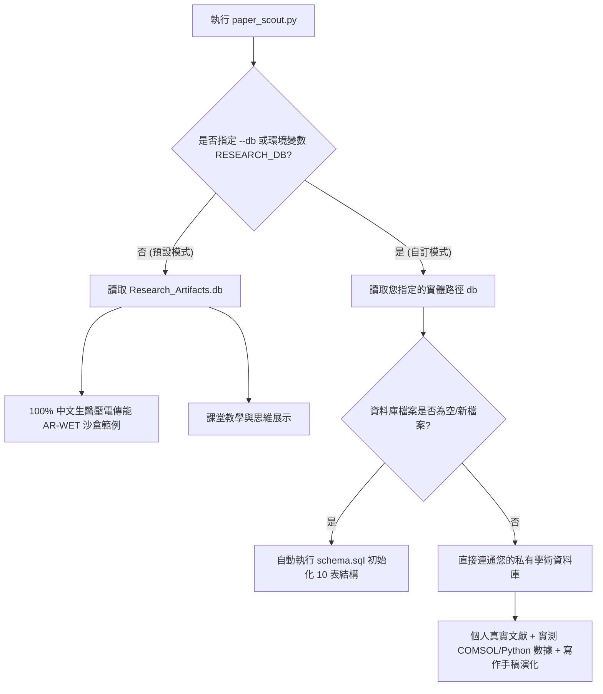

# 🪐 個人學術主權資料庫：自主延伸與實戰指南 (Personal Extension Guide)

> **核心信念**：這不是一套只能拿來展示的靜態玩具，而是一套專為「獨立學者」與「硬核研究生」量身打造的**活體心智主權基建**。您可以立刻用它開闢自己的學術戰場，奪回知識結構與教育的主權。

本指南將手把手帶您從「課堂教學沙盒」出發，無縫擴展出您專屬的、包含真實文獻與現地模擬比對的**主權研究資料庫**。

---

## 🗺️ 一、 雙軌並行戰略 (The Dual-Track Model)

為了讓您在「教學展示」與「個人私有研究」之間切換自如，我們在 `paper_scout.py` 中實踐了**環境與路徑解耦**。



*   **沙盒展示庫** (`Research_Artifacts.db`)：固化了高品質的中文壓電模擬、Duffing 非線性誤差、紅軍 PLL 攻防故事線，供教學展示。
*   **私有研究庫** (例如 `my_thesis.db`)：完全由您作主，只記錄您真實搜尋的 ArXiv 論文與您的肉身實驗實測資料。

---

## 🚀 二、 極速開闢個人真實戰場 (Quick-Start)

要為您自己的論文或研究計畫建立一個全新的資料庫，您只需要在 terminal 執行以下指令：

### 1. 方式 A：使用 CLI 參數臨時指定
```bash
python3 paper_scout.py --db ../../data/research/my_thesis.db --query "bifurcation neural network" --limit 3 --save-db
```
> **💡 奇蹟發生幕後**：系統會發現 `my_thesis.db` 不存在，自動為您克隆 `schema.sql` 的十表聯邦結構，隨後向 ArXiv 發動真實檢索，將 3 筆真實文獻寫入該庫，並自動為您建立 `prj_general`與 `top_general` 專案/主題以滿足資料庫外鍵約束！

### 2. 方式 B：設定環境變數永久定錨 (推薦)
如果您想在接下來的幾個星期內專注在個人研究，不想每次都打 `--db` 參數，可以在 `~/.zshrc` 或當前 terminal 執行：
```bash
export RESEARCH_DB="/Users/wuulong/github/bmad-pa/events/AIBooks/PersonalEmpowerment/PersonalAI-Empowerment/data/research/my_thesis.db"
```
之後直接執行一般指令，所有的查詢與沉澱都會秒級自動轉向您的私有庫：
```bash
# 直接寫入您的私有資料庫
python3 paper_scout.py --query "quantum key distribution" --limit 5 --save-db
```

---

## 🏗️ 三、 宣告個人主權：自訂專案與循序主題

自動生成的 `prj_general` 只是臨時的收納箱。當您正式投入自己的博士或專案研究時，您應該建立**專屬的專案契約與循序演化路線圖**。

您可以透過 SQLite 視覺化工具（如 DBeaver、DB Browser for SQLite）或 Python 腳本，向資料庫寫入您的「主權宣告」：

### 1. 定義您的主權專案 (INSERT INTO `projects`)
```sql
INSERT INTO projects (project_id, project_name, description, search_spec, architecture_spec)
VALUES (
    'prj_quantum_security', 
    '量子金鑰分發 (QKD) 光電晶片整合專案', 
    '開發高集成度矽光子 QKD 送收光電晶片，克服體積大與相位熱漂移脆弱點。',
    '{"keywords": ["QKD", "silicon-photonics", "phase-modulator"], "exclude": ["free-space"], "min_year": 2021}',
    '{"target_rekey_rate_kbps": 1.2, "target_wavelength_nm": 1550, "max_insertion_loss_dB": 4.5}'
);
```
> **戰略價值**：`search_spec`（探勘契約 JSON）會指引您的 AI 代理人持續追蹤相關文獻，`architecture_spec`（物理架構脈絡 JSON）則是您的物理硬指標 Baseline。

### 2. 定義您的循序主題 (INSERT INTO `topics`)
將您的畢業論文或研發計畫拆解為循序漸進的邏輯脊椎：
```sql
-- 主題一：矽光調變器元件物理建模
INSERT INTO topics (topic_id, project_id, topic_name, sequence_order, focus_spec, status)
VALUES ('top_qkd_modulator', 'prj_quantum_security', '高頻矽光相位調變器設計', 1, '{"focus_variables": ["Vpi_L", "bandwidth_GHz", "loss_dB"], "equations": ["Drude_Model"]}', 'COMPLETED');

-- 主題二：相位熱漂移的主動電路補償
INSERT INTO topics (topic_id, project_id, topic_name, sequence_order, focus_spec, status)
VALUES ('top_thermal_compensation', 'prj_quantum_security', '熱光相位漂移主動反饋控制', 2, '{"focus_variables": ["thermo_optic_coefficient", "phase_error", "response_time_us"], "equations": ["Bioheat_Transfer_Equation"]}', 'ACTIVE');
```

---

## 📂 四、 隔離實體路徑：目錄映射與 Zotero 移植

當您要在不同的電腦（如辦公室 Mac Studio、家裡 MacBook、或實驗室 NAS）切換時，最怕文獻 PDF 路徑斷線。主權資料庫透過 `directory_roots` 完美解決了這個痛點！

### 1. 設定您各裝置的 Directory Roots
在您的 A 電腦資料庫中寫入：
```sql
-- 電腦 A (Mac Studio)
INSERT INTO directory_roots (root_key, owner_type, owner_name, absolute_path, meta_data)
VALUES ('zotero_storage', 'STUDENT_LOCAL', 'wuulong', '/Users/wuulong/Zotero/storage/', '{"device": "MacStudio"}');
```
在您的 B 電腦資料庫中，您只需要將 `absolute_path` 更新為 B 電腦的實際路徑：
```sql
-- 電腦 B (MacBook Air)
UPDATE directory_roots 
SET absolute_path = '/Users/wuulong/Library/Application Support/Zotero/Profiles/storage/'
WHERE root_key = 'zotero_storage';
```

### 2. 真實論文 URL 寫入規範
在 `paper_urls` 中，**永遠不要存絕對路徑**，只存 `root_key` 與相對路徑：
*   `root_key` ➔ `'zotero_storage'`
*   `url_link` ➔ `'A1B2C3D4/paper.pdf'` (這是 Zotero 隨機生成的子資料夾路徑)

> **🎉 秒級移植奇蹟**：不論您換到哪一台電腦，只要更新 `directory_roots` 表中 `'zotero_storage'` 的 `absolute_path` 一個欄位，所有文獻的實體 PDF 跳轉與開啟連結，將在秒級內全部自動恢復！

---

## 📥 五、 既有資料遷移指引 (Data Migration Guide)

研究生通常已經累積了大量的文獻管理資產（最常見的是 **Zotero**、**Mendeley**、**EndNote**，或整理在 **Notion/Excel/CSV** 的表格）。我們強烈反對「手動逐筆重新輸入」這種低效的重複勞動。

以下提供三種主流文獻整理工具的「極速移轉至主權資料庫」實戰路徑：

### 1. 🚀 Zotero 聯邦直連路徑 (黃金標準)
Zotero 本身就是基於 SQLite 開發的。如果您使用 Zotero，移轉是最優雅且能完美對齊 LaTeX 寫作的。

*   **步驟一：安裝 Better BibTeX 插件**
    - 在 Zotero 中安裝 `Better BibTeX` 插件。它能為每一篇文獻生成唯一的、固定不變的 `cite_key` (例如 `Wang2026ARWET`)。
*   **步驟二：匯出為 `.bib` 檔案**
    - 選擇您的文獻庫，右鍵選擇「Export Collection...」，格式選擇 **Better BibTeX**，勾選「Keep Updated（自動同步維持最新）」。
*   **步驟三：使用獨立遷移腳本一鍵自動入庫**
    - 我們已將遷移程式碼獨立封裝為實體檔案 **[migrate_zotero_bib.py](migrate_zotero_bib.py)**。
    - **執行方式**：直接在 terminal 中執行以下命令，即可將匯出的 `.bib` 檔案整批解析並一鍵寫入您的私有主權庫：
      ```bash
      python3 migrate_zotero_bib.py --bib /path/to/your_zotero.bib --db /path/to/your_private.db
      ```
    - **💡 極客 AI 協同改寫機制**：如果您使用的是 **Mendeley、RIS、JSON、EndNote XML** 等其他格式，您**完全不需要手寫代碼**！請直接將這個獨立的 [migrate_zotero_bib.py](migrate_zotero_bib.py) 檔案上傳給您的 AI 程式設計助手（如 Gemini、Claude），並下達以下 Prompt：
      > 「*這是我目前的主權資料庫文獻移轉腳本。我現在想將來源改為讀取 [我的文獻.ris / 我的Notion.json]，請幫我改寫其中的 Parser 解析區段，維持寫入 papers 與 paper_urls 表格的欄位映射與外鍵約束安全性。*」
      AI 即可在數秒內為您量身改寫出一份專屬的遷移工具！

### 2. 📊 Notion / Excel / CSV 表格遷移路徑
許多研究生習慣用表格整理文獻。您可以將 Notion 或 Excel 匯出為 `.csv` 檔案，隨後採用以下手段：

*   **手段 A：利用 DBeaver / SQLite Studio 的 GUI 工具**
    1. 開啟您的私有庫 `my_thesis.db`。
    2. 右鍵點擊 `papers` 資料表，選擇 **「Import Data (匯入資料)」**。
    3. 選擇您的 `.csv` 檔案，設定欄位對應（例如 `Title` 對應 `title`，`Authors` 對應 `authors`）。
    4. 一鍵執行！
*   **手段 B：用 SQLite CLI 原生命令匯入**
    在 terminal 中，您可以先建立一個臨時表，匯入 CSV，再用 SELECT 寫入：
    ```sql
    .mode csv
    .import my_notion_papers.csv temp_papers
    
    -- 將 temp 表數據清洗並寫入 papers (確保 cite_key 等必填欄位生成)
    INSERT INTO papers (paper_id, title, authors, year, cite_key, bibtex, topic_id)
    SELECT 
        'csv_' || rowid, 
        title, 
        authors, 
        CAST(year AS INTEGER), 
        replace(authors, ' ', '') || year || rowid, -- 自動生成 cite_key
        '@article{csv_' || rowid || ', title={' || title || '}}',
        'top_general'
    FROM temp_papers;
    ```

### 3. 📂 EndNote / Mendeley ➔ RIS / BibTeX 途徑
*   **EndNote** 不支援直接輸出 SQLite，但您可以選擇 **File ➔ Export**，儲存格式選擇 **RIS** 或 **XML**。
*   建議的黃金轉換器是：**將 RIS 檔案一鍵匯入 Zotero**，隨後直接執行上述第 1 點的 Better BibTeX 移轉途徑。這能保障文獻附件（PDF 檔案）的實體相對路徑依然被完美解析與定錨！

---

## 📊 六、 肉身實踐：導入您自己的實驗真值

新一代學術主權方法論最鄙視「只會引用文獻，自己卻跑不出實測資料」的空洞研究。您可以將您在 COMSOL、MATLAB 或 Python 實際量測的資料寫入 `local_simulations`，與論文理論進行直接對比：

```sql
INSERT INTO local_simulations (sim_id, paper_id, run_config, empirical_results, discrepancy_percentage, meta_data)
VALUES (
    'qkd_sim_01', 
    'arxiv_2501_12345', -- 您搜尋到的真實背景論文 ID
    '{"Vpi_voltage": 3.8, "frequency_GHz": 10.0, "modulator_length_mm": 3.0}', 
    '{"measured_insertion_loss_dB": 4.8, "phase_shift_rad": 3.14}', 
    6.67, -- 本次實測相位與理論公式推導 QKD 換能效率產生的 6.67% 誤差
    '{"platform": "Lumerical_DEVICE", "analyst": "wuulong"}'
);
```

---

## 🧠 七、 心智防衛：與紅軍 Agent 對審與手稿有向演化

### 1. 紅軍自審 (Red Team Critique)
讓 AI 扮演最嚴苛的 Reviewer 2，攻擊您的研究脆弱點，並將您的防禦決策記錄在案，這會成為您口試與論文 Review時最堅固的盾牌：
*   **攻擊**：『你的矽光調變器在高頻下有嚴重的阻抗不匹配，反射係數 S11 高達 -5dB，這會導致極大的訊號失真。』
*   **防禦（品位裁決）**：『我們設計了漸變阻抗共面波導（CPW）電極結構，並在 `local_simulations` 中驗證 S11 成功降至 -18dB 以下，解決了反射損耗。』

### 2. 手稿有向演化 (Manuscript Evolution Chain)
您的研究不是孤立的。透過 `previous_manuscript_id`，您可以將您的研究串成一條清晰的基因演化鏈：
*   `ms_conf_2026` (IEEE 研討會論文)
    *   ➔ 被繼承為 `ms_journal_2027` (IEEE 期刊論文，解決了研討會論文未考慮的相位熱漂移熱力學效應)

---

## 🎓 八、 導師與學生的協同治理 (30秒 SQL 照妖鏡)

當您建構起這套專屬的資料庫後，您可以直接為您的指導教授（或給自我審查）提供以下「30 秒盲檢 SQL 指令」，瞬間證明您的研究強度：

```sql
-- 1. 盲檢：列出本主題下，所有理論與本地實測誤差大於 5% 的「臨界脆弱區間」
SELECT 
    p.title AS 論文標題, 
    s.sim_id AS 實測ID, 
    s.discrepancy_percentage AS 偏離誤差百分比, 
    s.run_config AS 實驗邊界設定
FROM local_simulations s
JOIN papers p ON s.paper_id = p.paper_id
WHERE s.discrepancy_percentage > 5.0;

-- 2. 盲檢：列出所有被紅軍攻擊過、但我們已成功通過 PASS 判定防禦的學術要塞
SELECT 
    p.cite_key AS 引用鍵, 
    r.aspect_analyzed AS 分析維度, 
    r.reviewer_attack AS 紅軍質疑, 
    r.student_defense AS 學生防禦策略
FROM red_team_logs r
JOIN papers p ON r.paper_id = p.paper_id
WHERE r.verdict = 'PASS';
```

透過這套機制，您不僅擁有了一個**絕對不會遺忘、隨時能隨主機遷移的「數位大腦」**，更能以無懈可擊的結構化證據，奪回您在學術界與研究現場的最高主權！
