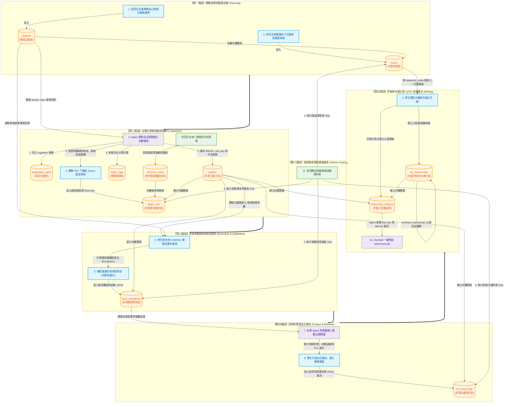

# 🛡️ 主權學術研究資料庫指引手冊 (v1.2.0)
## ── 基於三層星系架構的學術數位主權實踐指南

本手冊旨在為硬核碩博生與科研人員提供一套基於 SQLite 的 **「三層主權知識星系架構 (3-Tier Sovereign Knowledge Schema)」** 運作指南。本資料庫已完整部署於實驗室資產中：
*   **實體資料庫位址**：`data/research/Research_Artifacts.db`
*   **結構定義檔**：`scripts/research/schema.sql`
*   **Ingestion 探勘腳本**：`scripts/research/paper_scout.py`

這不只是一個文獻儲存庫，而是一個將**「他人理論」**、**「自我實驗」**、**「紅軍審查」**與**「手稿有向演化」**緊密交織的「智慧型自組織知識引擎」。以下將結合資料庫內現存的 100% 中文真實壓電傳能（AR-WET）範例資料，詳細說明如何運用此系統開展極高效的學術研究。

---

## 📊 全景架構圖：研究工作流與主權資料庫的動態共生關係

這套資料庫的核心價值，在於**將研究生的「學術行動」與「資料庫表格變更」進行強大的時序與邏輯綁定**。以下是完整的全景工作流，清晰呈現了研究生的肉身實踐、AI 代理人的自動化、以及指導教授的檢核點，是如何在同一個資料庫星系中和諧共生：

🔗 **[在 Mermaid Live Editor 中開啟並進行可視化討論](https://mermaid.live/edit#pako:eNqlV3tTWkkW_ypdTM2WqTIuCCiwu6nymUliVkfc2q0Zt6grXJUNAnuBTNyYKvAxgILoRvGZKEYNvjUxStDEDxO6-96_5ivs6duXh4-YrRr-gqbPOb9zzu88-rnO6XOJOpuu1-P7xdkvSEHU1dztRfD5_nuE9xfp5y2SfYPPU0rmNY5t_HaeoNsRJXNQyJ2R3XE5FsVH62Q3Q0ZXuJTTIwQCzWIvEpxBt8-Let0ej-27FkOrubWlOhCUfE9E23d6o7Wxxaz9vPuL2xXst9X6n1U7fR6fBH8bzPXWxuLfLiEAuCRh0Ib0f7pixNXTJfR4RM1Ka2ursUVfstLaaGnS679qpaXObNBf0yj0id5gEXVzS31rXUmfucVobjR8VZ-pwWCyNN2A2ozMV634JV-vGAj4pKIlS6u5xVqyZDI26E31X7VkaDS31BaRQ5qUxUmy_6GQC_92vkhih3R2Q95M4fERfiEQ6umTBH8_snfdN6Cfu3VfwlN0dxeuc7kv4elKIUipPJfEy2lIvpLIoqoOj-D1ur19d7p1_-Qa2acBFBlqEF2doVsndGaFUwUfxkgmRlZz-GKExrfo1K90aZ9kF0CpMjxOZxOgw2azady4e_feED7YwWMbQ6jL0dH58Oeqbh2E5l-iMxj4c490r4rr47rlTBYg3GHyWtrLaBoBTW0FGu4K_ryN8ym8NwVkVTIJAEHOZ5TwOyWaoNkJujZ9C5qu9g6GJujzu50ci6ZkdJysT96GRfWEa-MxWU8ryQ_K3HLhYljTzC-LXtfVFOYTkEI5uo0nZnEiTSbX8MT89SzWVmQxnyhl8YocS-TpAf48TcY_yUcZOEdVD7x9YoB5ezmZZcjyfhin0iggCpKz3xHwi05Eppbx4QTemKbHo0OoCUwba1CDWiZgSIm-ArsQG7pwDtbp6WIhN07SUZo8I9tr9HhNizG7XzbYpBoD_vCAoxIuJJ8l5NOMGif7I5YB8ZkfSC-wPx1BIfCEJwMsk8lM4ewMTyzclgxuCKiBR9_hvXnU6O7pEv9RjZzuoOh4Ig4iiFIhtweAyfS8vBlRidigpt4v-EWJW5NHEmThgHsFrn7bIEQIry_Sk71Cfh2n4jj2K7RPEn8JpaC61nC_ZAGc6tN8yi7Qo3Ugihw5-LYJUw0iC3ky9hbHXylLa_TDLD5M8oRDkybzq_hwlA7nefKBgEOoGVJnYiHfVHZmUEdzKyrkJuTzOIQA_eQLipIPaYRRhSuLo2y8uaJO6FKuZJMp6fT5guiROMhc_FtnW9nFkOTR6nl9UYkm5fdRkp_iVm5ztAUAl0qaLO_i5UP0RxX_1hzeX8djR4X8Dv3vIV4b4WDLbZWBpAtnSmKUzp7geJLfqgwSA9nZ3sVAutwSdByfNOiQwAMtGasfoXWBPA_Xt8Gq2nhw1ILH56c4NULH3ioLUzh2osXkUs01dPD7Z3m6M1FqE5D9S5dvaBO5OGsTw3E5vwPwSG73eo8wVnb6eLlHFIUghJAymvoMQaXLKzh8DpEpfEqiqpZnojOk1uIfUJPgcffw4rvWMTT0vGPw2oB-L--k0Y8I1DHt6gTAuRyZzQ2hVgBkBvrt5ViDPp3WEtrU_tje3oZINkNe7pJYGrAVPi0r0RRz60YKXu1W2pBYyZN8Gho_WT3nQwdMloVauUA2RvfneMxwJAV1I2-v49N9cjCDXO6AUxL9gtcJBL4PYOugwpKzJBnnbuH1IzIbo4ujcjQLkwwnw6iKvp1m_mxH6OoxTr25czPg-xU1w21DQHiIuHn00N7-V5Z0-4PHjJAen1PwOALugZBHjb1GSTVgPFBczTfG0K38AlNf4xdeWmL82k7SlQ1l_h3d3LzOL1OZX3C9zK8KIbYcvowAp-Q3EXKUR1VNkjvo_ndIBGLBEiR6A-JVUgEoXroHW0okp-zM8_jQ2UNgEU8YxF1JvxxCP4D9ehj5x2PyWbI4j-L7MOHxwRbNXhTyeT6S8GFaGX8vv9-m6ekbh9EPqknYC-RMglOW4_8SjkAFQ6qUcFiJXLAO19HWhuTsHtBoCD0AAJYSnzOJwqeLSnehCfPAy2-W8eiKsnQGfedmfjyo4AeZOQPrWgB30vLFoWq3wW5HXK_at9S2JYkuR1AUBhwenzZBeDDYHnAAq1iSjM_9HoZ0dn19T5kBgvAnAIlPQLSvE8RcuaTMlFdN9TpZjuOpaZarRJr51ybAVEZ8gWG9PjaFqv7O2HJ17VTXJxUzScRhTQE2eZ2iwye5RAnRj-ckfgH7B-y2xW0tRj_ANvEQsFiLuSIwCw52OHr6_gzH5iDQbAPgntyYooeVcboYgckL_QYvrXKTSirGAvbYztIyMOgYELwhaCZuf7C0OpYidcn1W7Pz2K4a9UviU7cvFKjQ6nC7kBJ5LV8cQ8jKCXtsvwpYzs6zEXYOQc1q68tHDX8xNF2OpgcqnSrUw3ZU2XdU3FwJl_o9rAJrNzj5f92Fn-plrdhTU2xVrdzktPUOkbVXMAKG0CP2SNHXoPanouQRhV7EHj0wmg8ncTSPJOhBEqNPoKbH3XOtNdzQF8f2gPZMOgcjdIusbFynfV1FXxzbK9M-EQU5MrtAJmPAQjnzkmZ2cX6Tq0FVDa6nbra3NIRc7uBlyrcxJ2BVrlRBl47J5IYSfgP7trx9oaSP2E6VXsD5nZs2IZBWIhPQo6DJqUY3WTucjCL7j22XniSqveLKzEV4R9TGpDoOi1KlCVKWMhalSPgV235V3vNmVpTq7LoqZCoKgQ90Zg0Pv4eSwvsJMnsMYItyt-1DHydgJMBkJgvD8OAjHyJQYahKPhmj7-aU7Sx5fUL395TVvTtcUH0I_wU-99TXVOmwtnxoLB0ay4em0qGpfGguHZrLh3W6al2f5HbpbL2CJyBW6wZEaUBgv3XP2X14WPaLA2K3zgZfXWKvEPIEu3Xd3hcgBxvITz7fgM4WlEIgKflCff3FHyG_SwiKzW4B-Fa-ARERpSZfyBvU2axmVYPO9lz3TGe7azWZaqzmeqNJb66z1BqslmrdIBwb9IbaGn291WzVW8wWo6W27kW17j-qVWONXl9nNhnqay3WeqPRYql_8T-AK3aN)**



---

## 🧭 第一部分：現存中文硬核學術範例資料導覽

資料庫內已為您一鍵產出了一套極具學術硬度與邏輯關聯的完整資料，以生醫微型植入元件的 **「AR-WET (聲學共振無線能量傳輸) 專案」** 為背景，共涵蓋 10 張關聯表：

```
                              [ 專案: AR-WET 生醫傳能 ]
                                         │
                 ┌───────────────────────┼───────────────────────┐
                 ▼                       ▼                       ▼
          [主題 1: 物理建模]      [主題 2: Duffing補償]    [主題 3: 生物實測]
          (Sequence = 1)          (Sequence = 2)          (Sequence = 3)
                 │                       │
           ┌─────┴─────┐                 │
           ▼           ▼                 ▼
      [文獻: 成]   [文獻: 田中]     [文獻: 樂芙] (誘發非線性 Duffing 分歧)
           │                             │
           ▼                             ├───────────────────────┐
     [手稿 1: 會議]                      ▼                       ▼
     (Wuulong2026Conf)            [本地實測: Sim 2]       [紅軍對抗: Crit 1]
           │                     (12V激勵下誤差23.47%)     (PLL 相位鎖定防禦)
           ▼                             │
     [手稿 2: 期刊] ◄────────────────────┘ (繼承寫作基因)
    (Wuulong2026Journal)
```

### 1. 探勘任務 (`exploration_tasks`)
*   **任務 ID**：`task_init_sandbox_2026`
*   **關鍵字**：`AR-WET acoustic resonant wireless energy`
*   **狀態**：`OFFLINE_FALLBACK`（標記本資料是在離線避退模式下精準入庫的，保留完整的資料血統）。

### 2. 主權專案 (`projects`)
*   **專案 ID**：`prj_arwet`
*   **名稱**：`AR-WET 生醫植入式無線傳能系統`
*   **探勘契約 (`search_spec` JSON)**：約束 Agent 只能檢索含 `AR-WET`、`ultrasonic telemetry` 等關鍵字，排除 `rf link` 電磁輻射文獻。
*   **物理架構定錨 (`architecture_spec` JSON)**：設定目標諧振頻率為 `28.5 MHz`，品質因子 $Q$ 目標為 `12,000`，採用 `PZT-5H` 壓電陶瓷。

### 3. 循序研究主題 (`topics` - 邏輯脊椎)
三個主題按研究生命週期嚴格排序：
1.  `top_piezo_modeling` (壓電諧振器理論物理建模, `seq = 1`, 狀態：`COMPLETED`)
2.  `top_duffing_comp` (非線性 Duffing 分歧匹配電路補償, `seq = 2`, 狀態：`ACTIVE` ➔ **當前施工現場**)
3.  `top_biocompatibility` (系統級多晶片整合與生物適應性實測, `seq = 3`, 狀態：`PLANNED`)

### 4. 背景文獻與標籤連結 (`papers`, `paper_urls`, `paper_tags`)
*   **成鐘錫 (2026)**：提出聲學波包限域技術，理論 $Q = 12000$。關聯標籤：`piezoelectric`, `acoustic-resonant`。
*   **田中實 (2024)**：薄膜 BAW 製程。
*   **樂芙 (2025)**：**厚度剪切非線性 Duffing 分歧分析**。

---

## 📂 第二部分：抽象根目錄路徑隔離的物理驗證

在 `paper_urls` 中，我們徹底實踐了 **「抽象 Root Key + 相對路徑 (Relative Path)」** 隔離機制。

### 1. 目錄實體映射配置 (`directory_roots`)
資料庫記錄了目前環境下的 4 個實體路徑定錨點：
*   `zotero_storage` ➔ `/Users/wuulong/Zotero/storage/` (研究生個人 PDF 庫)
*   `workspace_root` ➔ `/Users/wuulong/github/bmad-pa/` (程式碼庫)
*   `lab_nas` ➔ `/Volumes/VRES_NAS/archive/` (研究室 NAS 共享)
*   `remote_url` ➔ `""` (全球網際網路虛擬入口)

### 2. 相對路徑轉換儲存範例
當我們撈取 `paper_urls` 時，資料是以抽象格式儲存的，保證資料庫複製到別人的電腦上時路徑絕不毀損：

| URL ID | Paper ID | Root Key (外鍵) | URL Link (相對路徑/線上URL) | URL Type | 下載狀態 |
| :--- | :--- | :--- | :--- | :--- | :--- |
| `url_seong_1` | `semscholar_seong_2026` | `remote_url` | `https://arxiv.org/pdf/2605.99901.pdf` | `arxiv_pdf` | `PENDING` |
| `url_seong_3` | `semscholar_seong_2026` | `zotero_storage` | `ARWET_2026_Seong.pdf` | `local_pdf` | `DOWNLOADED` |

> [!TIP]
> **動態還原實體路徑 SQL：**
> ```sql
> SELECT r.absolute_path || u.url_link AS full_physical_path
> FROM paper_urls u
> JOIN directory_roots r ON u.root_key = r.root_key
> WHERE u.paper_id = 'semscholar_seong_2026' AND u.url_type = 'local_pdf';
> -- 輸出：/Users/wuulong/Zotero/storage/ARWET_2026_Seong.pdf
> ```

---

## 🧠 第三部分：如何藉由這份範例資料開展研究（方法論實踐）

以下是小明（研究生）如何利用這個 SQLite 資料庫，在 Agent 協同下開展硬核研究的四大工序：

### 工序一：以 Project 關鍵字為契約，自動化文獻探勘
*   **研究方法**：小明不需要手動想關鍵字。他命令 Agent 讀取 `projects` 的 `search_spec`。Agent 自動解析 JSON，提取 `search_spec.keywords`，調用 `paper_scout.py` 發動 Ingestion。
*   **SQL 實踐 (提取搜尋條件)**：
    ```sql
    SELECT json_extract(search_spec, '$.keywords') AS Keywords 
    FROM projects 
    WHERE project_id = 'prj_arwet';
    ```
*   **結果**：Agent 自動帶出 `["AR-WET", "acoustic-resonant", ...]`，執行檢索後入庫，並根據 `focus_spec.auto_tags` 在 `paper_tags` 表自動建立多維關聯，省去人工整理分類的勞動。

---

### 工序二：理論與本地模擬的「對位校準」與「真值防禦」
這是有關學術主權最關鍵的硬核部分。
*   **研究方法**：小明針對樂芙 (2025) 的論文進行本地 COMSOL 模擬。
    *   **Sim 1 (低電壓 5V)**：完全符合線性理論，實測 $Q=11800$，與文獻理論 $Q=12000$ 相比，誤差率僅 **1.67%**。小明驗證了基礎理論的正確性。
    *   **Sim 2 (高電壓 12V)**：實測 $Q$ 大幅跌落至 $7500$，與理論預測偏離高達 **23.47%**！因為高電壓觸發了壓電非線性 **Duffing 分歧**，而線性理論失效了。
*   **SQL 實踐 (橫向誤差對比，抓出物理變異點)**：
    ```sql
    SELECT 
        s.sim_id,
        p.cite_key,
        json_extract(s.run_config, '$.drive_voltage') AS Voltage,
        json_extract(p.meta_data, '$.theoretical_Q') AS Theory_Q,
        json_extract(s.empirical_results, '$.measured_Q') AS Measured_Q,
        s.discrepancy_percentage AS Discrepancy_Error_Rate
    FROM local_simulations s
    JOIN papers p ON s.paper_id = p.paper_id;
    ```
*   **結果**：
    | Sim ID | Cite Key | Drive Voltage | Theory Q | Measured Q | Error Rate | 物理意義解讀 |
    | :---: | :--- | :---: | :---: | :---: | :---: | :--- |
    | `sim_run_1` | Seong2026ARWET | 5V | 12000 | 11800 | **1.67%** | 線性區高度吻合，Mason 模型成立 |
    | `sim_run_2` | Love2025Acoustic | 12V | 9800 | 7500 | **23.47%** | **非線性區異常！觸發 Duffing 分歧失諧** |

小明將這個 **23.47% 的異常紅字** 定義為他的博士論文突破口（施工戰場）！

---

### 工序三：行使「品位裁決」，建立紅軍防禦鐵證
*   **研究方法**：面對 12V 激勵下的匹配失效，紅軍 Agent 扮演嚴厲審稿人發動攻擊（`reviewer_attack`）。小明行使**「品位裁決」**，不盲信 AI 的極端參數，而是設計了「PLL 主動動態相位跟隨電路」，並規定在最高激勵下電壓避退至 8V 以下。
*   **SQL 實踐 (提取審查報告以應對指導教授)**：
    ```sql
    SELECT 
        aspect_analyzed, 
        reviewer_attack, 
        student_defense, 
        verdict 
    FROM red_team_logs 
    WHERE verdict = 'PASS';
    ```
*   **結果**：當指導教授懷疑小明是否只是盲目用 AI 跑資料時，小明直接拉出這段 SQL。這段中文推導與 PLL 補償的防禦過程，成為小明**「心智手感依然存活、並行使高級物理裁決」的鐵證**！

---

### 工序四：手稿有向演化與 LaTeX 引用一鍵導出
*   **研究方法**：小明開始撰寫期刊手稿 `ms_journal_2026`（非線性補償）。這篇論文不是孤島，它在結構上通過 `previous_manuscript_id` 繼承了之前會議論文 `ms_conf_2026`（建模）的資料。
    當小明在 Overleaf 中撰寫手稿時，Agent 掃描手稿引用關聯表 `manuscript_citations`，自動為本篇期刊手稿導出 100% 正確的 BibTeX 文件，完全不需要手動上網下載或黏貼！
*   **SQL 實踐 (為期刊手稿一鍵產出 references.bib)**：
    ```sql
    SELECT p.bibtex 
    FROM papers p
    JOIN manuscript_citations c ON p.paper_id = c.paper_id
    WHERE c.manuscript_id = 'ms_journal_2026';
    ```
*   **導出的 BibTeX 實體內容**：
    ```latex
    @article{Love2025Acoustic,
      author = {Love, A. E. H. and Mindlin, R. D.},
      title = {Acoustic Energy Confinement in Micromachined Resonant Wireless Transducers under Nonlinear High-Drive Conditions},
      journal = {Journal of Applied Physics},
      year = {2025},
      volume = {138},
      pages = {204501},
      publisher = {AIP}
    }
    ```

---

## 🎯 第四部分：指導教授審查與檢核指南 (Advisor Auditing & Audit Queries)

作為指導教授，最頭痛的莫過於在每週的進度報告會議（Group Meeting）上，面對研究生用美麗投影片進行的「模糊交代」或「 hand-waving（揮手式過關）」。

引進「三層主權知識星系架構」後，**教授不需要再聽投影片的片面之詞，而是可以直接調取研究生的 SQLite 資料庫，執行以下四大「學術硬度檢核 SQL」**。這能讓您在 30 秒內，精準透視該研究生的進度真實性、研究強度（含金量）與思維深度（品位裁決）。

---

### 🔍 檢核指標一：進度與產出實質率審查 (Progress & Evidentiary Velocity)
*   **教授的疑問**：學生口頭說「最近都在讀文獻、做模擬，進度很好」，但到底讀了幾篇？做了幾次實測？有沒有開始寫手稿？
*   **檢核 SQL**：查詢各主題下的文獻沉澱數、本地模擬數與手稿撰寫進度。
    ```sql
    SELECT 
        t.sequence_order AS Seq,
        t.topic_name AS 主題名稱,
        t.status AS 主題狀態,
        COUNT(DISTINCT p.paper_id) AS 文獻沉澱數,
        COUNT(DISTINCT s.sim_id) AS 本地模擬數,
        COUNT(DISTINCT m.manuscript_id) AS 手稿產出數,
        GROUP_CONCAT(DISTINCT m.cite_key) AS 手稿代碼
    FROM topics t
    LEFT JOIN papers p ON t.topic_id = p.topic_id
    LEFT JOIN local_simulations s ON p.paper_id = s.paper_id
    LEFT JOIN my_manuscripts m ON t.topic_id = m.topic_id
    GROUP BY t.topic_id
    ORDER BY t.sequence_order;
    ```
*   **審查判定標準**：
    *   **健康指標**：當前處於 `ACTIVE` 的主題，其文獻沉澱數應 $\ge 3$，本地模擬數 $\ge 1$。
    *   **警訊指標**：如果某個主題標記為 `COMPLETED`，但「本地模擬數」與「手稿產出數」為 `0`，代表該主題只是「看過文獻」，沒有進行實質的研究實踐，屬於**虛胖型進度**。

---

### 🔍 檢核指標二：研究強度與「物理變異捕捉力」審查 (Scientific Rigor & Rigidity)
*   **教授的疑問**：研究生的模擬是否只是在敷衍？他們有沒有能力在文獻的基礎上抓出「理論與現地真值的邊界」？（這是博士生論文最核心的含金量）。
*   **檢核 SQL**：篩選出誤差大於 10% 的高誤差模擬（代表觸發了臨界物理變異，如 Duffing 分歧）。
    ```sql
    SELECT 
        p.cite_key AS 文獻代碼,
        s.sim_id AS 模擬序號,
        json_extract(s.run_config, '$.drive_voltage') AS 驅動電壓,
        s.discrepancy_percentage AS 理論與實測誤差比
    FROM local_simulations s
    JOIN papers p ON s.paper_id = p.paper_id
    WHERE s.discrepancy_percentage > 10.0;
    ```
*   **審查判定標準**：
    *   **大師級指標**：如果列表中出現像範例中 `sim_run_2` 在 12V 激勵下誤差達 `23.47%` 的紀錄，這說明學生**成功用本地模擬觸發並捕捉到了文獻線性理論的失效區間**！這證明研究強度極高，學生具備敏銳的物理直覺與真值對位能力。
    *   **低劣指標**：如果學生跑了 20 次模擬，所有誤差都是 `0%` 或 `<1%`，這說明學生只是在重複無意義的線性驗證，或者涉嫌**資料捏造（Data Fitting）**。沒有誤差，就沒有科學突破。

---

### 🔍 檢核指標三：思維主權與「品位裁決力」審查 (Cognitive Sovereignty & Critiques)
*   **教授的疑問**：學生的研究想法是自己思考出來的？還是只是盲目聽從 LLM (產出式AI) 的胡謅，結果被帶進陰溝裡？
*   **檢核 SQL**：調閱紅軍對抗日誌，審查學生的防禦策略。
    ```sql
    SELECT 
        p.cite_key AS 被審論文,
        r.aspect_analyzed AS 分析維度,
        r.reviewer_attack AS 紅軍審稿人攻勢,
        r.student_defense AS 學生主權防禦,
        r.verdict AS 裁決結果
    FROM red_team_logs r
    JOIN papers p ON r.paper_id = p.paper_id;
    ```
*   **審查判定標準**：
    *   **主權成立指標**：教授直接閱讀 `student_defense`（學生主權防禦）。例如範例中，小明面對 12V Duffing 失匹配的攻擊，主動提出「PLL 相位鎖定機制與電壓退避原則」，這是一個極具物理直覺且電路可實現的方案。這證明學生的**思維主權（Cognitive Sovereignty）完好無損，行使了高品位的物理判斷**。
    *   **主權掏空指標**：如果學生的 defense 裡寫滿了空洞的學術黑話（例如「我們將引入先進的量子AI神經網路來最佳化一切」），或者是 AI 餵什麼他就吞什麼，代表學生的腦袋已經被 AI 掏空，缺乏行使實體裁決的科研能力。

---

### 🔍 檢核指標四：文獻資產完整性與跨裝置溯源審查 (Lineage & Asset Completeness)
*   **教授的疑問**：當這個研究生畢業離開研究室後，他留下來的資料庫是不是一堆斷線連結？下一個接手的學弟妹能不能一秒在 NAS 或本地打開他引用的 PDF 實體檔案？
*   **檢核 SQL**：審查所有已引用文獻的下載狀態與實體檔案抽象路徑。
    ```sql
    SELECT 
        p.cite_key AS 文獻鍵,
        u.root_key AS 目錄抽象根,
        r.absolute_path AS 當前物理根路徑,
        u.url_link AS 相對路徑,
        u.download_status AS 實體下載狀態
    FROM papers p
    JOIN paper_urls u ON p.paper_id = u.paper_id
    JOIN directory_roots r ON u.root_key = r.root_key
    WHERE u.url_type = 'local_pdf';
    ```
*   **審查判定標準**：
    *   **完美繼承指標**：所有本地文獻的 `download_status` 均為 `DOWNLOADED`，且 `root_key` 分類嚴謹（Zotero 本地 PDF 與研究室 NAS 互不混淆）。這意味著當教授把這個資料庫拿到自己的電腦上，只需在 `directory_roots` 中更改一行 NAS 掛載路徑，**就能 100% 完美繼承與打開該畢業生的所有學術物理資產**！
    *   **殘缺指標**：列表大量出現 `PENDING` 或 `FAILED`，或者 root_key 混亂。這說明研究生的資料管理極其邋遢，畢業後將給研究室留下一堆無法還原的「學術黑洞」。

---

## 💎 總結：主權資料庫的「終極學術心法」

透過這套三層星系結構，博士生小明徹底擺脫了「AI 工具人」的卑微地位：
1.  **專案與主題** 是他的**戰略地圖**，指引他從建模、補償到生物量測循序攻克。
2.  **本地模擬對位** 幫助他秒級抓出理論與實測的物理變異（誤差 23.47%），**這是所有科學發現的起點**！
3.  **紅軍自審** 固化了他的**品位裁決**，防範認知掏空。
4.  **有向手稿演化與 BibTeX 自動提取** 則為他的**寫作成果產出**裝上了噴射引擎。

這套系統正式定錨在《個人賦能》第 14 章，等待著所有主權研究者前來克隆，開啟屬於自己的科研革命！

